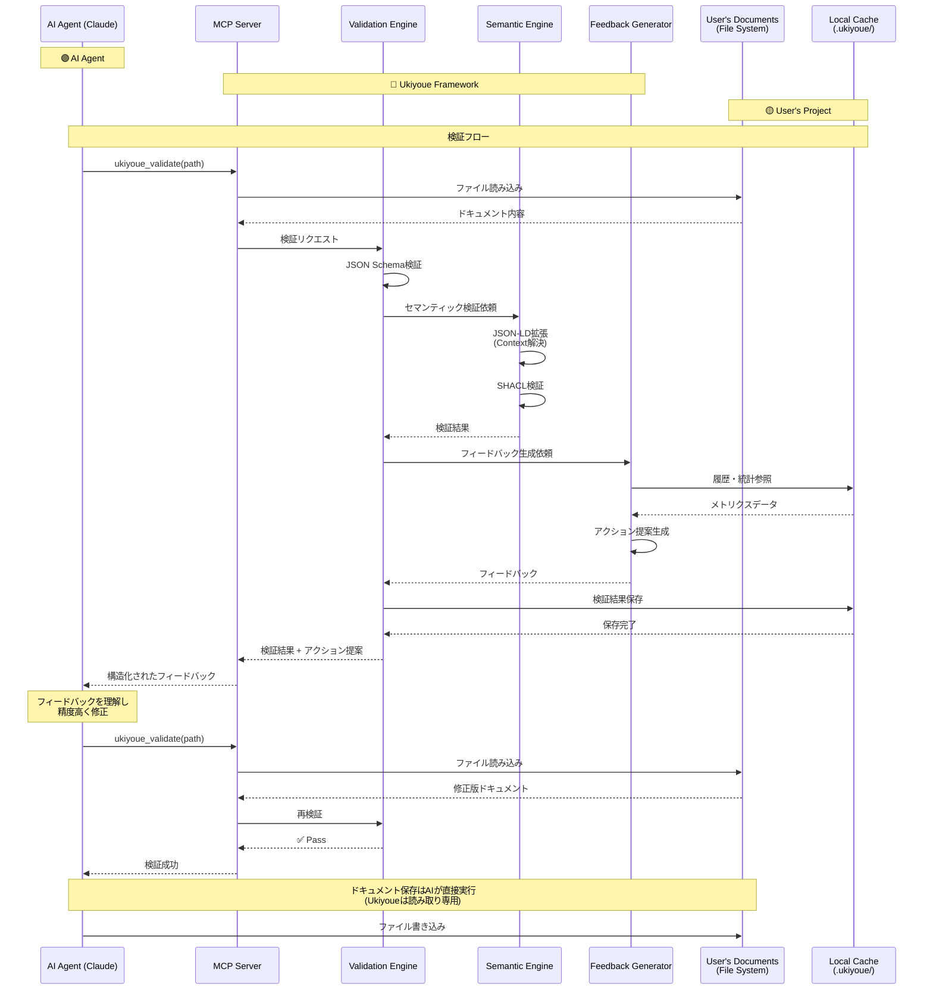
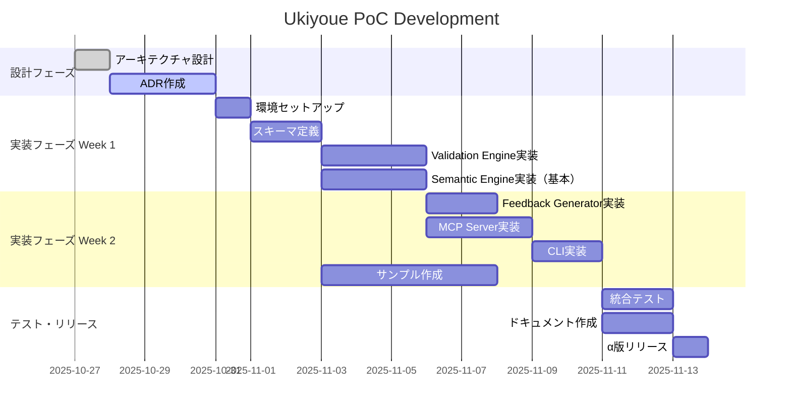

# Ukiyoue Framework - Architecture Blueprint

## 📋 このドキュメントの目的

**What**: Ukiyoue Frameworkの全体アーキテクチャと技術スタック
**Why**: 実装の指針となる設計方針と技術選定の根拠を明確化
**Who**: フレームワーク開発者、貢献者
**When**: 実装開始前、技術判断時

---

## 🏗️ システム全体像

### アーキテクチャダイアグラム

```mermaid
graph TB
    subgraph "AI Agents Layer"
        claude[Claude Desktop<br/>MCP対応]
        copilot[GitHub Copilot<br/>MCP対応]
        cursor[Cursor<br/>MCP対応]
        other_ai[Other AI Tools<br/>MCP対応]
    end

    subgraph "Human Users"
        dev[Developers<br/>手動操作]
        cicd[CI/CD Systems<br/>自動化]
    end

    subgraph "Ukiyoue Framework"
        subgraph "Interface Layer"
            mcp[MCP Server<br/>🎯 Primary Interface<br/>AI Agents向け]
            cli[CLI Tools<br/>🔧 Secondary Interface<br/>Human/CI向け]
        end

        subgraph "Core Engine Layer"
            validator[Validation Engine<br/>構造検証 + 意味検証]
            semantic[Semantic Engine<br/>JSON-LD処理 + 推論]
            component[Component Manager<br/>再利用パターン管理]
            feedback[Feedback Generator<br/>アクション提案生成]
        end

        subgraph "Schema Layer"
            jsonschema[JSON Schema<br/>構造定義]
            jsonld[JSON-LD Context<br/>セマンティック定義]
            shacl[SHACL Shapes<br/>整合性制約]
            rules[Custom Rules<br/>ドメイン固有ルール]
        end

        subgraph "Pattern Library"
            templates[Templates<br/>ドキュメントテンプレート]
            components[Components<br/>再利用可能パターン]
        end
    end

    subgraph "User's Development Environment"
        subgraph "User's Project"
            user_docs[Project Documents<br/>JSON/JSON-LD Files]
            user_config[.ukiyoue/<br/>プロジェクト設定]
        end

        subgraph "Cache & Metrics (Local)"
            cache[Validation Cache<br/>検証結果キャッシュ]
            metrics[Metrics Store<br/>検証履歴・統計]
        end
    end

    claude -.->|MCP Protocol| mcp
    copilot -.->|MCP Protocol| mcp
    cursor -.->|MCP Protocol| mcp
    other_ai -.->|MCP Protocol| mcp

    dev -.->|Terminal Command| cli
    cicd -.->|Terminal Command| cli

    mcp --> validator
    mcp --> semantic
    mcp --> component
    mcp --> feedback

    cli --> validator
    cli --> semantic
    cli --> component

    validator --> jsonschema
    validator --> shacl
    validator --> rules
    semantic --> jsonld
    semantic --> shacl

    validator -.->|読み取り専用| user_docs
    semantic -.->|読み取り専用| user_docs
    component --> templates
    component --> components
    feedback --> cache
    feedback --> metrics

    user_config -.->|設定読み込み| validator
    user_config -.->|設定読み込み| semantic

    %% Ukiyoue Framework (青系 - Framework提供)
    style mcp fill:#d4e9ff,stroke:#2a5f8f,stroke-width:3px
    style cli fill:#d4e9ff,stroke:#2a5f8f,stroke-width:2px
    style validator fill:#d4e9ff,stroke:#2a5f8f
    style semantic fill:#d4e9ff,stroke:#2a5f8f
    style component fill:#d4e9ff,stroke:#2a5f8f
    style feedback fill:#d4e9ff,stroke:#2a5f8f
    style jsonschema fill:#d4e9ff,stroke:#2a5f8f
    style jsonld fill:#d4e9ff,stroke:#2a5f8f
    style shacl fill:#d4e9ff,stroke:#2a5f8f
    style rules fill:#d4e9ff,stroke:#2a5f8f
    style templates fill:#d4e9ff,stroke:#2a5f8f
    style components fill:#d4e9ff,stroke:#2a5f8f

    %% User's Project (黄系 - ユーザー管理)
    style user_docs fill:#fff9d4,stroke:#8f7f2a,stroke-width:3px
    style user_config fill:#fff9d4,stroke:#8f7f2a,stroke-width:2px
    style cache fill:#fff9d4,stroke:#8f7f2a
    style metrics fill:#fff9d4,stroke:#8f7f2a

    %% AI Agents (紫系 - 外部ツール)
    style claude fill:#e8d4ff,stroke:#5f2a8f
    style copilot fill:#e8d4ff,stroke:#5f2a8f
    style cursor fill:#e8d4ff,stroke:#5f2a8f
    style other_ai fill:#e8d4ff,stroke:#5f2a8f

    %% Human Users (ピンク系 - 外部ユーザー)
    style dev fill:#ffd4e8,stroke:#8f2a5f
    style cicd fill:#ffd4e8,stroke:#8f2a5f
```



**色分けの凡例**:

| 色              | 対象                  | 説明                                         |
| --------------- | --------------------- | -------------------------------------------- |
| 🔵 **青系**     | **Ukiyoue Framework** | フレームワークが提供・管理するコンポーネント |
| 🟡 **黄系**     | **User's Project**    | ユーザーが作成・管理するドキュメントと設定   |
| 🟣 **紫系**     | **AI Agents**         | 外部のAIツール（Claude、Copilot等）          |
| 🩷 **ピンク系** | **Human Users**       | 人間ユーザーとCI/CDシステム                  |

**データの所有権と責任範囲**:

- **🔵 Ukiyoue Framework**: スキーマ定義、検証ロジック、テンプレート → **読み取り専用で提供**
- **🟡 User's Project**: ドキュメント本体、プロジェクト設定、キャッシュ → **ユーザーが完全管理**
- **境界**: Ukiyoueはユーザードキュメントを読み取るのみ、変更・保存は一切しない

**アーキテクチャの重要な原則**:

1. **Ukiyoue Framework の役割**
   - ✅ スキーマ定義の提供（JSON Schema, JSON-LD, SHACL）
   - ✅ 検証エンジンの提供
   - ✅ テンプレート・コンポーネントライブラリの提供
   - ❌ ユーザーのドキュメントは保持しない

2. **ユーザープロジェクトの構成**
   - `docs/` - ユーザーが作成するドキュメント（JSON/JSON-LD）
   - `.ukiyoue/config.json` - プロジェクト固有の設定
   - `.ukiyoue/cache/` - 検証結果のキャッシュ（ローカル）
   - `.ukiyoue/metrics/` - 検証履歴・統計（ローカル、オプトイン）

3. **データの流れ**
   - Ukiyoue → ユーザードキュメント: **読み取り専用**
   - ユーザー設定 → Ukiyoue: 設定の読み込み
   - 検証結果 → ローカルキャッシュ: キャッシュ・メトリクス保存

**インターフェースの役割分担**:

1. **MCP Server（Primary Interface）**
   - **対象**: すべてのAIエージェント
     - Claude Desktop
     - GitHub Copilot
     - Cursor
     - その他のMCP対応AIツール
   - **プロトコル**: Model Context Protocol
   - **特徴**: リアルタイム双方向通信、構造化されたツール呼び出し

2. **CLI Tools（Secondary Interface）**
   - **対象**: 人間とCI/CDシステム
     - 開発者による手動操作
     - GitHub Actions / GitLab CI
     - Pre-commit hooks
   - **プロトコル**: コマンドライン（POSIX）
   - **特徴**: シンプル、スクリプト可能、パイプライン統合

---

## 🔄 データフロー

### 典型的なAI協働フロー



---

## 🏛️ レイヤー構造

### Layer 1: Interface Layer（インターフェース層）

**目的**: AIエージェントと人間の両方からのアクセスを提供

#### MCP Server（主要インターフェース）

**責務**:

- Model Context Protocolによるツール提供
- AIエージェントとのシームレスな統合
- リアルタイムフィードバックループの実現

**提供ツール**:

```typescript
// MCP Tools
interface UkiyoueTools {
  ukiyoue_validate(params: {
    path: string; // ファイルまたはディレクトリパス
    level?: "structure" | "semantic" | "content";
    actionable?: boolean; // アクション提案を含めるか
  }): ValidationResult;

  ukiyoue_search_components(params: {
    query: string; // セマンティック検索クエリ
    category?: string;
    limit?: number;
  }): Component[];

  ukiyoue_get_component(params: {
    name: string;
    variation?: string;
  }): ComponentDetail;

  ukiyoue_create_variation(params: {
    base: string;
    name: string;
    parameters: Record<string, any>;
  }): Component;

  ukiyoue_analyze_project(params: { path: string }): ProjectAnalysis;
}
```

#### CLI Tools（補助インターフェース）

**責務**:

- 人間による手動操作
- CI/CD統合
- バッチ処理

**コマンド**:

```bash
ukiyoue validate <path> [--level structure|semantic|content] [--actionable]
ukiyoue component search <query> [--category <cat>] [--limit <n>]
ukiyoue component get <name> [--variation <var>]
ukiyoue component create-variation --base <base> --name <name> --params <json>
ukiyoue analyze <project-path>
ukiyoue init <project-name>
```

---

### Layer 2: Core Engine Layer（コアエンジン層）

**目的**: ドキュメントの検証・管理・改善のコアロジック

#### Validation Engine（検証エンジン）

**責務**:

- JSON Schemaによる構造検証
- SHACLによる意味整合性検証
- カスタムルールによるドメイン固有検証
- リンク・参照の整合性チェック

**実装構造**:

```typescript
class ValidationEngine {
  // Level 1: 構造検証（完全自動）
  validateStructure(document: unknown): StructureValidationResult;

  // Level 2: 意味整合性検証（完全自動）
  validateSemantics(document: JsonLdDocument): SemanticValidationResult;

  // Level 3: 内容妥当性検証（人間判断支援）
  suggestContentReview(document: UkiyoueDocument): ContentReviewSuggestion[];

  // 一括検証
  validateBatch(documents: unknown[]): ValidationResult[];
}
```

#### Semantic Engine（セマンティックエンジン）

**責務**:

- JSON-LDの拡張・正規化
- RDFグラフへの変換
- SPARQL/GraphQLクエリ実行
- セマンティック検索

**実装構造**:

```typescript
class SemanticEngine {
  // JSON-LD処理
  expand(document: JsonLdDocument): ExpandedDocument;
  compact(expanded: ExpandedDocument, context: Context): JsonLdDocument;

  // RDF変換
  toRDF(document: JsonLdDocument): RdfDataset;
  fromRDF(dataset: RdfDataset): JsonLdDocument;

  // 検索・クエリ
  search(query: string): SearchResult[];
  query(sparql: string): QueryResult;

  // 推論
  infer(document: JsonLdDocument, rules: InferenceRules): JsonLdDocument;
}
```

#### Component Manager（コンポーネント管理）

**責務**:

- 再利用可能コンポーネントの登録・検索
- バリエーション管理
- パターン抽出・推奨

**実装構造**:

```typescript
class ComponentManager {
  // コンポーネント管理
  register(component: Component): void;
  find(query: ComponentQuery): Component[];
  get(name: string, variation?: string): Component;

  // バリエーション
  createVariation(base: Component, params: VariationParams): Component;
  listVariations(baseName: string): Variation[];

  // パターン抽出
  extractPatterns(documents: UkiyoueDocument[]): Pattern[];
  suggestReuse(document: UkiyoueDocument): ReuseSuggestion[];
}
```

#### Feedback Generator（フィードバック生成）

**責務**:

- 検証結果からアクション提案を生成
- コンテキストに応じた推奨事項
- 統計データに基づく改善提案

**実装構造**:

```typescript
class FeedbackGenerator {
  // アクション提案生成
  generateActions(errors: ValidationError[]): ActionFeedback[];

  // コンテキスト分析
  analyzeContext(document: UkiyoueDocument): ContextAnalysis;

  // 統計ベースの推奨
  suggestImprovements(
    document: UkiyoueDocument,
    metrics: Metrics
  ): Improvement[];

  // 構造的不足の検出
  detectStructuralGaps(project: ProjectStructure): StructuralGap[];
}
```

---

### Layer 3: Schema Layer（スキーマ層）

**目的**: ドキュメントの構造と意味を形式的に定義

#### JSON Schema（構造定義）

**責務**:

- データ型・必須項目の定義
- フォーマット制約
- バリデーションルール

**例**:

```json
{
  "$schema": "https://json-schema.org/draft/2020-12/schema",
  "$id": "https://ukiyoue.dev/schemas/document.schema.json",
  "title": "Ukiyoue Document",
  "type": "object",
  "required": ["@context", "metadata", "content"],
  "properties": {
    "@context": {
      "type": ["string", "object", "array"],
      "description": "JSON-LD context"
    },
    "metadata": {
      "$ref": "#/$defs/metadata"
    },
    "content": {
      "type": "object"
    }
  },
  "$defs": {
    "metadata": {
      "type": "object",
      "required": ["id", "type", "title", "version"],
      "properties": {
        "id": {
          "type": "string",
          "pattern": "^[a-z0-9-]+$"
        },
        "type": {
          "type": "string",
          "enum": ["concept", "requirement", "design", "api-spec", "test-case"]
        },
        "title": {
          "type": "string",
          "minLength": 1
        },
        "version": {
          "type": "string",
          "pattern": "^\\d+\\.\\d+\\.\\d+$"
        }
      }
    }
  }
}
```

#### JSON-LD Context（セマンティック定義）

**責務**:

- 用語の意味定義
- 関係性の定義
- 外部語彙（schema.org, Dublin Core等）との連携

**例**:

```json
{
  "@context": {
    "@vocab": "https://ukiyoue.dev/vocab#",
    "schema": "https://schema.org/",
    "dc": "http://purl.org/dc/terms/",

    "Document": "schema:CreativeWork",
    "title": "dc:title",
    "description": "dc:description",
    "author": {
      "@id": "dc:creator",
      "@type": "@id"
    },
    "dependsOn": {
      "@id": "schema:isBasedOn",
      "@type": "@id"
    },
    "relatedTo": {
      "@id": "schema:relatedLink",
      "@type": "@id",
      "@container": "@set"
    }
  }
}
```

#### SHACL Shapes（整合性制約）

**責務**:

- セマンティックレベルの制約定義
- グラフパターンの検証
- 推論ルール

**例**:

```turtle
@prefix sh: <http://www.w3.org/ns/shacl#> .
@prefix ukiyoue: <https://ukiyoue.dev/vocab#> .

ukiyoue:DocumentShape
  a sh:NodeShape ;
  sh:targetClass ukiyoue:Document ;
  sh:property [
    sh:path ukiyoue:dependsOn ;
    sh:nodeKind sh:IRI ;
    sh:message "依存関係は有効なIRIである必要があります" ;
  ] ;
  sh:property [
    sh:path ukiyoue:relatedTo ;
    sh:minCount 0 ;
    sh:message "関連ドキュメントは0個以上である必要があります" ;
  ] .

ukiyoue:RequirementShape
  a sh:NodeShape ;
  sh:targetClass ukiyoue:Requirement ;
  sh:property [
    sh:path ukiyoue:testCases ;
    sh:minCount 1 ;
    sh:message "要件には少なくとも1つのテストケースが必要です" ;
  ] .
```

#### Custom Rules（カスタムルール）

**責務**:

- プロジェクト固有の検証ルール
- ドメイン知識の反映
- 組織標準の適用

**例**:

```yaml
# semantics/rules/consistency.yaml
rules:
  - id: REQ-001
    name: "要件にはテストケースが必要"
    description: "すべての機能要件は、少なくとも1つのテストケースを持つ必要がある"
    level: error
    target:
      type: requirement
      subtype: functional
    validation:
      check: hasLinkedTestCase
      message: "この要件に対応するテストケースが見つかりません"
      action: "テストケースを作成し、リンクを設定してください"
      reference: "/templates/test-case.json"

  - id: API-001
    name: "APIエンドポイントにはエラーレスポンスが必要"
    description: "すべてのAPIエンドポイントは、エラーレスポンスを定義する必要がある"
    level: warning
    target:
      type: api-spec
    validation:
      check: hasErrorResponses
      minCount: 3
      message: "エラーレスポンスが不足しています（推奨: 3個以上）"
      action: "一般的なエラーレスポンス（400, 401, 500等）を追加してください"
```

#### Pattern Library（パターンライブラリ）

**責務**:

- 再利用可能なドキュメントテンプレートの提供
- 検証済みコンポーネントの蓄積
- ベストプラクティスの共有

**構成**:

1. **Templates（テンプレート）**
   - ドキュメントの雛形
   - 必須項目が事前定義
   - すぐに使える初期構造

2. **Components（コンポーネント）**
   - 再利用可能なパターン
   - 複数のプロジェクトで検証済み
   - バリエーション対応

**Templates例**:

```json
// templates/requirement.json
{
  "@context": "https://ukiyoue.dev/context/v1",
  "@type": "FunctionalRequirement",
  "id": "",
  "title": "",
  "description": "",
  "priority": "medium",
  "status": "draft",
  "acceptanceCriteria": [],
  "dependsOn": [],
  "relatedTo": [],
  "testCases": []
}
```

**Components例**:

```json
// components/rest-api-endpoint.json
{
  "id": "rest-api-endpoint",
  "name": "RESTful API Endpoint Pattern",
  "category": "api-spec",
  "description": "RESTful APIエンドポイントの標準パターン",
  "version": "1.0.0",
  "variations": [
    {
      "name": "crud-endpoint",
      "description": "CRUD操作の標準エンドポイント",
      "parameters": {
        "resourceName": {
          "type": "string",
          "description": "リソース名（例: users, posts）"
        },
        "idType": {
          "type": "string",
          "enum": ["uuid", "integer", "string"],
          "default": "uuid"
        }
      },
      "template": {
        "@context": "https://ukiyoue.dev/context/v1",
        "@type": "APIEndpoint",
        "endpoints": [
          {
            "method": "GET",
            "path": "/{{resourceName}}",
            "summary": "List all {{resourceName}}",
            "responses": {
              "200": {
                "description": "Success",
                "schema": {
                  "type": "array",
                  "items": { "$ref": "#/components/schemas/{{resourceName}}" }
                }
              }
            }
          },
          {
            "method": "POST",
            "path": "/{{resourceName}}",
            "summary": "Create a new {{resourceName}}",
            "responses": {
              "201": { "description": "Created" },
              "400": { "description": "Bad Request" }
            }
          },
          {
            "method": "GET",
            "path": "/{{resourceName}}/{id}",
            "summary": "Get {{resourceName}} by ID",
            "parameters": [
              {
                "name": "id",
                "in": "path",
                "required": true,
                "schema": { "type": "{{idType}}" }
              }
            ],
            "responses": {
              "200": { "description": "Success" },
              "404": { "description": "Not Found" }
            }
          }
        ]
      }
    },
    {
      "name": "read-only-endpoint",
      "description": "読み取り専用エンドポイント",
      "parameters": {
        "resourceName": { "type": "string" }
      },
      "template": {
        "endpoints": [
          {
            "method": "GET",
            "path": "/{{resourceName}}",
            "summary": "List all {{resourceName}}"
          }
        ]
      }
    }
  ],
  "usageCount": 42,
  "qualityScore": 0.92,
  "lastUpdated": "2025-10-27"
}
```

**使用方法**:

```typescript
// Component Managerを通じてパターンを取得
const pattern = await componentManager.get(
  "rest-api-endpoint",
  "crud-endpoint"
);
const instantiated = pattern.instantiate({
  resourceName: "users",
  idType: "uuid",
});

// → CRUD操作のAPIエンドポイント定義が自動生成される
```

**品質管理**:

- **usageCount**: 使用回数（人気度の指標）
- **qualityScore**: 品質スコア（検証通過率等から算出）
- **バージョン管理**: セマンティックバージョニング
- **コミュニティレビュー**: 検証済みパターンのみ提供

**マクロの好循環との関係**:

- 実績のあるパターンが自動的に抽出
- 使用統計に基づいて品質スコアが向上
- コミュニティ全体でベストプラクティスが蓄積

---

### Layer 4: User's Project Structure（ユーザープロジェクト構造）

**目的**: ユーザーが作成・管理するドキュメントと設定

**重要**: このレイヤーは**Ukiyoue Frameworkの外部**にあり、ユーザーの開発環境に存在します。

#### Project Documents（プロジェクトドキュメント）

**場所**: ユーザーのプロジェクトディレクトリ
**形式**: JSON/JSON-LD Files
**構造例**:

```text
my-project/                    # ユーザーのプロジェクトルート
├── docs/                      # ドキュメントディレクトリ
│   ├── requirements/
│   │   ├── FR-001.json       # 機能要件
│   │   └── NFR-001.json      # 非機能要件
│   ├── design/
│   │   ├── architecture.json # アーキテクチャ設計
│   │   └── api-spec-v1.json  # API仕様
│   ├── tests/
│   │   └── TC-001.json       # テストケース
│   └── README.md
├── .ukiyoue/                  # Ukiyoue設定・キャッシュ
│   ├── config.json           # プロジェクト設定
│   ├── cache/                # 検証結果キャッシュ
│   │   └── validation-*.json
│   └── metrics/              # 検証履歴・統計（オプトイン）
│       └── metrics-*.json
├── src/                       # アプリケーションコード
└── package.json
```

**ドキュメント例**:

```json
// docs/requirements/FR-001.json
{
  "@context": "https://ukiyoue.dev/context/v1",
  "@type": "FunctionalRequirement",
  "id": "FR-001",
  "title": "ユーザー認証機能",
  "description": "ユーザーがメールアドレスとパスワードでログインできる",
  "priority": "high",
  "status": "approved",
  "dependsOn": [],
  "relatedTo": ["NFR-001"],
  "testCases": ["TC-001", "TC-002"]
}
```

#### Configuration（プロジェクト設定）

**場所**: `.ukiyoue/config.json`
**目的**: プロジェクト固有の検証ルール、除外パターン等

**例**:

```json
{
  "version": "1.0.0",
  "documentRoot": "./docs",
  "schemas": {
    "requirement": "https://ukiyoue.dev/schemas/requirement.schema.json",
    "api-spec": "https://ukiyoue.dev/schemas/api-spec.schema.json"
  },
  "validation": {
    "level": "strict",
    "ignorePatterns": ["**/drafts/**", "**/*.draft.json"]
  },
  "customRules": ["./custom-rules/company-standards.yaml"],
  "metrics": {
    "enabled": true,
    "telemetry": false // マクロの好循環への貢献（オプトイン）
  }
}
```

#### Validation Cache（検証キャッシュ）

**場所**: `.ukiyoue/cache/`
**目的**: 検証結果のキャッシュ、パフォーマンス向上

**特徴**:

- ファイルのハッシュ値で変更検出
- 変更されていないファイルは再検証をスキップ
- ローカルのみ（Gitには含めない）

#### Metrics Store（メトリクス保存）

**場所**: `.ukiyoue/metrics/`
**目的**: 検証履歴、品質スコアの記録（マクロの好循環用）

**特徴**:

- 完全にオプトイン（デフォルトは無効）
- 匿名化されたデータのみ
- ローカル保存（外部送信なし）

**例**:

```json
// .ukiyoue/metrics/FR-001-history.json
{
  "documentId": "FR-001",
  "validationHistory": [
    {
      "timestamp": "2025-10-27T10:00:00Z",
      "result": "pass",
      "duration": 120,
      "issues": []
    },
    {
      "timestamp": "2025-10-27T09:30:00Z",
      "result": "fail",
      "duration": 95,
      "issues": [
        {
          "level": "error",
          "message": "必須項目 'testCases' が不足"
        }
      ]
    }
  ],
  "qualityMetrics": {
    "completeness": 0.95,
    "consistency": 1.0,
    "reusability": 0.8
  }
}
```

---

### Ukiyoue Framework Package Structure（フレームワークパッケージ構造）

**重要**: これは**Ukiyoue Frameworkそのもの**の構造（npm packageとして配布）

```text
@ukiyoue/framework/            # npm package
├── schemas/                   # 標準スキーマ定義
│   ├── document.schema.json
│   ├── requirement.schema.json
│   ├── api-spec.schema.json
│   └── test-case.schema.json
├── semantics/                 # セマンティック定義
│   ├── context.jsonld
│   └── shapes/
│       ├── document.ttl
│       └── requirement.ttl
├── templates/                 # ドキュメントテンプレート
│   ├── requirement.json
│   ├── api-spec.json
│   └── test-case.json
├── components/                # 再利用可能コンポーネント
│   ├── rest-api-endpoint.json
│   └── crud-operations.json
├── src/                       # エンジン実装
│   ├── engines/
│   ├── tools/
│   └── utils/
└── package.json
```

---

## 🔧 技術スタック（仮置き）

### ドキュメント層

| 要素               | 技術選定                    | 選定根拠（詳細はADR参照） |
| ------------------ | --------------------------- | ------------------------- |
| **記述形式**       | JSON                        | ADR-001                   |
| **構造定義**       | JSON Schema (Draft 2020-12) | ADR-002                   |
| **セマンティック** | JSON-LD 1.1                 | ADR-003                   |

### 検証層

| 要素               | 技術選定                | 選定根拠（詳細はADR参照） |
| ------------------ | ----------------------- | ------------------------- |
| **構造検証**       | JSON Schema (Ajv v8)    | ADR-004                   |
| **要素識別**       | JSON Pointer (RFC 6901) | ADR-005                   |
| **意味整合性検証** | JSON-LD + SHACL         | ADR-006                   |
| **カスタムルール** | YAML/JSON定義           | ADR-007                   |

### 実装層

| 要素                     | 技術選定       | 選定根拠（詳細はADR参照） |
| ------------------------ | -------------- | ------------------------- |
| **言語**                 | TypeScript 5.x | ADR-008                   |
| **ランタイム**           | Bun 1.x        | ADR-009                   |
| **パッケージマネージャ** | Bun (内蔵)     | ADR-009                   |

### ライブラリ

| 用途                | ライブラリ                     | 選定根拠（詳細はADR参照） |
| ------------------- | ------------------------------ | ------------------------- |
| **JSON Schema検証** | Ajv v8 + ajv-formats           | ADR-010                   |
| **JSON-LD処理**     | jsonld.js                      | ADR-011                   |
| **SHACL検証**       | rdf-validate-shacl             | ADR-012                   |
| **MCP SDK**         | @modelcontextprotocol/sdk (TS) | ADR-013                   |
| **CLI**             | TBD (commander.js or oclif)    | ADR-014                   |

### 開発ツール

| 用途             | ツール                           | 選定根拠（詳細はADR参照） |
| ---------------- | -------------------------------- | ------------------------- |
| **ビルド**       | Bun (内蔵 TypeScript コンパイラ) | ADR-009                   |
| **テスト**       | Bun test (ネイティブ)            | ADR-015                   |
| **Lint**         | Biome (高速Rust実装)             | ADR-016                   |
| **フォーマット** | Biome                            | ADR-016                   |
| **CI/CD**        | GitHub Actions                   | ADR-017                   |

---

## 📐 設計原則

### 1. AI-First Design

**原則**: すべての機能はAIエージェントが直接利用できる形で設計

**実装**:

- MCPプロトコルによるツール提供
- 構造化されたフィードバック（JSON形式）
- アクション指向のエラーメッセージ

### 2. Validation as Code

**原則**: 検証ルールはコードとして管理・バージョニング

**実装**:

- JSON Schema, SHACL, Custom RulesをGit管理
- 変更履歴の追跡
- コードレビュープロセスの適用

### 3. Schema-Driven Development

**原則**: スキーマ定義が真実の源泉（Single Source of Truth）

**実装**:

- スキーマからTypeScript型定義を自動生成
- スキーマからドキュメントを自動生成
- スキーマの変更がすべてに波及

### 4. Semantic Web Standards

**原則**: W3C標準に準拠し、相互運用性を確保

**実装**:

- JSON-LD 1.1仕様準拠
- SHACL仕様準拠
- Linked Data Principles適用

### 5. Privacy by Design

**原則**: すべての処理をローカルで実行、外部送信なし

**実装**:

- 完全ローカル実行
- テレメトリはオプトイン方式
- データ暗号化オプション

---

## 🎯 PoCスコープ（Phase 1）

### 実装する機能

#### ✅ 必須機能（Phase 1）

**Validation Engine**:

- [ ] JSON Schema検証
- [ ] 基本的なSHACL検証
- [ ] カスタムルール検証（YAML定義）
- [ ] エラーメッセージ生成

**Semantic Engine**:

- [ ] JSON-LD拡張・圧縮
- [ ] RDF変換
- [ ] 基本的なSPARQLクエリ

**Feedback Generator**:

- [ ] 構造的エラーのアクション提案
- [ ] テンプレート参照の提示

**MCP Server**:

- [ ] `ukiyoue_validate` ツール
- [ ] `ukiyoue_get_component` ツール
- [ ] Claude Desktopとの統合

**CLI**:

- [ ] `ukiyoue validate` コマンド
- [ ] `ukiyoue component get` コマンド
- [ ] `ukiyoue init` コマンド

**Schema & Examples**:

- [ ] 基本ドキュメントスキーマ
- [ ] API仕様スキーマ
- [ ] 10個のサンプルドキュメント

#### ⏭️ Phase 2以降

- セマンティック検索の最適化
- コンポーネント自動抽出
- 統計分析（マクロの好循環）
- VS Code拡張機能
- Web UI

### 成功基準

**技術的検証**:

- [ ] MCPツールとしてClaude Desktopから呼び出せる
- [ ] 100ドキュメントの検証が5秒以内
- [ ] SHACL検証が正常に動作
- [ ] Bunですべてのライブラリが動作

**品質検証**:

- [ ] アクション提案の適切性80%以上（10シナリオで評価）
- [ ] フィードバックを受けてAIが修正できる
- [ ] セッション内での試行錯誤が30%削減

**開発効率**:

- [ ] API仕様書作成時間が従来比50%削減
- [ ] ドキュメント探索時間が90%削減

---

## 📊 パフォーマンス目標

### レイテンシ目標

| 操作                       | 目標レイテンシ | 測定条件               |
| -------------------------- | -------------- | ---------------------- |
| 単一ドキュメント検証       | < 100ms        | 標準的なAPI仕様（1KB） |
| 100ドキュメント一括検証    | < 5秒          | 平均1KB/doc            |
| 1,000ドキュメント一括検証  | < 30秒         | 平均1KB/doc            |
| 10,000ドキュメント一括検証 | < 5分          | 平均1KB/doc            |
| セマンティック検索         | < 200ms        | 1,000ドキュメント対象  |
| SPARQL クエリ              | < 500ms        | 中規模クエリ           |
| MCPツール呼び出し          | < 500ms        | ラウンドトリップ全体   |

### リソース目標

| リソース       | 目標値  | 測定条件                  |
| -------------- | ------- | ------------------------- |
| メモリ使用量   | < 512MB | 1,000ドキュメント読み込み |
| ディスク使用量 | < 100MB | フレームワーク本体        |
| CPU使用率      | < 50%   | 検証実行中                |
| 起動時間       | < 1秒   | MCPサーバー起動           |

### スケーラビリティ目標

```yaml
Phase 1 (PoC):
  対象: 10〜100ドキュメント
  アプローチ: シングルプロセス、メモリ内処理

Phase 2 (v1.0):
  対象: 100〜1,000ドキュメント
  アプローチ: 並列処理、インデックス最適化

Phase 3 (v2.0+):
  対象: 1,000〜10,000+ドキュメント
  アプローチ: 分散処理、データベース統合
```

---

## 🔐 セキュリティ・プライバシー

### 設計原則

```yaml
Privacy by Design:
  原則1: 完全ローカル実行
    - すべての処理をユーザーのマシンで実行
    - 外部サーバーへの通信なし（テレメトリもオプトイン）

  原則2: データ主権の尊重
    - ユーザーデータはユーザーが完全に管理
    - 暗号化オプションの提供

  原則3: 透明性
    - オープンソースコード
    - テレメトリ送信内容の完全開示

Security:
  依存関係管理:
    - 定期的な脆弱性スキャン（npm audit, Snyk）
    - 依存関係の最小化
    - SBOM (Software Bill of Materials) 提供

  コード署名:
    - リリースパッケージのGPG署名
    - GitHub Actionsでの検証可能なビルド

  入力検証:
    - すべての外部入力を厳密に検証
    - パストラバーサル対策
    - コードインジェクション対策
```

---

## 🧪 品質保証戦略

### テスト戦略

```yaml
Unit Tests:
  フレームワーク: Bun test (ネイティブ)
  カバレッジ目標: 80%以上
  対象:
    - 各エンジン（Validation, Semantic, Component, Feedback）
    - スキーマローダー
    - ユーティリティ関数

Integration Tests:
  フレームワーク: Bun test
  対象:
    - MCPプロトコル経由のツール呼び出し
    - エンジン間の連携
    - ファイルI/O

End-to-End Tests:
  フレームワーク: Bun test
  対象:
    - 実際のドキュメント生成→検証フロー
    - Claude Desktop実機テスト（手動）
    - ユーザーシナリオベース

Performance Tests:
  フレームワーク: カスタムベンチマーク
  対象:
    - 大量ドキュメント検証
    - セマンティック検索
    - メモリ使用量プロファイリング
```

### CI/CD

```yaml
GitHub Actions:
  Pull Request:
    - Lint (Biome)
    - Type Check (TypeScript)
    - Unit Tests
    - Integration Tests
    - カバレッジレポート

  main ブランチマージ:
    - すべてのテスト実行
    - Performance Tests
    - npm パッケージ公開（canary）
    - ドキュメント自動生成・デプロイ

  タグプッシュ（リリース）:
    - Release Build
    - GPG署名
    - npm パッケージ公開（stable）
    - GitHub Release作成
    - SBOM生成
```

---

## 📦 プロジェクト構造

```text
ukiyoue/
├── docs/                          # ドキュメント
│   ├── architecture.md            # このファイル
│   ├── concept.md                 # コンセプト
│   ├── working-backwards.md       # PR/FAQ
│   └── adr/                       # Architecture Decision Records
│       ├── 001-document-format.md
│       ├── 002-structure-validation.md
│       ├── 003-semantic-definition.md
│       ├── 004-schema-validation-engine.md
│       ├── 005-component-identification.md
│       ├── 006-semantic-integrity-validation.md
│       ├── 007-domain-specific-validation.md
│       ├── 008-implementation-language.md
│       ├── 009-runtime-environment.md
│       ├── 010-json-schema-library.md
│       ├── 011-json-ld-library.md
│       ├── 012-shacl-library.md
│       ├── 013-mcp-implementation.md
│       ├── 014-cli-implementation.md
│       ├── 015-test-framework.md
│       ├── 016-lint-formatter.md
│       └── 017-ci-cd-platform.md
│
├── schemas/                       # JSON Schema定義
│   ├── document.schema.json       # 基本ドキュメント
│   ├── metadata.schema.json       # メタデータ
│   ├── api-spec.schema.json       # API仕様
│   ├── requirement.schema.json    # 要件定義
│   └── test-case.schema.json      # テストケース
│
├── semantics/                     # セマンティック定義
│   ├── context.jsonld             # JSON-LD Context
│   ├── shapes/                    # SHACL Shapes
│   │   ├── document.ttl
│   │   ├── requirement.ttl
│   │   └── api-spec.ttl
│   └── rules/                     # カスタムルール
│       ├── consistency.yaml
│       └── completeness.yaml
│
├── tools/                         # ツール実装
│   ├── mcp-server/                # MCP Server
│   │   ├── src/
│   │   │   ├── index.ts           # エントリポイント
│   │   │   ├── tools/             # MCPツール実装
│   │   │   │   ├── validate.ts
│   │   │   │   ├── search.ts
│   │   │   │   ├── get-component.ts
│   │   │   │   └── analyze.ts
│   │   │   ├── engines/           # コアエンジン
│   │   │   │   ├── validation-engine.ts
│   │   │   │   ├── semantic-engine.ts
│   │   │   │   ├── component-manager.ts
│   │   │   │   └── feedback-generator.ts
│   │   │   ├── schema/            # スキーマローダー
│   │   │   │   ├── loader.ts
│   │   │   │   └── validator.ts
│   │   │   └── utils/             # ユーティリティ
│   │   ├── tests/                 # テスト
│   │   ├── package.json
│   │   └── tsconfig.json
│   │
│   └── cli/                       # CLI Tools
│       ├── src/
│       │   ├── index.ts           # CLIエントリポイント
│       │   ├── commands/          # コマンド実装
│       │   │   ├── validate.ts
│       │   │   ├── component.ts
│       │   │   ├── analyze.ts
│       │   │   └── init.ts
│       │   └── utils/
│       ├── tests/
│       ├── package.json
│       └── tsconfig.json
│
├── examples/                      # サンプルドキュメント
│   ├── concept-doc.json           # concept.mdのUkiyoue版
│   ├── api-spec-example.json
│   ├── requirement-example.json
│   └── test-case-example.json
│
├── templates/                     # ドキュメントテンプレート
│   ├── api-spec.json
│   ├── requirement.json
│   └── test-case.json
│
├── .github/
│   └── workflows/
│       ├── ci.yml
│       └── release.yml
│
├── package.json                   # ルートパッケージ（モノレポ管理）
├── bunfig.toml                    # Bun設定
├── biome.json                     # Biome設定
├── tsconfig.json                  # TypeScript設定（共通）
└── README.md
```

---

## 🚀 開発ロードマップ

### Phase 1: PoC (2週間) - 🎯 現在



#### Week 1: コアエンジン開発

- Day 1: 環境セットアップ、プロジェクト構造作成
- Day 2-3: スキーマ定義（JSON Schema, JSON-LD, SHACL）
- Day 4-7: Validation Engine + Semantic Engine実装

#### Week 2: インターフェース開発

- Day 8-9: Feedback Generator実装
- Day 10-12: MCP Server実装
- Day 13-14: CLI実装、サンプル作成

#### Week 3: テスト・リリース

- Day 15-16: 統合テスト、Claude Desktop実機テスト
- Day 17-18: ドキュメント作成、README整備
- Day 19: α版リリース

### Phase 2: コミュニティ構築 (3ヶ月)

```yaml
目標: オープンソース公開、初期ユーザー獲得

実装:
  - セマンティック検索の最適化
  - コンポーネント自動抽出
  - VS Code拡張機能（基本）
  - ドキュメント・チュートリアル充実

マイルストーン:
  - 100+ GitHub Stars
  - 10+ コントリビューター
  - 5+ 企業ユーザー
```

### Phase 3: エコシステム拡大 (6ヶ月)

```yaml
目標: v1.0リリース、エコシステム構築

実装:
  - 統計分析・マクロの好循環
  - JetBrains IDE対応
  - CI/CD統合テンプレート
  - コミュニティマーケットプレイス

マイルストーン:
  - 1,000+ GitHub Stars
  - 50+ コントリビューター
  - 20+ 企業ユーザー
```

---

## 🔗 関連ドキュメント

- [`concept.md`](concept.md) - フレームワークのコンセプトと背景
- [`working-backwards.md`](working-backwards.md) - プレスリリース & FAQ
- [`adr/`](adr/) - Architecture Decision Records（技術選定の詳細根拠）
- [`requirements.md`](requirements.md) - 詳細要件定義（TBD）

---

## 📝 次のステップ

### 開発開始前チェックリスト

- [ ] このアーキテクチャドキュメントをレビュー・合意
- [ ] ADR-001〜017を作成（技術選定の詳細根拠を記録）
- [ ] 開発環境セットアップ（Bun, TypeScript, etc.）
- [ ] GitHub プロジェクトボード作成
- [ ] 週次進捗会議の設定

### 準備が整ったら

1. **今すぐ**: ADR作成開始（明日から）
2. **ADR完成後**: 環境セットアップ、スキーマ定義
3. **Week 1開始**: コアエンジン実装

---

🎨 **Ukiyoue Framework - 使うほど品質が向上する、AI時代のドキュメント基盤**
