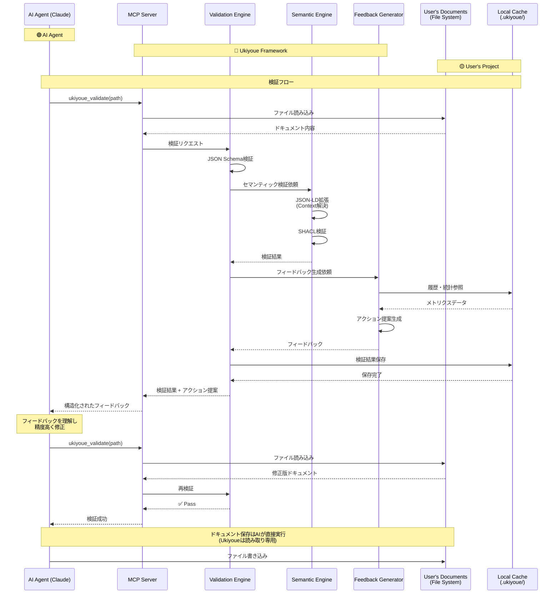

# Ukiyoue Framework - Architecture Blueprint

## 📋 このドキュメントの目的

| 項目     | 内容                                                       |
| -------- | ---------------------------------------------------------- |
| **What** | Ukiyoue Frameworkの全体アーキテクチャと設計原則            |
| **Why**  | システムの全体像と設計判断の根拠を明確化                   |
| **Who**  | すべてのステークホルダー（開発者、新メンバー、意思決定者） |
| **When** | 全体設計を理解する時、設計判断時                           |

**関連ドキュメント**:

- [`implementation-guide.md`](implementation-guide.md) - 実装詳細（エンジン、ライブラリの使い方）
- [`poc-plan.md`](poc-plan.md) - PoC実行計画（タスク、スケジュール）
- [`concept.md`](concept.md) - コンセプトと背景
- [`adr/`](adr/) - 技術選定の詳細根拠

---

## 🏗️ システム全体像

### アーキテクチャダイアグラム

```mermaid
graph TB
    subgraph "AI Agents Layer"
        claude[Claude Desktop<br/>MCP対応]
        copilot[GitHub Copilot<br/>MCP対応]
        cursor[Cursor<br/>MCP対応]
        other_ai[Other AI Tools<br/>MCP対応]
    end

    subgraph "Human Users"
        dev[Developers<br/>手動操作]
        cicd[CI/CD Systems<br/>自動化]
    end

    subgraph "Ukiyoue Framework"
        subgraph "Interface Layer"
            mcp[MCP Server<br/>🎯 Primary Interface<br/>AI Agents向け]
            cli[CLI Tools<br/>🔧 Secondary Interface<br/>Human/CI向け]
        end

        subgraph "Core Engine Layer"
            validator[Validation Engine<br/>構造検証 + 意味検証]
            semantic[Semantic Engine<br/>JSON-LD処理 + 推論]
            component[Component Manager<br/>再利用パターン管理]
            feedback[Feedback Generator<br/>アクション提案生成]
        end

        subgraph "Schema Layer"
            jsonschema[JSON Schema<br/>構造定義]
            jsonld[JSON-LD Context<br/>セマンティック定義]
            shacl[SHACL Shapes<br/>整合性制約]
            rules[Custom Rules<br/>ドメイン固有ルール]
        end

        subgraph "Pattern Library"
            templates[Templates<br/>ドキュメントテンプレート]
            components[Components<br/>再利用可能パターン]
        end
    end

    subgraph "User's Development Environment"
        subgraph "User's Project"
            user_docs[Project Documents<br/>JSON/JSON-LD Files]
            user_config[.ukiyoue/<br/>プロジェクト設定]
        end

        subgraph "Cache & Metrics (Local)"
            cache[Validation Cache<br/>検証結果キャッシュ]
            metrics[Metrics Store<br/>検証履歴・統計]
        end
    end

    claude -.->|MCP Protocol| mcp
    copilot -.->|MCP Protocol| mcp
    cursor -.->|MCP Protocol| mcp
    other_ai -.->|MCP Protocol| mcp

    dev -.->|Terminal Command| cli
    cicd -.->|Terminal Command| cli

    mcp --> validator
    mcp --> semantic
    mcp --> component
    mcp --> feedback

    cli --> validator
    cli --> semantic
    cli --> component

    validator --> jsonschema
    validator --> shacl
    validator --> rules
    semantic --> jsonld
    semantic --> shacl

    validator -.->|読み取り専用| user_docs
    semantic -.->|読み取り専用| user_docs
    component --> templates
    component --> components
    feedback --> cache
    feedback --> metrics

    user_config -.->|設定読み込み| validator
    user_config -.->|設定読み込み| semantic

    %% Ukiyoue Framework (青系 - Framework提供)
    style mcp fill:#d4e9ff,stroke:#2a5f8f,stroke-width:3px
    style cli fill:#d4e9ff,stroke:#2a5f8f,stroke-width:2px
    style validator fill:#d4e9ff,stroke:#2a5f8f
    style semantic fill:#d4e9ff,stroke:#2a5f8f
    style component fill:#d4e9ff,stroke:#2a5f8f
    style feedback fill:#d4e9ff,stroke:#2a5f8f
    style jsonschema fill:#d4e9ff,stroke:#2a5f8f
    style jsonld fill:#d4e9ff,stroke:#2a5f8f
    style shacl fill:#d4e9ff,stroke:#2a5f8f
    style rules fill:#d4e9ff,stroke:#2a5f8f
    style templates fill:#d4e9ff,stroke:#2a5f8f
    style components fill:#d4e9ff,stroke:#2a5f8f

    %% User's Project (黄系 - ユーザー管理)
    style user_docs fill:#fff9d4,stroke:#8f7f2a,stroke-width:3px
    style user_config fill:#fff9d4,stroke:#8f7f2a,stroke-width:2px
    style cache fill:#fff9d4,stroke:#8f7f2a
    style metrics fill:#fff9d4,stroke:#8f7f2a

    %% AI Agents (紫系 - 外部ツール)
    style claude fill:#e8d4ff,stroke:#5f2a8f
    style copilot fill:#e8d4ff,stroke:#5f2a8f
    style cursor fill:#e8d4ff,stroke:#5f2a8f
    style other_ai fill:#e8d4ff,stroke:#5f2a8f

    %% Human Users (ピンク系 - 外部ユーザー)
    style dev fill:#ffd4e8,stroke:#8f2a5f
    style cicd fill:#ffd4e8,stroke:#8f2a5f
```



**色分けの凡例**:

| 色              | 対象                  | 説明                                         |
| --------------- | --------------------- | -------------------------------------------- |
| 🔵 **青系**     | **Ukiyoue Framework** | フレームワークが提供・管理するコンポーネント |
| 🟡 **黄系**     | **User's Project**    | ユーザーが作成・管理するドキュメントと設定   |
| 🟣 **紫系**     | **AI Agents**         | 外部のAIツール（Claude、Copilot等）          |
| 🩷 **ピンク系** | **Human Users**       | 人間ユーザーとCI/CDシステム                  |

**データの所有権と責任範囲**:

- **🔵 Ukiyoue Framework**: スキーマ定義、検証ロジック、テンプレート → **読み取り専用で提供**
- **🟡 User's Project**: ドキュメント本体、プロジェクト設定、キャッシュ → **ユーザーが完全管理**
- **境界**: Ukiyoueはユーザードキュメントを読み取るのみ、変更・保存は一切しない

**アーキテクチャの重要な原則**:

1. **Ukiyoue Framework の役割**
   - ✅ スキーマ定義の提供（JSON Schema, JSON-LD, SHACL）
   - ✅ 検証エンジンの提供
   - ✅ テンプレート・コンポーネントライブラリの提供
   - ❌ ユーザーのドキュメントは保持しない

2. **ユーザープロジェクトの構成**
   - `docs/` - ユーザーが作成するドキュメント（JSON/JSON-LD）
   - `.ukiyoue/config.json` - プロジェクト固有の設定
   - `.ukiyoue/cache/` - 検証結果のキャッシュ（ローカル）
   - `.ukiyoue/metrics/` - 検証履歴・統計（ローカル、オプトイン）

3. **データの流れ**
   - Ukiyoue → ユーザードキュメント: **読み取り専用**
   - ユーザー設定 → Ukiyoue: 設定の読み込み
   - 検証結果 → ローカルキャッシュ: キャッシュ・メトリクス保存

**インターフェースの役割分担**:

1. **MCP Server（Primary Interface）**
   - **対象**: すべてのAIエージェント
     - Claude Desktop
     - GitHub Copilot
     - Cursor
     - その他のMCP対応AIツール
   - **プロトコル**: Model Context Protocol
   - **特徴**: リアルタイム双方向通信、構造化されたツール呼び出し

2. **CLI Tools（Secondary Interface）**
   - **対象**: 人間とCI/CDシステム
     - 開発者による手動操作
     - GitHub Actions / GitLab CI
     - Pre-commit hooks
   - **プロトコル**: コマンドライン（POSIX）
   - **特徴**: シンプル、スクリプト可能、パイプライン統合

---

## 🔄 データフロー

### 典型的なAI協働フロー



---

## 🏛️ レイヤー構造（概要）

Ukiyoueは4層のアーキテクチャで構成されています。各レイヤーの詳細な実装については [`implementation-guide.md`](implementation-guide.md) を参照してください。

### Layer 1: Interface Layer（インターフェース層）

**目的**: AIエージェントと人間の両方からのアクセスを提供

#### MCP Server（主要インターフェース）

**対象**: AI Agents（Claude Desktop、GitHub Copilot、Cursor等）

**提供ツール**:

- `ukiyoue_validate` - ドキュメント検証
- `ukiyoue_search_components` - コンポーネント検索
- `ukiyoue_get_component` - コンポーネント取得
- `ukiyoue_create_variation` - バリエーション作成
- `ukiyoue_analyze_project` - プロジェクト分析

**なぜMCPが主要か**: Ukiyoueの中心コンセプトは「AIの作業品質向上」。AIが直接利用できる形式が最適。

#### CLI Tools（補助インターフェース）

**対象**: 人間とCI/CDシステム

**コマンド**:

```bash
ukiyoue validate <path>
ukiyoue component search <query>
ukiyoue component get <name>
ukiyoue analyze <project-path>
ukiyoue init <project-name>
```

---

### Layer 2: Core Engine Layer（コアエンジン層）

**目的**: ドキュメントの検証・管理・改善のコアロジック

#### 4つのエンジン

1. **Validation Engine** - JSON Schema + SHACL + カスタムルールによる検証
2. **Semantic Engine** - JSON-LD処理、RDF変換、セマンティック検索
3. **Component Manager** - 再利用可能コンポーネントの管理
4. **Feedback Generator** - アクション指向のフィードバック生成

**実装詳細**: [`implementation-guide.md`](implementation-guide.md) を参照

---

### Layer 3: Schema Layer（スキーマ層）

**目的**: ドキュメントの構造と意味を形式的に定義

#### 4つの定義

1. **JSON Schema** - データ型・必須項目・フォーマット制約
2. **JSON-LD Context** - 用語の意味定義、関係性の定義
3. **SHACL Shapes** - セマンティックレベルの制約、グラフパターン
4. **Custom Rules** - ドメイン固有の検証ルール（YAML定義）

**Pattern Library** - 再利用可能なテンプレートとコンポーネント

---

### Layer 4: User's Project Structure（ユーザープロジェクト構造）

**重要**: このレイヤーは**Ukiyoue Frameworkの外部**にあり、ユーザーの開発環境に存在します。

**構造例**:

```text
my-project/                    # ユーザーのプロジェクトルート
├── docs/                      # ドキュメントディレクトリ
│   ├── requirements/
│   ├── design/
│   └── tests/
├── .ukiyoue/                  # Ukiyoue設定・キャッシュ
│   ├── config.json           # プロジェクト設定
│   ├── cache/                # 検証結果キャッシュ
│   └── metrics/              # 検証履歴・統計（オプトイン）
└── src/                       # アプリケーションコード
```

---

## 🔧 技術スタック

### ドキュメント層

| 要素               | 技術選定                    | 選定根拠（詳細はADR参照） |
| ------------------ | --------------------------- | ------------------------- |
| **記述形式**       | JSON                        | ADR-001                   |
| **構造定義**       | JSON Schema (Draft 2020-12) | ADR-002                   |
| **セマンティック** | JSON-LD 1.1                 | ADR-003                   |

### 検証層

| 要素                 | 技術選定                | 選定根拠（詳細はADR参照） |
| -------------------- | ----------------------- | ------------------------- |
| **構造検証**         | JSON Schema (Ajv v8)    | ADR-004                   |
| **要素識別**         | JSON Pointer (RFC 6901) | ADR-005                   |
| **意味整合性検証**   | JSON-LD + SHACL         | ADR-006                   |
| **カスタムルール**   | YAML/JSON定義           | ADR-007                   |
| **ドキュメント参照** | 相対パス + Base IRI     | ADR-018                   |

### 実装層

| 要素                     | 技術選定       | 選定根拠（詳細はADR参照） |
| ------------------------ | -------------- | ------------------------- |
| **言語**                 | TypeScript 5.x | ADR-008                   |
| **ランタイム**           | Bun 1.x        | ADR-009                   |
| **パッケージマネージャ** | Bun (内蔵)     | ADR-009                   |

### ライブラリ

| 用途                | ライブラリ                     | 選定根拠（詳細はADR参照） |
| ------------------- | ------------------------------ | ------------------------- |
| **JSON Schema検証** | Ajv v8 + ajv-formats           | ADR-004                   |
| **JSON-LD処理**     | jsonld.js                      | ADR-011                   |
| **SHACL検証**       | rdf-validate-shacl             | ADR-012                   |
| **MCP SDK**         | @modelcontextprotocol/sdk (TS) | ADR-013                   |
| **CLI**             | Commander.js + chalk + ora     | ADR-014                   |

### 開発ツール

| 用途             | ツール                           | 選定根拠（詳細はADR参照） |
| ---------------- | -------------------------------- | ------------------------- |
| **ビルド**       | Bun (内蔵 TypeScript コンパイラ) | ADR-009                   |
| **テスト**       | Bun test (ネイティブ)            | ADR-015                   |
| **Lint**         | Biome (高速Rust実装)             | ADR-016                   |
| **フォーマット** | Biome                            | ADR-016                   |
| **CI/CD**        | GitHub Actions                   | ADR-017                   |

---

## 📐 設計原則

### 1. AI-First Design

**原則**: すべての機能はAIエージェントが直接利用できる形で設計

**実装**:

- MCPプロトコルによるツール提供
- 構造化されたフィードバック（JSON形式）
- アクション指向のエラーメッセージ

### 2. Validation as Code

**原則**: 検証ルールはコードとして管理・バージョニング

**実装**:

- JSON Schema, SHACL, Custom RulesをGit管理
- 変更履歴の追跡
- コードレビュープロセスの適用

### 3. Schema-Driven Development

**原則**: スキーマ定義が真実の源泉（Single Source of Truth）

**実装**:

- スキーマからTypeScript型定義を自動生成
- スキーマからドキュメントを自動生成
- スキーマの変更がすべてに波及

### 4. Semantic Web Standards

**原則**: W3C標準に準拠し、相互運用性を確保

**実装**:

- JSON-LD 1.1仕様準拠
- SHACL仕様準拠
- Linked Data Principles適用

### 5. Privacy by Design

**原則**: すべての処理をローカルで実行、外部送信なし

**実装**:

- 完全ローカル実行
- テレメトリはオプトイン方式
- データ暗号化オプション

---

## 🔐 セキュリティ・プライバシー

### 設計原則

```yaml
Privacy by Design:
  原則1: 完全ローカル実行
    - すべての処理をユーザーのマシンで実行
    - 外部サーバーへの通信なし（テレメトリもオプトイン）

  原則2: データ主権の尊重
    - ユーザーデータはユーザーが完全に管理
    - 暗号化オプションの提供

  原則3: 透明性
    - オープンソースコード
    - テレメトリ送信内容の完全開示

Security:
  依存関係管理:
    - 定期的な脆弱性スキャン（npm audit, Snyk）
    - 依存関係の最小化
    - SBOM (Software Bill of Materials) 提供

  コード署名:
    - リリースパッケージのGPG署名
    - GitHub Actionsでの検証可能なビルド

  入力検証:
    - すべての外部入力を厳密に検証
    - パストラバーサル対策
    - コードインジェクション対策
```

---

## 📊 パフォーマンス目標

### レイテンシ目標

| 操作                       | 目標レイテンシ | 測定条件               |
| -------------------------- | -------------- | ---------------------- |
| 単一ドキュメント検証       | < 100ms        | 標準的なAPI仕様（1KB） |
| 100ドキュメント一括検証    | < 5秒          | 平均1KB/doc            |
| 1,000ドキュメント一括検証  | < 30秒         | 平均1KB/doc            |
| 10,000ドキュメント一括検証 | < 5分          | 平均1KB/doc            |
| セマンティック検索         | < 200ms        | 1,000ドキュメント対象  |
| SPARQL クエリ              | < 500ms        | 中規模クエリ           |
| MCPツール呼び出し          | < 500ms        | ラウンドトリップ全体   |

### リソース目標

| リソース       | 目標値  | 測定条件                  |
| -------------- | ------- | ------------------------- |
| メモリ使用量   | < 512MB | 1,000ドキュメント読み込み |
| ディスク使用量 | < 100MB | フレームワーク本体        |
| CPU使用率      | < 50%   | 検証実行中                |
| 起動時間       | < 1秒   | MCPサーバー起動           |

### スケーラビリティ目標

```yaml
Phase 1 (PoC):
  対象: 10〜100ドキュメント
  アプローチ: シングルプロセス、メモリ内処理

Phase 2 (v1.0):
  対象: 100〜1,000ドキュメント
  アプローチ: 並列処理、インデックス最適化

Phase 3 (v2.0+):
  対象: 1,000〜10,000+ドキュメント
  アプローチ: 分散処理、データベース統合
```

---

## 📦 プロジェクト構造

```yaml
Privacy by Design:
  原則1: 完全ローカル実行
    - すべての処理をユーザーのマシンで実行
    - 外部サーバーへの通信なし（テレメトリもオプトイン）

  原則2: データ主権の尊重
    - ユーザーデータはユーザーが完全に管理
    - 暗号化オプションの提供

  原則3: 透明性
    - オープンソースコード
    - テレメトリ送信内容の完全開示

Security:
  依存関係管理:
    - 定期的な脆弱性スキャン（npm audit, Snyk）
    - 依存関係の最小化
    - SBOM (Software Bill of Materials) 提供

  コード署名:
    - リリースパッケージのGPG署名
    - GitHub Actionsでの検証可能なビルド

  入力検証:
    - すべての外部入力を厳密に検証
    - パストラバーサル対策
    - コードインジェクション対策
```

---

## 🧪 品質保証戦略

### テスト戦略

```yaml
Unit Tests:
  フレームワーク: Bun test (ネイティブ)
  カバレッジ目標: 80%以上
  対象:
    - 各エンジン（Validation, Semantic, Component, Feedback）
    - スキーマローダー
    - ユーティリティ関数

Integration Tests:
  フレームワーク: Bun test
  対象:
    - MCPプロトコル経由のツール呼び出し
    - エンジン間の連携
    - ファイルI/O

End-to-End Tests:
  フレームワーク: Bun test
  対象:
    - 実際のドキュメント生成→検証フロー
    - Claude Desktop実機テスト（手動）
    - ユーザーシナリオベース

Performance Tests:
  フレームワーク: カスタムベンチマーク
  対象:
    - 大量ドキュメント検証
    - セマンティック検索
    - メモリ使用量プロファイリング
```

### CI/CD

```yaml
GitHub Actions:
  Pull Request:
    - Lint (Biome)
    - Type Check (TypeScript)
    - Unit Tests
    - Integration Tests
    - カバレッジレポート

  main ブランチマージ:
    - すべてのテスト実行
    - Performance Tests
    - npm パッケージ公開（canary）
    - ドキュメント自動生成・デプロイ

  タグプッシュ（リリース）:
    - Release Build
    - GPG署名
    - npm パッケージ公開（stable）
    - GitHub Release作成
    - SBOM生成
```

---

## 🚀 開発ロードマップ

### Phase 1: PoC - 🎯 現在

**期間**: プロジェクト開始から2〜3週間

**目標**: コア機能の実証と技術的検証

**詳細**: [`poc-plan.md`](poc-plan.md) を参照

**主要な成果物**:

- Validation Engine（JSON Schema + SHACL + カスタムルール）
- Semantic Engine（JSON-LD処理、RDF変換、基本SPARQL）
- Feedback Generator（アクション提案）
- MCP Server（Claude Desktop統合）
- CLI Tools（基本コマンド）
- 基本スキーマとサンプルドキュメント

### Phase 2: コミュニティ構築

**期間**: Phase 1完了後、3〜6ヶ月

**目標**: オープンソース公開、初期ユーザー獲得

```yaml
実装:
  - セマンティック検索の最適化
  - コンポーネント自動抽出
  - VS Code拡張機能（基本）
  - ドキュメント・チュートリアル充実
  - コミュニティフォーラム構築

マイルストーン:
  - 100+ GitHub Stars
  - 10+ コントリビューター
  - 5+ 企業ユーザー
```

### Phase 3: エコシステム拡大

**期間**: Phase 2完了後、6〜12ヶ月

**目標**: v1.0リリース、エコシステム構築

```yaml
実装:
  - 統計分析・マクロの好循環
  - JetBrains IDE対応
  - CI/CD統合テンプレート
  - コミュニティマーケットプレイス
  - 業界別スキーマ拡充

マイルストーン:
  - 1,000+ GitHub Stars
  - 50+ コントリビューター
  - 20+ 企業ユーザー
  - v1.0 Production Ready リリース
```

---

## 🔗 関連ドキュメント

- [`concept.md`](concept.md) - フレームワークのコンセプトと背景
- [`working-backwards.md`](working-backwards.md) - プレスリリース & FAQ
- [`adr/`](adr/) - Architecture Decision Records（技術選定の詳細根拠）
- [`requirements.md`](requirements.md) - 詳細要件定義（TBD）

---

🎨 **Ukiyoue Framework - 使うほど品質が向上する、AI時代のドキュメント基盤**
