# Ukiyoue Framework - Architecture Blueprint

## 📋 このドキュメントの目的

**What**: Ukiyoue Frameworkの全体アーキテクチャと設計原則
**Why**: システムの全体像と設計判断の根拠を明確化
**Who**: すべてのステークホルダー（開発者、新メンバー、意思決定者）
**When**: 全体設計を理解する時、設計判断時

**関連ドキュメント**:

- [`implementation-guide.md`](implementation-guide.md) - 実装詳細（エンジン、ライブラリの使い方）
- [`poc-plan.md`](poc-plan.md) - PoC実行計画（タスク、スケジュール）
- [`concept.md`](concept.md) - コンセプトと背景
- [`adr/`](adr/) - 技術選定の詳細根拠

---

## 🏗️ システム全体像

### アーキテクチャダイアグラム

```mermaid
graph TB
    subgraph "AI Agents Layer"
        claude[Claude Desktop<br/>MCP対応]
        copilot[GitHub Copilot<br/>MCP対応]
        cursor[Cursor<br/>MCP対応]
        other_ai[Other AI Tools<br/>MCP対応]
    end

    subgraph "Human Users"
        dev[Developers<br/>手動操作]
        cicd[CI/CD Systems<br/>自動化]
    end

    subgraph "Ukiyoue Framework"
        subgraph "Interface Layer"
            mcp[MCP Server<br/>🎯 Primary Interface<br/>AI Agents向け]
            cli[CLI Tools<br/>🔧 Secondary Interface<br/>Human/CI向け]
        end

        subgraph "Core Engine Layer"
            validator[Validation Engine<br/>構造検証 + 意味検証]
            semantic[Semantic Engine<br/>JSON-LD処理 + 推論]
            component[Component Manager<br/>再利用パターン管理]
            feedback[Feedback Generator<br/>アクション提案生成]
        end

        subgraph "Schema Layer"
            jsonschema[JSON Schema<br/>構造定義]
            jsonld[JSON-LD Context<br/>セマンティック定義]
            shacl[SHACL Shapes<br/>整合性制約]
            rules[Custom Rules<br/>ドメイン固有ルール]
        end

        subgraph "Pattern Library"
            templates[Templates<br/>ドキュメントテンプレート]
            components[Components<br/>再利用可能パターン]
        end
    end

    subgraph "User's Development Environment"
        subgraph "User's Project"
            user_docs[Project Documents<br/>JSON/JSON-LD Files]
            user_config[.ukiyoue/<br/>プロジェクト設定]
        end

        subgraph "Cache & Metrics (Local)"
            cache[Validation Cache<br/>検証結果キャッシュ]
            metrics[Metrics Store<br/>検証履歴・統計]
        end
    end

    claude -.->|MCP Protocol| mcp
    copilot -.->|MCP Protocol| mcp
    cursor -.->|MCP Protocol| mcp
    other_ai -.->|MCP Protocol| mcp

    dev -.->|Terminal Command| cli
    cicd -.->|Terminal Command| cli

    mcp --> validator
    mcp --> semantic
    mcp --> component
    mcp --> feedback

    cli --> validator
    cli --> semantic
    cli --> component

    validator --> jsonschema
    validator --> shacl
    validator --> rules
    semantic --> jsonld
    semantic --> shacl

    validator -.->|読み取り専用| user_docs
    semantic -.->|読み取り専用| user_docs
    component --> templates
    component --> components
    feedback --> cache
    feedback --> metrics

    user_config -.->|設定読み込み| validator
    user_config -.->|設定読み込み| semantic

    %% Ukiyoue Framework (青系 - Framework提供)
    style mcp fill:#d4e9ff,stroke:#2a5f8f,stroke-width:3px
    style cli fill:#d4e9ff,stroke:#2a5f8f,stroke-width:2px
    style validator fill:#d4e9ff,stroke:#2a5f8f
    style semantic fill:#d4e9ff,stroke:#2a5f8f
    style component fill:#d4e9ff,stroke:#2a5f8f
    style feedback fill:#d4e9ff,stroke:#2a5f8f
    style jsonschema fill:#d4e9ff,stroke:#2a5f8f
    style jsonld fill:#d4e9ff,stroke:#2a5f8f
    style shacl fill:#d4e9ff,stroke:#2a5f8f
    style rules fill:#d4e9ff,stroke:#2a5f8f
    style templates fill:#d4e9ff,stroke:#2a5f8f
    style components fill:#d4e9ff,stroke:#2a5f8f

    %% User's Project (黄系 - ユーザー管理)
    style user_docs fill:#fff9d4,stroke:#8f7f2a,stroke-width:3px
    style user_config fill:#fff9d4,stroke:#8f7f2a,stroke-width:2px
    style cache fill:#fff9d4,stroke:#8f7f2a
    style metrics fill:#fff9d4,stroke:#8f7f2a

    %% AI Agents (紫系 - 外部ツール)
    style claude fill:#e8d4ff,stroke:#5f2a8f
    style copilot fill:#e8d4ff,stroke:#5f2a8f
    style cursor fill:#e8d4ff,stroke:#5f2a8f
    style other_ai fill:#e8d4ff,stroke:#5f2a8f

    %% Human Users (ピンク系 - 外部ユーザー)
    style dev fill:#ffd4e8,stroke:#8f2a5f
    style cicd fill:#ffd4e8,stroke:#8f2a5f
```



**色分けの凡例**:

| 色              | 対象                  | 説明                                         |
| --------------- | --------------------- | -------------------------------------------- |
| 🔵 **青系**     | **Ukiyoue Framework** | フレームワークが提供・管理するコンポーネント |
| 🟡 **黄系**     | **User's Project**    | ユーザーが作成・管理するドキュメントと設定   |
| 🟣 **紫系**     | **AI Agents**         | 外部のAIツール（Claude、Copilot等）          |
| 🩷 **ピンク系** | **Human Users**       | 人間ユーザーとCI/CDシステム                  |

**データの所有権と責任範囲**:

- **🔵 Ukiyoue Framework**: スキーマ定義、検証ロジック、テンプレート → **読み取り専用で提供**
- **🟡 User's Project**: ドキュメント本体、プロジェクト設定、キャッシュ → **ユーザーが完全管理**
- **境界**: Ukiyoueはユーザードキュメントを読み取るのみ、変更・保存は一切しない

**アーキテクチャの重要な原則**:

1. **Ukiyoue Framework の役割**
   - ✅ スキーマ定義の提供（JSON Schema, JSON-LD, SHACL）
   - ✅ 検証エンジンの提供
   - ✅ テンプレート・コンポーネントライブラリの提供
   - ❌ ユーザーのドキュメントは保持しない

2. **ユーザープロジェクトの構成**
   - `docs/` - ユーザーが作成するドキュメント（JSON/JSON-LD）
   - `.ukiyoue/config.json` - プロジェクト固有の設定
   - `.ukiyoue/cache/` - 検証結果のキャッシュ（ローカル）
   - `.ukiyoue/metrics/` - 検証履歴・統計（ローカル、オプトイン）

3. **データの流れ**
   - Ukiyoue → ユーザードキュメント: **読み取り専用**
   - ユーザー設定 → Ukiyoue: 設定の読み込み
   - 検証結果 → ローカルキャッシュ: キャッシュ・メトリクス保存

**インターフェースの役割分担**:

1. **MCP Server（Primary Interface）**
   - **対象**: すべてのAIエージェント
     - Claude Desktop
     - GitHub Copilot
     - Cursor
     - その他のMCP対応AIツール
   - **プロトコル**: Model Context Protocol
   - **特徴**: リアルタイム双方向通信、構造化されたツール呼び出し

2. **CLI Tools（Secondary Interface）**
   - **対象**: 人間とCI/CDシステム
     - 開発者による手動操作
     - GitHub Actions / GitLab CI
     - Pre-commit hooks
   - **プロトコル**: コマンドライン（POSIX）
   - **特徴**: シンプル、スクリプト可能、パイプライン統合

---

## 🔄 データフロー

### 典型的なAI協働フロー

```mermaid
sequenceDiagram
    participant AI as AI Agent (Claude)
    participant MCP as MCP Server
    participant VE as Validation Engine
    participant SE as Semantic Engine
    participant FG as Feedback Generator
    participant UD as User's Documents<br/>(File System)
    participant Cache as Local Cache<br/>(.ukiyoue/)

    Note over AI: 🟣 AI Agent
    Note over MCP,FG: 🔵 Ukiyoue Framework
    Note over UD,Cache: 🟡 User's Project

    Note over AI,Cache: 検証フロー

    AI->>MCP: ukiyoue_validate(path)
    MCP->>UD: ファイル読み込み
    UD-->>MCP: ドキュメント内容
    MCP->>VE: 検証リクエスト

    VE->>VE: JSON Schema検証
    VE->>SE: セマンティック検証依頼
    SE->>SE: JSON-LD拡張<br/>(Context解決)
    SE->>SE: SHACL検証
    SE-->>VE: 検証結果

    VE->>FG: フィードバック生成依頼
    FG->>Cache: 履歴・統計参照
    Cache-->>FG: メトリクスデータ
    FG->>FG: アクション提案生成
    FG-->>VE: フィードバック

    VE->>Cache: 検証結果保存
    Cache-->>VE: 保存完了

    VE-->>MCP: 検証結果 + アクション提案
    MCP-->>AI: 構造化されたフィードバック

    Note over AI: フィードバックを理解し<br/>精度高く修正

    AI->>MCP: ukiyoue_validate(path)
    MCP->>UD: ファイル読み込み
    UD-->>MCP: 修正版ドキュメント
    MCP->>VE: 再検証
    VE-->>MCP: ✅ Pass
    MCP-->>AI: 検証成功

    Note over AI,UD: ドキュメント保存はAIが直接実行<br/>(Ukiyoueは読み取り専用)
    AI->>UD: ファイル書き込み
```



---

## 🏛️ レイヤー構造（概要）

Ukiyoueは4層のアーキテクチャで構成されています。各レイヤーの詳細な実装については [`implementation-guide.md`](implementation-guide.md) を参照してください。

### Layer 1: Interface Layer（インターフェース層）

**目的**: AIエージェントと人間の両方からのアクセスを提供

#### MCP Server（主要インターフェース）

**対象**: AI Agents（Claude Desktop、GitHub Copilot、Cursor等）

**提供ツール**:

- `ukiyoue_validate` - ドキュメント検証
- `ukiyoue_search_components` - コンポーネント検索
- `ukiyoue_get_component` - コンポーネント取得
- `ukiyoue_create_variation` - バリエーション作成
- `ukiyoue_analyze_project` - プロジェクト分析

**なぜMCPが主要か**: Ukiyoueの中心コンセプトは「AIの作業品質向上」。AIが直接利用できる形式が最適。

#### CLI Tools（補助インターフェース）

**対象**: 人間とCI/CDシステム

**コマンド**:

```bash
ukiyoue validate <path>
ukiyoue component search <query>
ukiyoue component get <name>
ukiyoue analyze <project-path>
ukiyoue init <project-name>
```

---

### Layer 2: Core Engine Layer（コアエンジン層）

**目的**: ドキュメントの検証・管理・改善のコアロジック

#### 4つのエンジン

1. **Validation Engine** - JSON Schema + SHACL + カスタムルールによる検証
2. **Semantic Engine** - JSON-LD処理、RDF変換、セマンティック検索
3. **Component Manager** - 再利用可能コンポーネントの管理
4. **Feedback Generator** - アクション指向のフィードバック生成

**実装詳細**: [`implementation-guide.md`](implementation-guide.md) を参照

---

### Layer 3: Schema Layer（スキーマ層）

**目的**: ドキュメントの構造と意味を形式的に定義

#### 4つの定義

1. **JSON Schema** - データ型・必須項目・フォーマット制約
2. **JSON-LD Context** - 用語の意味定義、関係性の定義
3. **SHACL Shapes** - セマンティックレベルの制約、グラフパターン
4. **Custom Rules** - ドメイン固有の検証ルール（YAML定義）

**Pattern Library** - 再利用可能なテンプレートとコンポーネント

---

### Layer 4: User's Project Structure（ユーザープロジェクト構造）

**重要**: このレイヤーは**Ukiyoue Frameworkの外部**にあり、ユーザーの開発環境に存在します。

**構造例**:

```text
my-project/                    # ユーザーのプロジェクトルート
├── docs/                      # ドキュメントディレクトリ
│   ├── requirements/
│   ├── design/
│   └── tests/
├── .ukiyoue/                  # Ukiyoue設定・キャッシュ
│   ├── config.json           # プロジェクト設定
│   ├── cache/                # 検証結果キャッシュ
│   └── metrics/              # 検証履歴・統計（オプトイン）
└── src/                       # アプリケーションコード
```

---

## 🔧 技術スタック

### ドキュメント層

| 要素               | 技術選定                    | 選定根拠（詳細はADR参照） |
| ------------------ | --------------------------- | ------------------------- |
| **記述形式**       | JSON                        | ADR-001                   |
| **構造定義**       | JSON Schema (Draft 2020-12) | ADR-002                   |
| **セマンティック** | JSON-LD 1.1                 | ADR-003                   |

### 検証層

| 要素                 | 技術選定                | 選定根拠（詳細はADR参照） |
| -------------------- | ----------------------- | ------------------------- |
| **構造検証**         | JSON Schema (Ajv v8)    | ADR-004                   |
| **要素識別**         | JSON Pointer (RFC 6901) | ADR-005                   |
| **意味整合性検証**   | JSON-LD + SHACL         | ADR-006                   |
| **カスタムルール**   | YAML/JSON定義           | ADR-007                   |
| **ドキュメント参照** | 相対パス + Base IRI     | ADR-018                   |

### 実装層

| 要素                     | 技術選定       | 選定根拠（詳細はADR参照） |
| ------------------------ | -------------- | ------------------------- |
| **言語**                 | TypeScript 5.x | ADR-008                   |
| **ランタイム**           | Bun 1.x        | ADR-009                   |
| **パッケージマネージャ** | Bun (内蔵)     | ADR-009                   |

### ライブラリ

| 用途                | ライブラリ                     | 選定根拠（詳細はADR参照） |
| ------------------- | ------------------------------ | ------------------------- |
| **JSON Schema検証** | Ajv v8 + ajv-formats           | ADR-004                   |
| **JSON-LD処理**     | jsonld.js                      | ADR-011                   |
| **SHACL検証**       | rdf-validate-shacl             | ADR-012                   |
| **MCP SDK**         | @modelcontextprotocol/sdk (TS) | ADR-013                   |
| **CLI**             | Commander.js + chalk + ora     | ADR-014                   |

### 開発ツール

| 用途             | ツール                           | 選定根拠（詳細はADR参照） |
| ---------------- | -------------------------------- | ------------------------- |
| **ビルド**       | Bun (内蔵 TypeScript コンパイラ) | ADR-009                   |
| **テスト**       | Bun test (ネイティブ)            | ADR-015                   |
| **Lint**         | Biome (高速Rust実装)             | ADR-016                   |
| **フォーマット** | Biome                            | ADR-016                   |
| **CI/CD**        | GitHub Actions                   | ADR-017                   |

---

## � 設計原則

### 1. AI-First Design

**原則**: すべての機能はAIエージェントが直接利用できる形で設計

**実装**:

- MCPプロトコルによるツール提供
- 構造化されたフィードバック（JSON形式）
- アクション指向のエラーメッセージ

### 2. Validation as Code

**原則**: 検証ルールはコードとして管理・バージョニング

**実装**:

- JSON Schema, SHACL, Custom RulesをGit管理
- 変更履歴の追跡
- コードレビュープロセスの適用

### 3. Schema-Driven Development

**原則**: スキーマ定義が真実の源泉（Single Source of Truth）

**実装**:

- スキーマからTypeScript型定義を自動生成
- スキーマからドキュメントを自動生成
- スキーマの変更がすべてに波及

### 4. Semantic Web Standards

**原則**: W3C標準に準拠し、相互運用性を確保

**実装**:

- JSON-LD 1.1仕様準拠
- SHACL仕様準拠
- Linked Data Principles適用

### 5. Privacy by Design

**原則**: すべての処理をローカルで実行、外部送信なし

**実装**:

- 完全ローカル実行
- テレメトリはオプトイン方式
- データ暗号化オプション

---

## 🔐 セキュリティ・プライバシー

### 設計原則

````json
// schemas/requirement.schema.json
{
  "$schema": "https://json-schema.org/draft/2020-12/schema",
  "$id": "https://ukiyoue.dev/schemas/requirement.schema.json",
  "type": "object",
  "required": [
    "@context",
    "@type",
    "id",
    "title",
    "description",
    "priority",
    "status"
  ],
  "properties": {
    "@context": { "type": "string" },
    "@type": { "type": "string" },
    "id": {
      "type": "string",
      "pattern": "^FR-[0-9]{3}$"
    },
    "title": {
      "type": "string",
      "minLength": 5,
      "maxLength": 100
    },
    "description": {
      "type": "string",
      "minLength": 10
    },
    "priority": {
      "type": "string",
      "enum": ["high", "medium", "low"]
    },
    "status": {
      "type": "string",
      "enum": ["draft", "approved", "implemented", "deprecated"]
    },
    "acceptanceCriteria": {
      "type": "array",
      "items": { "type": "string" },
      "minItems": 1
    },
    "testCases": {
      "type": "array",
      "items": { "type": "string" }
    },
    "dependsOn": {
      "type": "array",


```yaml
Privacy by Design:
  原則1: 完全ローカル実行
    - すべての処理をユーザーのマシンで実行
    - 外部サーバーへの通信なし（テレメトリもオプトイン）

  原則2: データ主権の尊重
    - ユーザーデータはユーザーが完全に管理
    - 暗号化オプションの提供

  原則3: 透明性
    - オープンソースコード
    - テレメトリ送信内容の完全開示

Security:
  依存関係管理:
    - 定期的な脆弱性スキャン（npm audit, Snyk）
    - 依存関係の最小化
    - SBOM (Software Bill of Materials) 提供

  コード署名:
    - リリースパッケージのGPG署名
    - GitHub Actionsでの検証可能なビルド

  入力検証:
    - すべての外部入力を厳密に検証
    - パストラバーサル対策
    - コードインジェクション対策
````

---

## 📊 パフォーマンス目標

### レイテンシ目標

| 操作                       | 目標レイテンシ | 測定条件               |
| -------------------------- | -------------- | ---------------------- |
| 単一ドキュメント検証       | < 100ms        | 標準的なAPI仕様（1KB） |
| 100ドキュメント一括検証    | < 5秒          | 平均1KB/doc            |
| 1,000ドキュメント一括検証  | < 30秒         | 平均1KB/doc            |
| 10,000ドキュメント一括検証 | < 5分          | 平均1KB/doc            |
| セマンティック検索         | < 200ms        | 1,000ドキュメント対象  |
| SPARQL クエリ              | < 500ms        | 中規模クエリ           |
| MCPツール呼び出し          | < 500ms        | ラウンドトリップ全体   |

### リソース目標

| リソース       | 目標値  | 測定条件                  |
| -------------- | ------- | ------------------------- |
| メモリ使用量   | < 512MB | 1,000ドキュメント読み込み |
| ディスク使用量 | < 100MB | フレームワーク本体        |
| CPU使用率      | < 50%   | 検証実行中                |
| 起動時間       | < 1秒   | MCPサーバー起動           |

### スケーラビリティ目標

```yaml
Phase 1 (PoC):
  対象: 10〜100ドキュメント
  アプローチ: シングルプロセス、メモリ内処理

Phase 2 (v1.0):
  対象: 100〜1,000ドキュメント
  アプローチ: 並列処理、インデックス最適化

Phase 3 (v2.0+):
  対象: 1,000〜10,000+ドキュメント
  アプローチ: 分散処理、データベース統合
```

---

## 📦 プロジェクト構造

```yaml
Privacy by Design:
  原則1: 完全ローカル実行
    - すべての処理をユーザーのマシンで実行
    - 外部サーバーへの通信なし（テレメトリもオプトイン）

  原則2: データ主権の尊重
    - ユーザーデータはユーザーが完全に管理
    - 暗号化オプションの提供

  原則3: 透明性
    - オープンソースコード
    - テレメトリ送信内容の完全開示

Security:
  依存関係管理:
    - 定期的な脆弱性スキャン（npm audit, Snyk）
    - 依存関係の最小化
    - SBOM (Software Bill of Materials) 提供

  コード署名:
    - リリースパッケージのGPG署名
    - GitHub Actionsでの検証可能なビルド

  入力検証:
    - すべての外部入力を厳密に検証
    - パストラバーサル対策
    - コードインジェクション対策
```

---

## 🧪 品質保証戦略

### テスト戦略

```yaml
Unit Tests:
  フレームワーク: Bun test (ネイティブ)
  カバレッジ目標: 80%以上
  対象:
    - 各エンジン（Validation, Semantic, Component, Feedback）
    - スキーマローダー
    - ユーティリティ関数

Integration Tests:
  フレームワーク: Bun test
  対象:
    - MCPプロトコル経由のツール呼び出し
    - エンジン間の連携
    - ファイルI/O

End-to-End Tests:
  フレームワーク: Bun test
  対象:
    - 実際のドキュメント生成→検証フロー
    - Claude Desktop実機テスト（手動）
    - ユーザーシナリオベース

Performance Tests:
  フレームワーク: カスタムベンチマーク
  対象:
    - 大量ドキュメント検証
    - セマンティック検索
    - メモリ使用量プロファイリング
```

### CI/CD

```yaml
GitHub Actions:
  Pull Request:
    - Lint (Biome)
    - Type Check (TypeScript)
    - Unit Tests
    - Integration Tests
    - カバレッジレポート

  main ブランチマージ:
    - すべてのテスト実行
    - Performance Tests
    - npm パッケージ公開（canary）
    - ドキュメント自動生成・デプロイ

  タグプッシュ（リリース）:
    - Release Build
    - GPG署名
    - npm パッケージ公開（stable）
    - GitHub Release作成
    - SBOM生成
```

---

## 🚀 開発ロードマップ

### Phase 1: PoC - 🎯 現在

**期間**: プロジェクト開始から2〜3週間

**目標**: コア機能の実証と技術的検証

**詳細**: [`poc-plan.md`](poc-plan.md) を参照

**主要な成果物**:

- Validation Engine（JSON Schema + SHACL + カスタムルール）
- Semantic Engine（JSON-LD処理、RDF変換、基本SPARQL）
- Feedback Generator（アクション提案）
- MCP Server（Claude Desktop統合）
- CLI Tools（基本コマンド）
- 基本スキーマとサンプルドキュメント

### Phase 2: コミュニティ構築

**期間**: Phase 1完了後、3〜6ヶ月

**目標**: オープンソース公開、初期ユーザー獲得

```yaml
実装:
  - セマンティック検索の最適化
  - コンポーネント自動抽出
  - VS Code拡張機能（基本）
  - ドキュメント・チュートリアル充実
  - コミュニティフォーラム構築

マイルストーン:
  - 100+ GitHub Stars
  - 10+ コントリビューター
  - 5+ 企業ユーザー
```

### Phase 3: エコシステム拡大

**期間**: Phase 2完了後、6〜12ヶ月

**目標**: v1.0リリース、エコシステム構築

```yaml
実装:
  - 統計分析・マクロの好循環
  - JetBrains IDE対応
  - CI/CD統合テンプレート
  - コミュニティマーケットプレイス
  - 業界別スキーマ拡充

マイルストーン:
  - 1,000+ GitHub Stars
  - 50+ コントリビューター
  - 20+ 企業ユーザー
  - v1.0 Production Ready リリース
```

---

## 🔗 関連ドキュメント

- [`concept.md`](concept.md) - フレームワークのコンセプトと背景
- [`working-backwards.md`](working-backwards.md) - プレスリリース & FAQ
- [`adr/`](adr/) - Architecture Decision Records（技術選定の詳細根拠）
- [`requirements.md`](requirements.md) - 詳細要件定義（TBD）

---

🎨 **Ukiyoue Framework - 使うほど品質が向上する、AI時代のドキュメント基盤**
