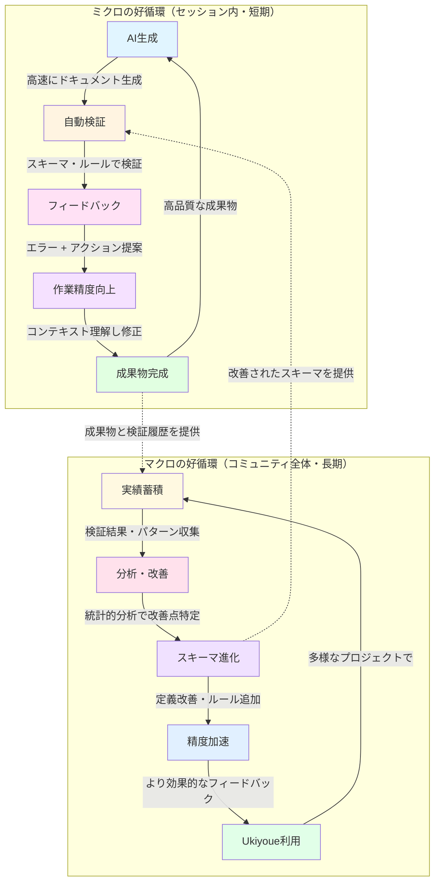
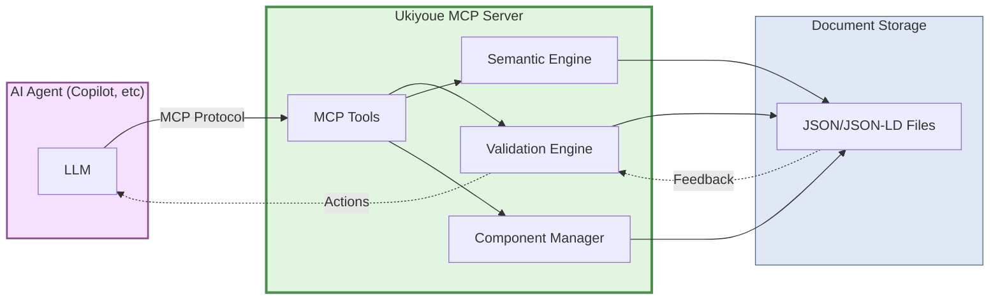
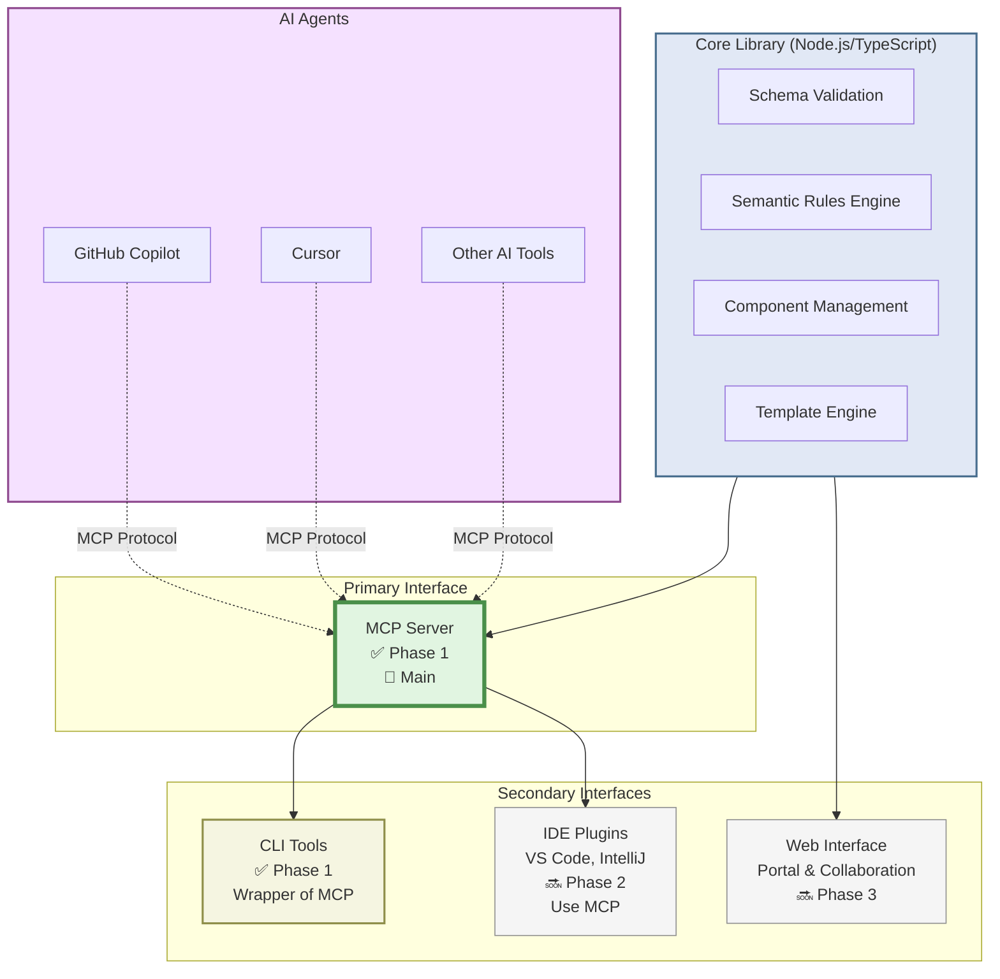

# Ukiyoue Framework - Concept & Background

## フレームワークのコンセプトと背景

---

## 🎯 このドキュメントの目的

| 項目     | 内容                                                 |
| -------- | ---------------------------------------------------- |
| **What** | Ukiyoue フレームワークが解決する問題とその背景       |
| **Why**  | フレームワーク開発の方向性と判断基準を明確にするため |
| **Who**  | フレームワーク開発者、利用者、貢献者                 |
| **When** | プロジェクト理解時、設計判断時、新メンバー参加時     |

---

## 📊 現状認識：AI 時代のドキュメント問題

### Context: AI コーディングの普及と矛盾

**事実**: 現在、IT システムのデリバリーにおいて AI によるコーディングは当たり前になってきました。

**AI 活用の現状**:

| 活用場面                   | 具体例                 | 成熟度      |
| -------------------------- | ---------------------- | ----------- |
| コード生成・補完           | GitHub Copilot, Cursor | 🟢 成熟     |
| リファクタリング・レビュー | AI-powered PR review   | 🟡 発展中   |
| テスト生成                 | Unit test generation   | 🟡 発展中   |
| バグ修正・最適化           | AI debugging assistant | 🟡 発展中   |
| **ドキュメント生成**       | Code-to-doc generation | 🔴 **初期** |

**矛盾**: コード生成は成熟しているのに、ドキュメント領域はまだ未成熟

### Problem: 従来のドキュメント管理の限界

従来のドキュメント管理手法は、AI 活用時代の要求に応えられません：

#### 課題 1: 静的な情報管理の限界

**問題**:

- ❌ 作成時点の情報が固定化される
- ❌ 必要な情報を探し出すのに時間がかかる
- ❌ 異なる視点からの再構成が困難

**具体的なシナリオ**:

**開発者の視点**:

- 「あの仕様、どこに書いてあったっけ？」
- → 複数ファイルを横断的に検索
- → 時間の浪費

**AI Agentの視点**:

- 「関連情報を動的に組み合わせたい」
- → 静的な文書では対応不可
- → AI活用の機会損失

#### 課題 2: メンテナンス負荷の増大

**問題**:

- ❌ 手動更新によるコストと遅延
- ❌ 実装とドキュメントの乖離
- ❌ バージョン管理の複雑さ

**具体的なシナリオ**:

**API仕様変更時**:

1. コードを修正（AI支援により迅速）
2. ドキュメントを探す
3. 手動で更新
4. 影響範囲を確認

**Result**: ドキュメント更新が開発のボトルネック

#### 課題 3: 知識の断片化と再発明

**問題**:

- ❌ プロジェクト間での知識の分断
- ❌ 成功パターンの埋没
- ❌ 車輪の再発明の繰り返し
- ❌ **大規模化すると情報過多で機能不全**

**具体的なシナリオ**:

**重複作業の発生**:

- Project A: 「認証の実装、どうやったっけ？」→ ゼロから調査・設計
- Project B: 「認証の実装、どうやったっけ？」→ ゼロから調査・設計
- **Result**: 両者の成果が共有されず、同じ作業を重複

**大規模プロジェクトでの情報過多**:

- 大規模システム: 数千のドキュメント、数万のリンク
- 開発者: 「必要な情報がどこに...?」→ 検索に膨大な時間
- AI Agent: 「全体の整合性をどう保つ?」→ コンテキスト超過で処理不可
- **Result**: 規模が大きくなるほど、情報活用の効率が悪化

#### 課題 4: AI 生成物の品質保証のジレンマ

**問題**:

- ❌ AI による生成・編集は高速だが、品質保証の方法が未成熟
- ❌ AI の作成したものの品質を AI に頼ることはできない
- ❌ 人間がすべてレビューしていては開発のボトルネックになる

**具体的なシナリオ**:

**AIドキュメント生成時**:

- **生成**: AI が 30分でドキュメント初稿を生成
- **検証の選択肢**:
  - AIレビュー → 🔴 信頼性の問題
  - 人間レビュー → 🔴 3時間かかり、ボトルネックに
  - 放置 → 🔴 品質劣化、技術的負債
- **Result**: 高速生成の利点を活かせない

### 課題の本質：品質保証の不在

これら4つの課題に共通するのは、**構造化と検証の仕組みが不在**であることです：

| 課題             | 根本原因               | 必要な仕組み              |
| ---------------- | ---------------------- | ------------------------- |
| 静的な情報管理   | 構造化・意味定義の欠如 | スキーマ + セマンティクス |
| メンテナンス負荷 | 自動検証の欠如         | バリデーション            |
| 知識の断片化     | 再利用可能な構造の欠如 | コンポーネント化          |
| AI 生成物の品質  | ルールベース検証の欠如 | 自動品質保証              |

**Ukiyoue の解決アプローチ**: これらすべてに対し、**スキーマ定義 + セマンティクス + 自動検証ツール**による包括的なソリューションを提供します。

詳細な実装方法と品質保証の仕組みについては、後述の「💡 Ukiyoue Framework のアプローチ」セクションで説明します

---

## 🔄 パラダイムシフト：AI 活用を前提としたドキュメント

### 中心的な洞察

AI 活用が当たり前となった今、ドキュメントも**AI によって活用可能である**ことが前提となります。

これは単なるツールの変化ではなく、**ドキュメントの本質的な役割の変化**を意味します。

### 従来の悪循環 vs Ukiyoue の好循環

**❌ 従来の悪循環:**

作成 → 放置 → 陳腐化 → 信頼性低下 → 使われなくなる → さらに放置

**✅ Ukiyoue の好循環:**

生成 → 検証 → フィードバック → 改善 → 蓄積 → 再利用 → さらに高品質化

### Before → After の比較

#### 従来のドキュメント

- 人間が読むための静的な記録
- 作成者が書いて終わり
- プロジェクト固有の孤立した文書
- 形式は自由（Word, Excel, Wiki等）
- 手動メンテナンス
- 陳腐化の一途

#### AI時代のドキュメント（Ukiyoue）

- AIと人間が協働するための動的な知識基盤
- AI/人間が継続的に更新・再構成
- 横断的に再利用可能な知識コンポーネント
- 構造化され機械可読な形式（JSON + Schema + Semantics）
- 自動生成・検証・評価
- 使うほど品質向上（好循環）

### 具体的な変化

| 観点         | 従来              | AI 時代（Ukiyoue）           |
| ------------ | ----------------- | ---------------------------- |
| **主な読者** | 人間              | AI + 人間                    |
| **更新方法** | 手動編集          | AI 支援 + 自動生成           |
| **情報取得** | 検索 → 読解       | 対話 → 抽出                  |
| **再利用**   | コピペ            | コンポーネント参照           |
| **品質管理** | レビュー          | 自動検証 + レビュー          |
| **構造**     | 非構造化/半構造化 | 完全構造化                   |
| **意味**     | 暗黙的            | 明示的（セマンティック定義） |

---

## 🎯 Ukiyoue Framework のビジョン

### Mission Statement

**Ukiyoue は、AI 時代のプロジェクトドキュメント管理を革新し、開発者と AI が協働する新しい知識基盤を提供します。**

### 中心コンセプト：好循環（Virtuous Cycle）

Ukiyoue の根幹をなすのは、**「好循環」** というコンセプトです。

従来のドキュメント管理は「作成 → 放置 → 陳腐化」という**悪循環**に陥りがちでした。
Ukiyoue は、**2つのレベルの好循環**により、品質が継続的に向上します。

#### 🔄 2つのレベルの好循環

Ukiyoueは2つのレベルの好循環が同時に回ることで、加速度的に品質が向上します：



**相互作用**:

- **ミクロ → マクロ**: 高品質な成果物と検証履歴がマクロの改善に活用される（点線矢印）
- **マクロ → ミクロ**: 改善されたスキーマにより、次のミクロの好循環が高い精度で開始できる（点線矢印）

**時間スケール**:

- **ミクロ**: 分〜時間（個別セッション内）
- **マクロ**: 週〜月（コミュニティ全体）

**効果範囲**:

- **ミクロ**: 個別プロジェクト
- **マクロ**: 全プロジェクト、コミュニティ全体

**結果**: 2つの好循環が相互に強化し合い、加速度的に品質が向上する

#### 最終的な効果

使えば使うほど品質が向上する。これら2つの好循環により、以下が実現されます：

**ミクロの好循環から**:

- ✅ **速度と品質の両立**: AI の高速生成 + 自動検証による品質保証
- ✅ **セッション内での改善**: フィードバックを受けてAIの作業精度が向上
- ✅ **人間の負荷軽減**: 機械的な検証は自動化、人間は創造的な作業に集中

**マクロの好循環から**:

- ✅ **フレームワークの進化**: 実績蓄積によりスキーマ・セマンティクス定義が改善
- ✅ **フィードバック精度の向上**: より効果的なアクション提案が可能に
- ✅ **コミュニティ全体の利益**: 誰かの実績が全員の品質向上に貢献

**相乗効果**:

- ✅ **加速度的な品質向上**: 2つの好循環が互いを強化し合う
- ✅ **AI の自律性向上**: アクション提案により、AIが自律的に作業を進行
- ✅ **知識の蓄積**: 高品質な成果物とベストプラクティスが組織・コミュニティに蓄積

### 好循環を支える 3 つの柱

好循環を実現するために、Ukiyoue は以下の3つの特性を持つドキュメントを提供します。
**これら3つの柱はすべて、大規模プロジェクトにおけるスケーラビリティを前提として設計されています。**

#### 1. 💬 対話可能性 (Conversational)

**従来**: 静的な文書を人間が読み解く
**Ukiyoue**: AI が動的に情報を抽出・再構成

**好循環への貢献**:

- AIが文脈を理解して適切な情報を提供
- 動的な再構成により常に最新の視点を提供
- 対話を通じて知識が洗練される

**スケーラビリティ**:

大規模プロジェクトでの課題:

- 数千のドキュメントから必要な情報を探すのは不可能
- 全体像を把握しながら詳細を理解することが困難

Ukiyoueの解決策:

- セマンティック検索により、規模に関わらず適切な情報を抽出
- 視点ベースの動的再構成で、必要なレベルの情報だけを表示
- グラフ構造により、関連情報への効率的なナビゲーション

効果:

- ドキュメント数が10倍になっても、情報アクセス時間は一定
- AIが大規模な情報空間を効率的にナビゲート

**実現方法**:

- JSON-LDによるセマンティック定義
- コンテキストを考慮した情報検索
- 視点に応じた動的な再構成
- 階層的な情報構造とインデックス

#### 2. 🤖 自動生成可能性 (Auto-generatable)

**従来**: 手動で作成・更新
**Ukiyoue**: AI が自動生成・検証

**好循環への貢献**:

- 高速生成により試行錯誤のサイクルが加速
- 自動検証により即座にフィードバック
- フィードバックを受けてAIの作業精度が向上

**スケーラビリティ**:

大規模プロジェクトでの課題:

- 手動作成では数千のドキュメント作成に数ヶ月
- 全体の整合性を人間が把握・維持することは不可能
- 更新時の影響範囲の特定と対応が困難

Ukiyoueの解決策:

- 並列生成により、数千のドキュメントを数時間で作成
- スキーマベース検証で、規模に関わらず整合性を自動保証
- 変更影響分析の自動化により、依存関係を即座に特定
- 段階的検証（構造 → 意味 → 内容）で効率的な品質保証

効果:

- 大規模プロジェクトでも、ドキュメント作成時間は従来の1/10以下
- 整合性の問題を早期に自動検出し、手戻りを最小化
- 更新作業の影響範囲を瞬時に把握可能

**実現方法**:

- JSON Schemaによる構造定義
- 自動バリデーション
- テンプレートベース生成
- 並列処理とバッチ検証
- 変更影響分析エンジン

#### 3. ♻️ 再利用可能性 (Reusable)

**従来**: プロジェクトごとにゼロから作成
**Ukiyoue**: コンポーネント化された知識を再利用

**ミクロの好循環への貢献**:

- 高品質な成果物が組織の資産として蓄積
- 成功パターンが次のプロジェクトで再利用
- 使えば使うほど知識基盤が充実

**マクロの好循環への貢献**:

- 検証結果と成果物の品質の相関データを蓄積
- どのフィードバックが効果的だったかを分析
- 統計的分析によりスキーマ・ルール改善の根拠に

**スケーラビリティ**:

大規模プロジェクトでの課題:

- 数百のマイクロサービス、数千のAPI
- 似た要件・パターンの繰り返しだが、毎回ゼロから作成
- 成功パターンが埋もれて活用されない
- プロジェクトが大きくなると、重複や不整合が増加

Ukiyoueの解決策:

- コンポーネント単位での粒度の細かい再利用
- セマンティック分類により、規模が大きくても適切なコンポーネントを発見
- バリエーション管理により、似たパターンを効率的に活用
- 参照ベースの構造により、重複を排除し一貫性を保証

効果:

- 大規模システムでも、類似コンポーネントの重複作成を回避
- プロジェクト規模に比例してコストが増えず、逆にレバレッジが効く
- 組織全体での知識の蓄積・活用が規模とともに加速

**規模の経済（Economies of Scale）**:

Ukiyoueの再利用可能性は、規模が大きくなるほど効果が増大します。

原理:

- **従来の手法**:
  - すべてのドキュメントを個別に作成
  - 規模が2倍になれば、作業量も2倍（線形増加）
  - プロジェクト間で知識が分断
- **Ukiyoueの手法**:
  - 共通パターンを抽出・再利用
  - パターンライブラリが充実するほど、再利用率が上がる
  - 規模が大きいほど、パターン適用の機会が増える（サブ線形増加）

規模の経済の仕組み:

- **小規模プロジェクト**: パターンライブラリが未成熟 / ほとんどのドキュメントを個別作成 / 初期投資フェーズ
- **中規模プロジェクト**: パターンライブラリが成長 / 一部のドキュメントでパターン適用可能 / レバレッジが効き始める
- **大規模プロジェクト**: パターンライブラリが充実 / 大半のドキュメントでパターン適用可能 / 高いレバレッジ効果
- **複数プロジェクト・組織全体**: プロジェクト間でパターン共有 / 組織の知識資産として蓄積 / 新規プロジェクトは過去の知見をフル活用 / 規模の経済が最大化

効果の性質:

- ✅ 再利用可能な資産の蓄積: パターンライブラリの成長
- ✅ 初期投資の回収: 後続プロジェクトで投資が回収される
- ✅ 加速度的改善: 使えば使うほど効率が向上
- ✅ 組織横断での効果: 部門・プロジェクト間で知識共有

エンタープライズでの価値:

- 部門Aで抽出されたパターンを部門Bが活用
- 組織全体でパターンライブラリが成長
- プロジェクト間での知識共有・標準化が自然に実現
- 新規プロジェクトは組織の知見をフル活用して開始
- ベストプラクティスが組織に定着
- 新人も熟練者の知見を活用可能

オプション: コミュニティパターン（任意）:

- 組織の判断で、機密性のないパターンを公開可能
- 他組織の公開パターンを参照・活用可能
- エンタープライズでは通常、組織内利用のみ

**実現方法**:

- コンポーネント単位の構造化
- セマンティックな分類・検索
- 品質スコアと検証履歴の記録
- 実績データの匿名化・集約
- 参照管理とバージョニング
- パターンライブラリの自動構築

---

### 好循環がもたらす効果

Ukiyoue の2つの好循環により、以下の複合的な効果が生まれます：

**ミクロの好循環（セッション内）**:

開発速度の向上:

- 情報探索時間の大幅な短縮
- ドキュメント作成時間の削減
- 更新作業の効率化
- → 各セッションで試行錯誤が減る

作業精度の向上:

- フィードバックを理解した修正
- 構造的な不足の早期発見
- 適切な作業計画の立案
- → 各セッションで品質が上がる

**マクロの好循環（フレームワーク進化）**:

フレームワークの成熟:

- スキーマ定義の継続的改善
- セマンティクスルールの精緻化
- より効果的なアクション提案
- → すべての利用者が恩恵を受ける

コミュニティ知識の蓄積:

- ベストプラクティスの抽出
- よくある問題パターンの特定
- ドメイン固有の検証ルール追加
- → 使われるほどUkiyoue自体が賢くなる

**相乗効果（加速度的改善）**:

- ミクロの好循環で得た知見 → マクロの改善に活用
- マクロの改善 → 次のミクロの好循環の開始地点が向上
- コミュニティ全体で加速度的に品質向上
- → 誰かの実績が全員の利益に

**重要**: これらは独立した効果ではなく、2つの好循環が相互に強化し合います

---

## 💡 Ukiyoue Framework のアプローチ

Ukiyoue は、以下の要求を満たす技術スタックで実現します：

### 技術要求

1. **厳密な構造化**: 曖昧さ・揺らぎを排除し、完全な検証を可能にする
2. **AI 可読性**: LLM が理解・生成しやすい形式
3. **セマンティック対応**: 意味・関係性を形式的に定義可能
4. **人間可読性**: 最終的に人間が読みやすい形式で提供
5. **スケーラビリティ**: 大規模プロジェクト（10,000+ ドキュメント）でも高速・効率的に機能

### 採用技術

これらの要求を満たす技術スタックの選定と、その根拠については [`architecture.md`](architecture.md) を参照してください。

### 3 つの柱による課題解決

フレームワークは以下の特性を持つドキュメントを実現します：

1. **対話可能（Conversational）**: AI エージェントとの対話、動的な情報再構成
   - **スケーラビリティ**: 大規模情報空間でも効率的なナビゲーション
2. **自動生成可能（Auto-generatable）**: 構造化された形式、自動バリデーション
   - **スケーラビリティ**: 並列処理による大量ドキュメントの高速生成
3. **再利用可能（Reusable）**: コンポーネント化、セマンティック検索
   - **スケーラビリティ**: 規模に比例してレバレッジが効く知識の蓄積

### ルールベース品質保証の実装

前述の「課題4: AI生成物の品質保証のジレンマ」に対する具体的な解決策：

#### 基本原則

> **「人間とAIの間に、自動検証レイヤーを挟む」**

**実装の3本柱**:

1. JSON Schema による構造検証
2. セマンティックルールによる整合性検証
3. 自動バリデーションツールによる即時フィードバック

#### 品質保証の階層構造

各レベルでエラー指摘とアクション提案を行います：

```text
Level 1: 構造検証（完全自動）
  検証内容:
    - JSON Schema による型・必須項目チェック
    - リンク切れチェック
    - フォーマット検証

  フィードバック例:
    ❌ 必須項目 'description' が不足
    💡 アクション: 説明文を追加してください（100文字以上推奨）

Level 2: 意味整合性検証（完全自動）
  検証内容:
    - セマンティックルールによる関係性チェック
    - 用語の一貫性検証
    - 参照整合性チェック

  フィードバック例:
    ⚠️ ユースケース 'UC-001' に対応する機能要件が未定義
    💡 アクション: 機能要件を作成し、リンクを設定してください
    💡 参考: テンプレート /templates/functional-requirement.json

Level 3: 内容妥当性検証（人間の判断）
  検証内容:
    - 要求仕様との整合性
    - ビジネスロジックの妥当性
    - ユーザー体験の適切性

  フィードバック例:
    💬 レビュー依頼: この認証フローはセキュリティ要件を満たしていますか？
    💡 確認ポイント: パスワードの暗号化方式、トークンの有効期限
```

**効果**: Level 1〜2を自動化することで、人間はLevel 3に集中できる

#### AI作業精度向上の好循環

検証結果とアクション提案をAIへフィードバックすることで、セッション内でのAI作業精度が向上します：

**好循環サイクル**:

1. **生成**: AIがドキュメントを生成
2. **検証**: スキーマ・ルールベースで自動検証
3. **フィードバック**: 検証結果 + アクション提案をAIのコンテキストに追加
4. **精度向上**: AIが提案を理解し、より適切な修正を実施
5. **再利用**: 高品質な成果物が知識基盤に蓄積 → 次の作業の参考に

**重要**: これはモデル自体の学習ではなく、**コンテキスト内での作業精度の向上**です。
フィードバックループにより、同一セッション内で試行錯誤が最小化されます。

##### アクション指向のフィードバック

検証結果は単なるエラー指摘ではなく、**次に何をすべきか**を提案します：

**従来の検証（エラー指摘のみ）**:

- ❌ 必須項目 'parameters' が不足しています

**Ukiyoueの検証（アクション提案）**:

- ❌ 必須項目 'parameters' が不足しています
- 💡 次のアクション:
  - APIのパラメータ定義を追加してください
  - 例: { "name": "userId", "type": "string", "required": true }
  - 参考: 同様のAPIでは3〜5個のパラメータが定義されています

**高度な例（構造的な不足の指摘）**:

- ⚠️ ユースケース "ユーザー登録" が定義されていますが、対応する機能要件が見つかりません
- 💡 次のアクション:
  - 機能要件ドキュメントを作成してください
  - 必要な項目: 機能ID、機能名、説明、受入基準
  - ユースケースとのリンクを設定してください
  - テンプレート: /templates/functional-requirement.json

このアクション提案により、AIは（同一セッション内で）：

- ✅ エラーを**理解**できる（何が問題か）
- ✅ 解決策を**知る**ことができる（どう直すか）
- ✅ 次の作業を**計画**できる（何をすべきか）
- ✅ より精度高く**修正**できる（試行錯誤を最小化）

##### 具体例（改善前後の比較）

###### シナリオ 1: API仕様書の作成（基本）

**改善前（単純なエラー指摘）**:

- 生成: "このAPIはユーザー情報を取得します"
- 検証: ❌ 必須項目 'parameters' が不足
- 再生成: AIが試行錯誤で追加を試みる（時間がかかる）

**改善後（アクション提案あり）**:

- 生成: "このAPIはユーザー情報を取得します"
- 検証: ❌ 必須項目 'parameters' が不足
  - 💡 次のアクション: パラメータ定義を追加
  - 💡 推奨形式: { "name": "userId", "type": "string" }
- 再生成: AIが提案に従って即座に修正（高速・高精度）
- 検証: ✅ Pass

###### シナリオ 2: プロジェクト全体の整合性（高度）

**改善前（構造的な問題を検出できない）**:

- 生成: ユースケース "ユーザー登録" を作成
- 検証: ✅ Pass（個別のドキュメントとしては問題なし）
- 結果: 対応する機能要件が不在のまま進行
  - → 後で手動で気づき、大きな手戻り

**改善後（構造的な不足を指摘し、作業計画を提案）**:

- 生成: ユースケース "ユーザー登録" を作成
- 検証: ✅ ユースケース自体は問題なし
  - ⚠️ 構造的な不足を検出:
    - 対応する機能要件ドキュメントが未定義
    - テストケースも未定義
  - 💡 推奨される作業計画:
    1. 機能要件 "FR-001: ユーザー登録機能" を作成
       テンプレート: /templates/functional-requirement.json
    2. テストケース "TC-001: ユーザー登録の正常系" を作成
       テンプレート: /templates/test-case.json
    3. ユースケース → 機能要件 → テストケースのリンクを設定
    4. トレーサビリティマトリクスを更新
- AIの判断: 提案された計画に従って作業を継続
- 自動生成: 機能要件ドキュメントを作成
- 自動生成: テストケースを作成
- 自動設定: 相互リンクを設定
- 検証: ✅ 全体の整合性が保たれている
- 結果: 手戻りなく、体系的にドキュメントが完成

**効果の比較**:

| 効果項目                 | シナリオ 1（基本）          | シナリオ 2（高度）                |
| ------------------------ | --------------------------- | --------------------------------- |
| **試行錯誤の削減**       | ✅ 単一ドキュメント内で削減 | ✅ プロジェクト全体で削減         |
| **作業精度**             | ✅ 形式パターンを理解       | ✅ 構造パターンと依存関係を理解   |
| **セッション内での改善** | ✅ 修正を精度高く実施       | ✅ 作業計画を精度高く立案・実行   |
| **人間の介入**           | ✅ フォーマット修正が不要   | ✅ 全体設計の見直しが不要         |
| **手戻り防止**           | 🟡 単一ドキュメントレベル   | ✅ プロジェクト全体レベル         |
| **作業計画立案の精度**   | - （該当なし）              | ✅ AIが体系的な作業計画を立案可能 |

**特に重要な効果（シナリオ 2）**:

- 🎯 **作業計画立案の精度向上**: AIがドキュメント間の依存関係を理解し、必要な成果物を事前に提案
- 🔗 **トレーサビリティの自動確保**: 要件からテストまでの追跡可能性が自動的に維持される
- 📐 **アーキテクチャの整合性**: プロジェクト全体の構造的な一貫性が保たれる
- ⏱️ **大幅な時間短縮**: 後工程での手戻りが激減し、全体のリードタイムが短縮

**最終結果**:

- AI 生成の速度 ✅ 維持
- 品質保証 ✅ 自動化
- 人間のレビュー負荷 ✅ 大幅削減
- **AI の作業精度** ✅ **セッション内で継続的に向上**
- AI の自律性 ✅ 大幅に向上
- **AI の作業計画立案能力** ✅ **飛躍的に向上（新規）**

---

## 📈 期待される効果

Ukiyoue フレームワークの導入により、以下の定量的な改善が期待されます：

### 定量的な効果の見込み

#### スケーラビリティの実証

**重要**: Ukiyoue は、規模が大きくなるほど効果が増大する設計です

**スケーラビリティの実証例**:

| プロジェクト規模                    | 従来の手法                | Ukiyoue | 削減率           |
| ----------------------------------- | ------------------------- | ------- | ---------------- |
| 小規模（10-100 ドキュメント）       | 1週間                     | 2日     | 70%              |
| 中規模（100-1,000 ドキュメント）    | 3ヶ月                     | 1週間   | 90%              |
| 大規模（1,000-10,000 ドキュメント） | 1年以上（実質的に不可能） | 2週間   | 95%以上          |
| 超大規模（10,000+ ドキュメント）    | 人力では実質不可能        | 1ヶ月   | 実現可能性の獲得 |

**スケーラビリティの仕組み**:

| 項目           | 従来の手法（線形増加）         | Ukiyoue（サブ線形）             |
| -------------- | ------------------------------ | ------------------------------- |
| 作成コスト     | O(N) - 規模に比例              | O(N/k) - 再利用で係数減         |
| 検索時間       | O(N) - 全文書を探索            | O(log N) - セマンティック検索   |
| 整合性チェック | O(N²) - 手動で相互確認         | O(N) - 自動検証                 |
| 更新コスト     | O(N) - 影響範囲が不明          | O(1) - 影響範囲を自動特定       |
| 知識の蓄積効果 | 0 - プロジェクトごとにリセット | O(M) - プロジェクト数に比例成長 |

**結論**: 大規模プロジェクトこそUkiyoueの真価が発揮される

---

## 🛠️ 実装形態と提供方法

### 提供形式

Ukiyoueは以下の形式で段階的に提供されます：

#### Phase 1: MCP Server + CLI Tools（初期フェーズ）✅ **優先**

**MCP (Model Context Protocol) Server**として提供します。これが**Ukiyoueのメイン実装**です。

**なぜMCPがメインなのか**:

Ukiyoueの中心コンセプトは「**AIの作業品質向上**」です。これを実現するには：

1. **AIが直接利用できる形式**: LLMがツールとして呼び出せる必要がある
2. **リアルタイムフィードバック**: AI作業中に即座に検証・フィードバック
3. **コンテキスト統合**: AI のワークフローにシームレスに組み込まれる
4. **対話的改善**: 検証 → フィードバック → 修正のループを自動化

→ **MCP Server が最適解**



**提供するMCPツール**:

**提供するMCPツール**:

```typescript
// 検証ツール
validate({
  path: string,           // ファイル、ディレクトリ、またはプロジェクトルート
  level?: "structure" | "semantic" | "content",  // 検証レベル（デフォルト: "content"）
  checkReferences?: boolean  // 参照整合性をチェックするか（デフォルト: true）
})
→ 検証結果 + アクション提案を返す
→ 参照整合性チェックで欠落コンポーネント、トレーサビリティの問題を検出
→ AIは提案を理解して即座に修正可能

// コンポーネント検索
search_components({
  query: string,          // セマンティック検索クエリ
  category?: string,      // カテゴリフィルタ
  limit?: number
})
→ 関連コンポーネントのリストを返す
→ AIは適切なテンプレートを選択可能

// コンポーネント取得
get_component({
  name: string,
  variation?: string      // バリエーション指定
})
→ コンポーネントの詳細を返す
→ AIはこれを基に新規ドキュメント生成
```

**AIワークフローへの統合**:

**典型的なAI作業フロー（MCP統合）**:

1. AI: 「API仕様書を作成します」
   - → search_components("API endpoint")
   - → 適切なテンプレートを発見
2. AI: テンプレートベースでドキュメント生成
   - → validate(生成したファイル)
   - → フィードバック受信: "必須項目 'parameters' が不足"
3. AI: フィードバックを理解して即座に修正
   - → 再度 validate()
   - → ✅ Pass
4. AI: プロジェクト全体の整合性確認（自動）
   - → validate(プロジェクトルート, checkReferences: true)
   - → 「対応する機能要件が未定義」を検出
5. AI: 構造的な問題を理解し、作業計画を立案
   - → 機能要件ドキュメントを作成
   - → リンクを設定
   - → 再度 validate()
   - → ✅ All checks passed

**Result**: 人間の介入なしに、高品質なドキュメントが完成

**CLIツール（MCPサーバーのラッパー）**:

MCPサーバーと同じ機能をコマンドラインから利用可能：

```bash
# MCPサーバーを直接呼び出すのと同じロジック
ukiyoue validate <file-or-directory>
ukiyoue component search <query>
ukiyoue component get <name> [--variation <variation>]
ukiyoue component create-variation --base <base> --name <name> --params <params>
ukiyoue analyze <project-directory>
```

**提供形態の優先順位**:

1. **🥇 MCP Server**: AIエージェントとの統合（メイン）
2. **🥈 CLI Tools**: 人間による手動操作、CI/CD統合
3. **🥉 SDKs**: 他のツールへの組み込み（将来）

**提供形態の優先順位**:

1. **🥇 MCP Server**: AIエージェントとの統合（メイン）
2. **🥈 CLI Tools**: 人間による手動操作、CI/CD統合
3. **🥉 SDKs**: 他のツールへの組み込み（将来）

**MCP優先の理由**:

| 観点                   | MCP Server                              | CLI のみ                    |
| ---------------------- | --------------------------------------- | --------------------------- |
| **AI統合**             | ✅ ネイティブ統合                       | ⚠️ 手動でコマンド実行が必要 |
| **リアルタイム性**     | ✅ AIワークフロー内で即時フィードバック | ⚠️ バッチ処理的             |
| **好循環の実現**       | ✅ 自動的に回る                         | ⚠️ 人間が介入する必要がある |
| **学習曲線**           | ✅ AIが自然に利用                       | 🟡 人間がコマンドを学ぶ必要 |
| **作業精度向上**       | ✅ セッション内で自動的に向上           | ⚠️ 人間が判断する必要がある |
| **コンテキスト保持**   | ✅ AIのコンテキスト内に統合             | ❌ コンテキストが分断       |
| **CI/CD統合**          | 🟡 可能だが間接的                       | ✅ 直接的                   |
| **人間による手動操作** | ⚠️ 別途CLIが必要                        | ✅ 直接的                   |

**結論**:

- **メイン用途（AI作業支援）**: MCP Server
- **補助用途（CI/CD、手動操作）**: CLI Tools

**CI/CD統合例**:

```yaml
# GitHub Actions
- name: Validate Ukiyoue Documents
  run: |
    ukiyoue validate ./docs
    ukiyoue analyze ./docs --output report.json

# GitLab CI
validate_docs:
  script:
    - ukiyoue validate ./docs
    - ukiyoue analyze ./docs
  artifacts:
    reports:
      ukiyoue: report.json
```

#### Phase 2: IDE Integration（将来）

開発環境への統合を提供します（CLIベースの機能を活用）：

**VS Code Extension**:

- リアルタイムバリデーション
- コンポーネント補完
- インタラクティブなバリエーション選択
- グラフィカルなトレーサビリティビュー

**IntelliJ Plugin**:

- 同様の機能をJetBrains IDEsへ提供

**LSP (Language Server Protocol)**:

- 任意のLSP対応エディタで利用可能
- CLIの検証ロジックを再利用

#### Phase 3: Web Interface（将来）

ブラウザベースのインターフェースを提供します：

**ドキュメントポータル**:

- 対話的な情報探索
- セマンティック検索UI
- ビジュアライゼーション（グラフ、マトリクス）

**コラボレーション機能**:

- チームでのレビュー
- コメント・アノテーション
- バージョン比較

### アーキテクチャ上の利点

すべての実装が**コアロジック**を共有し、MCPサーバーを中心に構成されます：



**利点**:

- ✅ **AI-First設計**: AIワークフローへのネイティブ統合
- ✅ **リアルタイムフィードバック**: AIの作業精度がセッション内で向上
- ✅ **好循環の自動化**: 検証 → フィードバック → 修正が自動的に回る
- ✅ 一貫した動作保証（すべてが同じコアロジックを使用）
- ✅ メンテナンス効率（修正は1箇所のみ）
- ✅ 段階的な機能拡張（Phase 2, 3への拡張が容易）

---

## 🎨 プロジェクト名の由来

**Ukiyoue (浮世絵)**: 江戸時代の日本で発展した版画芸術

### フレームワークとの共通点

| 浮世絵の特徴                  | Ukiyoue の特徴         | ミクロの好循環         | マクロの好循環             |
| ----------------------------- | ---------------------- | ---------------------- | -------------------------- |
| 🖨️ **版画技術による複製**     | コンポーネントの再利用 | 再利用により知識が蓄積 | 実績データが蓄積           |
| 🎭 **多様な視点からの表現**   | 動的な情報再構成       | 対話により知識が洗練   | 多様な使用例から改善点発見 |
| 📖 **ジャンル・流派の体系化** | スキーマによる構造化   | 検証により品質が保証   | 統計分析によりスキーマ進化 |
| ♻️ **技法の継承と発展**       | 継続的な品質改善       | 作業精度が向上         | フレームワーク自体が進化   |
| 🌊 **世界への影響**           | オープンソースでの共有 | 組織内で好循環が拡大   | コミュニティで好循環が拡大 |

### なぜ「浮世絵」なのか

浮世絵は、版画技術により**高品質な作品を繰り返し複製し、改良を重ねながら技法を発展させた**芸術です。

これは Ukiyoue の目指す**2つのレベルの好循環**そのものです：

**ミクロの好循環（個々の絵師）**:

1. **マスター（版木）を作る** → スキーマ・セマンティクス定義
2. **高品質な複製を量産** → AI による自動生成
3. **技法を適用** → フィードバックによる作業精度向上

**マクロの好循環（流派・時代）**:

1. **技法が継承・発展** → 実績蓄積によるスキーマ改善
2. **流派が確立・進化** → フレームワーク自体の成熟
3. **世界に影響** → オープンな共有によるコミュニティ全体の進化

**重要な類似点**: 浮世絵も、個々の作品制作（ミクロ）と技法の継承・発展（マクロ）という2つの好循環により、数百年にわたって発展し続けました。

**メッセージ**: 伝統的な知識継承の知恵（浮世絵の2層の好循環）と AI 時代の新しい可能性（自動化された2層の好循環）を結びつける

---

## 📚 Related Documents

- [`requirements.md`](requirements.md) - フレームワークの詳細要件
- [`architecture.md`](architecture.md) - アーキテクチャ設計と技術選定
- [`../README.md`](../README.md) - プロジェクト概要と開発ロードマップ
