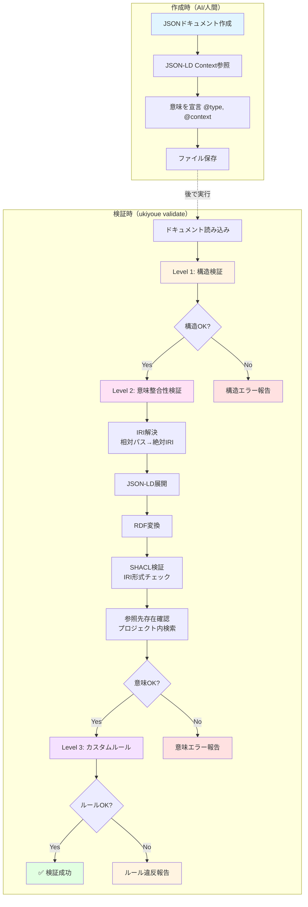

# Ukiyoue Framework - Implementation Guide

## 📋 このドキュメントの目的

| 項目     | 内容                                             |
| -------- | ------------------------------------------------ |
| **What** | Ukiyoue Frameworkの実装詳細と開発ガイド          |
| **Why**  | 実装時の具体的な手順とライブラリの使い方を明確化 |
| **Who**  | フレームワーク実装者、コントリビューター         |
| **When** | 実装作業中、各エンジンの詳細を理解する時         |

**関連ドキュメント**: このドキュメントは [`architecture.md`](architecture.md) の実装詳細版です。全体設計を理解した上で参照してください。

---

## 🔍 定義と検証の構造

### 全体像：ドキュメントのライフサイクル

Ukiyoueにおけるドキュメントは、**作成時**と**検証時**で異なる処理が行われます。



---

## Phase 1: ドキュメント作成（静的）

### 目的

AIまたは人間がドキュメントを作成する

### この時点で定義されるもの

```json
// docs/requirements/FR-001.json（ユーザーが作成）
{
  "@context": "https://ukiyoue.dev/context/v1", // ← 意味定義を**参照**
  "@type": "FunctionalRequirement", // ← クラスを**宣言**
  "id": "FR-001",
  "title": "ユーザー認証機能",
  "description": "ユーザーがメールアドレスとパスワードでログインできる",
  "priority": "high",
  "status": "draft",
  "acceptanceCriteria": [
    "メールアドレスとパスワードでログインできること",
    "ログイン失敗時はエラーメッセージを表示すること"
  ],
  "testCases": ["TC-001", "TC-002"], // ← 関連を**記述**
  "dependsOn": ["FR-000"] // ← 別の要件への依存を記述
}
```

### 参照されているスキーマ定義

```json
// schemas/requirement.schema.json
{
  "$schema": "https://json-schema.org/draft/2020-12/schema",
  "$id": "https://ukiyoue.dev/schemas/requirement.schema.json",
  "type": "object",
  "required": [
    "@context",
    "@type",
    "id",
    "title",
    "description",
    "priority",
    "status"
  ],
  "properties": {
    "@context": { "type": "string" },
    "@type": { "type": "string" },
    "id": {
      "type": "string",
      "pattern": "^FR-[0-9]{3}$"
    },
    "title": {
      "type": "string",
      "minLength": 5,
      "maxLength": 100
    },
    "description": {
      "type": "string",
      "minLength": 10
    },
    "priority": {
      "type": "string",
      "enum": ["high", "medium", "low"]
    },
    "status": {
      "type": "string",
      "enum": ["draft", "approved", "implemented", "deprecated"]
    },
    "acceptanceCriteria": {
      "type": "array",
      "items": { "type": "string" },
      "minItems": 1
    },
    "testCases": {
      "type": "array",
      "items": { "type": "string" }
    },
    "dependsOn": {
      "type": "array",
      "items": { "type": "string" }
    }
  }
}
```

```json
// semantics/context.jsonld（一部抜粋）
{
  "@context": {
    "@vocab": "https://ukiyoue.dev/vocab#",
    "FunctionalRequirement": {
      "@id": "https://ukiyoue.dev/vocab#FunctionalRequirement",
      "@type": "@id"
    },
    "testCases": {
      "@id": "https://ukiyoue.dev/vocab#testCases",
      "@type": "@id",
      "@container": "@set"
    },
    "dependsOn": {
      "@id": "https://ukiyoue.dev/vocab#dependsOn",
      "@type": "@id",
      "@container": "@set"
    }
  }
}
```

### 重要な理解

- ✅ この時点では**ただのJSONファイル**
- ✅ `@context`は外部のJSON-LD定義を**参照しているだけ**（まだ解決されていない）
- ✅ `@type`は**意味を宣言**しているが、まだ検証されていない
- ❌ JSON-LDの展開・RDF変換は**まだ実行されていない**
- ❌ 検証は**一切実行されていない**

---

## Phase 2: 検証実行（動的）

### 目的

ドキュメントの正当性を3レベルで検証

---

## Level 1: 構造検証（JSON Schema）

### 実行タイミング

検証の最初

### 使用技術

- JSON Schema (Draft 2020-12)
- Ajv v8（検証エンジン）

### 処理フロー

```typescript
// Validation Engine内部
import Ajv from "ajv";
import addFormats from "ajv-formats";

// 1. スキーマ読み込み
const schema = await loadJsonSchema("requirement.schema.json");

// 2. Ajvインスタンス作成
const ajv = new Ajv({ allErrors: true, strict: true });
addFormats(ajv);

// 3. スキーマコンパイル
const validate = ajv.compile(schema);

// 4. ドキュメント検証
const document = await loadDocument("FR-001.json");
const isValid = validate(document);

if (!isValid) {
  // エラー詳細を取得
  console.log(validate.errors);
  // [
  //   {
  //     instancePath: "/testCases",
  //     message: "must have required property 'testCases'"
  //   }
  // ]
}
```

### 検証内容

| 項目           | 例                                                          |
| -------------- | ----------------------------------------------------------- |
| 必須項目       | `id`, `title`, `description`が存在するか                    |
| データ型       | `priority`が文字列か                                        |
| 列挙値         | `status`が`draft/approved/implemented/deprecated`のいずれか |
| フォーマット   | `id`が`^FR-[0-9]{3}$`パターンに一致するか                   |
| 配列の要素数   | `acceptanceCriteria`が最低1個あるか                         |
| ネストした構造 | `acceptanceCriteria`の各要素が文字列か                      |
| 文字列長       | `title`が5〜100文字、`description`が10文字以上か            |

### エラー例

```json
{
  "level": "structure",
  "errors": [
    {
      "path": "/acceptanceCriteria",
      "message": "必須項目 'acceptanceCriteria' が不足しています",
      "expected": "array (minItems: 1)",
      "actual": "undefined"
    }
  ]
}
```

---

## Level 2: 意味整合性検証（JSON-LD + SHACL）

### 実行タイミング

構造検証が成功した後

### 使用技術

- jsonld.js（JSON-LD処理）
- rdf-validate-shacl（SHACL検証エンジン）

---

### Step 2-0: IRI解決（ADR-018）

```typescript
// Semantic Engine内部

// 0. 相対パスを絶対IRIに解決
const baseIri = config.baseIri; // 例: "file:///path/to/project/docs/"
const resolvedDocument = await semanticEngine.resolveIris(document, baseIri);

// Before（相対パス）:
// "testCases": ["../tests/TC-001", "../tests/TC-002"]
// "dependsOn": ["./FR-000"]

// After（絶対IRI）:
// "testCases": ["file:///path/to/project/docs/tests/TC-001", "file:///path/to/project/docs/tests/TC-002"]
// "dependsOn": ["file:///path/to/project/docs/requirements/FR-000"]
```

**何が起こるか**:

- ドキュメント内の相対パス参照がプロジェクトのベースIRIと組み合わされる
- すべての参照が完全なIRI形式になる
- JSON-LD処理とSHACL検証で正しく扱えるようになる

---

### Step 2-1: JSON-LD → RDF変換

```typescript
// Semantic Engine内部
import * as jsonld from "jsonld";
import { Parser as N3Parser } from "n3";
import factory from "rdf-ext";

// 1. カスタム document loader でローカル context を読み込み
const documentLoader = async (url: string) => {
  if (url === "https://ukiyoue.dev/context/v1") {
    const contextPath = resolve(
      __dirname,
      "../semantics/contexts/context.jsonld"
    );
    const contextContent = readFileSync(contextPath, "utf-8");
    return {
      contextUrl: undefined,
      document: JSON.parse(contextContent),
      documentUrl: url,
    };
  }
  throw new Error(`Unable to load remote context: ${url}`);
};

// 2. JSON-LD を N-Quads 形式に変換
const nquads = await jsonld.toRDF(document, {
  format: "application/n-quads",
  documentLoader,
});

// 3. N-Quads を rdf-ext dataset に変換
const dataset = factory.dataset();
const parser = new N3Parser({ format: "application/n-quads" });

return new Promise((resolve, reject) => {
  parser.parse(nquads, (error, quad) => {
    if (error) {
      reject(error);
    } else if (quad) {
      const rdfQuad = factory.quad(
        factory.namedNode(quad.subject.value),
        factory.namedNode(quad.predicate.value),
        quad.object.termType === "Literal"
          ? factory.literal(
              quad.object.value,
              quad.object.language || quad.object.datatype?.value
            )
          : factory.namedNode(quad.object.value)
      );
      dataset.add(rdfQuad);
    } else {
      resolve(dataset);
    }
  });
});
```

**重要ポイント**:

- カスタム document loader で**ローカル context.jsonld** を読み込み（ネットワーク不要）
- `@base` を使って相対 ID を絶対 IRI に変換（例: `"BG-001"` → `https://ukiyoue.dev/doc/BG-001`）
- rdf-ext の dataset 形式に変換して SHACL validator に渡す

---

### Step 2-2: RDFグラフの構造

生成される RDF トリプル：

```turtle
# BusinessGoal の例
<https://ukiyoue.dev/doc/BG-001> <http://www.w3.org/1999/02/22-rdf-syntax-ns#type> <https://ukiyoue.dev/vocab#BusinessGoal> .
<https://ukiyoue.dev/doc/BG-001> <http://purl.org/dc/terms/title> "SEO最適化"@ja .
<https://ukiyoue.dev/doc/BG-001> <http://purl.org/dc/terms/description> "検索エンジンからの流入を増やす"@ja .
<https://ukiyoue.dev/doc/BG-001> <https://ukiyoue.dev/vocab#hasMetric> <https://ukiyoue.dev/doc/SM-001> .
```

**RDFグラフの構造**:

RDFは「主語・述語・目的語」のトリプル（3つ組）の集合です：

| 主語（Subject） | 述語（Predicate） | 目的語（Object）      |
| --------------- | ----------------- | --------------------- |
| FR-001          | rdf:type          | FunctionalRequirement |
| FR-001          | dc:title          | "ユーザー認証機能"    |
| FR-001          | ukiyoue:testCases | TC-001                |
| FR-001          | ukiyoue:testCases | TC-002                |
| FR-001          | ukiyoue:dependsOn | FR-000                |

このグラフ構造により、「FR-001はテストケースTC-001, TC-002を持つ」「FR-001は要件FR-000に依存する」という**意味的な関係**が明示されます。

---

### Step 2-3: SHACL検証

```typescript
// Semantic Engine内部
import SHACLValidator from "rdf-validate-shacl";

// 1. SHACL shapes を読み込み（Turtle 形式）
const shapesDataset = await loadShapes();

// 2. Validator を作成（factory オプションなし）
const validator = new SHACLValidator(shapesDataset);

// 3. データグラフを検証
const report = await validator.validate(dataDataset);

if (report.conforms) {
  // ✅ 検証成功
  return { valid: true };
} else {
  // ❌ 検証失敗 - エラーを整形
  const errors = report.results.map((result) => ({
    path: result.path?.value || "unknown",
    message: result.message?.[0]?.value || "Constraint violated",
    focusNode: result.focusNode?.value,
    severity: result.severity?.value.includes("Violation")
      ? "Violation"
      : "Warning",
  }));
  return { valid: false, errors };
}
```

**SHACL Shape の例**（`semantics/shapes/business-goal.ttl`）：

```turtle
@prefix sh: <http://www.w3.org/ns/shacl#> .
@prefix ukiyoue: <https://ukiyoue.dev/vocab#> .
@prefix dc: <http://purl.org/dc/terms/> .

ukiyoue:BusinessGoalShape
  a sh:NodeShape ;
  sh:targetClass ukiyoue:BusinessGoal ;

  # title は必須で 1-200 文字
  sh:property [
    sh:path dc:title ;
    sh:minLength 1 ;
    sh:maxLength 200 ;
    sh:minCount 1 ;
    sh:maxCount 1 ;
    sh:message "title は必須で、1〜200文字である必要があります" ;
  ] ;

  # hasMetric は IRI の配列
  sh:property [
    sh:path ukiyoue:hasMetric ;
    sh:nodeKind sh:IRI ;
    sh:message "hasMetric は有効な IRI である必要があります" ;
  ] .
```

**重要ポイント**：

- `sh:datatype xsd:string` を指定しない（rdf:langString も許可）
- `sh:nodeKind sh:IRI` で参照フィールドの IRI 形式を検証
- `sh:minCount`/`sh:maxCount` で必須・任意を制御

---

### Step 2-4: 参照整合性チェック

```typescript
// Semantic Engine内部

// 1. プロジェクト内の全ドキュメント ID を取得
async getAllDocumentIds(): Promise<Set<string>> {
  const allIds = new Set<string>();
  const jsonFiles = this.findJsonFiles(this.projectRoot);

  for (const file of jsonFiles) {
    const content = JSON.parse(readFileSync(file, "utf-8"));
    if (content.id) {
      allIds.add(content.id);
    }
  }
  return allIds;
}

// 2. 参照フィールドをチェック
async checkReferences(document: Record<string, unknown>): Promise<SemanticValidationError[]> {
  const errors: SemanticValidationError[] = [];
  const allDocumentIds = await this.getAllDocumentIds();

  const referenceFields = ["hasMetric", "hasUseCase", "constrainedBy", "measuresGoal", "relatedGoal"];

  for (const field of referenceFields) {
    const value = document[field];
    if (!value) continue;

    const references = Array.isArray(value) ? value : [value];

    for (const ref of references) {
      if (typeof ref !== "string") continue;

      // IRI から ID 部分を抽出（例: "BG-001"）
      const id = this.extractIdFromIri(ref);

      if (!allDocumentIds.has(id)) {
        errors.push({
          path: field,
          message: `参照先のドキュメント '${id}' が見つかりません`,
          focusNode: document["id"] as string,
          severity: "Violation",
        });
      }
    }
  }

  return errors;
}
```

**検証内容**：

1. SHACL で IRI 形式を検証（`sh:nodeKind sh:IRI`）
2. プロジェクト内の全ドキュメント ID を収集
3. 参照先 ID が実際に存在するかチェック
4. 存在しない場合はエラーを報告

### エラー例

```json
{
  "level": "semantic",
  "errors": [
    {
      "path": "derivedFrom",
      "message": "参照先のドキュメント 'BG-999' が見つかりません",
      "focusNode": "UC-001",
      "severity": "Violation"
    }
  ]
}
```

---

## Level 3: カスタムルール検証（ドメイン固有）

### 実行タイミング

意味整合性検証が成功した後

### 使用技術

- YAML/JSON定義
- カスタムバリデーター（TypeScript実装）

### 処理フロー

```typescript
// Validation Engine内部

// 1. カスタムルール読み込み
const customRules = await loadCustomRules("consistency.yaml");

// 2. 対象ドキュメントタイプに該当するルールを抽出
const applicableRules = customRules.filter(
  (rule) => rule.target.type === document["@type"]
);

// 3. 各ルールを実行
for (const rule of applicableRules) {
  const result = await executeRule(rule, document, rdfDataset);

  if (!result.passed) {
    errors.push({
      ruleId: rule.id,
      message: rule.validation.message,
      action: rule.validation.action,
      reference: rule.validation.reference,
    });
  }
}
```

### カスタムルール例

```yaml
# semantics/rules/consistency.yaml
rules:
  - id: REQ-001
    name: "承認済み要件にはテストケースが必要"
    description: "statusがapprovedまたはimplementedの要件は、最低2個のテストケース（正常系+異常系）が必要"
    level: error
    target:
      type: FunctionalRequirement
      status: ["approved", "implemented"]
    validation:
      check: hasMinimumTestCases
      minCount: 2
      message: "承認済み要件には最低2個のテストケース（正常系+異常系）が必要です"
      action: "不足しているテストケースを追加してください"
      reference: "/templates/test-case.json"
      detail: "現在のテストケース数: {actual}, 必要数: {expected}"

  - id: REQ-002
    name: "high優先度の要件には受入基準が必須"
    description: "priorityがhighの要件は、詳細な受入基準が必要"
    level: error
    target:
      type: FunctionalRequirement
      priority: "high"
    validation:
      check: hasAcceptanceCriteria
      minCount: 3
      message: "high優先度の要件には最低3個の受入基準が必要です"
      action: "受入基準を追加してください（What/Why/Howを明確に）"
```

### 検証内容

- **条件付きルール**: statusやpriorityに応じた動的な検証
- **ビジネスロジック**: 組織固有の開発プロセス要件
- **品質基準**: 最低限の品質を保証するルール
- **ドメイン知識**: 業界特有の制約や慣習

---

## 検証結果の構造

すべてのレベルの検証結果を統合したレポート：

```json
{
  "summary": {
    "totalDocuments": 1,
    "passed": 0,
    "failed": 1
  },
  "results": [
    {
      "document": "docs/requirements/FR-001.json",
      "overall": "failed",
      "levels": {
        "structure": {
          "status": "passed",
          "errors": []
        },
        "semantic": {
          "status": "failed",
          "errors": [
            {
              "path": "ukiyoue:dependsOn",
              "message": "参照先のドキュメント 'FR-000' が見つかりません",
              "severity": "error",
              "source": "Semantic Engine (Reference Check)"
            }
          ]
        },
        "custom": {
          "status": "failed",
          "errors": [
            {
              "ruleId": "REQ-001",
              "message": "承認済み要件には最低2個のテストケース（正常系+異常系）が必要です",
              "severity": "error",
              "action": "不足しているテストケースを追加してください",
              "reference": "/templates/test-case.json",
              "detail": "現在のテストケース数: 2, 必要数: 2 (status=approved時)"
            },
            {
              "ruleId": "REQ-002",
              "message": "high優先度の要件には最低3個の受入基準が必要です",
              "severity": "error",
              "action": "受入基準を追加してください（What/Why/Howを明確に）",
              "detail": "現在の受入基準数: 2, 必要数: 3"
            }
          ]
        }
      }
    }
  ]
}
```

---

## ライブラリの役割分担

| フェーズ              | ライブラリ                    | 役割                               |
| --------------------- | ----------------------------- | ---------------------------------- |
| **Level 1: 構造**     | Ajv v8                        | JSON Schemaコンパイル・検証実行    |
| **Level 2: 意味**     | jsonld.js                     | JSON-LD展開・RDF変換               |
|                       | rdf-validate-shacl            | RDFグラフのSHACL検証               |
| **Level 3: カスタム** | Ukiyoue独自実装（TypeScript） | YAMLルール読み込み・実行エンジン   |
| **共通**              | JSON Pointer（Ajv内蔵）       | エラー箇所の特定（/testCases/0等） |

**補足**:

- **Level 3 (カスタム)**: ユーザーはYAML/JSON形式でルール定義を記述するだけ。ルールの実行エンジンはUkiyoue Frameworkが提供
- ユーザー側での実装は不要（設定ファイルの記述のみ）

---

## 重要な設計原則

### 1. 段階的検証（Fail Fast）

```text
構造検証 → 失敗 → 即座に報告（以降の検証はスキップ）
構造検証 → 成功 → 意味検証 → 失敗 → 即座に報告
構造検証 → 成功 → 意味検証 → 成功 → カスタム検証
```

**理由**:

- 構造が壊れていれば、意味検証は無意味
- 早期失敗により検証時間を短縮

### 2. 検証の独立性

各レベルの検証は独立しており、個別に実行可能：

```bash
# 構造のみ
ukiyoue validate --level structure

# 意味検証まで
ukiyoue validate --level semantic

# すべて（デフォルト）
ukiyoue validate --level content
```

### 3. キャッシュ戦略

検証結果はファイルハッシュでキャッシュ：

```typescript
const fileHash = await hashFile("FR-001.json");
const cachedResult = cache.get(fileHash);

if (cachedResult) {
  return cachedResult; // キャッシュヒット
}

// 検証実行
const result = await validate(document);
cache.set(fileHash, result);
```

**効果**:

- 変更されていないファイルは再検証不要
- 大規模プロジェクトでの高速化

---

## 📦 プロジェクト構造

```text
ukiyoue/
├── docs/                          # ドキュメント
│   ├── architecture.md            # アーキテクチャ概要
│   ├── implementation-guide.md    # このファイル（実装詳細）
│   ├── poc-plan.md                # PoC計画
│   ├── concept.md                 # コンセプト
│   ├── working-backwards.md       # PR/FAQ
│   └── adr/                       # Architecture Decision Records
│       ├── 001-document-format.md
│       ├── 002-structure-validation.md
│       ├── 003-semantic-definition.md
│       ├── 004-schema-validation-engine.md
│       ├── 005-element-identification.md
│       ├── 006-semantic-integrity-validation.md
│       ├── 007-domain-specific-validation.md
│       ├── 008-implementation-language.md
│       ├── 009-runtime-environment.md
│       ├── 011-json-ld-library.md
│       ├── 012-shacl-library.md
│       ├── 013-mcp-implementation.md
│       ├── 014-cli-implementation.md
│       ├── 015-test-framework.md
│       ├── 016-lint-formatter.md
│       ├── 017-ci-cd-platform.md
│       └── 018-document-reference-strategy.md
│
├── schemas/                       # JSON Schema定義
│   ├── document.schema.json       # 基本ドキュメント
│   ├── metadata.schema.json       # メタデータ
│   ├── api-spec.schema.json       # API仕様
│   ├── requirement.schema.json    # 要件定義
│   └── test-case.schema.json      # テストケース
│
├── semantics/                     # セマンティック定義
│   ├── context.jsonld             # JSON-LD Context
│   ├── shapes/                    # SHACL Shapes
│   │   ├── document.ttl
│   │   ├── requirement.ttl
│   │   └── api-spec.ttl
│   └── rules/                     # カスタムルール
│       ├── consistency.yaml
│       └── completeness.yaml
│
├── tools/                         # ツール実装
│   ├── mcp-server/                # MCP Server
│   │   ├── src/
│   │   │   ├── index.ts           # エントリポイント
│   │   │   ├── tools/             # MCPツール実装
│   │   │   │   ├── validate.ts
│   │   │   │   ├── search.ts
│   │   │   │   ├── get-component.ts
│   │   │   │   └── analyze.ts
│   │   │   ├── engines/           # コアエンジン
│   │   │   │   ├── validation-engine.ts
│   │   │   │   ├── semantic-engine.ts
│   │   │   │   ├── component-manager.ts
│   │   │   │   └── feedback-generator.ts
│   │   │   ├── schema/            # スキーマローダー
│   │   │   │   ├── loader.ts
│   │   │   │   └── validator.ts
│   │   │   └── utils/             # ユーティリティ
│   │   ├── tests/                 # テスト
│   │   ├── package.json
│   │   └── tsconfig.json
│   │
│   └── cli/                       # CLI Tools
│       ├── src/
│       │   ├── index.ts           # CLIエントリポイント
│       │   ├── commands/          # コマンド実装
│       │   │   ├── validate.ts
│       │   │   ├── component.ts
│       │   │   ├── analyze.ts
│       │   │   └── init.ts
│       │   └── utils/
│       ├── tests/
│       ├── package.json
│       └── tsconfig.json
│
├── examples/                      # サンプルドキュメント
│   ├── concept-doc.json           # concept.mdのUkiyoue版
│   ├── api-spec-example.json
│   ├── requirement-example.json
│   └── test-case-example.json
│
├── templates/                     # ドキュメントテンプレート
│   ├── api-spec.json
│   ├── requirement.json
│   └── test-case.json
│
├── .github/
│   └── workflows/
│       ├── ci.yml
│       └── release.yml
│
├── package.json                   # ルートパッケージ（モノレポ管理）
├── bunfig.toml                    # Bun設定
├── biome.json                     # Biome設定
├── tsconfig.json                  # TypeScript設定（共通）
└── README.md
```

---

## 🧪 品質保証戦略

### テスト戦略

```yaml
Unit Tests:
  フレームワーク: Bun test (ネイティブ)
  カバレッジ目標: 80%以上
  対象:
    - 各エンジン（Validation, Semantic, Component, Feedback）
    - スキーマローダー
    - ユーティリティ関数

Integration Tests:
  フレームワーク: Bun test
  対象:
    - MCPプロトコル経由のツール呼び出し
    - エンジン間の連携
    - ファイルI/O

End-to-End Tests:
  フレームワーク: Bun test
  対象:
    - 実際のドキュメント生成→検証フロー
    - GitHub Copilot実機テスト（手動）
    - ユーザーシナリオベース

Performance Tests:
  フレームワーク: カスタムベンチマーク
  対象:
    - 大量ドキュメント検証
    - セマンティック検索
    - メモリ使用量プロファイリング
```

### CI/CD

```yaml
GitHub Actions:
  Pull Request:
    - Lint (Biome)
    - Type Check (TypeScript)
    - Unit Tests
    - Integration Tests
    - カバレッジレポート

  main ブランチマージ:
    - すべてのテスト実行
    - Performance Tests
    - npm パッケージ公開（canary）
    - ドキュメント自動生成・デプロイ

  タグプッシュ（リリース）:
    - Release Build
    - GPG署名
    - npm パッケージ公開（stable）
    - GitHub Release作成
    - SBOM生成
```

---

## 🔗 関連ドキュメント

- [`architecture.md`](architecture.md) - システム全体設計と原則
- [`poc-plan.md`](poc-plan.md) - PoC実行計画
- [`concept.md`](concept.md) - フレームワークのコンセプトと背景
- [`working-backwards.md`](working-backwards.md) - プレスリリース & FAQ
- [`adr/`](adr/) - Architecture Decision Records（技術選定の詳細根拠）

---

🎨 **Ukiyoue Framework - 使うほど品質が向上する、AI時代のドキュメント基盤**
