# Ukiyoue Framework - Implementation Guide

## 📋 このドキュメントの目的

| 項目     | 内容                                             |
| -------- | ------------------------------------------------ |
| **What** | Ukiyoue Frameworkの実装詳細と開発ガイド          |
| **Why**  | 実装時の具体的な手順とライブラリの使い方を明確化 |
| **Who**  | フレームワーク実装者、コントリビューター         |
| **When** | 実装作業中、各エンジンの詳細を理解する時         |

**関連ドキュメント**: このドキュメントは [`architecture.md`](architecture.md) の実装詳細版です。全体設計を理解した上で参照してください。

---

## 🔍 定義と検証の構造

### 全体像：ドキュメントのライフサイクル

Ukiyoueにおけるドキュメントは、**作成時**と**検証時**で異なる処理が行われます。

```mermaid
graph TD
    subgraph "作成時（AI/人間）"
        A1[JSONドキュメント作成] --> A2[JSON-LD Context参照]
        A2 --> A3[意味を宣言 @type, @context]
        A3 --> A4[ファイル保存]
    end

    subgraph "検証時（ukiyoue validate）"
        B1[ドキュメント読み込み] --> B2[Level 1: 構造検証]
        B2 --> B3{構造OK?}
        B3 -->|Yes| B4[Level 2: 意味整合性検証]
        B3 -->|No| E1[構造エラー報告]

        B4 --> B4a[IRI解決<br/>相対パス→絶対IRI]
        B4a --> B5[JSON-LD展開]
        B5 --> B6[RDF変換]
        B6 --> B7[SHACL検証<br/>IRI形式チェック]
        B7 --> B8[参照先存在確認<br/>プロジェクト内検索]
        B8 --> B9{意味OK?}
        B9 -->|Yes| B10[Level 3: カスタムルール]
        B9 -->|No| E2[意味エラー報告]

        B10 --> B11{ルールOK?}
        B11 -->|Yes| R1[✅ 検証成功]
        B11 -->|No| E3[ルール違反報告]
    end

    A4 -.->|後で実行| B1

    style A1 fill:#e1f5ff
    style B2 fill:#fff4e1
    style B4 fill:#ffe1f5
    style B10 fill:#f5e1ff
    style R1 fill:#e1ffe1
    style E1 fill:#ffe1e1
    style E2 fill:#ffe1e1
    style E3 fill:#fff4e1
```



---

## Phase 1: ドキュメント作成（静的）

### 目的

AIまたは人間がドキュメントを作成する

### この時点で定義されるもの

```json
// docs/requirements/FR-001.json（ユーザーが作成）
{
  "@context": "https://ukiyoue.dev/context/v1", // ← 意味定義を**参照**
  "@type": "FunctionalRequirement", // ← クラスを**宣言**
  "id": "FR-001",
  "title": "ユーザー認証機能",
  "description": "ユーザーがメールアドレスとパスワードでログインできる",
  "priority": "high",
  "status": "draft",
  "acceptanceCriteria": [
    "メールアドレスとパスワードでログインできること",
    "ログイン失敗時はエラーメッセージを表示すること"
  ],
  "testCases": ["TC-001", "TC-002"], // ← 関連を**記述**
  "dependsOn": ["FR-000"] // ← 別の要件への依存を記述
}
```

### 参照されているスキーマ定義

```json
// schemas/requirement.schema.json
{
  "$schema": "https://json-schema.org/draft/2020-12/schema",
  "$id": "https://ukiyoue.dev/schemas/requirement.schema.json",
  "type": "object",
  "required": [
    "@context",
    "@type",
    "id",
    "title",
    "description",
    "priority",
    "status"
  ],
  "properties": {
    "@context": { "type": "string" },
    "@type": { "type": "string" },
    "id": {
      "type": "string",
      "pattern": "^FR-[0-9]{3}$"
    },
    "title": {
      "type": "string",
      "minLength": 5,
      "maxLength": 100
    },
    "description": {
      "type": "string",
      "minLength": 10
    },
    "priority": {
      "type": "string",
      "enum": ["high", "medium", "low"]
    },
    "status": {
      "type": "string",
      "enum": ["draft", "approved", "implemented", "deprecated"]
    },
    "acceptanceCriteria": {
      "type": "array",
      "items": { "type": "string" },
      "minItems": 1
    },
    "testCases": {
      "type": "array",
      "items": { "type": "string" }
    },
    "dependsOn": {
      "type": "array",
      "items": { "type": "string" }
    }
  }
}
```

```json
// semantics/context.jsonld（一部抜粋）
{
  "@context": {
    "@vocab": "https://ukiyoue.dev/vocab#",
    "FunctionalRequirement": {
      "@id": "https://ukiyoue.dev/vocab#FunctionalRequirement",
      "@type": "@id"
    },
    "testCases": {
      "@id": "https://ukiyoue.dev/vocab#testCases",
      "@type": "@id",
      "@container": "@set"
    },
    "dependsOn": {
      "@id": "https://ukiyoue.dev/vocab#dependsOn",
      "@type": "@id",
      "@container": "@set"
    }
  }
}
```

### 重要な理解

- ✅ この時点では**ただのJSONファイル**
- ✅ `@context`は外部のJSON-LD定義を**参照しているだけ**（まだ解決されていない）
- ✅ `@type`は**意味を宣言**しているが、まだ検証されていない
- ❌ JSON-LDの展開・RDF変換は**まだ実行されていない**
- ❌ 検証は**一切実行されていない**

---

## Phase 2: 検証実行（動的）

### 目的

ドキュメントの正当性を3レベルで検証

---

## Level 1: 構造検証（JSON Schema）

### 実行タイミング

検証の最初

### 使用技術

- JSON Schema (Draft 2020-12)
- Ajv v8（検証エンジン）

### 処理フロー

```typescript
// Validation Engine内部
import Ajv from "ajv";
import addFormats from "ajv-formats";

// 1. スキーマ読み込み
const schema = await loadJsonSchema("requirement.schema.json");

// 2. Ajvインスタンス作成
const ajv = new Ajv({ allErrors: true, strict: true });
addFormats(ajv);

// 3. スキーマコンパイル
const validate = ajv.compile(schema);

// 4. ドキュメント検証
const document = await loadDocument("FR-001.json");
const isValid = validate(document);

if (!isValid) {
  // エラー詳細を取得
  console.log(validate.errors);
  // [
  //   {
  //     instancePath: "/testCases",
  //     message: "must have required property 'testCases'"
  //   }
  // ]
}
```

### 検証内容

| 項目           | 例                                                          |
| -------------- | ----------------------------------------------------------- |
| 必須項目       | `id`, `title`, `description`が存在するか                    |
| データ型       | `priority`が文字列か                                        |
| 列挙値         | `status`が`draft/approved/implemented/deprecated`のいずれか |
| フォーマット   | `id`が`^FR-[0-9]{3}$`パターンに一致するか                   |
| 配列の要素数   | `acceptanceCriteria`が最低1個あるか                         |
| ネストした構造 | `acceptanceCriteria`の各要素が文字列か                      |
| 文字列長       | `title`が5〜100文字、`description`が10文字以上か            |

### エラー例

```json
{
  "level": "structure",
  "errors": [
    {
      "path": "/acceptanceCriteria",
      "message": "必須項目 'acceptanceCriteria' が不足しています",
      "expected": "array (minItems: 1)",
      "actual": "undefined"
    }
  ]
}
```

---

## Level 2: 意味整合性検証（JSON-LD + SHACL）

### 実行タイミング

構造検証が成功した後

### 使用技術

- jsonld.js（JSON-LD処理）
- rdf-validate-shacl（SHACL検証エンジン）

---

### Step 2-0: IRI解決（ADR-018）

```typescript
// Semantic Engine内部

// 0. 相対パスを絶対IRIに解決
const baseIri = config.baseIri; // 例: "file:///path/to/project/docs/"
const resolvedDocument = await semanticEngine.resolveIris(document, baseIri);

// Before（相対パス）:
// "testCases": ["../tests/TC-001", "../tests/TC-002"]
// "dependsOn": ["./FR-000"]

// After（絶対IRI）:
// "testCases": ["file:///path/to/project/docs/tests/TC-001", "file:///path/to/project/docs/tests/TC-002"]
// "dependsOn": ["file:///path/to/project/docs/requirements/FR-000"]
```

**何が起こるか**:

- ドキュメント内の相対パス参照がプロジェクトのベースIRIと組み合わされる
- すべての参照が完全なIRI形式になる
- JSON-LD処理とSHACL検証で正しく扱えるようになる

---

### Step 2-1: JSON-LD展開

```typescript
// Semantic Engine内部
import * as jsonld from "jsonld";

// 1. JSON-LD Contextを解決して展開
const expanded = await jsonld.expand(resolvedDocument);

// Before（元のJSON）:
// {
//   "@context": "https://ukiyoue.dev/context/v1",
//   "@type": "FunctionalRequirement",
//   "title": "ユーザー認証機能",
//   "testCases": ["TC-001", "TC-002"],
//   "dependsOn": ["FR-000"]
// }

// After（展開後）:
// [
//   {
//     "@type": ["https://ukiyoue.dev/vocab#FunctionalRequirement"],
//     "http://purl.org/dc/terms/title": [
//       { "@value": "ユーザー認証機能" }
//     ],
//     "https://ukiyoue.dev/vocab#testCases": [
//       { "@id": "TC-001" },
//       { "@id": "TC-002" }
//     ],
//     "https://ukiyoue.dev/vocab#dependsOn": [
//       { "@id": "FR-000" }
//     ]
//   }
// ]
```

**何が起こるか**:

- 短縮形のプロパティ名が完全なIRI（URL）に展開
- `@type`が完全なクラスIRIに解決
- 関係性が`@id`で明示的に

---

### Step 2-2: RDF変換

```typescript
// Semantic Engine内部
import * as jsonld from "jsonld";

// 2. JSON-LD → RDFグラフに変換
const rdfDataset = await jsonld.toRDF(expanded, {
  format: "application/n-quads",
});

// 生成されるRDFトリプル（概念的な表現）:
// <FR-001> <rdf:type> <https://ukiyoue.dev/vocab#FunctionalRequirement> .
// <FR-001> <dc:title> "ユーザー認証機能" .
// <FR-001> <ukiyoue:priority> "high" .
// <FR-001> <ukiyoue:testCases> <TC-001> .
// <FR-001> <ukiyoue:testCases> <TC-002> .
// <FR-001> <ukiyoue:dependsOn> <FR-000> .
```

**RDFグラフの構造**:

RDFは「主語・述語・目的語」のトリプル（3つ組）の集合です：

| 主語（Subject） | 述語（Predicate） | 目的語（Object）      |
| --------------- | ----------------- | --------------------- |
| FR-001          | rdf:type          | FunctionalRequirement |
| FR-001          | dc:title          | "ユーザー認証機能"    |
| FR-001          | ukiyoue:testCases | TC-001                |
| FR-001          | ukiyoue:testCases | TC-002                |
| FR-001          | ukiyoue:dependsOn | FR-000                |

このグラフ構造により、「FR-001はテストケースTC-001, TC-002を持つ」「FR-001は要件FR-000に依存する」という**意味的な関係**が明示されます。

---

### Step 2-3: SHACL検証

```typescript
// Semantic Engine内部
import factory from "rdf-ext";
import SHACLValidator from "rdf-validate-shacl";

// 3. SHACL Shapeを読み込み
const shapesGraph = await loadShaclShapes("requirement.ttl");

// SHACL Shape定義（Turtle形式）:
// @prefix sh: <http://www.w3.org/ns/shacl#> .
// @prefix ukiyoue: <https://ukiyoue.dev/vocab#> .
//
// ukiyoue:RequirementShape
//   a sh:NodeShape ;
//   sh:targetClass ukiyoue:FunctionalRequirement ;
//   sh:property [
//     sh:path ukiyoue:dependsOn ;
//     sh:nodeKind sh:IRI ;
//     sh:message "依存関係の参照先が有効なIRIではありません" ;
//   ] ;
//   sh:property [
//     sh:path ukiyoue:testCases ;
//     sh:nodeKind sh:IRI ;
//     sh:message "テストケースの参照先が有効なIRIではありません" ;
//   ] .

// 4. RDFグラフをSHACL Shapeで検証
const validator = new SHACLValidator(shapesGraph);
const report = validator.validate(rdfDataset);

if (!report.conforms) {
  // 違反が検出された場合
  for (const result of report.results) {
    console.log({
      focusNode: result.focusNode.value, // "FR-001"
      message: result.message[0].value, // "依存関係の参照先が..."
      path: result.path?.value, // "ukiyoue:dependsOn"
      value: result.value?.value, // 実際の値
    });
  }
}

// 5. 参照先の存在確認（プロジェクト内のドキュメント）
// SHACLでIRI形式は検証できるが、実際のファイル存在確認は別途必要
const allDocuments = await loadAllDocuments(projectRoot);
const documentIds = new Set(allDocuments.map((d) => d.id));

for (const ref of document.dependsOn) {
  if (!documentIds.has(ref)) {
    errors.push({
      path: "dependsOn",
      message: `参照先のドキュメント '${ref}' が見つかりません`,
      severity: "error",
    });
  }
}

for (const ref of document.testCases) {
  if (!documentIds.has(ref)) {
    errors.push({
      path: "testCases",
      message: `参照先のテストケース '${ref}' が見つかりません`,
      severity: "error",
    });
  }
}
```

### 検証内容

| 制約タイプ     | 例                                                                |
| -------------- | ----------------------------------------------------------------- |
| ノードの種類   | `dependsOn`の各要素が有効なIRI形式か                              |
| ノードの種類   | `testCases`の各要素が有効なIRI形式か                              |
| データ型       | `priority`は文字列型か（RDFリテラル）                             |
| 値の範囲       | `status`は定義された列挙値のいずれかか                            |
| 参照の存在確認 | `dependsOn`で参照されるFR-000がプロジェクト内に存在するか         |
| 参照の存在確認 | `testCases`で参照されるTC-001, TC-002がプロジェクト内に存在するか |
| 関係の整合性   | 循環参照がないか（AがBに依存、BがAに依存）                        |

### SHACL vs JSON Schemaの違い

| 観点             | JSON Schema              | SHACL                              |
| ---------------- | ------------------------ | ---------------------------------- |
| **対象**         | JSON文書の構造           | RDFグラフの意味・関係性            |
| **検証レベル**   | データ型、フォーマット   | セマンティック制約、グラフパターン |
| **参照の検証**   | 不可（文字列として扱う） | 可能（IRIとして解決し、存在確認）  |
| **関係性の検証** | 困難                     | 得意（グラフベース）               |
| **例**           | "testCasesが配列か"      | "testCasesの参照先が実在するか"    |

### 補足: 参照先の存在確認

SHACLは参照がIRI形式であることは検証できますが、実際のファイルがプロジェクト内に存在するかは別途確認が必要です。Ukiyoueでは、Semantic Engineがこの役割を担い、RDF検証後にプロジェクト内のドキュメントIDを照合して参照の実在性をチェックします。

**IRI解決戦略**: ドキュメント内では相対パス（例: `"../tests/TC-001"`）で参照し、検証時にプロジェクトのベースIRIと組み合わせて完全なIRIに解決します。詳細は[ADR-018](adr/018-document-reference-strategy.md)を参照。

---

## Level 3: カスタムルール検証（ドメイン固有）

### 実行タイミング

意味整合性検証が成功した後

### 使用技術

- YAML/JSON定義
- カスタムバリデーター（TypeScript実装）

### 処理フロー

```typescript
// Validation Engine内部

// 1. カスタムルール読み込み
const customRules = await loadCustomRules("consistency.yaml");

// 2. 対象ドキュメントタイプに該当するルールを抽出
const applicableRules = customRules.filter(
  (rule) => rule.target.type === document["@type"]
);

// 3. 各ルールを実行
for (const rule of applicableRules) {
  const result = await executeRule(rule, document, rdfDataset);

  if (!result.passed) {
    errors.push({
      ruleId: rule.id,
      message: rule.validation.message,
      action: rule.validation.action,
      reference: rule.validation.reference,
    });
  }
}
```

### カスタムルール例

```yaml
# semantics/rules/consistency.yaml
rules:
  - id: REQ-001
    name: "承認済み要件にはテストケースが必要"
    description: "statusがapprovedまたはimplementedの要件は、最低2個のテストケース（正常系+異常系）が必要"
    level: error
    target:
      type: FunctionalRequirement
      status: ["approved", "implemented"]
    validation:
      check: hasMinimumTestCases
      minCount: 2
      message: "承認済み要件には最低2個のテストケース（正常系+異常系）が必要です"
      action: "不足しているテストケースを追加してください"
      reference: "/templates/test-case.json"
      detail: "現在のテストケース数: {actual}, 必要数: {expected}"

  - id: REQ-002
    name: "high優先度の要件には受入基準が必須"
    description: "priorityがhighの要件は、詳細な受入基準が必要"
    level: error
    target:
      type: FunctionalRequirement
      priority: "high"
    validation:
      check: hasAcceptanceCriteria
      minCount: 3
      message: "high優先度の要件には最低3個の受入基準が必要です"
      action: "受入基準を追加してください（What/Why/Howを明確に）"
```

### 検証内容

- **条件付きルール**: statusやpriorityに応じた動的な検証
- **ビジネスロジック**: 組織固有の開発プロセス要件
- **品質基準**: 最低限の品質を保証するルール
- **ドメイン知識**: 業界特有の制約や慣習

---

## 検証結果の構造

すべてのレベルの検証結果を統合したレポート：

```json
{
  "summary": {
    "totalDocuments": 1,
    "passed": 0,
    "failed": 1
  },
  "results": [
    {
      "document": "docs/requirements/FR-001.json",
      "overall": "failed",
      "levels": {
        "structure": {
          "status": "passed",
          "errors": []
        },
        "semantic": {
          "status": "failed",
          "errors": [
            {
              "path": "ukiyoue:dependsOn",
              "message": "参照先のドキュメント 'FR-000' が見つかりません",
              "severity": "error",
              "source": "Semantic Engine (Reference Check)"
            }
          ]
        },
        "custom": {
          "status": "failed",
          "errors": [
            {
              "ruleId": "REQ-001",
              "message": "承認済み要件には最低2個のテストケース（正常系+異常系）が必要です",
              "severity": "error",
              "action": "不足しているテストケースを追加してください",
              "reference": "/templates/test-case.json",
              "detail": "現在のテストケース数: 2, 必要数: 2 (status=approved時)"
            },
            {
              "ruleId": "REQ-002",
              "message": "high優先度の要件には最低3個の受入基準が必要です",
              "severity": "error",
              "action": "受入基準を追加してください（What/Why/Howを明確に）",
              "detail": "現在の受入基準数: 2, 必要数: 3"
            }
          ]
        }
      }
    }
  ]
}
```

---

## ライブラリの役割分担

| フェーズ              | ライブラリ                    | 役割                               |
| --------------------- | ----------------------------- | ---------------------------------- |
| **Level 1: 構造**     | Ajv v8                        | JSON Schemaコンパイル・検証実行    |
| **Level 2: 意味**     | jsonld.js                     | JSON-LD展開・RDF変換               |
|                       | rdf-validate-shacl            | RDFグラフのSHACL検証               |
| **Level 3: カスタム** | Ukiyoue独自実装（TypeScript） | YAMLルール読み込み・実行エンジン   |
| **共通**              | JSON Pointer（Ajv内蔵）       | エラー箇所の特定（/testCases/0等） |

**補足**:

- **Level 3 (カスタム)**: ユーザーはYAML/JSON形式でルール定義を記述するだけ。ルールの実行エンジンはUkiyoue Frameworkが提供
- ユーザー側での実装は不要（設定ファイルの記述のみ）

---

## 重要な設計原則

### 1. 段階的検証（Fail Fast）

```text
構造検証 → 失敗 → 即座に報告（以降の検証はスキップ）
構造検証 → 成功 → 意味検証 → 失敗 → 即座に報告
構造検証 → 成功 → 意味検証 → 成功 → カスタム検証
```

**理由**:

- 構造が壊れていれば、意味検証は無意味
- 早期失敗により検証時間を短縮

### 2. 検証の独立性

各レベルの検証は独立しており、個別に実行可能：

```bash
# 構造のみ
ukiyoue validate --level structure

# 意味検証まで
ukiyoue validate --level semantic

# すべて（デフォルト）
ukiyoue validate --level content
```

### 3. キャッシュ戦略

検証結果はファイルハッシュでキャッシュ：

```typescript
const fileHash = await hashFile("FR-001.json");
const cachedResult = cache.get(fileHash);

if (cachedResult) {
  return cachedResult; // キャッシュヒット
}

// 検証実行
const result = await validate(document);
cache.set(fileHash, result);
```

**効果**:

- 変更されていないファイルは再検証不要
- 大規模プロジェクトでの高速化

---

## 📦 プロジェクト構造

```text
ukiyoue/
├── docs/                          # ドキュメント
│   ├── architecture.md            # アーキテクチャ概要
│   ├── implementation-guide.md    # このファイル（実装詳細）
│   ├── poc-plan.md                # PoC計画
│   ├── concept.md                 # コンセプト
│   ├── working-backwards.md       # PR/FAQ
│   └── adr/                       # Architecture Decision Records
│       ├── 001-document-format.md
│       ├── 002-structure-validation.md
│       ├── 003-semantic-definition.md
│       ├── 004-schema-validation-engine.md
│       ├── 005-element-identification.md
│       ├── 006-semantic-integrity-validation.md
│       ├── 007-domain-specific-validation.md
│       ├── 008-implementation-language.md
│       ├── 009-runtime-environment.md
│       ├── 011-json-ld-library.md
│       ├── 012-shacl-library.md
│       ├── 013-mcp-implementation.md
│       ├── 014-cli-implementation.md
│       ├── 015-test-framework.md
│       ├── 016-lint-formatter.md
│       ├── 017-ci-cd-platform.md
│       └── 018-document-reference-strategy.md
│
├── schemas/                       # JSON Schema定義
│   ├── document.schema.json       # 基本ドキュメント
│   ├── metadata.schema.json       # メタデータ
│   ├── api-spec.schema.json       # API仕様
│   ├── requirement.schema.json    # 要件定義
│   └── test-case.schema.json      # テストケース
│
├── semantics/                     # セマンティック定義
│   ├── context.jsonld             # JSON-LD Context
│   ├── shapes/                    # SHACL Shapes
│   │   ├── document.ttl
│   │   ├── requirement.ttl
│   │   └── api-spec.ttl
│   └── rules/                     # カスタムルール
│       ├── consistency.yaml
│       └── completeness.yaml
│
├── tools/                         # ツール実装
│   ├── mcp-server/                # MCP Server
│   │   ├── src/
│   │   │   ├── index.ts           # エントリポイント
│   │   │   ├── tools/             # MCPツール実装
│   │   │   │   ├── validate.ts
│   │   │   │   ├── search.ts
│   │   │   │   ├── get-component.ts
│   │   │   │   └── analyze.ts
│   │   │   ├── engines/           # コアエンジン
│   │   │   │   ├── validation-engine.ts
│   │   │   │   ├── semantic-engine.ts
│   │   │   │   ├── component-manager.ts
│   │   │   │   └── feedback-generator.ts
│   │   │   ├── schema/            # スキーマローダー
│   │   │   │   ├── loader.ts
│   │   │   │   └── validator.ts
│   │   │   └── utils/             # ユーティリティ
│   │   ├── tests/                 # テスト
│   │   ├── package.json
│   │   └── tsconfig.json
│   │
│   └── cli/                       # CLI Tools
│       ├── src/
│       │   ├── index.ts           # CLIエントリポイント
│       │   ├── commands/          # コマンド実装
│       │   │   ├── validate.ts
│       │   │   ├── component.ts
│       │   │   ├── analyze.ts
│       │   │   └── init.ts
│       │   └── utils/
│       ├── tests/
│       ├── package.json
│       └── tsconfig.json
│
├── examples/                      # サンプルドキュメント
│   ├── concept-doc.json           # concept.mdのUkiyoue版
│   ├── api-spec-example.json
│   ├── requirement-example.json
│   └── test-case-example.json
│
├── templates/                     # ドキュメントテンプレート
│   ├── api-spec.json
│   ├── requirement.json
│   └── test-case.json
│
├── .github/
│   └── workflows/
│       ├── ci.yml
│       └── release.yml
│
├── package.json                   # ルートパッケージ（モノレポ管理）
├── bunfig.toml                    # Bun設定
├── biome.json                     # Biome設定
├── tsconfig.json                  # TypeScript設定（共通）
└── README.md
```

---

## 🧪 品質保証戦略

### テスト戦略

```yaml
Unit Tests:
  フレームワーク: Bun test (ネイティブ)
  カバレッジ目標: 80%以上
  対象:
    - 各エンジン（Validation, Semantic, Component, Feedback）
    - スキーマローダー
    - ユーティリティ関数

Integration Tests:
  フレームワーク: Bun test
  対象:
    - MCPプロトコル経由のツール呼び出し
    - エンジン間の連携
    - ファイルI/O

End-to-End Tests:
  フレームワーク: Bun test
  対象:
    - 実際のドキュメント生成→検証フロー
    - GitHub Copilot実機テスト（手動）
    - ユーザーシナリオベース

Performance Tests:
  フレームワーク: カスタムベンチマーク
  対象:
    - 大量ドキュメント検証
    - セマンティック検索
    - メモリ使用量プロファイリング
```

### CI/CD

```yaml
GitHub Actions:
  Pull Request:
    - Lint (Biome)
    - Type Check (TypeScript)
    - Unit Tests
    - Integration Tests
    - カバレッジレポート

  main ブランチマージ:
    - すべてのテスト実行
    - Performance Tests
    - npm パッケージ公開（canary）
    - ドキュメント自動生成・デプロイ

  タグプッシュ（リリース）:
    - Release Build
    - GPG署名
    - npm パッケージ公開（stable）
    - GitHub Release作成
    - SBOM生成
```

---

## 🔗 関連ドキュメント

- [`architecture.md`](architecture.md) - システム全体設計と原則
- [`poc-plan.md`](poc-plan.md) - PoC実行計画
- [`concept.md`](concept.md) - フレームワークのコンセプトと背景
- [`working-backwards.md`](working-backwards.md) - プレスリリース & FAQ
- [`adr/`](adr/) - Architecture Decision Records（技術選定の詳細根拠）

---

🎨 **Ukiyoue Framework - 使うほど品質が向上する、AI時代のドキュメント基盤**
