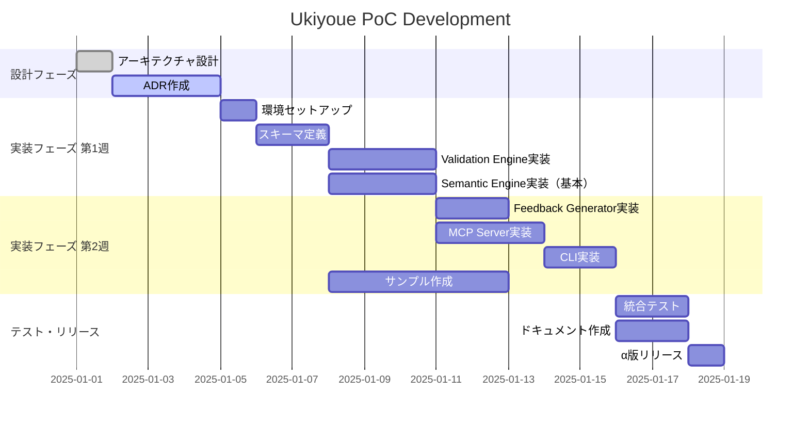

# Ukiyoue Framework - PoC Plan

## 📋 このドキュメントの目的

**What**: Ukiyoue Framework Phase 1 (PoC)の実行計画
**Why**: PoC実装の指針とタスク管理を明確化
**Who**: PoC実装チーム
**When**: PoC実装期間中（2〜3週間）

**関連ドキュメント**:

- [`architecture.md`](architecture.md) - 全体設計と原則
- [`implementation-guide.md`](implementation-guide.md) - 実装詳細

---

## 🎯 PoCスコープ（Phase 1）

### 実装する機能

#### ✅ 必須機能（Phase 1）

**Validation Engine**:

- [ ] JSON Schema検証
- [ ] 基本的なSHACL検証
- [ ] カスタムルール検証（YAML定義）
- [ ] エラーメッセージ生成

**Semantic Engine**:

- [ ] JSON-LD拡張・圧縮
- [ ] IRI解決（相対パス → 絶対IRI）（ADR-018）
- [ ] 複数ドキュメントからのRDFグラフ構築
- [ ] RDF変換
- [ ] 基本的なSPARQLクエリ
- [ ] 参照先存在確認

**Feedback Generator**:

- [ ] 構造的エラーのアクション提案
- [ ] テンプレート参照の提示

**MCP Server**:

- [ ] `ukiyoue_validate` ツール
- [ ] `ukiyoue_get_component` ツール
- [ ] Claude Desktopとの統合

**CLI**:

- [ ] `ukiyoue validate` コマンド
- [ ] `ukiyoue component get` コマンド
- [ ] `ukiyoue init` コマンド

**Schema & Examples**:

- [ ] 基本ドキュメントスキーマ
- [ ] API仕様スキーマ
- [ ] 10個のサンプルドキュメント

#### ⏭️ Phase 2以降に延期

- セマンティック検索の最適化
- コンポーネント自動抽出
- 統計分析（マクロの好循環）
- VS Code拡張機能
- Web UI

---

## 📊 成功基準

### 技術的検証

- [ ] MCPツールとしてClaude Desktopから呼び出せる
- [ ] 100ドキュメントの検証が5秒以内
- [ ] SHACL検証が正常に動作
- [ ] Bunですべてのライブラリが動作

### 品質検証

- [ ] アクション提案の適切性80%以上（10シナリオで評価）
- [ ] フィードバックを受けてAIが修正できる
- [ ] セッション内での試行錯誤が30%削減

### 開発効率

- [ ] API仕様書作成時間が従来比50%削減
- [ ] ドキュメント探索時間が90%削減

---

## 🚀 開発ロードマップ

### Phase 1: PoC (2〜3週間) - 🎯 現在



### 第1週: コアエンジン開発

#### 1日目: 環境セットアップ

- [ ] Bunランタイムのインストール
- [ ] プロジェクト構造の作成
- [ ] 依存関係のインストール（Ajv, jsonld.js, rdf-validate-shacl等）
- [ ] TypeScript設定（tsconfig.json）
- [ ] Biome設定（biome.json）
- [ ] Git設定（.gitignore, .github/workflows）

#### 2〜3日目: スキーマ定義

- [ ] 基本ドキュメントスキーマ（document.schema.json）
- [ ] API仕様スキーマ（api-spec.schema.json）
- [ ] 要件スキーマ（requirement.schema.json）
- [ ] JSON-LD Context（context.jsonld）
- [ ] SHACL Shapes（document.ttl, requirement.ttl）
- [ ] カスタムルール定義（consistency.yaml）

#### 4〜7日目: Validation Engine + Semantic Engine実装

##### Validation Engine (4〜5日目)

- [ ] スキーマローダー実装
- [ ] Ajv統合（JSON Schema検証）
- [ ] エラーメッセージ生成
- [ ] ユニットテスト作成

##### Semantic Engine (6〜7日目)

- [ ] IRI解決ロジック実装
- [ ] JSON-LD展開・圧縮（jsonld.js統合）
- [ ] RDF変換
- [ ] SHACL検証（rdf-validate-shacl統合）
- [ ] 参照先存在確認
- [ ] ユニットテスト作成

### 第2週: インターフェース開発

#### 8〜9日目: Feedback Generator実装

- [ ] 検証結果の解析
- [ ] アクション提案の生成ロジック
- [ ] テンプレート参照の提示
- [ ] ユニットテスト作成

#### 10〜12日目: MCP Server実装

- [ ] MCPプロトコル統合（@modelcontextprotocol/sdk）
- [ ] `ukiyoue_validate` ツール実装
- [ ] `ukiyoue_get_component` ツール実装
- [ ] Claude Desktop設定ファイル作成
- [ ] 統合テスト

#### 13〜14日目: CLI実装、サンプル作成

##### CLI (13日目)

- [ ] Commander.js統合
- [ ] `validate` コマンド実装
- [ ] `component get` コマンド実装
- [ ] `init` コマンド実装
- [ ] ヘルプメッセージ、エラーハンドリング

##### サンプル (14日目)

- [ ] API仕様サンプル（3個）
- [ ] 要件サンプル（3個）
- [ ] テストケースサンプル（3個）
- [ ] README作成（examples/）

### 第3週: テスト・リリース

#### 15〜16日目: 統合テスト

- [ ] エンド・ツー・エンドテスト実装
- [ ] Claude Desktop実機テスト
- [ ] パフォーマンステスト（100ドキュメント）
- [ ] バグ修正

#### 17〜18日目: ドキュメント作成

- [ ] README更新
- [ ] インストール手順
- [ ] クイックスタートガイド
- [ ] API リファレンス（MCP, CLI）
- [ ] トラブルシューティング

#### 19日目: α版リリース

- [ ] バージョンタグ作成（v0.1.0-alpha）
- [ ] npm公開（canary）
- [ ] GitHub Release作成
- [ ] コミュニティへの告知

---

## 📊 パフォーマンス目標

### レイテンシ目標

| 操作                       | 目標レイテンシ | 測定条件               |
| -------------------------- | -------------- | ---------------------- |
| 単一ドキュメント検証       | < 100ms        | 標準的なAPI仕様（1KB） |
| 100ドキュメント一括検証    | < 5秒          | 平均1KB/doc            |
| 1,000ドキュメント一括検証  | < 30秒         | 平均1KB/doc            |
| 10,000ドキュメント一括検証 | < 5分          | 平均1KB/doc            |
| セマンティック検索         | < 200ms        | 1,000ドキュメント対象  |
| SPARQL クエリ              | < 500ms        | 中規模クエリ           |
| MCPツール呼び出し          | < 500ms        | ラウンドトリップ全体   |

### リソース目標

| リソース       | 目標値  | 測定条件                  |
| -------------- | ------- | ------------------------- |
| メモリ使用量   | < 512MB | 1,000ドキュメント読み込み |
| ディスク使用量 | < 100MB | フレームワーク本体        |
| CPU使用率      | < 50%   | 検証実行中                |
| 起動時間       | < 1秒   | MCPサーバー起動           |

### スケーラビリティ目標

```yaml
Phase 1 (PoC):
  対象: 10〜100ドキュメント
  アプローチ: シングルプロセス、メモリ内処理

Phase 2 (v1.0):
  対象: 100〜1,000ドキュメント
  アプローチ: 並列処理、インデックス最適化

Phase 3 (v2.0+):
  対象: 1,000〜10,000+ドキュメント
  アプローチ: 分散処理、データベース統合
```

---

## 🧪 検証計画

### 統合テストシナリオ

#### シナリオ 1: 基本的なAPI仕様の検証

```yaml
目的: 構造検証が正しく機能することを確認

手順: 1. API仕様ドキュメント（api-spec-example.json）を作成
  2. ukiyoue validate api-spec-example.json を実行
  3. 検証結果を確認

期待結果:
  - 構造検証: Pass
  - セマンティック検証: Pass
  - カスタムルール検証: Pass
  - 総合: Pass
```

#### シナリオ 2: 構造エラーの検出

```yaml
目的: 構造エラーが適切に検出・報告されることを確認

手順: 1. 必須項目を欠いたドキュメントを作成
  2. ukiyoue validate を実行
  3. エラーメッセージを確認

期待結果:
  - 構造検証: Fail
  - エラーメッセージ: "必須項目 'title' が不足しています"
  - アクション提案: "title フィールドを追加してください"
```

#### シナリオ 3: 参照エラーの検出

```yaml
目的: 存在しない参照が検出されることを確認

手順: 1. 存在しないテストケースを参照する要件を作成
  2. ukiyoue validate を実行
  3. エラーメッセージを確認

期待結果:
  - 構造検証: Pass
  - セマンティック検証: Fail
  - エラーメッセージ: "参照先のテストケース 'TC-999' が見つかりません"
  - アクション提案: "テストケース TC-999 を作成するか、参照を削除してください"
```

#### シナリオ 4: カスタムルール違反の検出

```yaml
目的: カスタムルールが正しく適用されることを確認

手順: 1. high優先度だが受入基準が少ない要件を作成
  2. ukiyoue validate を実行
  3. エラーメッセージを確認

期待結果:
  - 構造検証: Pass
  - セマンティック検証: Pass
  - カスタムルール検証: Fail
  - エラーメッセージ: "high優先度の要件には最低3個の受入基準が必要です"
  - アクション提案: "受入基準を追加してください（What/Why/Howを明確に）"
```

#### シナリオ 5: MCP統合テスト

```yaml
目的: Claude DesktopからMCPツールが呼び出せることを確認

手順: 1. Claude Desktopを起動
  2. "このプロジェクトのドキュメントを検証して"と指示
  3. Claude が ukiyoue_validate ツールを呼び出す
  4. 検証結果を受け取る

期待結果:
  - MCPツールが正常に呼び出される
  - 検証結果が構造化された形式で返される
  - Claude が結果を理解して説明できる
```

#### シナリオ 6〜10: （追加予定）

- シナリオ 6: 大量ドキュメントの一括検証
- シナリオ 7: キャッシュ機能の動作確認
- シナリオ 8: エラーからの修正フロー
- シナリオ 9: コンポーネント取得
- シナリオ 10: プロジェクト初期化

### Claude Desktop実機テスト手順

#### セットアップ

```bash
# 1. MCPサーバーをインストール
cd tools/mcp-server
bun install
bun build

# 2. Claude Desktop設定ファイルに追加
# ~/Library/Application Support/Claude/claude_desktop_config.json (macOS)
# %APPDATA%\Claude\claude_desktop_config.json (Windows)
{
  "mcpServers": {
    "ukiyoue": {
      "command": "bun",
      "args": ["run", "/path/to/ukiyoue/tools/mcp-server/dist/index.js"],
      "env": {
        "NODE_ENV": "production"
      }
    }
  }
}

# 3. Claude Desktopを再起動
```

#### テストケース

##### TC-1: 基本的な検証

```yaml
プロンプト: |
  このプロジェクトのdocs/requirements/FR-001.jsonを検証してください。

期待される動作: 1. Claude が ukiyoue_validate ツールを呼び出す
  2. 検証結果を受け取る
  3. 結果を人間が理解できる形で説明

確認項目:
  - ツールが正常に呼び出されるか
  - エラーメッセージが適切か
  - アクション提案が表示されるか
```

##### TC-2: エラー修正フロー

```yaml
プロンプト: |
  docs/requirements/FR-001.jsonに検証エラーがあります。
  エラーを修正してください。

期待される動作: 1. Claude が ukiyoue_validate を呼び出してエラーを確認
  2. アクション提案を理解
  3. 修正案を提示
  4. 再度検証して確認

確認項目:
  - エラーを正しく理解できるか
  - 適切な修正案を提示できるか
  - 修正後に再検証できるか
```

##### TC-3: コンポーネント取得

```yaml
プロンプト: |
  REST APIエンドポイントのテンプレートを取得してください。

期待される動作: 1. Claude が ukiyoue_get_component を呼び出す
  2. テンプレートを取得
  3. 内容を説明

確認項目:
  - コンポーネント検索が機能するか
  - 取得した内容が正しいか
```

### パフォーマンステスト手順

#### 準備

```bash
# テストデータ生成スクリプト
bun run scripts/generate-test-data.ts --count 100

# 生成されるファイル:
# test-data/
#   api-spec-001.json
#   api-spec-002.json
#   ...
#   api-spec-100.json
```

#### 測定方法

```bash
# シングルドキュメント検証
time ukiyoue validate test-data/api-spec-001.json

# 一括検証
time ukiyoue validate test-data/

# プロファイリング
bun run --prof tools/cli/src/index.ts validate test-data/
```

#### 目標値

| ドキュメント数 | 目標時間 | 測定時間 | 結果 |
| -------------- | -------- | -------- | ---- |
| 1              | < 100ms  | -        | -    |
| 10             | < 1s     | -        | -    |
| 100            | < 5s     | -        | -    |
| 1,000          | < 30s    | -        | -    |

---

## 🚨 リスク管理

### 技術的リスク

#### リスク 1: SHACL検証がBunで動作しない

**影響**: 高（セマンティック検証が実装できない）
**発生確率**: 中

**対応策**:

- **事前調査**: rdf-validate-shaclのBun互換性を確認（第1週、1日目）
- **代替案**: Node.jsランタイムでの実行（Bunからspawn）
- **最悪のシナリオ**: SHACL検証をPhase 2に延期し、JSON Schemaのみで進める

#### リスク 2: パフォーマンス目標未達成

**影響**: 中（α版リリースは可能だが、大規模利用に制限）
**発生確率**: 中

**対応策**:

- **早期測定**: 第2週の時点でパフォーマンステストを実施
- **最適化**: キャッシュ戦略の見直し、並列処理の導入
- **段階的改善**: Phase 1では小規模プロジェクト向けと割り切る

#### リスク 3: MCP統合の複雑さ

**影響**: 高（主要機能が使えない）
**発生確率**: 低

**対応策**:

- **プロトタイプ**: 第2週の初日に最小限の統合をテスト
- **ドキュメント参照**: MCP SDK公式ドキュメント・サンプルを活用
- **コミュニティ**: MCP開発者コミュニティに質問

### スケジュールリスク

#### リスク 4: 第1週の遅延

**影響**: 高（全体スケジュールに影響）
**発生確率**: 中

**対応策**:

- **並行作業**: スキーマ定義とエンジン実装を可能な限り並行
- **スコープ削減**: カスタムルール検証をPhase 2に延期（構造+セマンティックのみ）
- **リソース追加**: コントリビューターの追加募集

#### リスク 5: 第3週のテスト期間不足

**影響**: 中（品質に影響）
**発生確率**: 高

**対応策**:

- **テスト先行**: 第1〜2週でユニットテストを並行作成
- **自動化**: CI/CDで継続的にテスト実行
- **α版の位置づけ**: 不完全でも問題ないことを明示

---

## 📈 Phase 2への移行計画

### α版からβ版への道筋

#### α版（v0.1.0-alpha）の位置づけ

- **目的**: 技術的実現可能性の検証
- **対象**: 初期コントリビューター、技術評価者
- **制限事項**:
  - 小規模プロジェクト向け（10-100ドキュメント）
  - 英語のみ
  - バグ・破壊的変更の可能性あり

#### β版（v0.2.0-beta）へのステップ

```yaml
α版リリース後 4〜8週間 (約1ヶ月): β版開発

追加機能:
  - セマンティック検索の最適化
  - コンポーネント自動抽出（基本）
  - エラーメッセージの改善
  - ドキュメントの充実（日本語対応）

改善項目:
  - パフォーマンス最適化（1,000ドキュメント対応）
  - バグ修正
  - ユーザビリティ向上

リリース判断基準:
  - 破壊的変更なしで1ヶ月以上運用できる
  - 3つ以上の実プロジェクトで使用されている
  - ドキュメントが整備されている
```

### コミュニティフィードバック収集方法

#### フィードバックチャネル

1. **GitHub Issues**: バグ報告、機能リクエスト
2. **GitHub Discussions**: 使用感、質問、アイデア
3. **Discord**: リアルタイム質問・議論
4. **アンケート**: 定期的な満足度調査

#### 収集したい情報

```yaml
技術的フィードバック:
  - 動作環境（OS, Bun/Node.jsバージョン等）
  - パフォーマンス（ドキュメント数、検証時間）
  - エラー・クラッシュ情報
  - 互換性問題

ユーザビリティ:
  - エラーメッセージの分かりやすさ
  - アクション提案の適切性
  - ドキュメントの充実度
  - セットアップの難易度

機能要望:
  - 必要な機能
  - 優先順位
  - ユースケース
```

### 改善優先順位の決定方法

#### 優先度マトリクス

| 項目             | 影響度 | 緊急度 | 優先度 |
| ---------------- | ------ | ------ | ------ |
| クリティカルバグ | 高     | 高     | P0     |
| パフォーマンス   | 高     | 中     | P1     |
| 機能追加         | 中     | 中     | P2     |
| UI/UX改善        | 中     | 低     | P3     |
| ドキュメント     | 低     | 低     | P4     |

#### 判断基準

```yaml
P0 (即座に対応):
  - システムが動作しない
  - データ損失のリスク
  - セキュリティ脆弱性

P1 (1週間以内):
  - パフォーマンス問題（目標値の50%以下）
  - 主要機能の不具合
  - 複数ユーザーからの報告

P2 (1ヶ月以内):
  - 機能追加リクエスト（5名以上）
  - ユーザビリティ改善
  - 互換性問題

P3 (Phase 2以降):
  - マイナーな改善
  - エッジケース
  - Nice-to-have機能
```

---

## 🔗 関連ドキュメント

- [`architecture.md`](architecture.md) - システム全体設計と原則
- [`implementation-guide.md`](implementation-guide.md) - 実装詳細
- [`concept.md`](concept.md) - フレームワークのコンセプトと背景
- [`working-backwards.md`](working-backwards.md) - プレスリリース & FAQ
- [`adr/`](adr/) - Architecture Decision Records

---

🎨 **Ukiyoue Framework - 使うほど品質が向上する、AI時代のドキュメント基盤**
