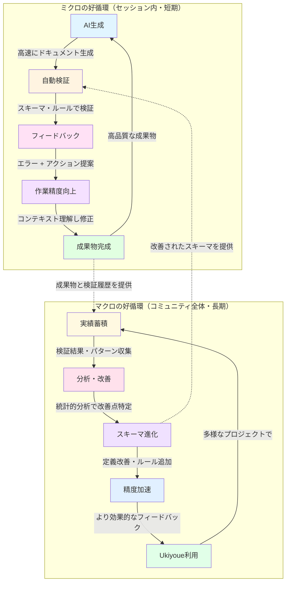
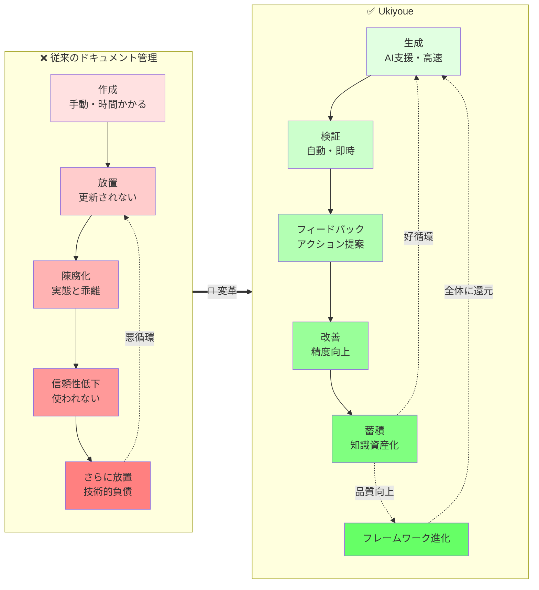

# Ukiyoue Framework - プレスリリース & FAQ

> **⚠️ 免責事項**
>
> このドキュメントは、[`concept.md`](./concept.md)で策定したコンセプトを元に、Amazon の Working Backwards 手法に則って「**もし実際にソリューション化したら**」という想定で作成した **架空のプレスリリース・FAQ（PR/FAQ）** です。
>
> **現時点では、ここに記載されている製品、サービス、ロードマップ、ビジネスモデル等は実在せず、具体的な開発・提供計画もありません。** あくまでコンセプトの検証と、将来的な方向性の検討を目的としたシミュレーション文書です。
>
> このアプローチにより、以下を明確化することを目指しています：
>
> - **顧客価値**: 技術ではなく、顧客が得られる価値から逆算する
> - **実現可能性**: 実際にソリューション化する際に必要な要素の洗い出し
> - **ビジョンの共有**: チームやコミュニティとの方向性の合意形成
>
> 実際の開発ロードマップや提供計画については、今後のコミュニティでの議論を経て決定されます。

---

## 📰 プレスリリース

### Ukiyoue: AI時代のドキュメンテーション・フレームワークをオープンソースで公開

― 開発チームとAIが協働し、使うほど品質が向上する好循環型のプロジェクト管理基盤 ―

GitHub Copilot、Cursor、Claude等のAIコーディングツールが当たり前となった今、ドキュメント管理もAI時代へ。Ukiyoueは、スキーマ駆動の構造化とセマンティック技術により、AIと人間が協働する新しい知識基盤を実現します。

---

**日時・場所**: [架空の日付] - [架空のロケーション]

---

本日、私たちは**Ukiyoue Framework**をオープンソースとして公開します。Ukiyoueは、AI時代のプロジェクトドキュメント管理を革新し、開発者とAIが協働する新しい知識基盤を提供するフレームワークです。

### 課題

現代のソフトウェア開発において、AIによるコード生成は当たり前になりました。しかし、ドキュメント管理は依然として旧態依然としています：

- **情報が見つからない**: 必要な仕様を探すのに何時間もかかる
- **更新が追いつかない**: コードは進化してもドキュメントは古いまま
- **知識が埋もれる**: プロジェクト間で成功パターンが共有されず、同じ失敗を繰り返す
- **AI生成の品質保証に悩む**: AIは高速に生成するが、その品質を誰がどう保証するのか？

特に最後の問題は深刻です。AIにレビューさせても信頼できず、人間がすべてレビューすれば開発のボトルネックになります。

### 解決策

Ukiyoueは、**スキーマ駆動の構造化 + セマンティック技術 + 自動検証**により、これらの課題を解決します：

**即時効果（ミクロの好循環）**:

- ⚡ **AI生成 + 自動検証**: 30分で生成したドキュメントを数秒で検証
- 🎯 **アクション指向のフィードバック**: 「何が間違っているか」だけでなく「次に何をすべきか」を提案
- 🔄 **セッション内での精度向上**: フィードバックを受けてAIの作業精度が向上

**長期効果（マクロの好循環）**:

- 📈 **使うほど賢くなるフレームワーク**: 実績データに基づいてスキーマとルールが進化
- 🌍 **コミュニティ全体の利益**: 誰かの実績が全員の品質向上に貢献
- ♻️ **知識の好循環**: 高品質な成果物が組織・コミュニティに蓄積

### 主要機能

1. **JSON Schemaによる厳密な構造定義**: 曖昧さを排除し、完全な自動検証を実現
2. **JSON-LDによるセマンティクス**: AIが意味・関係性を理解して動的に情報を再構成
3. **アクション指向の自動検証**: エラー指摘だけでなく、次にすべきことを具体的に提案
4. **コンポーネント再利用**: 成功パターンを組織全体で共有・活用

### 顧客の声

> 「AIを使ったコード生成は速いんですが、ドキュメントの品質をどう保証するかが課題でした。Ukiyoueの自動検証とフィードバック機能により、AIの出力を即座に検証し、修正の方向性まで提示してくれます。おかげで開発速度を落とさずに高品質なドキュメントが維持できています。しかも使えば使うほどフィードバックが的確になっていくので、チーム全体の生産性が加速しています。」
>
> — テックリード、エンタープライズSaaS企業

### 始め方

**MCPサーバーとして利用（推奨）**:

```bash
# 1. MCPサーバーのインストール
npm install -g @ukiyoue/mcp-server

# 2. AI環境（Claude Desktop等）に設定
# claude_desktop_config.json に追加:
{
  "mcpServers": {
    "ukiyoue": {
      "command": "ukiyoue-mcp",
      "args": ["--project", "./my-project"]
    }
  }
}

# 3. AIと協働してドキュメント作成開始
# AIが自動的にUkiyoueのツールを活用します
```

**CLIツールとして利用**:

```bash
# 1. インストール
npm install -g @ukiyoue/cli

# 2. プロジェクト初期化
ukiyoue init my-project

# 3. ドキュメント生成
ukiyoue generate --template api-spec

# 4. 自動検証（アクション提案付き）
ukiyoue validate --actionable
```

### 行動喚起

今すぐUkiyoueを試して、AI時代のドキュメント管理を体験してください：

- 🌐 **Website**: <https://ukiyoue.dev>
- 📦 **GitHub**: <https://github.com/mahitotsu/ukiyoue>
- 📚 **Documentation**: <https://ukiyoue.dev/docs>
- 💬 **Community**: <https://ukiyoue.dev/community>

---

## ❓ よくある質問

_以下のFAQは、Working Backwards 手法に基づく架空のシナリオです。実際の製品やサービスに関する質問ではありません。_

### Q1: Ukiyoueは誰のためのものですか？

**A**: 以下のような方々に最適です：

- **開発チーム**: AIコーディングツールを活用しているが、ドキュメント管理に課題を感じている
- **テックリード**: チーム全体の知識共有と品質保証に責任を持つ
- **プロダクトマネージャー**: 要件とテストのトレーサビリティを確保したい
- **スタートアップ**: 少人数で高速に開発しながら、技術的負債を最小化したい
- **大規模組織**: 複数チーム間で知識を共有し、ベストプラクティスを標準化したい

### Q2: 既存のドキュメントツール（Confluence、Notion等）との違いは？

**A**: 従来のツールは「人間が読むための記録」ですが、Ukiyoueは「AIと人間が協働する知識基盤」です：

| 観点             | 従来のツール      | Ukiyoue                   |
| ---------------- | ----------------- | ------------------------- |
| **主な読者**     | 人間              | AI + 人間                 |
| **構造**         | 非構造化/半構造化 | 完全構造化（JSON Schema） |
| **意味定義**     | 暗黙的            | 明示的（JSON-LD）         |
| **品質保証**     | 人間レビューのみ  | 自動検証 + アクション提案 |
| **AI活用**       | 検索のみ          | 生成・検証・再構成        |
| **改善サイクル** | なし              | 2層の好循環で加速的に向上 |

**併用可能**: UkiyoueはConfluence等の既存ツールと併用できます。構造化された知識基盤をUkiyoueで管理し、人間向けのビューを既存ツールで提供する、というハイブリッドな使い方も推奨します。

### Q3: AIがドキュメントを生成するなら、人間は何をするのですか？

**A**: 人間は創造的で価値の高い作業に集中できます：

**人間の役割**:

- ✅ ビジネス要件の定義
- ✅ アーキテクチャ判断
- ✅ ユーザー体験の設計
- ✅ セキュリティ・プライバシーの判断
- ✅ 最終的な品質の承認

**AIの役割**:

- 🤖 構造化ドキュメントの生成
- 🤖 形式・整合性の自動検証
- 🤖 関連情報の抽出・要約
- 🤖 パターンに基づく提案

**重要**: UkiyoueはAIの「自律性を高める」ツールです。アクション提案により、AIは人間の介入を最小限にしながら作業を進められます。

### Q4: 「好循環」とは具体的に何ですか？

**A**: Ukiyoueには2つのレベルの好循環があります：

**ミクロの好循環（セッション内・短期）**:

```text
AI生成 → 自動検証 → アクション提案 → AI修正（精度向上）→ 成果物完成
    ↑___________________________________________________|
```

- 時間スケール: 分〜時間
- 効果: セッション内でAIの作業精度が向上し、試行錯誤が減る

**マクロの好循環（フレームワーク進化・長期）**:

```text
利用 → 実績蓄積 → 統計分析 → スキーマ改善 → 精度加速
 ↑_______________________________________________|
```

- 時間スケール: 週〜月
- 効果: すべての利用者のフィードバック精度が向上

**相乗効果**: 2つの好循環が互いを強化し合い、加速度的に品質が向上します。

### Q5: どのくらいの学習コストがかかりますか？

**A**: 段階的に導入できます：

**レベル1: 基本利用（1日）**:

- CLIツールの基本操作
- テンプレートからの生成
- 自動検証の実行

**レベル2: カスタマイズ（1週間）**:

- プロジェクト固有のスキーマ定義
- セマンティクスルールの追加
- CI/CDへの統合

**レベル3: 深い活用（継続的）**:

- コミュニティへの貢献
- 新しいドメインへの拡張
- ベストプラクティスの共有

**サポート体制**:

- 📚 包括的なドキュメント
- 🎥 チュートリアル動画
- 💬 コミュニティフォーラム
- 🎓 ワークショップ（定期開催予定）

### Q6: セキュリティとプライバシーはどうなっていますか？

**A**: プライバシー・ファーストの設計です：

- ✅ **完全ローカル実行**: すべての検証はローカルで実行（外部送信なし）
- ✅ **匿名化されたテレメトリ**: 統計分析のデータは完全に匿名化され、オプトイン方式
- ✅ **オープンソース**: すべてのコードが公開されており、監査可能
- ✅ **エアギャップ対応**: インターネット接続なしでも完全に動作

**マクロの好循環への貢献は任意**: 実績データの共有は完全にオプトインです。共有しなくてもミクロの好循環（セッション内の改善）は機能します。

### Q7: どのプログラミング言語・フレームワークに対応していますか？

**A**: Ukiyoueは言語・フレームワークに依存しません：

**なぜなら**: Ukiyoueが扱うのは「プロジェクトドキュメント」であり、コード自体ではありません。

**対応ドキュメントタイプ**:

- 📋 要件仕様（機能要件、非機能要件）
- 🎨 設計ドキュメント（アーキテクチャ、API仕様）
- 🧪 テスト仕様（テストケース、テストシナリオ）
- 📖 ユーザーストーリー、ユースケース
- 🗂️ データモデル、ER図（JSON-LD形式）

**連携**: コードドキュメント（JSDoc、Pythonのdocstring等）からUkiyoue形式への変換ツールも提供予定です。

### Q8: 他のツールと統合できますか？

**A**: はい、以下のような統合を想定しています：

**既に対応済み**:

- ✅ MCP (Model Context Protocol): AI環境（Claude Desktop、Cursor等）との統合
- ✅ Git: バージョン管理との統合
- ✅ CI/CD: GitHub Actions、GitLab CI等でのバリデーション自動化

**今後対応予定**:

- 🔜 VS Code: 拡張機能（リアルタイム検証、補完）
- 🔜 IntelliJ: プラグイン
- 🔜 Jira、Linear: チケットとの連携
- 🔜 Confluence、Notion: 既存ドキュメントツールへのエクスポート
- 🔜 OpenAPI、AsyncAPI: 標準仕様との相互変換
- 🔜 PlantUML、Mermaid: 図表の自動生成

### Q9: 既存プロジェクトに導入できますか？

**A**: はい、段階的な導入が可能です：

**ステップ1: 評価（1日）**:

```bash
# 既存ドキュメントの構造を分析
ukiyoue analyze ./docs

# 変換の見積もりを取得
ukiyoue estimate ./docs
```

**ステップ2: 部分移行（1週間）**:

```bash
# 重要なドキュメントから移行
ukiyoue migrate ./docs/api-spec.md --template api

# 検証して品質を確認
ukiyoue validate
```

**ステップ3: 段階的拡大（継続的）**:

- 新しいドキュメントからUkiyoue形式で作成
- 既存ドキュメントは必要に応じて移行
- 両形式の併用期間を設けてスムーズに移行

### Q10: コストはかかりますか？

**A**: 完全無料・オープンソースです：

- ✅ **フレームワーク本体**: MITライセンス（商用利用可）
- ✅ **CLIツール**: 無料
- ✅ **コミュニティサポート**: 無料
- ✅ **ドキュメント・チュートリアル**: 無料

**オプションのサービス（今後提供予定）**:

- 💼 **エンタープライズサポート**: SLA付きサポート（有償）
- 🎓 **専門トレーニング**: オンサイトワークショップ（有償）
- ☁️ **ホスティング版**: クラウドでの運用代行（有償）

**重要**: これらはすべてオプションです。フレームワーク自体は永続的に無料・オープンソースです。

### Q11: 大規模プロジェクトでもスケールしますか？

**A**: はい、Ukiyoueは**規模が大きいほど効果が増大する**設計です。

**規模の経済の原理**:

**従来の手法**:

- すべてのドキュメントを個別に作成
- 規模が2倍 = 作業量も2倍（線形増加）
- プロジェクト間で知識が分断

**Ukiyoueの手法**:

- 共通パターンを抽出・再利用
- パターンライブラリが充実するほど再利用率が上昇
- 規模が大きいほど、パターン適用の機会が増える（サブ線形増加）

**規模別の効果**:

| プロジェクト規模                    | 従来の手法 | Ukiyoue | 削減率           |
| ----------------------------------- | ---------- | ------- | ---------------- |
| 小規模（10-100 ドキュメント）       | 1週間      | 2日     | 70%              |
| 中規模（100-1,000 ドキュメント）    | 3ヶ月      | 1週間   | 90%              |
| 大規模（1,000-10,000 ドキュメント） | 1年以上    | 2週間   | 95%以上          |
| 超大規模（10,000+ ドキュメント）    | 実質不可能 | 1ヶ月   | 実現可能性の獲得 |

**エンタープライズでの価値**:

- 部門間でパターンを共有し、組織全体でライブラリが成長
- プロジェクト間での知識共有・標準化が自然に実現
- 新規プロジェクトは組織の過去の知見をフル活用して開始
- ベストプラクティスが組織に定着
- 新人も熟練者の知見を活用可能

**技術的なスケーラビリティ**:

| 項目           | 従来の手法             | Ukiyoue                       |
| -------------- | ---------------------- | ----------------------------- |
| 作成コスト     | O(N) - 規模に比例      | O(N/k) - 再利用で係数減       |
| 検索時間       | O(N) - 全文書を探索    | O(log N) - セマンティック検索 |
| 整合性チェック | O(N²) - 手動で相互確認 | O(N) - 自動検証               |
| 更新コスト     | O(N) - 影響範囲が不明  | O(1) - 影響範囲を自動特定     |

**結論**: 大規模プロジェクトこそUkiyoueの真価が発揮されます。

---

## 🎨 Visual Representation (ビジュアル表現)

### Core Concept Diagram: 2層の好循環



**相互作用**:

- **ミクロ → マクロ**: 高品質な成果物と検証履歴がマクロの改善に活用される（点線矢印）
- **マクロ → ミクロ**: 改善されたスキーマにより、次のミクロの好循環が高い精度で開始できる（点線矢印）

**時間スケール**:

- **ミクロ**: 分〜時間（個別セッション内）
- **マクロ**: 週〜月（コミュニティ全体）

**効果範囲**:

- **ミクロ**: 個別プロジェクト
- **マクロ**: 全プロジェクト、コミュニティ全体

**結果**: 2つの好循環が相互に強化し合い、加速度的に品質が向上する

### Before vs After Comparison



### Value Proposition Canvas

```yaml
顧客の仕事（Customer Jobs）:
  - プロジェクトドキュメントを最新に保つ
  - 要件からテストまでのトレーサビリティを確保
  - チームの知識を共有・蓄積する
  - AIツールを活用して開発速度を上げる
  - 技術的負債を最小化する

顧客の悩み（Pains）:
  - 情報を探すのに時間がかかる（1日30分〜1時間）
  - ドキュメント更新が開発のボトルネックに
  - AIが生成したものの品質保証に悩む
  - プロジェクト間で知識が断片化
  - 人手不足でレビューが追いつかない

顧客の利益（Gains）:
  - 情報へのアクセス時間を90%削減
  - ドキュメント更新作業を70%削減
  - 品質保証を自動化し、人間は戦略的作業に集中
  - 過去の成功パターンを簡単に再利用
  - チーム全体の生産性が向上

製品・サービス（Products & Services）:
  - JSON Schema による構造化フレームワーク
  - JSON-LD によるセマンティック定義
  - アクション指向の自動検証ツール
  - コンポーネント再利用システム
  - CI/CD 統合

痛みの緩和剤（Pain Relievers）:
  - セマンティック検索で情報を即座に発見
  - AI生成 + 自動検証で更新を高速化
  - ルールベース検証でAI出力の品質を保証
  - スキーマ駆動で知識を構造化・共有
  - アクション提案で人間の判断を支援

利益の創造剤（Gain Creators）:
  - 対話的情報アクセスで探索時間を90%削減
  - 自動生成・検証で作業時間を70%削減
  - 2層の好循環で使うほど品質向上
  - コンポーネント化で再利用率80%以上
  - エコシステム効果でコミュニティ全体が成長
```

---

## 📊 成功指標

### 短期指標（導入後1〜3ヶ月）

**効率性の向上**:

- [ ] ドキュメント作成時間: 70%削減（従来4時間 → Ukiyoue 1.2時間）
- [ ] 情報検索時間: 90%削減（従来30分 → Ukiyoue 3分）
- [ ] ドキュメント更新頻度: 3倍増加（週1回 → 週3回）

**品質の向上**:

- [ ] ドキュメントの整合性エラー: 80%削減
- [ ] 人間レビューの負荷: 60%削減
- [ ] AI生成ドキュメントの承認率: 85%以上

### 中期指標（導入後3〜6ヶ月）

**組織的効果**:

- [ ] ドキュメント再利用率: 50%以上
- [ ] プロジェクト立ち上げ時間: 40%短縮
- [ ] 新メンバーのオンボーディング時間: 50%短縮

**技術的負債の削減**:

- [ ] ドキュメントの陳腐化率: 70%削減
- [ ] 要件とテストのトレーサビリティ: 95%以上
- [ ] 手戻り工数: 40%削減

### 長期指標（導入後6ヶ月〜1年）

**好循環の実現**:

- [ ] フィードバック精度の向上: 40%改善（統計的に測定）
- [ ] コミュニティ貢献: 月間アクティブコントリビューター 50名以上
- [ ] スキーマ改善頻度: 月1回以上の有意義なアップデート

**ビジネスインパクト**:

- [ ] プロジェクト全体のリードタイム: 30%短縮
- [ ] ドキュメント関連の開発コスト: 50%削減
- [ ] 顧客満足度（トレーサビリティ・透明性）: 20%向上

---

## 🚀 カスタマージャーニー

### テックリード田中さんの1週間

**背景**: 田中さんは10名のチームを率いるテックリードです。GitHub Copilotを活用してコード生成は高速化しましたが、ドキュメント管理が追いつかず悩んでいます。

#### Day 0: 課題の発覚

```yaml
状況:
  - 新機能のAPI仕様を書く時間がない
  - 既存のドキュメントが古く、信頼できない
  - AIで生成したドキュメントの品質が不安

田中さんの心の声: 「コードは速く書けるようになったのに、
  ドキュメントがボトルネックになってる...」
```

#### Day 1: Ukiyoueとの出会い

```yaml
状況:
  - 同僚の紹介でUkiyoueを知る
  - まずは試しにインストール

実施内容:
  インストール:
    - npm install -g @ukiyoue/cli

  プロジェクト初期化:
    - ukiyoue init my-new-api-project
    - プロジェクト構造が生成される
    - .ukiyoue/config.json が作成される
    - サンプルテンプレートが配置される

  テンプレート確認:
    - ukiyoue component search "API"
    - api-spec, api-endpoint, error-response など表示

田中さんの心の声: 「JSON形式か...でもスキーマで型安全なら、
  むしろAIとの相性は良さそうだ」
```

#### Day 2: 最初の生成

```yaml
状況:
  - 新しいAPI仕様をAIと協働で作成
  - Claude Desktop（MCP統合）で作業

作業フロー:
  1. テンプレート検索:
    - Claude が ukiyoue_search_components("API endpoint") を実行
    - 適切なテンプレートを発見

  2. ドキュメント生成:
    - テンプレートベースでJSON形式のドキュメント生成
    - 30分で初稿完成（docs/api/user-management.json）

  3. 自動検証:
    - Claude が ukiyoue_validate() を自動実行
    - 結果: ❌ 必須項目 'errorResponses' が不足
    - 💡 次のアクション: エラーレスポンスを定義してください
         推奨形式: { "code": 400, "message": "Bad Request" }
         参考: 同様のAPIでは3〜5個のエラーが定義されています

  4. 修正と再検証:
    - Claude がフィードバックを理解し、即座に修正
    - 再度 ukiyoue_validate() を実行
    - 結果: ✅ Pass

田中さんの感想: 「うわ、これは良い。AIの出力を即座に検証できて、
  しかも次に何をすべきか教えてくれる。
  しかもClaudeが自分で検証ツールを呼んで修正までやってくれる」
```

#### Day 3: チームへの共有

```yaml
状況:
  - チームミーティングで共有
  - デモを見せると、メンバーも興味津々

質疑応答:
  メンバーA: 「テストケースも作れる？」
  田中さん: 「もちろん。test-caseテンプレートがあるよ」

  メンバーB: 「既存のドキュメントは？」
  田中さん: 「既存のはWord/Markdownだから、
    新しいドキュメントから始めて、必要に応じて手動で移行かな。
    でも、AIに既存ドキュメントを読ませてJSON形式で生成させれば
    意外と早いかも」

  メンバーC: 「JSON形式って読みにくくない？」
  田中さん: 「確かに生のJSONは読みにくいけど、
    VS Code拡張があれば見やすくなるし、
    むしろ構造化されてるから機械処理しやすい。
    AIとの相性は抜群だよ」

結果: 全員納得し、試験的導入を決定
```

#### Day 4: CI/CDへの統合

```yaml
状況:
  - GitHub Actionsにバリデーションを追加
  - .github/workflows/docs-validation.yml を作成

実装内容:
  トリガー: push, pull_request
  処理:
    - Ukiyoue CLIをインストール
    - ドキュメント自動検証（ukiyoue validate --actionable）

効果:
  - PRごとにドキュメントが自動検証される
  - 品質ゲートとして機能

田中さんの心の声: 「これでレビュー負荷が減る」
```

#### Day 5: 最初の成功体験

```yaml
出来事:
  - 新機能の仕様書を1.5時間で完成（従来は4時間）
  - 整合性エラーはゼロ（自動検証のおかげ）
  - チームメンバーが「読みやすい」と評価

田中さんの心の声: 「これは続けられそう。むしろチームの標準にしたい」
```

#### 1週間後: 振り返り

```yaml
定量的な効果:
  - ドキュメント作成時間: 4時間 → 1.5時間（62.5%削減）
  - 整合性エラー: 12個 → 0個
  - チームの満足度: 大幅向上

田中さんの結論: 「Ukiyoueをチームの標準ツールにします。
  次はプロジェクト全体のドキュメントを段階的に移行していきます」
```

#### 3ヶ月後: 好循環の実感

```yaml
状況:
  - チーム全体がUkiyoueを日常的に使用
  - 新しいプロジェクトは最初からUkiyoue形式
  - 過去のプロジェクトのドキュメントを再利用できるように

驚きの発見: 「最近、バリデーションのフィードバックが
  より的確になってきた気がする。
  マクロの好循環って、これのことか！」

組織への貢献:
  - 成功事例を社内勉強会で共有
  - 他のチームもUkiyoueを導入開始
  - 会社全体の知識基盤が形成されつつある
```

---

## 🎯 顧客セグメント

### プライマリーセグメント: AIツール活用中の開発チーム

**特徴**:

- GitHub Copilot、Cursor等のAIコーディングツールを既に活用
- 5〜20名規模のアジャイル開発チーム
- 開発速度は上がったが、ドキュメント管理に課題

**ニーズ**:

- AI生成ドキュメントの品質保証
- 高速化した開発に追従するドキュメント管理
- チームの知識共有と標準化

**Ukiyoueの価値**:

- AI生成 + 自動検証で速度と品質を両立
- アクション提案でAIの自律性向上
- スキーマ駆動で標準化を実現

### セカンダリーセグメント: 大規模組織のアーキテクトチーム

**特徴**:

- 複数のプロジェクト・チームを統括
- エンタープライズ標準の策定に責任
- トレーサビリティとガバナンスが重要

**ニーズ**:

- 組織全体のベストプラクティス共有
- 要件からテストまでの追跡可能性
- 監査対応とコンプライアンス

**Ukiyoueの価値**:

- コンポーネント再利用で標準化を促進
- セマンティクスでトレーサビリティを自動化
- 検証ログで監査証跡を確保

### ターシャリーセグメント: スタートアップ

**特徴**:

- 少人数（3〜10名）で高速開発
- 技術的負債の最小化が重要
- コスト意識が高い

**ニーズ**:

- 少人数での効率的なドキュメント管理
- 将来のスケーリングを見据えた基盤
- 低コストでの導入

**Ukiyoueの価値**:

- 完全無料・オープンソース
- AIと協働で少人数でも高品質を維持
- スケールしても破綻しない構造

---

## 💼 ビジネスモデル

### コア戦略: オープンソース + オプショナルサービス

**無料・永続提供（コア価値）**:

- ✅ Ukiyoueフレームワーク本体（MITライセンス）
- ✅ CLIツール
- ✅ 標準スキーマ・セマンティクス定義
- ✅ コミュニティサポート

**有償サービス（付加価値）**:

#### 1. エンタープライズサポート

```yaml
対象: 大規模組織、ミッションクリティカルなプロジェクト

提供内容:
  - SLA付き技術サポート（24時間対応）
  - 専任コンサルタントによるオンボーディング
  - カスタムスキーマ開発支援
  - プライベートリポジトリへの対応

価格: 月額 $500〜 （チーム規模による）
```

#### 2. 専門トレーニング

```yaml
対象: Ukiyoueを本格導入したい組織

提供内容:
  - オンサイト/オンラインワークショップ（1〜2日）
  - ハンズオン形式の実践トレーニング
  - プロジェクト固有のカスタマイズ支援
  - 導入後フォローアップ

価格: $3,000〜 / セッション
```

#### 3. ホスティング版（SaaS）

```yaml
対象: インフラ管理を外部委託したい組織

提供内容:
  - クラウドでの完全マネージド運用
  - 自動バックアップ・復旧
  - スケーラビリティ保証
  - セキュリティ監視

価格: 月額 $100〜 （ユーザー数・ストレージによる）

注: オンプレミス版は無料で利用可能（セルフホスティング）
```

#### 4. カスタムスキーマ開発

```yaml
対象: ドメイン固有のスキーマが必要な組織

提供内容:
  - 業界特化型スキーマの設計・開発
  - セマンティクスルールのカスタマイズ
  - バリデーションロジックの実装
  - オープンソース化（オプション）

価格: $10,000〜 / プロジェクト
```

### 収益予測

```yaml
Year 1: コミュニティ構築フェーズ
  目標: 1,000+ アクティブユーザー
  収益: 主にスポンサーシップ・助成金
  焦点: プロダクト成熟度向上

Year 2: マネタイゼーション開始
  目標: 5,000+ アクティブユーザー
  有償顧客: 20社
  収益: $200,000 （エンタープライズサポート中心）

Year 3: スケーリング
  目標: 20,000+ アクティブユーザー
  有償顧客: 100社
  収益: $1,000,000 （SaaS版も本格展開）
```

**重要な原則**:

- コアフレームワークは永続的に無料・オープンソース
- 有償サービスはすべてオプション（使わなくても完全に機能）
- コミュニティの成長が最優先

---

## 🌍 長期ビジョン

### 5年後の世界

**Ukiyoueが実現したい未来**:

```yaml
開発チーム: 「ドキュメントはAIが書き、品質は自動検証される。
  私たちは本質的な問題解決に集中できる」

プロダクトマネージャー: 「要件からテストまで完全にトレースでき、
  ビジネス価値と技術実装が常に整合している」

エンジニアリングマネージャー: 「チーム間で知識が自然に共有され、
  誰かの成功が全員の利益になる組織文化ができた」

コミュニティ: 「Ukiyoueは単なるツールではなく、
  AI時代のドキュメント標準そのものになった」
```

### 戦略的柱

#### 1. グローバル標準化```yaml

目標: AI時代のプロジェクトドキュメントのデファクトスタンダード

戦略:

- ISO/IEC標準化団体との連携
- 主要フレームワーク（OpenAPI、AsyncAPI）との相互運用
- 多言語対応（英語、日本語、中国語、スペイン語等）
- 業界別スキーマの整備（金融、医療、製造等）

````yaml
#### 2. エコシステム構築

```yaml
目標: Ukiyoue中心の豊かなエコシステム

戦略:
  - IDEプラグイン（VS Code、JetBrains、Vim等）
  - CI/CD統合（GitHub、GitLab、Jenkins等）
  - プロジェクト管理ツール連携（Jira、Linear、Asana等）
  - AI Agents連携（LangChain、AutoGPT等）
  - コミュニティマーケットプレイス（スキーマ・テンプレート共有）
````

#### 3. AI Agents時代への対応

```yaml
目標: AI Agentsが自律的にプロジェクトを推進できる基盤

展望: 「2030年、AI Agentsが要件を理解し、
  設計・実装・テスト・ドキュメントまで自律的に作成。
  人間は方向性の判断と最終承認に集中」

Ukiyoueの役割:
  - AI Agentsが理解できる構造化された知識基盤
  - Agents間のコミュニケーションプロトコル
  - 品質保証の自動化フレームワーク
  - 人間とAgentsの協働を支える基盤
```

#### 4. 学習する組織の実現

```yaml
目標: 組織の知識が自然に蓄積・進化する仕組み

ビジョン: 「使えば使うほど組織全体が賢くなる。
  誰かの失敗が全員の学びになり、
  誰かの成功が全員の資産になる」

実現方法:
  - 2層の好循環（ミクロ + マクロ）の継続的改善
  - ベストプラクティスの自動抽出
  - 組織固有の知識グラフの構築
  - 予測的な品質改善提案
```

---

## 🤝 Join Our Community

### How to Participate

Ukiyoue grows with its community. Here's how you can participate:

#### 1. 利用者として

```bash
# まずは使ってみる
npm install -g @ukiyoue/cli
ukiyoue init my-project

# フィードバックを送る
ukiyoue feedback --anonymous # プライバシー保護された形でテレメトリ送信
```

#### 2. 貢献者として

```yaml
コード貢献:
  - バグ修正、機能追加
  - テストカバレッジの向上
  - パフォーマンス最適化

ドキュメント貢献:
  - チュートリアルの執筆
  - 翻訳（多言語対応）
  - ユースケース事例の共有

スキーマ貢献:
  - 業界特化型スキーマの開発
  - セマンティクスルールの追加
  - テンプレートの作成

コミュニティ貢献:
  - 質問への回答（フォーラム・Discord）
  - 勉強会・カンファレンスでの発表
  - ブログ記事の執筆
```

#### 3. スポンサーとして

```yaml
個人スポンサー: $5/month〜
  - プロジェクトの継続的発展を支援
  - 専用バッジ・クレジット表示

企業スポンサー: $500/month〜
  - ロゴ掲載（ウェブサイト・README）
  - 優先的な機能リクエスト
  - 四半期ごとのステアリングミーティング参加

戦略的パートナー: 個別相談
  - 共同開発・研究
  - カンファレンスでの共同発表
  - エコシステム連携
```

### コミュニティ原則

```yaml
オープン:
  - すべての議論は公開（セキュリティ問題を除く）
  - 誰でも提案・批判できる
  - 意思決定プロセスが透明

インクルーシブ:
  - 経験レベルに関わらず歓迎
  - 多様なバックグラウンドを尊重
  - 建設的なフィードバック文化

メリトクラシー:
  - 貢献の質と量で評価
  - 誰でもコアチームになれる
  - リーダーシップは獲得するもの

協働:
  - 競争ではなく協力
  - 互いの成功を祝う
  - 知識の共有を奨励
```

---

## 📅 ロードマップ

### フェーズ1: 基盤構築 (0〜6ヶ月) - 🚧 コンセプトフェーズ

```yaml
目標: コアフレームワークの確立

完了済み:
  - ✅ コンセプト策定
  - ✅ アーキテクチャ設計
  - ✅ 基本スキーマ定義

進行中:
  - 🔄 CLIツール開発
  - 🔄 バリデーションエンジン実装
  - 🔄 ドキュメント整備

次のステップ:
  - 📋 α版リリース（限定公開）
  - 📋 初期ユーザーからのフィードバック収集
  - 📋 スキーマの洗練
```

### Phase 2: Community Building (6〜12ヶ月)

```yaml
目標: コミュニティの構築とエコシステムの開始

計画:
  - 🎯 β版リリース（公開）
  - 🎯 VS Code拡張機能
  - 🎯 CI/CD統合テンプレート
  - 🎯 チュートリアル・ユースケース集
  - 🎯 コミュニティフォーラム開設
  - 🎯 月次オンラインミートアップ開始

マイルストーン:
  - 1,000+ GitHub Stars
  - 100+ アクティブユーザー
  - 10+ コントリビューター
  - 5+ 企業事例
```

### フェーズ3: エコシステム拡大 (12〜24ヶ月)

```yaml
目標: エコシステムの拡大と標準化

計画:
  - 🚀 v1.0リリース（Production Ready）
  - 🚀 JetBrains IDE対応
  - 🚀 Jira/Linear統合
  - 🚀 OpenAPI相互変換
  - 🚀 コミュニティマーケットプレイス
  - 🚀 業界別スキーマ（金融、医療等）
  - 🚀 多言語対応（英語、中国語、スペイン語）

マイルストーン:
  - 5,000+ GitHub Stars
  - 1,000+ アクティブユーザー
  - 50+ コントリビューター
  - 20+ 企業事例
  - 初の大規模カンファレンス発表
```

### フェーズ4: AI Agents統合 (24〜36ヶ月)

```yaml
目標: AI Agents時代への対応

計画:
  - 🤖 AI Agents専用API
  - 🤖 LangChain/AutoGPT統合
  - 🤖 自律的ドキュメント管理機能
  - 🤖 予測的品質改善提案
  - 🤖 組織知識グラフ自動構築

ビジョン: 「AI Agentsが自律的にプロジェクトを推進し、
  人間は戦略的判断に集中できる未来」
```

---

## 📖 まとめ

### なぜ今なのか

```yaml
技術的タイミング:
  - AI コーディングツールの成熟（GitHub Copilot、Cursor等）
  - LLMの推論能力向上（GPT-4、Claude 3.5 Sonnet等）
  - JSON-LD、JSON Schemaの標準化

市場的タイミング:
  - AI活用が当たり前の時代へ
  - ドキュメント管理の課題が顕在化
  - 開発速度と品質の両立が求められる

社会的タイミング:
  - リモートワークでの知識共有の重要性
  - オープンソース文化の成熟
  - AI倫理・品質保証への関心
```

### Ukiyoueの約束

私たちは、以下を約束します：

1. **永続的な無料・オープンソース**: コアフレームワークは永遠に無料
2. **継続的な品質向上**: 2層の好循環で加速的に進化
3. **透明なガバナンス**: すべての意思決定はコミュニティに開かれている
4. **プライバシー・ファースト**: データ主権を尊重し、完全にローカル実行可能
5. **長期的コミットメント**: 短期的な利益ではなく、長期的価値創造を重視

### ムーブメントに参加しよう

AI時代のドキュメント管理を、一緒に再発明しませんか？

**今すぐ始める**:

```bash
npm install -g @ukiyoue/cli
ukiyoue init my-project
```

**つながる**:

- 🌐 Website: <https://ukiyoue.dev>
- 💬 Discord: <https://ukiyoue.dev/discord>
- 📧 Newsletter: <https://ukiyoue.dev/newsletter>
- 🐦 Twitter: @ukiyoue_dev

**貢献する**:

- 📦 GitHub: <https://github.com/mahitotsu/ukiyoue>
- 📝 Contribute: <https://ukiyoue.dev/contribute>
- 💰 Sponsor: <https://ukiyoue.dev/sponsor>

---

> **「使うほど賢くなる。誰かの実績が全員の利益になる。」**
>
> これが、Ukiyoueの目指す未来です。
>
> あなたも、この好循環の一部になりませんか？

---

<!-- Ukiyoue Framework - Empowering Human-AI Collaboration in the Age of Intelligent Development -->
