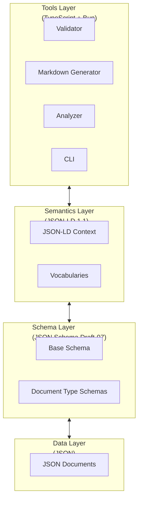
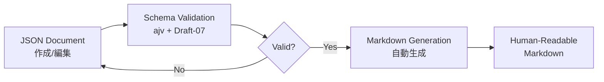
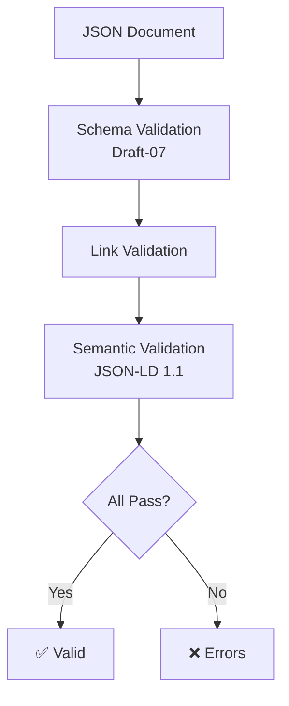

# Ukiyoue Framework - Architecture

**フレームワークのアーキテクチャ設計**

## 🎯 このドキュメントの目的

Ukiyoue フレームワークの全体アーキテクチャと技術選定の概要を示します。

**対象読者**: フレームワーク開発者、貢献者
**使用場面**: 実装開始前、設計レビュー時、新規コンポーネント追加時

**注**: 詳細な技術選定の根拠は各 ADR（Architecture Decision Record）を参照してください。

## 📋 技術選定の概要

Ukiyoue フレームワークの技術基盤は、以下の ADR で決定されています：

| 決定事項                      | 選定結果                     | ADR                                                             |
| ----------------------------- | ---------------------------- | --------------------------------------------------------------- |
| **データフォーマット**        | JSON + JSON Schema + JSON-LD | [ADR-001](design-decisions/001-data-format-and-schema.md)       |
| **JSON Schema バージョン**    | Draft-07                     | [ADR-002](design-decisions/002-json-schema-draft-version.md)    |
| **JSON-LD バージョン**        | 1.1                          | [ADR-003](design-decisions/003-json-ld-version.md)              |
| **ツール実装言語/ランタイム** | TypeScript + Bun             | [ADR-004](design-decisions/004-tool-implementation-language.md) |

### 選定理由の要約

- **JSON + JSON Schema + JSON-LD**: 厳密な構造化、完全な検証可能性、AI/LLM 最適化、セマンティック対応
- **Draft-07**: 最大のツールサポート（ajv, VSCode）、6年以上の実績、圧倒的な情報量
- **JSON-LD 1.1**: W3C 最新勧告、Nested context/`@protected`/`@import` による強力な意味定義
- **TypeScript + Bun**: 最高の JSON エコシステム（ajv, jsonld.js）、Node.js の 3〜4 倍の実行速度

詳細は各 ADR を参照してください。

## 🏗️ 全体アーキテクチャ

### 4 層構成



### 各層の責務

| 層                  | 責務                         | 技術                 | 決定根拠         | 実装状態  |
| ------------------- | ---------------------------- | -------------------- | ---------------- | --------- |
| **Tools Layer**     | バリデーション、生成、分析   | TypeScript + Bun     | ADR-004          | 🟡 一部   |
| **Semantics Layer** | 意味・関係性の定義           | JSON-LD 1.1          | ADR-001, ADR-003 | ⏳ 未実装 |
| **Schema Layer**    | 構造の形式的定義と検証ルール | JSON Schema Draft-07 | ADR-001, ADR-002 | ⏳ 未実装 |
| **Data Layer**      | ドキュメントの実際の内容     | JSON                 | ADR-001          | ⏳ 未実装 |

## 📦 現在の実装状態（Phase 0）

### 実装済み

| コンポーネント   | 説明                             | 技術スタック     | 状態 |
| ---------------- | -------------------------------- | ---------------- | ---- |
| 仕様策定         | concept, requirements, ADRs      | Markdown         | ✅   |
| プロジェクト構成 | ワークスペース、package.json     | Bun              | ✅   |
| 開発環境         | Husky, lint-staged, markdownlint | TypeScript + Bun | ✅   |

### 未実装（計画中）

| レイヤー            | コンポーネント            | 優先度   | 予定フェーズ |
| ------------------- | ------------------------- | -------- | ------------ |
| **Schema Layer**    | document-base.schema.json | Critical | Phase 1      |
|                     | Document Type Schemas     | Critical | Phase 1      |
| **Semantics Layer** | context.jsonld            | High     | Phase 1      |
|                     | Vocabularies              | High     | Phase 2      |
| **Tools Layer**     | Schema Validator          | Critical | Phase 1      |
|                     | Markdown Generator        | Critical | Phase 1      |
|                     | Link Checker              | High     | Phase 1      |
|                     | Quality Analyzer          | Medium   | Phase 2      |
| **Data Layer**      | Example Documents         | High     | Phase 1      |
|                     | Templates                 | Medium   | Phase 1      |

## 🔄 想定されるワークフロー

### ドキュメント作成フロー（実装後）



### バリデーションフロー（実装後）



## 📂 ディレクトリ構造（計画）

```
ukiyoue/
├── specs/                    # ✅ 実装済み（Phase 0）
│   ├── concept.md
│   ├── requirements.md
│   ├── architecture.md       # このドキュメント
│   └── design-decisions/     # ADR
│       ├── 001-data-format-and-schema.md
│       ├── 002-json-schema-draft-version.md
│       ├── 003-json-ld-version.md
│       └── 004-tool-implementation-language.md
├── schemas/                  # ⏳ 未実装（Phase 1）
│   ├── document-base.schema.json
│   └── types/
│       ├── technical-spec.schema.json
│       ├── api-doc.schema.json
│       └── ...
├── semantics/                # ⏳ 未実装（Phase 1）
│   ├── context.jsonld
│   └── vocabularies/
│       ├── document.jsonld
│       └── ...
├── tools/                    # ⏳ 未実装（Phase 1）
│   ├── src/
│   │   ├── core/
│   │   │   ├── SchemaLoader.ts
│   │   │   └── JSONLDProcessor.ts
│   │   ├── plugins/
│   │   │   ├── validators/
│   │   │   ├── generators/
│   │   │   └── analyzers/
│   │   └── cli/
│   │       └── index.ts
│   ├── package.json
│   └── tsconfig.json
├── examples/                 # ⏳ 未実装（Phase 1）
│   ├── technical-spec-example.json
│   ├── api-doc-example.json
│   └── templates/
│       └── ...
└── package.json              # ✅ 実装済み（Phase 0）
```

## 🎯 次のステップ（Phase 1）

### 優先順位 1: Schema Layer

1. `document-base.schema.json` の作成
   - すべてのドキュメントタイプの基底スキーマ
   - メタデータ構造の定義
   - ADR-002 に従い Draft-07 で実装

2. ドキュメントタイプ別スキーマの作成
   - `technical-spec.schema.json`
   - `api-doc.schema.json`
   - など

### 優先順位 2: Tools Layer

1. Schema Validator の実装
   - ajv v8+ を使用（ADR-004）
   - CLI インターフェース
   - エラーメッセージの改善

2. Markdown Generator の実装
   - JSON → Markdown 変換
   - テンプレートエンジン統合
   - 表示専用フォーマットとして出力

### 優先順位 3: Semantics Layer

1. `context.jsonld` の作成
   - ADR-003 に従い JSON-LD 1.1 で実装
   - Nested context 活用
   - `@protected` による意味保護

2. Vocabularies の定義
   - ドキュメント関連の語彙
   - 関係性の定義

## 📚 関連ドキュメント

### フレームワーク仕様

- [concept.md](concept.md) - フレームワークのコンセプトと背景
- [requirements.md](requirements.md) - 機能要件・非機能要件の定義

### 技術選定（ADR）

- [ADR-001: データフォーマット・スキーマ定義・セマンティック定義の選定](design-decisions/001-data-format-and-schema.md)
  - JSON + JSON Schema + JSON-LD を採用
  - Markdown は表示専用
- [ADR-002: JSON Schema Draft 版の選定](design-decisions/002-json-schema-draft-version.md)
  - Draft-07 を採用（最大のツールサポート、安定性）
- [ADR-003: JSON-LD バージョンの選定](design-decisions/003-json-ld-version.md)
  - JSON-LD 1.1 を採用（W3C 最新勧告、強力な新機能）
- [ADR-004: ツール実装言語とランタイムの選定](design-decisions/004-tool-implementation-language.md)
  - TypeScript + Bun を採用（最高の JSON エコシステム、高速実行）

### 実装ガイド（未作成）

- ⏳ Schema 設計ガイド
- ⏳ JSON-LD Context 設計ガイド
- ⏳ Plugin 開発ガイド
- ⏳ 貢献ガイド
