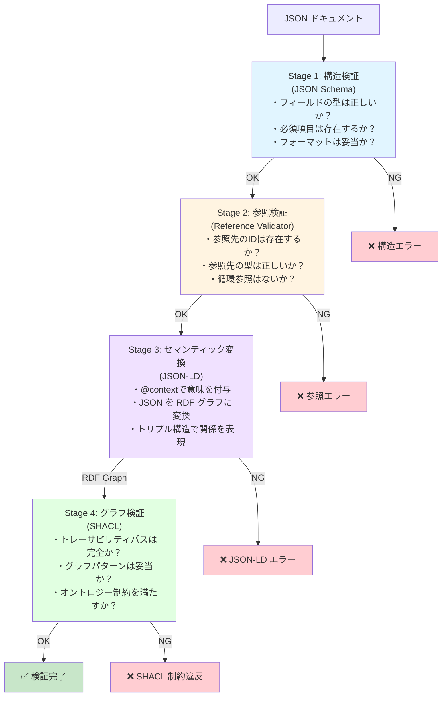

# Ukiyoue Framework - Architecture

## フレームワークのアーキテクチャ設計

## 🎯 このドキュメントの目的

Ukiyoue フレームワークの全体アーキテクチャと技術選定を示します。

**対象読者**: フレームワーク開発者、貢献者
**使用場面**: 実装開始前、設計レビュー時

## 📋 技術選定

以下の技術基盤が ADR（Architecture Decision Record）で決定されています：

| 決定事項                         | 選定結果                     | ADR                                                                     |
| -------------------------------- | ---------------------------- | ----------------------------------------------------------------------- |
| **データフォーマット**           | JSON + JSON Schema + JSON-LD | [ADR-001](architecture-decisions/001-data-format-and-schema.md)         |
| **JSON Schema バージョン**       | Draft-07                     | [ADR-002](architecture-decisions/002-json-schema-draft-version.md)      |
| **JSON-LD バージョン**           | 1.1                          | [ADR-003](architecture-decisions/003-json-ld-version.md)                |
| **ツール実装言語/ランタイム**    | TypeScript + Bun             | [ADR-004](architecture-decisions/004-tool-implementation-language.md)   |
| **実行可能コードの取り扱い**     | ネイティブ形式（JSON化なし） | [ADR-005](architecture-decisions/005-executable-code-representation.md) |
| **JSON成果物のトレーサビリティ** | ハイブリッド方式             | [ADR-007](architecture-decisions/007-json-artifact-traceability.md)     |

**選定理由の要約**:

- **JSON + JSON Schema + JSON-LD**: 厳密な構造化、完全な検証可能性、AI/LLM 最適化、セマンティック対応
- **Draft-07**: 最大のツールサポート（ajv, VSCode）、6年以上の実績
- **JSON-LD 1.1**: W3C 最新勧告、強力な意味定義機能
- **TypeScript + Bun**: 最高の JSON エコシステム、高速実行
- **実行可能コードのネイティブ形式**: 既存ツールチェーン活用、実行可能性優先（詳細は ADR-005）
- **ハイブリッドトレーサビリティ**: 埋め込み型（単方向）+ 自動生成マトリックス（詳細は ADR-007）

詳細は各 ADR を参照してください。

### データフォーマット適用範囲

JSON フォーマットは**すべての成果物**に適用されますが、以下の例外があります（[ADR-005](architecture-decisions/005-executable-code-representation.md)）：

- **Layer 4 実装成果物**（ソースコード、テストコード、DB スキーマ、IaC）: **ネイティブ形式を維持**
  - 理由: 既に非曖昧で実行可能、既存ツールチェーン活用の必要性
  - トレーサビリティ: 外部トレーサビリティマトリックス（JSON-LD）で管理

その他のすべての成果物（Layer 1-3, 5-6）は JSON フォーマットで記述し、[ADR-007](architecture-decisions/007-json-artifact-traceability.md) に従ってトレーサビリティを管理します。

## 🔍 多層検証アーキテクチャ

Ukiyoue フレームワークでは、データの正しさを**4つの段階**で保証します（[ADR-008](architecture-decisions/008-multi-layer-validation-strategy.md)）。

### データ検証の流れ



### なぜ JSON-LD が必要か

**普通の JSON では意味が分からない**:

```json
{
  "id": "us-001",
  "derivedFrom": ["bg-001"]
}
```

- `id` が何を意味するのか不明（識別子？タイトル？）
- `derivedFrom` の関係性が不明（派生？参照？依存？）
- RDF のトリプル構造（主語-述語-目的語）に必要な意味情報がない

**JSON-LD で意味を付与**:

```json
{
  "@context": {
    "@vocab": "https://ukiyoue.example.org/vocab#",
    "id": "@id",
    "derivedFrom": {
      "@id": "derivedFrom",
      "@type": "@id"
    }
  },
  "id": "us-001",
  "derivedFrom": ["bg-001"]
}
```

**RDF に変換**:

```turtle
<artifact/us-001> ukiyoue:derivedFrom <artifact/bg-001> .
```

→ 意味が明確になり、SHACL で検証可能

### 具体例: User Story の検証

#### 入力 JSON ドキュメント

```json
{
  "@context": "https://ukiyoue.example.org/context/base.jsonld",
  "id": "us-001",
  "type": "user-story",
  "title": "Browse menu",
  "derivedFrom": ["bg-001"]
}
```

#### Stage 1: JSON Schema 検証

```text
✓ id: string型、パターン "^[a-z0-9-]+$" に一致
✓ type: "user-story" は有効な値
✓ title: string型、minLength: 1 を満たす
✓ derivedFrom: array型
```

**使用技術**: ajv (JSON Schema Draft-07)

#### Stage 2: Reference 検証

```text
✓ "bg-001" は存在する（ファイルシステムで確認）
✓ "bg-001" の type は "business-goal"
✓ artifact-input-rules.json で確認:
  user-story.inputs = ["business-goal"] → OK
✓ 循環参照なし
```

**使用技術**: TypeScript + artifact-input-rules.json

**artifact-input-rules.json** (`schemas/constraints/`):

```json
{
  "user-story": {
    "inputs": ["business-goal"],
    "description": "User Story は Business Goal のみから派生可能"
  }
}
```

#### Stage 3: RDF 変換

```turtle
@prefix ukiyoue: <https://ukiyoue.example.org/vocab#> .

<artifact/us-001> a ukiyoue:UserStory ;
  ukiyoue:id "us-001" ;
  ukiyoue:title "Browse menu" ;
  ukiyoue:derivedFrom <artifact/bg-001> .

<artifact/bg-001> a ukiyoue:BusinessGoal .
```

**使用技術**: jsonld.js (JSON-LD 1.1 → RDF)

#### Stage 4: SHACL 検証

```turtle
ukiyoue:UserStoryShape
  a sh:NodeShape ;
  sh:targetClass ukiyoue:UserStory ;
  sh:property [
    sh:path ukiyoue:derivedFrom ;
    sh:minCount 1 ;
    sh:class ukiyoue:BusinessGoal ;
  ] .
```

```text
✓ UserStory は少なくとも1つの derivedFrom を持つ
✓ derivedFrom の参照先は BusinessGoal クラスである
✓ BusinessGoal から ProjectCharter へのトレースパスが存在する
  （グラフ全体で検証）
```

**使用技術**: rdf-validate-shacl + N3.js

### 各検証の役割分担

| 検証層                  | 対象                  | 検証内容               | 実装                       | 速度 |
| ----------------------- | --------------------- | ---------------------- | -------------------------- | ---- |
| **JSON Schema**         | 単一ファイル          | フィールド構造         | ajv                        | 高速 |
| **Reference Validator** | 単一ファイル + 参照先 | 参照の型整合性         | TypeScript + rules.json    | 高速 |
| **JSON-LD Validator**   | 単一ファイル          | @context 構文          | jsonld.js                  | 中速 |
| **SHACL Validator**     | グラフ全体            | トレーサビリティ完全性 | rdf-validate-shacl + N3.js | 低速 |

### 検証タイミングの推奨

| タイミング         | 実行する検証          | 理由                         |
| ------------------ | --------------------- | ---------------------------- |
| **ファイル保存時** | Stage 1-2             | 即座のフィードバック         |
| **コミット前**     | Stage 1-3             | 基本的な整合性確認           |
| **CI/CD (PR)**     | Stage 1-4（完全検証） | プロジェクト全体の整合性確認 |
| **定期チェック**   | Stage 1-4（完全検証） | トレーサビリティの健全性確認 |

### CLI インターフェース

```bash
# デフォルト（高速検証: Stage 1-3）
bun src/validate.ts examples/us-001.json

# 完全検証（Stage 1-4: SHACL 含む）
bun src/validate.ts examples/table-order-system/ --full-validation

# 選択的スキップ
bun src/validate.ts file.json --skip-shacl
bun src/validate.ts file.json --skip-references
```

## 🏗️ アーキテクチャ概要

### 4 層構成

```text
Tools Layer (TypeScript + Bun)
  └─ Validator, Generator, Analyzer, CLI
       ↓
Semantics Layer (JSON-LD 1.1)
  └─ Context, Vocabularies
       ↓
Schema Layer (JSON Schema Draft-07)
  └─ Base Schema, Document Type Schemas
       ↓
Data Layer (JSON)
  └─ JSON Documents
```

### 各層の責務

| 層                  | 責務                         | 技術                 | 決定根拠         |
| ------------------- | ---------------------------- | -------------------- | ---------------- |
| **Tools Layer**     | バリデーション、生成、分析   | TypeScript + Bun     | ADR-004          |
| **Semantics Layer** | 意味・関係性の定義           | JSON-LD 1.1          | ADR-001, ADR-003 |
| **Schema Layer**    | 構造の形式的定義と検証ルール | JSON Schema Draft-07 | ADR-001, ADR-002 |
| **Data Layer**      | ドキュメントの実際の内容     | JSON                 | ADR-001          |

## 📍 現在の状態（Phase 0）

### 完了済み

- ✅ **仕様策定**: concept, requirements, ADRs
- ✅ **プロジェクト構成**: ワークスペース、package.json
- ✅ **開発環境**: Husky, lint-staged, markdownlint

### ディレクトリ構造

```text
ukiyoue/
├── specs/                    # ✅ 仕様ドキュメント（Phase 0）
│   ├── concept.md
│   ├── requirements.md
│   ├── architecture.md       # このドキュメント
│   └── architecture-decisions/
│       ├── 001-data-format-and-schema.md
│       ├── 002-json-schema-draft-version.md
│       ├── 003-json-ld-version.md
│       └── 004-tool-implementation-language.md
├── schemas/                  # ⏳ 未実装
├── semantics/                # ⏳ 未実装
├── tools/                    # ⏳ 未実装
├── examples/                 # ⏳ 未実装
└── package.json              # ✅ プロジェクト設定
```

## 🎯 次のステップ

Phase 1 以降の詳細は、実装開始時に別途設計します。

現時点での方針：

1. Schema Layer の設計から開始
2. Tools Layer（Validator）の実装
3. Example Documents による検証

## 📚 関連ドキュメント

- [concept.md](concept.md) - フレームワークのコンセプトと背景
- [requirements.md](requirements.md) - 機能要件・非機能要件
- [architecture-decisions/](architecture-decisions/) - 技術選定の根拠（ADR）
