# Artifact Taxonomy: Overview

## 成果物分類の全体像

このドキュメントは、Ukiyoue フレームワークで扱う成果物の分類（タクソノミー）の全体像を示します。

**対象読者**: フレームワーク開発者、スキーマ設計者

## 🎯 目的

- **What**: どのような成果物タイプが存在するか
- **Why**: 各成果物タイプの役割と必要性
- **How**: 成果物間の依存関係と情報の流れ

## 📈 全体サマリー

- **成果物総数**: 43種類
- **レイヤー数**: 6層（ビジネス → 要件定義 → 設計 → 実装・テスト → 運用 → 検証）
- **主要な特徴**:
  - ✅ プロジェクトライフサイクル全体をカバー
  - ✅ アプリケーションとインフラストラクチャの両方を含む
  - ✅ 開発環境の明示的な設計と実装（Development Environment Architecture & Configuration）
  - ✅ 信頼性・運用性の明示的な設計（Reliability, Observability, DevOps Architecture）
  - ✅ トップダウンフロー + フィードバックループ（Test Results → Roadmap/Business Req）
  - ✅ 複数入力を持つ統合ポイント（Source Code が最多：5つの設計情報を統合）

---

## 📊 レイヤー構造

Ukiyoue フレームワークでは、成果物を以下の6つのレイヤーに分類します：

```mermaid
graph TD
    subgraph Layer1["Layer 1: ビジネス層（5種類）"]
        L1_desc["ビジネス目標、プロジェクト全体の方向性、リスク管理、ユーザー要求"]
        L1_docs["Charter, Roadmap, Risk Register, Business Goal, User Story"]
    end

    subgraph Layer2["Layer 2: 要件定義（4種類）"]
        L2_desc["ビジネス要件、機能要件、非機能要件、テスト戦略"]
        L2_docs["Business Req, Functional Req, Non-Functional Req, Test Strategy"]
    end

    subgraph Layer3["Layer 3: 設計（13種類）"]
        L3_desc["アーキテクチャ、データ、UI/UX、API、セキュリティ、信頼性、インフラ、監視、DevOps、開発環境、テスト計画・仕様"]
        L3_docs["ADR, Runtime Arch, Data Model, UI/UX, API,<br/>Security Arch, Reliability Arch, Infrastructure Arch,<br/>Observability Arch, DevOps Arch, Dev Env Arch,<br/>Test Plan, Test Specification"]
    end

    subgraph Layer4["Layer 4: 実装・テスト（11種類）"]
        L4_desc["アプリケーションコード、インフラコード、データベース実装、開発環境実装、CI/CD、監視、テスト"]
        L4_docs["Impl Guide, DB Schema, Dev Env Config, IaC, CI/CD Pipeline, Repository Config,<br/>Monitoring & Logging Config,<br/>Source Code, Test Code, Test Results, Source Code Doc"]
    end

    subgraph Layer5["Layer 5: 運用（4種類）"]
        L5_desc["デプロイ、運用手順、トラブルシューティング"]
        L5_docs["Deployment Guide, Ops Manual, Incident Response,<br/>Troubleshooting Guide"]
    end

    subgraph Layer6["Layer 6: 検証（6種類）"]
        L6_desc["システム統合検証（技術）、ユーザー受入検証（ビジネス）"]
        L6_docs["SIT Plan/Spec/Results, UAT Plan/Spec/Results"]
    end

    Layer1 -->|"基盤"| Layer2
    Layer2 -->|"詳細化"| Layer3
    Layer3 -->|"実装"| Layer4
    Layer4 -->|"運用準備"| Layer5
    Layer5 -->|"検証"| Layer6

    Total["合計: 43種類の成果物タイプ"]

    Layer6 -.->|"まとめ"| Total

    classDef layer1Style fill:#e1f5ff,stroke:#01579b,stroke-width:3px
    classDef layer2Style fill:#fff9c4,stroke:#f57f17,stroke-width:3px
    classDef layer3Style fill:#f3e5f5,stroke:#4a148c,stroke-width:3px
    classDef layer4Style fill:#e8f5e9,stroke:#1b5e20,stroke-width:3px
    classDef layer5Style fill:#ffe0b2,stroke:#e65100,stroke-width:3px
    classDef layer6Style fill:#fce4ec,stroke:#880e4f,stroke-width:3px
    classDef totalStyle fill:#e0e0e0,stroke:#424242,stroke-width:2px,stroke-dasharray: 5 5

    class Layer1 layer1Style
    class Layer2 layer2Style
    class Layer3 layer3Style
    class Layer4 layer4Style
    class Layer5 layer5Style
    class Layer6 layer6Style
    class Total totalStyle
```

## 📊 成果物タイプサマリー

| レイヤー     | 成果物数 | 主な役割                       |
| ------------ | -------- | ------------------------------ |
| ビジネス     | 5        | ビジネス目標・要求・リスク管理 |
| 要件定義     | 4        | 何を実現するか + テスト戦略    |
| 設計         | 13       | どう実現するか + テスト計画    |
| 実装・テスト | 11       | コードと品質保証               |
| 運用         | 4        | システムの継続的な稼働         |
| 検証         | 6        | システム統合検証とビジネス受入 |
| **合計**     | **43**   | プロジェクトライフサイクル全体 |

## 関連ドキュメント

### 詳細仕様

- [artifact-definitions.md](artifact-definitions.md) - 43種類の成果物詳細定義
- [artifact-relationships.md](artifact-relationships.md) - 成果物間の依存関係とデータフロー

### フレームワーク仕様

- [concept.md](concept.md) - フレームワークの理念
- [requirements.md](requirements.md) - フレームワークの要件
- [architecture.md](architecture.md) - 技術アーキテクチャ

### 設計判断記録（ADR）

- [ADR-005](architecture-decisions/005-executable-code-representation.md) - 実行可能コードのJSON化適用範囲
- [ADR-006](architecture-decisions/006-reliability-infrastructure-observability-separation.md) - Reliability, Infrastructure, Observability Architecture の分離
- [ADR-007](architecture-decisions/007-json-artifact-traceability.md) - JSON成果物のトレーサビリティ実現方式
