# Artifact Taxonomy: Relationships

## 成果物間の依存関係とデータフロー

このドキュメントは、Ukiyoue フレームワークで扱う成果物間の依存関係、データフロー、詳細化チェーンを定義します。

**対象読者**: スキーマ設計者、フレームワーク開発者

---

## 🔄 成果物間の依存関係

### 全体の依存関係グラフ


### 依存関係の特徴

#### トップダウンフロー（計画→実装→検証）

プロジェクトの情報は上位レイヤーから下位レイヤーへ流れます：

```text
Project Charter（起点: プロジェクト承認・正当化）
  → Roadmap（スケジュールとマイルストーン）
  → Business Goal（ビジネス目標・KPI定義）
    → User Story（ユーザー視点の要求）
      → Use Case（アクターとシステムの相互作用シナリオ）
        → Functional Requirements & Non-Functional Requirements（システム要件）
          → Test Strategy（全体テスト戦略・品質ゲート定義）
            → 設計（Layer 3: 13種類）
              → 実装・テスト（Layer 4: 12種類）
                → 運用（Layer 5: 4種類）
                  → 検証（Layer 6: 6種類）
                    - SIT（技術統合検証）
                    - UAT（ビジネス受入検証）
```

#### 横断的な依存関係（フィードバックループ）

実装・検証の結果が上流成果物の改善にフィードバックされます（点線の依存関係）：

##### 横断的成果物（継続的更新）

以下の成果物は特定の依存関係チェーンに固定されず、プロジェクトライフサイクル全体を通じて継続的に更新されます：

- **Risk Register（リスク登録簿）**
  - **初期入力**: Project Charter（初期リスクと前提条件）
  - **継続的追加**: すべてのレイヤーから新規リスクを識別・追加
    - Layer 1: Roadmap（スケジュールリスク）、Business Goal（目標達成リスク）
    - Layer 2-3: 設計段階でのリスク識別
    - Layer 4: 実装・テスト段階でのリスク識別
    - Layer 5-6: 運用・検証段階でのリスク識別
  - **参照**: すべての成果物がリスクを参照可能（スケジュール調整、リソース計画等）

- **Architecture Decision Record（アーキテクチャ決定記録）**
  - **初期入力**: Non-Functional Requirements（制約と品質要件）
  - **継続的追加**: アーキテクチャ設計全段階で技術決定を記録
    - Runtime Architecture、Infrastructure Architecture、Security Architecture等
  - **参照**: すべてのアーキテクチャ成果物が過去の決定を参照可能（一貫性確保）

##### 実装テスト結果のフィードバック

- **Test Results** → **Roadmap**（品質状況に応じたマイルストーン・スケジュール調整）
  - テスト合格率が低い → リリース延期
  - 重大な不具合発見 → 修正フェーズをロードマップに追加
  - カバレッジ不足 → テスト強化期間を設定
- **Test Results** → **Functional Requirements**（実装困難な要件の見直し）
  - 実装困難な要件の発見 → 要件の再検討
  - パフォーマンス問題 → 非機能要件の調整

##### システム統合テスト結果のフィードバック

- **SIT Results** → **Functional Requirements**（技術的実現性による機能要件の調整）
  - E2Eシナリオ問題 → 機能要件の修正・優先度変更
  - 性能問題 → 機能範囲の見直し
- **SIT Results** → **運用ドキュメント**（実テストによる運用手順の改善）
  - Deployment Guide（デプロイ手順の修正、所要時間の更新）
  - Operations Manual（FAQ追加、監視手順の改善）
  - Runbook（障害シナリオ追加、復旧手順の改善、診断フローの改善、不足情報の追加）

##### ビジネス受入テスト結果のフィードバック

- **UAT Results** → **Business Goal**（ビジネス目標達成度による調整）
  - ビジネス目標未達 → KPI目標値の見直し
  - ROI未達成 → スコープ調整、投資判断の再検討
- **UAT Results** → **Functional Requirements**（ユーザー受入による機能要件の調整）
  - ユーザビリティ問題 → UI/UX要件の見直し
  - 業務フロー不適合 → 機能要件の修正
- **UAT Results** → **Roadmap**（最終リリース判断による計画の確定）
  - 本番リリース承認 → 本番展開スケジュール確定
  - 条件付き承認 → 追加改善フェーズの計画

#### レイヤー内の依存関係（詳細化チェーン）

同一レイヤー内または隣接レイヤー間で詳細化が進む主要なチェーン：

##### ビジネス層詳細化チェーン（Layer 1内）

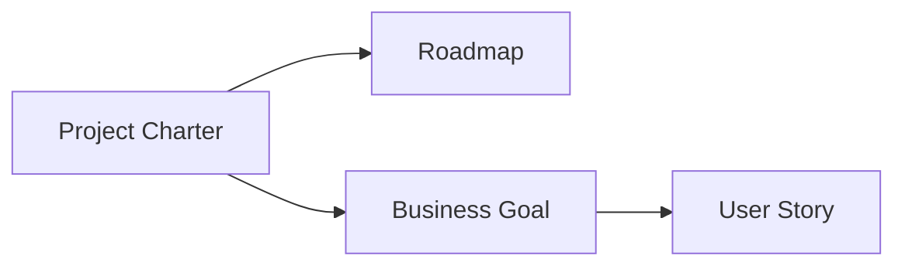

**フロー**: プロジェクト承認 → ビジネス目標設定 → ユーザーストーリー作成 → スケジュール計画

**Note**:

- **Risk Register（リスク登録簿）**: プロジェクトライフサイクル全体を通じて継続的に作成・更新される横断的成果物。Project Charterの初期リスクから始まり、すべてのレイヤーで新規リスクが識別・追加される。特定の依存関係チェーンには含まれない。
- **Architecture Decision Record（ADR）**: アーキテクチャ設計全段階で技術決定が必要になった時点で継続的に作成される横断的成果物。特定の依存関係チェーンには含まれない。

##### 要件分解チェーン（Layer 1→2）

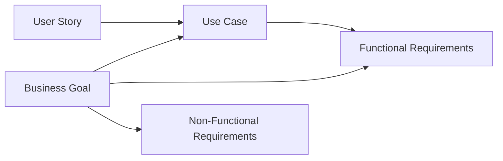

**フロー**: ビジネスゴールとユーザーストーリー → ユースケース（詳細シナリオ） → 機能要件・非機能要件への分解

##### テスト戦略チェーン（Layer 2→4→6）

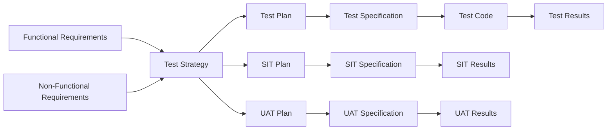

**特徴**:

- Test Strategy が全テストレベルを統括
- Layer 4: 実装レベルのテスト（Unit/Integration/E2E）
- Layer 6: システムレベルの検証（SIT技術統合 + UATビジネス受入）

##### アーキテクチャ詳細化チェーン（Layer 2→3）

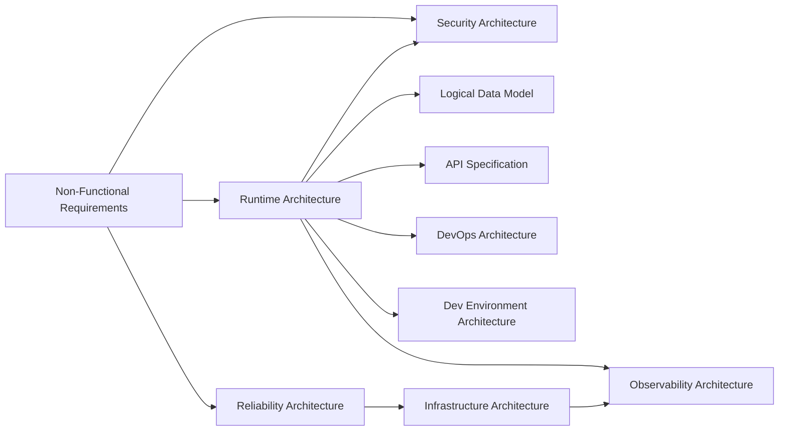

**フロー**: 非機能要件 → 各種アーキテクチャ詳細化

**注**: 横断的成果物（ADR、Risk Register）は、このフロー全体を通じて継続的に作成・更新されます。ADRはアーキテクチャ上の決定が必要になった時点で記録され、Risk Registerはすべての段階でリスクが識別された時点で追加されます。

##### データ設計チェーン（Layer 2→3→4）

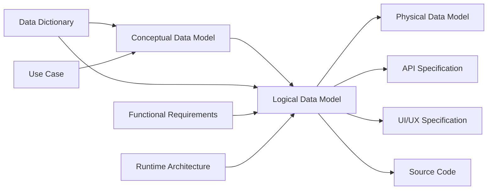

**フロー**:

- Layer 1: 用語定義（Data Dictionary、ビジネス用語とシステム用語の統一辞書）
- Layer 2: 概念構造（Conceptual Data Model、エンティティ間の関係性）
- Layer 3: 論理データモデル（Logical Data Model、データストア非依存）
- Layer 4: 物理実装（Physical Data Model、データストア固有）

##### セキュリティチェーン（Layer 2→3→4→5）

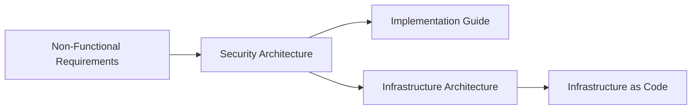

**フロー**: セキュリティ要件 → セキュリティ設計 → 実装方針 + インフラ設計

##### 信頼性・インフラ・監視チェーン（Layer 2→3→4→5）

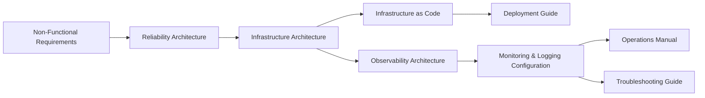

**具体例**:

- 可用性99.9% → SLO定義 → Multi-AZ構成 → メトリクス監視 → Prometheus設定
- 性能要件 → 容量計画 → Auto Scaling → 負荷監視 → Grafana ダッシュボード
- DR要件 → RPO/RTO → バックアップ構成 → 復旧監視 → アラート設定

##### DevOps・CI/CDチェーン（Layer 3→4→5）

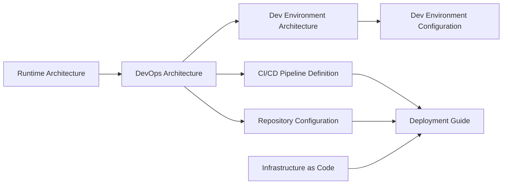

**具体例**:

- パイプライン設計 → GitHub Actions定義 → デプロイ手順
- ブランチ戦略 → .github/設定 → リリースフロー
- 成果物管理 → コンテナレジストリ設定 → イメージ配布

##### アプリケーション実装チェーン（Layer 2→3→4）

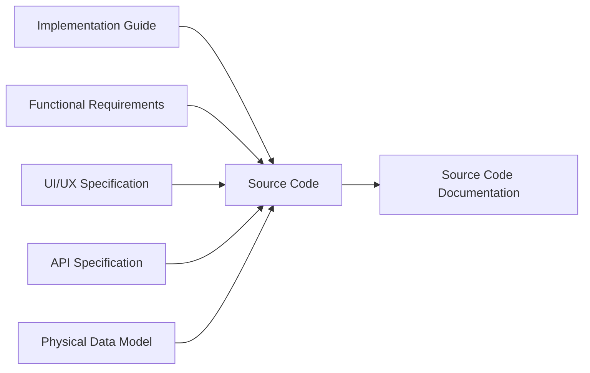

**統合の複雑性**: 5つの入力源を統合

##### 実装テストチェーン（Layer 2→4）

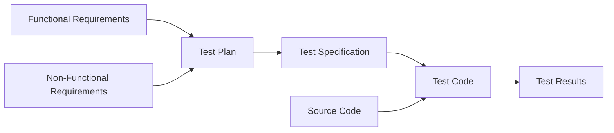

**テスト種別**:

- 機能テスト: 機能要件の検証（ユニット、統合、E2E）
- 非機能テスト: 非機能要件の検証
  - 性能テスト（負荷、ストレス、スパイク）
  - セキュリティテスト（脆弱性診断、ペネトレーション）
  - 可用性テスト（フェイルオーバー、復旧）
  - 運用性テスト（バックアップ/リストア、監視）

##### 運用ドキュメントチェーン（Layer 4→5）

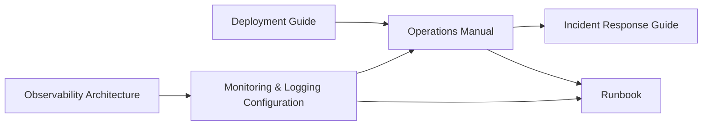

**フロー**: デプロイ手順 → 運用手順 → 障害対応 + トラブルシューティング（Runbook統合）

##### システム統合テストチェーン（Layer 2→4→5→6）

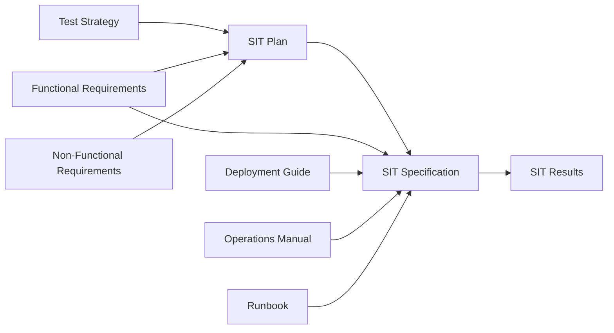

**特徴**: 技術統合検証（E2E、デプロイ、運用、障害対応）
**目的**: UAT移行判断、運用準備度評価

##### ビジネス受入テストチェーン（Layer 2→6）

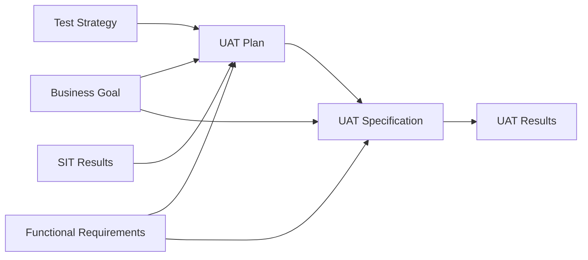

**特徴**: ビジネス受入検証（ビジネス目標達成度、KPI/ROI評価）
**目的**: 本番リリース最終判断

#### ハブ成果物（クリティカルパス・ボトルネック）

多数の成果物と依存関係を持つ「ハブ成果物」は、プロジェクトのクリティカルパスとボトルネックになりやすく、スケジュールと品質の重点管理対象です。

##### 上流ハブ（多数の成果物への入力源）

**リスク**: この成果物の遅延・品質問題が多数の下流成果物に波及

**注**: フィードバックループ（点線の依存関係）はカウントから除外

| 成果物                          | 下流影響 | 主な下流成果物                                                                                                      | プロジェクト管理上の重要性                                                   |
| ------------------------------- | -------- | ------------------------------------------------------------------------------------------------------------------- | ---------------------------------------------------------------------------- |
| **Runtime Architecture**        | 10+      | Logical Data Model, API, Security Arch, Infrastructure Arch, DevOps Arch, Dev Env Arch, 他多数                      | **最重要**: システム全体の基盤設計、早期確定必須、アーキテクトの重点作業領域 |
| **Functional Requirements**     | 9        | Logical Data Model, UI/UX, Test Strategy, Test Plan, Test Spec, Source Code, SIT Plan, SIT Spec, UAT Plan, UAT Spec | **重要**: 機能仕様の明確化遅延が全実装に波及、UAT/E2E検証まで継続参照        |
| **Business Goal**               | 6        | Func Req, Non-Func Req, Test Strategy, UAT Plan, UAT Spec                                                           | **重要**: ビジネス目標の曖昧さがプロジェクト全体の方向性を見失わせる         |
| **Non-Functional Requirements** | 6        | ADR, Runtime Arch, Security Arch, Reliability Arch, Test Strategy, Test Plan                                        | **重要**: 性能・セキュリティ要件の曖昧さが設計やり直しを招く                 |
| **Logical Data Model**          | 4        | UI/UX, API, Physical Data Model, Source Code                                                                        | **重要**: データ構造変更のコストが高い、早期レビュー必須                     |
| **DevOps Architecture**         | 4        | Dev Env Arch, Impl Guide, Pipeline Def, Repository Config                                                           | 開発プロセスの基盤、プロジェクト初期に確定                                   |
| **Test Strategy**               | 3        | Test Plan, SIT Plan, UAT Plan                                                                                       | **重要**: 全体テスト方針、品質ゲート定義、リリース基準の統括                 |

##### 統合ハブ（多数の成果物からの入力が必要）

**リスク**: 複数の依存関係が収束、前提条件が揃わないと着手不可、統合の複雑性

**注**: フィードバックループ（点線の依存関係）はカウントから除外

| 成果物                           | 入力数 | 主な入力元                                             | プロジェクト管理上の重要性                                               |
| -------------------------------- | ------ | ------------------------------------------------------ | ------------------------------------------------------------------------ |
| **System Integration Test Spec** | 5      | SIT Plan, Func Req, Deploy, Ops Manual, Runbook        | **最重要**: 技術統合検証、運用準備度の総合評価                           |
| **Source Code**                  | 5      | Func Req, Impl Guide, UI/UX, API, DB Schema            | **最重要**: 全設計の統合実装、並行作業の調整が鍵、統合テスト重視         |
| **Implementation Guide**         | 4      | Runtime Arch, Security Arch, Dev Env Arch, DevOps Arch | **重要**: 複数アーキテクチャの実装方針統合、早期ドラフト作成で並行作業可 |
| **Infrastructure Architecture**  | 3      | Reliability Arch, Runtime Arch, Security Arch          | **重要**: 信頼性・性能・セキュリティの統合設計、SREの重点作業領域        |
| **Test Strategy**                | 3      | Business Goal, Functional Req, Non-Functional Req      | **重要**: 全要件に基づく包括的テスト戦略、品質ゲート定義                 |
| **UAT Specification**            | 3      | UAT Plan, Business Req, Functional Req                 | **重要**: ビジネス受入テスト詳細化、最終リリース判断の基盤               |
| **Observability Architecture**   | 3      | Runtime Arch, Infrastructure Arch, Reliability Arch    | 運用監視の統合設計、インフラ確定後に詳細化                               |
| **Test Specification**           | 2      | Test Plan, Functional Requirements                     | テスト戦略と機能仕様の統合、並行作業可能                                 |

##### プロジェクト管理上の推奨アクション

**上流ハブへの対策**:

- ✅ **早期着手**: プロジェクト初期フェーズで優先的にリソース配分
- ✅ **厳格なレビュー**: アーキテクチャレビュー、要件レビューの義務化
- ✅ **変更管理**: 変更の影響範囲が大きいため、変更プロセスを厳格化
- ✅ **経験者配置**: Runtime Architectureには経験豊富なアーキテクトを配置

**統合ハブへの対策**:

- ✅ **並行作業の最大化**: 依存関係を分析し、可能な限り並行で進める
- ✅ **早期の依存関係解決**: 入力成果物の完成を待たず、ドラフトベースで着手
- ✅ **統合テスト重視**: Source Codeは特に統合テストに時間を確保
- ✅ **段階的統合**: 一度に全てを統合せず、段階的に統合して複雑性を管理

**全成果物の作成順序とクリティカルパス**:

以下のガントチャートは、全40成果物の推奨作成順序を示します。赤色のタスクがクリティカルパス（最も遅延が許されない経路）です。

**重要**: ここで示す日数はあくまでも**例示**であり、標準的な見積もり工数ではありません。プロジェクトの規模、チームの経験、技術スタック、品質要件などによって実際の工数は大きく異なります。このセクションの目的は、**成果物間の依存関係と作成タイミングのイメージを提示すること**です。

```mermaid
gantt
    title 成果物作成スケジュール（クリティカルパス強調）
    dateFormat YYYY-MM-DD
    axisFormat %m/%d

    section Layer 1: PM
    Charter                       :crit, charter, 2025-01-01, 5d
    Roadmap                       :crit, roadmap, after charter, 3d
    Business Goal                 :crit, bizgoal, after charter, 5d
    User Story                    :crit, userstory, after bizgoal, 10d

    section Layer 2: 要件
    Functional Requirements       :crit, func, after userstory, 15d
    Non-Functional Requirements   :crit, nonfunc, after bizgoal userstory, 10d
    Test Strategy                 :crit, teststrat, after func nonfunc, 5d

    section Layer 3: 設計
    Runtime Architecture          :crit, runtime, after nonfunc, 15d
    Logical Data Model            :crit, datamodel, after func runtime, 10d
    UI/UX Specification           :ui, after func datamodel, 8d
    API Specification             :api, after runtime datamodel, 8d
    Security Architecture         :security, after nonfunc runtime, 8d
    Reliability Architecture      :reliability, after nonfunc, 5d
    Infrastructure Architecture   :infra, after reliability runt
    Observability Architecture    :observ, after runtime infra reliability, 8d
    DevOps Architecture           :devops, after runtime, 5d
    Dev Environment Architecture  :devenv, after runtime devops, 5d
    Test Plan                     :crit, testplan, after teststrat func nonfunc, 8d
    Test Specification            :testspec, after testplan func, 10d

    section Layer 4: 実装準備
    Implementation Guide          :crit, implguide, after runtime security devenv devops, 8d
    Dev Environment Configuration :devenvconf, after devenv, 5d
    Physical Data Model           :crit, physicaldata, after datamodel, 8d
    Infrastructure as Code        :iac, after infra, 10d
    CI/CD Pipeline Definition     :pipeline, after devops, 8d
    Repository Configuration      :repo, after devops devenv, 5d
    Monitoring Configuration      :monitoring, after observ, 8d

    section Layer 4: 実装
    Source Code                   :crit, code, after func implguide ui api physicaldata repo devenvconf, 30d
    Test Code                     :crit, testcode, after testspec code, 20d
    Test Results                  :crit, testresult, after testcode, 10d
    Source Code Documentation     :codedoc, after code, 8d

    section Layer 5: 運用
    Deployment Guide              :deploy, after iac pipeline testresult, 5d
    Operations Manual             :manual, after deploy monitoring testresult, 8d
    Runbook                       :runbook, after observ manual codedoc, 5d

    section Layer 6: 検証
    System Integration Test Plan  :crit, sitplan, after teststrat func nonfunc, 5d
    System Integration Test Spec  :crit, sitspec, after sitplan func deploy manual runbook, 8d
    System Integration Test Result :crit, sitresult, after sitspec, 10d
    UAT Plan                      :crit, uatplan, after teststrat biz func, 5d
    UAT Specification             :crit, uatspec, after uatplan biz func sitresult, 8d
    UAT Results                   :crit, uatresult, after uatspec, 10d
```

**並行作業の機会**:

クリティカルパス以外の成果物は並行作業可能：

- **Layer 3並行**: UI/UX, API, Security, Reliability, Infrastructure, Observability, DevOps, Dev Env, Test Plan, Test Spec
- **Layer 4並行**: Dev Env Config, IaC, CI/CD Pipeline, Repository Config, Monitoring
- **Layer 5並行**: Deployment Guide, Operations Manual, Runbook（実装完了後すぐ着手、SIT Specへ）
- **Layer 6前倒し**: SIT Plan, UAT Plan（要件確定後すぐ作成開始、実装と並行して策定）

**注**: 横断的成果物（ADR、Risk Register）はプロジェクト全体を通じて継続的に作成・更新される成果物であり、単一のタスクとしてスケジュールされません。技術決定やリスク識別が必要になった時点で遅滞なく作成・記録されます。

**スケジュールバッファの配置**:

クリティカルパス上の高リスクタスクにバッファを配置する例：

**注**: 以下の日数とバッファ比率は例示です。実際のバッファは、プロジェクトのリスク評価、チームの経験、技術的不確実性などに基づいて決定してください。

| 成果物            | 基本期間 | バッファ | 合計  | 理由                                                    |
| ----------------- | -------- | -------- | ----- | ------------------------------------------------------- |
| ARCH-RUNTIME      | 15日     | +3日     | 18日  | 影響範囲最大（10+下流）                                 |
| IMPL-CODE         | 30日     | +9日     | 39日  | 統合の複雑性（5入力）                                   |
| IMPL-TESTCODE     | 20日     | +4日     | 24日  | 品質リスク                                              |
| IMPL-TESTRESULT   | 10日     | +2日     | 12日  | 修正・再テストサイクル                                  |
| VERIFY-SIT-SPEC   | 8日      | +2日     | 10日  | 4ドキュメント統合の複雑性                               |
| VERIFY-SIT-RESULT | 10日     | +3日     | 13日  | 技術統合検証、運用ドキュメント改善サイクル              |
| VERIFY-UAT-SPEC   | 8日      | +2日     | 10日  | ビジネス受入テスト詳細化                                |
| VERIFY-UAT-RESULT | 10日     | +3日     | 13日  | ビジネス受入検証、最終リリース判断                      |
| **合計バッファ**  | -        | +28日    | 220日 | **約11.0ヶ月（UAT含む完全な検証プロセス＋バッファ込）** |

---

---

## 📊 トレーサビリティ実現方式

Ukiyoue フレームワークでは、成果物間のトレーサビリティを **ADR-007** に従って実現します。

### ハイブリッドアプローチ（埋め込み + 自動生成マトリクス）

- **成果物内**: 下流→上流の単方向トレースを各JSON内に埋め込み
- **自動生成マトリクス**: 全成果物から抽出したトレース情報を統合した読み取り専用ビュー

### トレース関係の種類

| 関係名        | 方向               | 説明               |
| ------------- | ------------------ | ------------------ |
| `derivedFrom` | 下流 → 上流        | 要件の詳細化・分解 |
| `satisfies`   | 実装 → 要件        | 要件の実現         |
| `testedBy`    | 要件/実装 → テスト | テストによる検証   |
| `implements`  | 実装 → 設計        | 設計の実装         |
| `relatedTo`   | 任意 → 任意        | 一般的な関連       |
| `dependsOn`   | 任意 → 任意        | 技術的依存関係     |

### 例：User Story のトレース情報

```json
{
  "@context": "https://ukiyoue.dev/contexts/user-story.jsonld",
  "@type": "UserStory",
  "@id": "US-TOS-001",
  "title": "Browse menu by category",
  "asA": "Customer",
  "iWant": "to browse menu items by category",
  "soThat": "I can easily find dishes I want to order",
  "traceability": {
    "derivedFrom": ["BG-TOS-001", "BG-TOS-003"],
    "satisfiedBy": ["FR-TOS-001"]
  },
  "acceptanceCriteria": [
    {
      "given": "I am on the table order screen",
      "when": "I select 'Appetizers' category",
      "then": "I see all appetizer items with names and prices"
    }
  ]
}
```

### 例：Functional Requirement のトレース情報

```json
{
  "@context": "https://ukiyoue.dev/contexts/functional-requirement.jsonld",
  "@type": "FunctionalRequirement",
  "@id": "FR-TOS-001",
  "title": "Display menu items by category",
  "traceability": {
    "derivedFrom": ["BIZ-REQ-TOS-001"],
    "relatedUserStories": ["US-TOS-001"],
    "satisfiedBy": ["ARCH-UI-001"],
    "testedBy": ["TEST-FUNC-001"]
  }
}
```

### 例：Business Goal のトレース情報

```json
{
  "@context": "https://ukiyoue.dev/contexts/business-goal.jsonld",
  "@type": "BusinessGoal",
  "@id": "BG-TOS-001",
  "title": "Table Order System Business Goal",
  "traceability": {
    "derivedFrom": ["PC-TOS-001"],
    "relatedUserStories": ["US-TOS-001", "US-TOS-002"],
    "satisfiedBy": ["FR-TOS-001", "NFR-TOS-001"]
  }
}
```

### 自動生成トレーサビリティマトリクス

全成果物から抽出したトレース情報を統合し、以下を提供：

- **全体俯瞰**: プロジェクト全体のトレース構造の可視化
- **逆方向クエリ**: 下流→上流だけでなく上流→下流の検索も可能
- **変更影響分析**: 特定成果物の変更が影響する範囲の特定
- **JSON-LD SPARQL**: セマンティッククエリによる高度な分析

詳細は [ADR-007](architecture-decisions/007-json-artifact-traceability.md) を参照。

---

## 関連ドキュメント

- [artifact-overview.md](artifact-overview.md) - 成果物分類の全体像
- [artifact-definitions.md](artifact-definitions.md) - 45種類の成果物詳細定義
- [ADR-005](architecture-decisions/005-executable-code-representation.md) - 実行可能コードのJSON化適用範囲
- [ADR-007](architecture-decisions/007-traceability-implementation.md) - トレーサビリティ実装戦略
- [ADR-009](architecture-decisions/009-data-dictionary-integration.md) - Data Dictionary統合戦略
