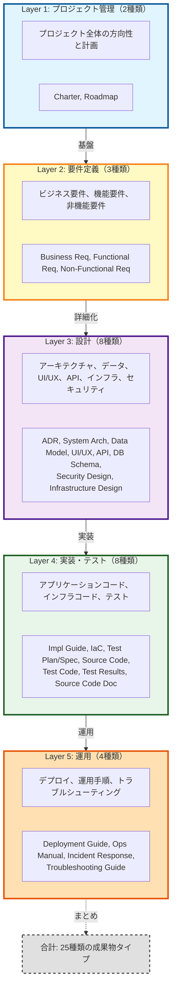
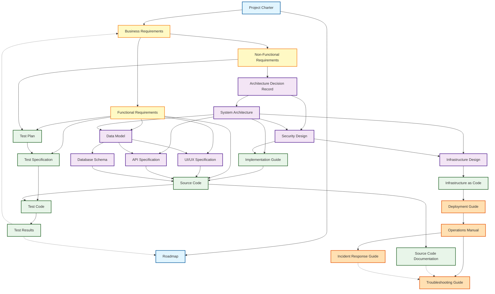

# Artifact Taxonomy

## 成果物分類と入出力関係の定義

このドキュメントは、Ukiyoue フレームワークで扱う成果物の分類（タクソノミー）と、成果物間の入出力依存関係を定義します。

## 🎯 目的

- **What**: どのような成果物タイプが存在するか
- **Why**: 各成果物タイプの役割と必要性
- **How**: 成果物間の依存関係と情報の流れ

**対象読者**: フレームワーク開発者、スキーマ設計者

## 📈 全体サマリー

- **成果物総数**: 25種類
- **レイヤー数**: 5層（プロジェクト管理 → 要件定義 → 設計 → 実装・テスト → 運用）
- **主要な特徴**:
  - ✅ プロジェクトライフサイクル全体をカバー
  - ✅ アプリケーションとインフラストラクチャの両方を含む
  - ✅ トップダウンフロー + フィードバックループ（Test Results → Roadmap/Business Req）
  - ✅ 複数入力を持つ統合ポイント（Source Code が最多：5つの設計情報を統合）

---

## 📊 成果物分類の全体像

### レイヤー構造

Ukiyoue フレームワークでは、成果物を以下の5つのレイヤーに分類します：



---

## 📋 成果物タイプ一覧

### Layer 1: プロジェクト管理（2種類）

#### 1. Project Charter（プロジェクト憲章）

- **目的**: プロジェクトの目的、スコープ、ステークホルダーを定義
- **主な内容**: ビジョン、目標、制約条件、成功基準
- **読者**: 全ステークホルダー
- **更新頻度**: プロジェクト開始時、重要な変更時

#### 2. Roadmap（ロードマップ）

- **目的**: プロジェクトのマイルストーンとタイムラインを提示
- **主な内容**: フェーズ、主要成果物、期限
- **読者**: プロジェクトマネージャー、ステークホルダー
- **更新頻度**: 定期的（月次/四半期）

### Layer 2: 要件定義（3種類）

#### 3. Business Requirements（ビジネス要件）

- **目的**: ビジネス視点での要求事項を記述
- **主な内容**: ビジネス目標、ユーザーニーズ、ユーザーストーリー、期待効果、KPI
- **読者**: ビジネスアナリスト、プロダクトオーナー、ステークホルダー
- **更新頻度**: 企画段階で作成、ビジネス要件変更時

#### 4. Functional Requirements（機能要件）

- **目的**: システムが実現すべき機能を定義
- **主な内容**: 機能一覧、ユースケース記述（アクター、シナリオ、事前/事後条件）、機能仕様詳細、受け入れ基準
- **読者**: ビジネスアナリスト、プロダクトオーナー、開発者、テスター
- **更新頻度**: 要件定義段階で作成、機能追加・変更時

#### 5. Non-Functional Requirements（非機能要件）

- **目的**: システムの品質特性を定義
- **主な内容**: 性能要件、セキュリティ要件、可用性、拡張性、保守性
- **読者**: アーキテクト、開発者、インフラエンジニア
- **更新頻度**: 要件定義段階で作成、品質要件変更時

### Layer 3: 設計（8種類）

#### 6. Architecture Decision Record（アーキテクチャ決定記録）

- **目的**: 重要な技術選定とアーキテクチャ決定を記録
- **主な内容**: 決定内容、背景、選択肢、根拠、影響
- **読者**: アーキテクト、開発チームリーダー
- **更新頻度**: 重要な技術決定時

#### 7. System Architecture（システムアーキテクチャ）

- **目的**: システム全体の構造と技術スタックを定義
- **主な内容**: システム構成図、技術スタック、コンポーネント構成
- **読者**: アーキテクト、開発者、インフラエンジニア
- **更新頻度**: 設計段階で作成、アーキテクチャ変更時

#### 8. Data Model（データモデル）

- **目的**: データ構造とデータ間の関係を定義
- **主な内容**: ER 図、テーブル定義、データ辞書、制約条件
- **読者**: データアーキテクト、開発者、DBA
- **更新頻度**: 設計段階で作成、データ構造変更時

#### 9. UI/UX Specification（UI/UX 仕様）

- **目的**: ユーザーインターフェースとユーザー体験を定義
- **主な内容**: 画面遷移図、ワイヤーフレーム、デザインガイドライン
- **読者**: UI/UX デザイナー、フロントエンド開発者
- **更新頻度**: 設計段階で作成、UI 変更時

#### 10. API Specification（API 仕様）

- **目的**: API のエンドポイント、パラメータ、レスポンスを定義
- **主な内容**: エンドポイント一覧、リクエスト/レスポンス、認証、エラーコード
- **読者**: API 開発者、API 利用者
- **更新頻度**: API 設計段階で作成、API 変更時

#### 11. Database Schema（データベーススキーマ）

- **目的**: データベースの物理設計を定義
- **主な内容**: DDL、インデックス定義、パーティション設計
- **読者**: DBA、バックエンド開発者
- **更新頻度**: 設計段階で作成、スキーマ変更時

#### 12. Security Design（セキュリティ設計）

- **目的**: セキュリティ対策と実装方針を定義
- **主な内容**: 認証・認可方式、暗号化方針、脆弱性対策
- **読者**: セキュリティエンジニア、開発者
- **更新頻度**: 設計段階で作成、セキュリティ要件変更時

#### 13. Infrastructure Design（インフラストラクチャ設計）

- **目的**: インフラストラクチャの構成と設計を定義
- **主な内容**: ネットワーク構成図、サーバー構成、クラウドリソース設計、負荷分散、冗長化設計
- **読者**: インフラエンジニア、SRE、DevOps エンジニア
- **更新頻度**: 設計段階で作成、インフラ要件変更時

### Layer 4: 実装・テスト（8種類）

#### 14. Implementation Guide（実装ガイド）

- **目的**: 実装の手順と規約を提供
- **主な内容**: コーディング規約、実装パターン、ベストプラクティス
- **読者**: 開発者
- **更新頻度**: 実装開始時に作成、知見蓄積時

#### 15. Infrastructure as Code（インフラストラクチャコード）

- **目的**: インフラストラクチャの実装コード
- **主な内容**: Terraform、CloudFormation、Ansible、Kubernetes マニフェスト等の IaC コード
- **読者**: インフラエンジニア、SRE、DevOps エンジニア
- **更新頻度**: インフラ実装段階で作成、継続的に更新

#### 16. Test Plan（テスト計画）

- **目的**: テストの方針、スコープ、スケジュールを定義
- **主な内容**: テスト戦略、テストレベル（機能テスト・非機能テスト）、テスト環境、リソース計画
- **テスト種別**:
  - **機能テスト**: ユニットテスト、統合テスト、E2E テスト
  - **非機能テスト**: 性能テスト、セキュリティテスト、可用性テスト、運用性テスト
- **読者**: テストマネージャー、QA チーム
- **更新頻度**: テスト開始前に作成、計画変更時

#### 17. Test Specification（テスト仕様）

- **目的**: テストケースとテスト手順を詳細に定義
- **主な内容**: テストケース、テストデータ、期待結果、実行手順
- **読者**: テスター、QA エンジニア
- **更新頻度**: テスト設計段階で作成、仕様変更時

#### 18. Source Code（ソースコード）

- **目的**: システムの実装ソースコード
- **主な内容**: アプリケーションコード、ライブラリ、スクリプト、設定ファイル
- **読者**: 開発者、保守担当者
- **更新頻度**: 実装段階で作成、継続的に更新

#### 19. Test Code（テストコード）

- **目的**: 自動テストのソースコード
- **主な内容**: ユニットテスト、統合テスト、E2E テストのコード
- **読者**: 開発者、QA エンジニア
- **更新頻度**: 実装と並行して作成、継続的に更新

#### 20. Test Results（テスト結果）

- **目的**: テスト実行結果と品質状況を記録
- **主な内容**: テスト実行結果、カバレッジ、不具合一覧、品質メトリクス
- **読者**: テストマネージャー、プロジェクトマネージャー、開発者
- **更新頻度**: テスト実行の都度

#### 21. Source Code Documentation（ソースコードドキュメント）

- **目的**: ソースコードの構造と実装詳細を説明
- **主な内容**: クラス図、シーケンス図、コメント、自動生成 API ドキュメント
- **読者**: 開発者、保守担当者
- **更新頻度**: 実装と並行して作成、コード変更時

### Layer 5: 運用（4種類）

#### 22. Deployment Guide（デプロイガイド）

- **目的**: システムのデプロイ手順を記述
- **主な内容**: 環境構築、デプロイ手順、設定項目、ロールバック手順
- **読者**: DevOps エンジニア、リリース担当者
- **更新頻度**: デプロイ準備時に作成、インフラ変更時

#### 23. Operations Manual（運用マニュアル）

- **目的**: システムの日常運用手順を提供
- **主な内容**: 監視項目、バックアップ手順、定期メンテナンス
- **読者**: 運用担当者、SRE
- **更新頻度**: 運用開始時に作成、運用知見蓄積時

#### 24. Incident Response Guide（インシデント対応ガイド）

- **目的**: 障害発生時の対応手順を定義
- **主な内容**: エスカレーションフロー、初動対応、復旧手順
- **読者**: 運用担当者、サポート担当者
- **更新頻度**: 運用開始時に作成、インシデント経験時

#### 25. Troubleshooting Guide（トラブルシューティングガイド）

- **目的**: 問題発生時の診断と解決方法を記述
- **主な内容**: よくある問題、診断方法、解決手順、FAQ
- **読者**: 運用担当者、サポート担当者、開発者
- **更新頻度**: 運用中に継続的に更新

---

## 📊 成果物タイプサマリー

| レイヤー         | 成果物数 | 主な役割                       |
| ---------------- | -------- | ------------------------------ |
| プロジェクト管理 | 2        | 方向性と計画                   |
| 要件定義         | 3        | 何を実現するか                 |
| 設計             | 8        | どう実現するか                 |
| 実装・テスト     | 8        | コードと品質保証               |
| 運用             | 4        | システムの継続的な稼働         |
| **合計**         | **25**   | プロジェクトライフサイクル全体 |

---

## 🔄 成果物間の依存関係

### 全体の依存関係グラフ



### 依存関係の特徴

#### 1. トップダウンフロー（計画→実装）

プロジェクトの情報は上位レイヤーから下位レイヤーへ流れます：

```text
Project Charter（起点）
  → Business Requirements（ビジネス価値）
    → Functional Requirements & Non-Functional Requirements（具体的要件）
      → 設計（Layer 3: 8種類）
        → 実装（Layer 4: 8種類）
          → 運用（Layer 5: 4種類）
```

#### 2. 複数の入力を持つドキュメント（統合ポイント）

以下のドキュメントは複数の情報源を統合します：

| ドキュメント              | 入力元                                                | 統合の目的                                           |
| ------------------------- | ----------------------------------------------------- | ---------------------------------------------------- |
| **Data Model**            | Functional Req + System Architecture                  | 機能要件とシステム構造からデータ設計                 |
| **API Specification**     | System Architecture + Data Model                      | システム構成とデータ構造から API 設計                |
| **UI/UX Specification**   | Functional Req + Data Model                           | 機能要件とデータ構造から UI 設計                     |
| **Infrastructure Design** | System Architecture + Security Design                 | システム構成とセキュリティ要件を統合したインフラ設計 |
| **Implementation Guide**  | System Architecture + Security Design                 | システム構成とセキュリティ方針から実装方針           |
| **Test Plan**             | Functional Req + Non-Functional Req                   | 機能テストと非機能テストの計画を統合                 |
| **Source Code**           | Functional Req + Impl Guide + UI/UX + API + DB Schema | **最多入力**: 全設計情報を統合実装                   |
| **Test Code**             | Test Specification + Source Code                      | テスト仕様とテスト対象コード                         |

#### 3. 横断的な依存関係（フィードバックループ）

- **Test Results** → **Roadmap**（品質状況に応じたマイルストーン・スケジュール調整）
  - テスト合格率が低い → リリース延期
  - 重大な不具合発見 → 修正フェーズをロードマップに追加
  - カバレッジ不足 → テスト強化期間を設定
- **Test Results** → **Business Requirements**（品質評価による要件の再検討）
  - 実装困難な要件の発見 → 要件の見直し
  - パフォーマンス問題 → 非機能要件の調整
- **Troubleshooting Guide** ← Source Code Documentation + Incident Response（運用知見の蓄積）
  - 実装の詳細と障害対応の経験を統合

#### 4. レイヤー内の依存関係（詳細化チェーン）

同一レイヤー内または隣接レイヤー間で詳細化が進む主要なチェーン：

##### データ設計チェーン

```text
Data Model（論理） → Database Schema（物理）
```

##### インフラチェーン

```text
Infrastructure Design（設計） → Infrastructure as Code（実装） → Deployment Guide（手順）
```

##### アプリケーション実装チェーン

```text
複数の設計 → Source Code → Source Code Documentation
  ├─ Functional Requirements（機能）
  ├─ Implementation Guide（方針）
  ├─ UI/UX Specification（画面）
  ├─ API Specification（API）
  └─ Database Schema（データアクセス）
```

##### テストチェーン

```text
Functional Requirements    → Test Plan → Test Specification → Test Code → Test Results
Non-Functional Requirements →                                   ↑
                                                            Source Code（テスト対象）

テスト種別:
- 機能テスト: 機能要件の検証（ユニット、統合、E2E）
- 非機能テスト: 非機能要件の検証
  - 性能テスト（負荷、ストレス、スパイク）
  - セキュリティテスト（脆弱性診断、ペネトレーション）
  - 可用性テスト（フェイルオーバー、復旧）
  - 運用性テスト（バックアップ/リストア、監視）
```

##### 運用知見チェーン

```text
Operations Manual → Incident Response Guide
                 └→ Troubleshooting Guide ← Source Code Documentation（実装詳細）
```

---

## 📐 次のステップ

この成果物タクソノミーを基に、以下を段階的に詳細化します：

### Phase 1.1: メタデータ設計

- 各成果物タイプに共通するメタデータの定義
- 成果物識別子の設計

### Phase 1.2: スキーマ設計

- 各成果物タイプの JSON Schema 設計
- 共通スキーマ（artifact-base.schema.json）の設計

### Phase 1.3: セマンティック定義

- 成果物間の関係性の形式的定義
- JSON-LD Context の設計

### Phase 1.4: バリデーションルール

- 依存関係の検証ルール
- 整合性チェックルール

---

## 📚 関連ドキュメント

- [concept.md](concept.md) - フレームワークの理念
- [requirements.md](requirements.md) - フレームワークの要件
- [architecture.md](architecture.md) - 技術アーキテクチャ
