# Artifact Taxonomy

## 成果物分類と入出力関係の定義

このドキュメントは、Ukiyoue フレームワークで扱う成果物の分類（タクソノミー）と、成果物間の入出力依存関係を定義します。

## 🎯 目的

- **What**: どのような成果物タイプが存在するか
- **Why**: 各成果物タイプの役割と必要性
- **How**: 成果物間の依存関係と情報の流れ

**対象読者**: フレームワーク開発者、スキーマ設計者

## 📈 全体サマリー

- **成果物総数**: 33種類
- **レイヤー数**: 5層（プロジェクト管理 → 要件定義 → 設計 → 実装・テスト → 運用）
- **主要な特徴**:
  - ✅ プロジェクトライフサイクル全体をカバー
  - ✅ アプリケーションとインフラストラクチャの両方を含む
  - ✅ 開発環境の明示的な設計と実装（Development Environment Architecture & Configuration）
  - ✅ 信頼性・運用性の明示的な設計（Reliability, Observability, DevOps Architecture）
  - ✅ トップダウンフロー + フィードバックループ（Test Results → Roadmap/Business Req）
  - ✅ 複数入力を持つ統合ポイント（Source Code が最多：5つの設計情報を統合）

---

## 📊 成果物分類の全体像

### レイヤー構造

Ukiyoue フレームワークでは、成果物を以下の5つのレイヤーに分類します：

```mermaid
graph TD
    subgraph Layer1["Layer 1: プロジェクト管理（2種類）"]
        L1_desc["プロジェクト全体の方向性と計画"]
        L1_docs["Charter, Roadmap"]
    end

    subgraph Layer2["Layer 2: 要件定義（3種類）"]
        L2_desc["ビジネス要件、機能要件、非機能要件"]
        L2_docs["Business Req, Functional Req, Non-Functional Req"]
    end

    subgraph Layer3["Layer 3: 設計（11種類）"]
        L3_desc["アーキテクチャ、データ、UI/UX、API、セキュリティ、信頼性、インフラ、監視、DevOps、開発環境"]
        L3_docs["ADR, Runtime Arch, Data Model, UI/UX, API,<br/>Security Arch, Reliability Arch, Infrastructure Arch,<br/>Observability Arch, DevOps Arch, Dev Env Arch"]
    end

    subgraph Layer4["Layer 4: 実装・テスト（13種類）"]
        L4_desc["アプリケーションコード、インフラコード、データベース実装、開発環境実装、CI/CD、監視、テスト"]
        L4_docs["Impl Guide, DB Schema, Dev Env Config, IaC, CI/CD Pipeline, Repository Config,<br/>Monitoring & Logging Config, Test Plan/Spec,<br/>Source Code, Test Code, Test Results, Source Code Doc"]
    end

    subgraph Layer5["Layer 5: 運用（4種類）"]
        L5_desc["デプロイ、運用手順、トラブルシューティング"]
        L5_docs["Deployment Guide, Ops Manual, Incident Response,<br/>Troubleshooting Guide"]
    end

    Layer1 -->|"基盤"| Layer2
    Layer2 -->|"詳細化"| Layer3
    Layer3 -->|"実装"| Layer4
    Layer4 -->|"運用"| Layer5

    Total["合計: 31種類の成果物タイプ"]

    Layer5 -.->|"まとめ"| Total

    classDef layer1Style fill:#e1f5ff,stroke:#01579b,stroke-width:3px
    classDef layer2Style fill:#fff9c4,stroke:#f57f17,stroke-width:3px
    classDef layer3Style fill:#f3e5f5,stroke:#4a148c,stroke-width:3px
    classDef layer4Style fill:#e8f5e9,stroke:#1b5e20,stroke-width:3px
    classDef layer5Style fill:#ffe0b2,stroke:#e65100,stroke-width:3px
    classDef totalStyle fill:#e0e0e0,stroke:#424242,stroke-width:2px,stroke-dasharray: 5 5

    class Layer1 layer1Style
    class Layer2 layer2Style
    class Layer3 layer3Style
    class Layer4 layer4Style
    class Layer5 layer5Style
    class Total totalStyle
```



---

## 📋 成果物タイプ一覧

### Layer 1: プロジェクト管理（2種類）

#### Project Charter（プロジェクト憲章）

- **識別子**: `PM-CHARTER`
- **目的**: プロジェクトの正当性と承認を得るための文書
- **主な内容**:
  - **プロジェクトの背景**: なぜこのプロジェクトが必要か
  - **スポンサー・ステークホルダー**: 誰が承認し、誰に影響するか
  - **ハイレベルスコープ**: 何をするか/しないか（境界線）
  - **ハイレベルマイルストーン**: 主要な節目（期限は概算）
  - **予算・リソース制約**: 投資規模、人員制約
  - **リスクと前提条件**: プロジェクト承認時の仮定
- **入力**: なし（プロジェクトの起点）
- **読者**: 経営層、スポンサー、プロジェクトマネージャー
- **更新頻度**: プロジェクト開始時、プロジェクト方針の大幅変更時
- **特徴**: **承認文書**（経営判断のための要約）

#### Roadmap（ロードマップ）

- **識別子**: `PM-ROADMAP`
- **目的**: プロジェクトの時間軸とマイルストーンを管理
- **主な内容**:
  - **マイルストーン**: 主要なリリースポイント、フェーズゲート
  - **主要成果物と期限**: いつ何を完成させるか
  - **依存関係**: 前提条件、ブロッカー
  - **リスク**: スケジュールに影響する不確定要素
  - **リソース計画**: 各フェーズの人員配置
- **入力**: Project Charter（プロジェクトスコープと目標）、Test Results（品質状況に基づくスケジュール調整）
- **読者**: プロジェクトマネージャー、開発チームリーダー、ステークホルダー
- **更新頻度**: 定期的（月次/四半期）、進捗状況やテスト結果に応じて調整
- **特徴**: **スケジュール管理文書**（いつ何を達成するかの計画）

### Layer 2: 要件定義（3種類）

#### Business Requirements（ビジネス要件）

- **識別子**: `REQ-BIZ`
- **目的**: 解決すべきビジネス課題と要求事項を詳細に記述
- **主な内容**:
  - **ビジネス課題**: 現状の問題点、ペインポイント
  - **ビジネス目標**: 具体的な達成目標（売上XX%向上、コストXX%削減等）
  - **ターゲットユーザー**: ペルソナ、ユーザーセグメント
  - **ユーザーストーリー**: As a [役割], I want [機能], So that [価値]
  - **期待効果**: ビジネスインパクト（ROI、競争優位性）
  - **KPI・成功指標**: 測定可能な定量指標（DAU、CV率、NPS等）
- **入力**: Project Charter（プロジェクト背景とビジネス目標）、Test Results（フィードバックループで要件見直し）
- **読者**: ビジネスアナリスト、プロダクトオーナー、開発チームリーダー
- **更新頻度**: 企画段階で作成、ビジネス環境変化・ユーザーフィードバックに応じて更新
- **特徴**: **要件詳細化文書**（開発チームが何を作るべきか判断するための詳細）

#### Functional Requirements（機能要件）

- **識別子**: `REQ-FUNC`
- **目的**: システムが「何をするか」を明確に定義
- **主な内容**:
  - **機能一覧**: システムが提供する機能のカタログ
  - **ユースケース**: アクター、シナリオ、事前条件、事後条件
  - **機能仕様詳細**: 入力、処理、出力、バリデーションルール
  - **受け入れ基準**: 各機能が完成したと判断する基準
  - **優先度**: Must/Should/Could/Won't（MoSCoW法等）
- **入力**: Business Requirements（ビジネス課題を機能要件に翻訳）
- **読者**: ビジネスアナリスト、プロダクトオーナー、開発者、テスター
- **更新頻度**: 要件定義段階で作成、機能追加・変更時、ユーザーフィードバック時
- **特徴**: **機能詳細化文書**（Business Requirementsの「What」を「How」レベルで詳細化）

#### Non-Functional Requirements（非機能要件）

- **識別子**: `REQ-NONFUNC`
- **目的**: システムの品質特性と制約条件を定義
- **主な内容**:
  - **性能要件**: レスポンスタイム、スループット、同時接続数
  - **セキュリティ要件**: 認証方式、暗号化、監査ログ、脆弱性対策
  - **可用性**: 稼働時間（99.9%等）、MTBF/MTTR
  - **拡張性**: スケーラビリティ、将来の成長への対応
  - **保守性**: 可読性、テスタビリティ、モジュール性
  - **互換性**: ブラウザ、OS、既存システムとの統合
  - **コンプライアンス**: 法規制、業界標準（GDPR、PCI-DSS等）
- **入力**: Business Requirements（ビジネス制約と品質目標を非機能要件に翻訳）
- **読者**: アーキテクト、開発者、インフラエンジニア、セキュリティエンジニア
- **更新頻度**: 要件定義段階で作成、品質要件変更時、法規制変更時
- **特徴**: **品質基準文書**（機能以外のシステム品質を定量的に定義）

### Layer 3: 設計（11種類）

#### Architecture Decision Record（アーキテクチャ決定記録）

- **識別子**: `ARCH-ADR`
- **目的**: 重要な技術選定の理由と経緯を記録し、将来の判断材料とする
- **主な内容**:
  - **決定内容**: 何を選択したか（技術、パターン、アプローチ）
  - **背景・コンテキスト**: なぜこの決定が必要だったか
  - **選択肢**: 検討した代替案（Pros/Cons）
  - **根拠**: なぜこの選択肢を選んだか（技術的理由、コスト、リスク）
  - **影響**: この決定が他のコンポーネントに与える影響
  - **ステータス**: Proposed/Accepted/Deprecated/Superseded
- **入力**: Non-Functional Requirements（制約と品質要件から技術選定の根拠を得る）
- **読者**: アーキテクト、開発チームリーダー、新規参画メンバー
- **更新頻度**: 重要な技術決定時、アーキテクチャ変更時、決定の見直し時
- **特徴**: **決定の記録**（「なぜ」を残す履歴文書、後で振り返るための証拠）

#### Runtime Architecture（実行時アーキテクチャ）

- **識別子**: `ARCH-RUNTIME`
- **目的**: システムが実行時にどう動作するかの全体構造を定義
- **主な内容**:
  - **システム構成図**: コンポーネント、サービス、外部システムの配置
  - **コンポーネント構成**: マイクロサービス/モノリス、フロントエンド/バックエンド構成
  - **通信方式**: 同期/非同期、REST/gRPC/メッセージング
  - **技術スタック**: 言語、フレームワーク、ミドルウェア
  - **データフロー**: リクエスト処理の流れ、イベントフロー
  - **統合ポイント**: 外部API、SaaS、レガシーシステムとの連携
- **入力**: Architecture Decision Record（技術選定の根拠）、Non-Functional Requirements（性能・拡張性要件）
- **読者**: アーキテクト、開発者、インフラエンジニア、新規参画メンバー
- **更新頻度**: 設計段階で作成、アーキテクチャ変更時、技術スタック変更時
- **特徴**: **実行時構造文書**（Non-Functional Requirementsを満たすシステム構造設計）

#### Data Model（データモデル）

- **識別子**: `ARCH-DATA`
- **目的**: システムが扱うデータの構造と関係性を論理的に定義
- **主な内容**:
  - **ER図**: エンティティ、リレーションシップ、カーディナリティ
  - **エンティティ定義**: ビジネス概念としてのデータの意味
  - **属性定義**: 各エンティティが持つデータ項目
  - **データ辞書**: 属性名、型、制約、説明
  - **正規化**: 第3正規形までの正規化設計
  - **ドメイン定義**: 共通データ型（メールアドレス、電話番号等）
- **入力**: Functional Requirements（扱うデータの種類）、Runtime Architecture（データの保存・アクセス方法）
- **読者**: データアーキテクト、開発者、DBA、ビジネスアナリスト
- **更新頻度**: 設計段階で作成、データ構造変更時、ビジネスルール変更時
- **特徴**: **論理データ設計文書**（Functional Requirementsをデータ視点で構造化）

#### UI/UX Specification（UI/UX 仕様）

- **識別子**: `ARCH-UI`
- **目的**: ユーザーインターフェースとユーザー体験を詳細に設計
- **主な内容**:
  - **画面遷移図**: 画面フロー、ナビゲーション構造
  - **ワイヤーフレーム**: 画面レイアウト、要素配置
  - **インタラクションデザイン**: ボタン動作、フォーム検証、エラー表示
  - **デザインガイドライン**: カラーパレット、タイポグラフィ、コンポーネント
  - **レスポンシブデザイン**: デバイス別（PC/タブレット/スマホ）のレイアウト
  - **アクセシビリティ**: WCAG準拠、スクリーンリーダー対応
- **入力**: Functional Requirements（画面で実現する機能）、Data Model（画面に表示するデータ）
- **読者**: UI/UXデザイナー、フロントエンド開発者、プロダクトオーナー
- **更新頻度**: 設計段階で作成、UI変更時、ユーザーフィードバック反映時
- **特徴**: **UI設計文書**（Functional Requirementsをユーザー視点で可視化）

#### API Specification（API 仕様）

- **識別子**: `ARCH-API`
- **目的**: システム間/コンポーネント間のインターフェースを厳密に定義
- **主な内容**:
  - **エンドポイント一覧**: URL、HTTPメソッド、概要
  - **リクエスト仕様**: パラメータ（パス/クエリ/ボディ）、型、必須/任意
  - **レスポンス仕様**: ステータスコード、レスポンスボディ、ヘッダー
  - **認証・認可**: API キー、OAuth、JWT トークン
  - **エラーハンドリング**: エラーコード、エラーメッセージフォーマット
  - **レート制限**: スロットリング、クォータ
  - **バージョニング**: API バージョン管理戦略
- **入力**: Runtime Architecture（API設計方針とアーキテクチャパターン）、Data Model（APIで扱うデータ構造）
- **読者**: API開発者、フロントエンド開発者、API利用者（内部/外部）
- **更新頻度**: API設計段階で作成、API変更時、バージョンアップ時
- **特徴**: **インターフェース契約文書**（OpenAPI/Swagger等の機械可読形式推奨）

#### Security Architecture（セキュリティアーキテクチャ）

- **識別子**: `ARCH-SECURITY`
- **目的**: システム全体のセキュリティ対策を体系的に設計
- **主な内容**:
  - **認証方式**: ユーザー認証（パスワード、MFA、SSO、生体認証）
  - **認可方式**: アクセス制御（RBAC、ABAC）、権限管理
  - **暗号化方針**: データ暗号化（保存時/転送時）、鍵管理
  - **脆弱性対策**: OWASP Top 10対策、SQLインジェクション、XSS、CSRF
  - **セキュアコーディング**: 入力検証、エスケープ、セキュアAPI使用
  - **監査ログ**: アクセスログ、操作ログ、証跡管理
  - **脅威モデリング**: 攻撃シナリオ、リスク評価
- **入力**: Non-Functional Requirements（セキュリティ要件）、Runtime Architecture（セキュリティを実装する対象システム）
- **読者**: セキュリティエンジニア、開発者、アーキテクト、監査担当者
- **更新頻度**: 設計段階で作成、セキュリティ要件変更時、脆弱性発見時
- **特徴**: **セキュリティ設計文書**（Non-Functional Requirementsのセキュリティ要件を実装方針に落とし込む）

#### Reliability Architecture（信頼性アーキテクチャ）

- **識別子**: `ARCH-RELIABILITY`
- **目的**: システムの信頼性要件を抽象的に定義（Infrastructure Architectureへのインプット）
- **主な内容**:
  - **SLO/SLI/SLA定義**: サービスレベル目標、指標、契約
  - **可用性レベル**: 目標稼働率（99.9%、99.99%等）、ダウンタイム許容値
  - **冗長化レベル**: Multi-AZ必要性、Active-Active/Active-Standby
  - **DR要件**: RPO（目標復旧時点）、RTO（目標復旧時間）
  - **容量要件**: 想定トラフィック、成長予測、ピーク対応
  - **障害許容度**: 単一障害点（SPOF）の許容範囲
- **入力**: Non-Functional Requirements（信頼性・可用性要件を抽象的に定義）
- **読者**: アーキテクト、SRE、インフラエンジニア、ビジネスオーナー
- **更新頻度**: 設計段階で作成、非機能要件変更時、ビジネス成長に応じて見直し
- **特徴**: **信頼性要件文書**（「どのくらい信頼性が必要か」を定義、ADR-005参照）

#### Infrastructure Architecture（インフラストラクチャアーキテクチャ）

- **識別子**: `ARCH-INFRA`
- **目的**: インフラストラクチャの具体的構成を設計（Reliability Architectureの具体化）
- **主な内容**:
  - **ネットワーク構成**: VPC、サブネット、ルーティング、ファイアウォール
  - **サーバー/コンテナ構成**: EC2/ECS/EKS、VM/コンテナ、サイジング
  - **Multi-AZ構成**: リージョン、アベイラビリティゾーン配置
  - **負荷分散**: ロードバランサー（ALB/NLB）、トラフィック分散
  - **Auto Scaling設計**: スケールアウト/イン条件、閾値
  - **バックアップ構成**: バックアップ戦略、世代管理、リストア手順
  - **クラウドリソース設計**: AWS/Azure/GCPサービス選定、構成図
- **入力**: Reliability Architecture（信頼性要件を具体実装）、Runtime Architecture（実行時構成に基づくインフラ）、Security Architecture（セキュアなインフラ構成）
- **読者**: インフラエンジニア、SRE、DevOpsエンジニア、アーキテクト
- **更新頻度**: 設計段階で作成、インフラ要件変更時、スケーリング要件変更時
- **特徴**: **インフラ具体設計文書**（Reliability Architectureを実現する具体的構成、ADR-005参照）

#### Observability Architecture（可観測性アーキテクチャ）

- **識別子**: `ARCH-OBSERVABILITY`
- **目的**: 監視・ログ・トレースの設計（Infrastructure Architectureの運用面）
- **主な内容**:
  - **メトリクス定義**: アプリケーションメトリクス（レイテンシ、エラー率）、インフラメトリクス（CPU、メモリ）
  - **ログフォーマット**: 構造化ログ（JSON）、ログレベル、必須フィールド
  - **ログ保持期間**: 保存期間、アーカイブ戦略
  - **トレース設計**: 分散トレーシング、スパン設計
  - **アラート設計**: アラート条件、閾値、通知先、エスカレーション
  - **ダッシュボード**: 監視ダッシュボード構成、可視化項目
  - **インシデント対応フロー**: 検知→通知→対応→事後対応
- **入力**: Runtime Architecture（監視対象のアプリケーション構造）、Infrastructure Architecture（監視対象のインフラ構成）、Reliability Architecture（監視目的とSLO/SLI）
- **読者**: SRE、運用チーム、DevOpsエンジニア、開発者
- **更新頻度**: 設計段階で作成、監視要件変更時、インシデント経験の反映時
- **特徴**: **運用監視設計文書**（システムの健全性を継続的に監視する設計、ADR-005参照）

#### DevOps Architecture（DevOps アーキテクチャ）

- **識別子**: `ARCH-DEVOPS`
- **目的**: チーム開発・リリースプロセスの全体設計（git push以降のプロセス）
- **主な内容**:
  - **ブランチ戦略**: Git Flow/GitHub Flow/Trunk-Based Development、ブランチ命名規則
  - **PR/MRプロセス**: レビュープロセス、承認フロー、マージ条件
  - **CI/CDパイプライン設計**: ビルド→テスト→デプロイフロー、各ステージの自動化範囲
  - **リリース戦略**: Blue-Green Deployment、Canary Release、Feature Flag
  - **環境管理**: dev/staging/production環境、環境間の差異管理、プロモーション戦略
  - **成果物管理**: コンテナレジストリ、パッケージレポジトリ、アーティファクト保管
  - **自動化方針**: どこまで自動化するか、手動承認ポイント
- **入力**: Runtime Architecture（CI/CD対象のシステム構成）
- **読者**: DevOpsエンジニア、開発リーダー、リリースマネージャー
- **更新頻度**: 設計段階で作成、開発プロセス変更時、ツール変更時
- **特徴**: **チーム協調プロセス設計文書**（git push以降の継続的デリバリー戦略）

#### Development Environment Architecture（開発環境アーキテクチャ）

- **識別子**: `ARCH-DEVENV`
- **目的**: ローカル開発環境と個人生産性の最大化（git push以前のプロセス）
- **主な内容**:
  - **開発ツール選定**: IDE（VS Code、IntelliJ等）、エディタ、デバッガ、プロファイラ
  - **ローカル環境構成**: Docker Compose、仮想環境、ローカル開発サーバー設定
  - **ローカルワークフロー**: コーディング→ローカルテスト→デバッグ→コミットまでの流れ
  - **デバッグ環境**: ブレークポイント設定、変数監視、ステップ実行環境
  - **依存関係管理方針**: パッケージマネージャ、ロックファイル戦略
  - **開発環境の統一方針**: チーム全体で共通化する設定、個人設定の許容範囲
- **入力**: Runtime Architecture（開発対象のシステム構成）、DevOps Architecture（チームプロセスとの整合性）
- **読者**: 開発リーダー、開発者、新規参画メンバー
- **更新頻度**: プロジェクト開始時、ツール変更時、開発プロセス改善時
- **特徴**: **個人生産性設計文書**（ローカル環境での日常作業の効率化）

### Layer 4: 実装・テスト（13種類）

#### Implementation Guide（実装ガイド）

- **識別子**: `IMPL-GUIDE`
- **目的**: 実装の品質とチーム内の一貫性を保つための開発標準
- **主な内容**:
  - **コーディング規約**: 命名規則、フォーマット、コメント規約
  - **実装パターン**: デザインパターン適用指針、アーキテクチャパターン
  - **ベストプラクティス**: 言語・フレームワーク固有の推奨事項
  - **禁止事項**: アンチパターン、避けるべきコード
  - **ライブラリ選定**: 承認済みライブラリ、使用禁止ライブラリ
  - **エラーハンドリング**: 例外処理の方針、ログ出力ルール
  - **開発環境使用ガイド**: ローカル開発サーバー起動、デバッグ方法、トラブルシューティング
  - **ブランチ・コミット規約**: ブランチ命名規則、コミットメッセージフォーマット、PR作成前チェックリスト
  - **レビュー基準**: コードレビューのチェックポイント
- **入力**: Runtime Architecture（実装対象のアーキテクチャパターン）、Security Architecture（セキュアコーディング規約）、Development Environment Architecture（ローカル開発環境での作業方法）、DevOps Architecture（ブランチ戦略、PR/レビュープロセス）
- **読者**: 開発者（全員）、新規参画メンバー
- **更新頻度**: 実装開始時に作成、知見蓄積時、チームコンセンサス変更時
- **特徴**: **開発標準文書**（複数のアーキテクチャ設計を実装レベルで統合・具体化）

#### Development Environment Configuration（開発環境設定）

- **識別子**: `IMPL-DEVENV`
- **目的**: ローカル開発環境のセットアップ自動化（個人作業環境の構築）
- **主な内容**:
  - **IDE設定ファイル**: .vscode/settings.json、.idea/、EditorConfig
  - **開発用コンテナ定義**: docker-compose.dev.yml、Dockerfile.dev、devcontainer.json
  - **ローカルサーバー設定**: 開発サーバー起動スクリプト、ホットリロード設定
  - **デバッグ設定**: launch.json、デバッガ設定、ブレークポイント設定例
  - **環境変数テンプレート**: .env.example、ローカル開発用の環境変数説明
  - **依存関係固定**: package-lock.json、poetry.lock、Gemfile.lock
  - **セットアップスクリプト**: bootstrap.sh、環境構築自動化スクリプト
  - **READMEと手順書**: 開発環境構築手順、トラブルシューティング
- **入力**: Development Environment Architecture（開発環境設計を実装に落とす）
- **読者**: 開発者（全員）、新規参画メンバー、オンボーディング担当者
- **更新頻度**: プロジェクト開始時、ツール追加時、環境変更時、継続的に更新
- **特徴**: **ローカル環境実装コード**（開発者が即座にローカル開発を開始できる環境の自動構築）

#### Database Schema（データベーススキーマ）

- **識別子**: `IMPL-DBSCHEMA`
- **目的**: データベースの物理実装を定義（Data Modelの実装コード化）
- **主な内容**:
  - **DDL**: CREATE TABLE文、ALTER文
  - **テーブル定義**: カラム名、型、NULL/NOT NULL、デフォルト値
  - **主キー・外部キー**: 制約、参照整合性
  - **インデックス定義**: 検索性能最適化、複合インデックス
  - **パーティション設計**: テーブルパーティショニング戦略
  - **ストレージ設計**: テーブルスペース、ファイルグループ
- **入力**: Data Model（論理設計を物理実装に変換）
- **読者**: DBA、バックエンド開発者、インフラエンジニア
- **更新頻度**: 実装段階で作成、スキーマ変更時、パフォーマンスチューニング時
- **特徴**: **データベース実装コード**（Data Modelを実行可能なDDLとして実装）

#### Infrastructure as Code（インフラストラクチャコード）

- **識別子**: `IMPL-IAC`
- **目的**: インフラストラクチャの実装（Infrastructure Architectureのコード化）
- **主な内容**:
  - **IaCコード**: Terraform、CloudFormation、Pulumi等の宣言的コード
  - **構成管理**: Ansible、Chef、Puppet等の構成管理ツール
  - **Kubernetesマニフェスト**: Deployment、Service、Ingress等のリソース定義
  - **環境別設定**: dev/staging/prod環境の変数管理
  - **モジュール設計**: 再利用可能なインフラモジュール
  - **バージョン管理**: インフラコードのGit管理、変更履歴
- **入力**: Infrastructure Architecture（コード化対象のインフラ設計）
- **読者**: インフラエンジニア、SRE、DevOpsエンジニア
- **更新頻度**: 実装段階で作成、継続的に更新、インフラ変更の都度
- **特徴**: **インフラ実装コード**（Infrastructure Architectureを実行可能コードで表現）

#### CI/CD Pipeline Definition（CI/CDパイプライン定義）

- **識別子**: `IMPL-PIPELINE`
- **目的**: CI/CDパイプラインの実装（DevOps Architectureの具体化）
- **主な内容**:
  - **パイプライン定義**: GitHub Actions、GitLab CI、Jenkins、Azure DevOps等のYAML/設定
  - **ビルドステージ**: コンパイル、依存関係解決、成果物生成
  - **テストステージ**: ユニットテスト、統合テスト、E2Eテスト実行
  - **デプロイステージ**: 環境別デプロイ、承認フロー
  - **環境変数・シークレット管理**: 機密情報の安全な管理
  - **通知設定**: ビルド失敗時の通知、Slack/メール連携
- **入力**: DevOps Architecture（パイプライン設計方針）
- **読者**: DevOpsエンジニア、開発者、リリース担当者
- **更新頻度**: 実装段階で作成、パイプライン変更時、デプロイ戦略変更時
- **特徴**: **パイプライン実装コード**（DevOps Architectureを自動化パイプラインとして実装）

#### Repository Configuration（リポジトリ設定）

- **識別子**: `IMPL-REPO`
- **目的**: リポジトリ基盤とチーム品質ゲートの設定（git push以降の品質保証）
- **主な内容**:
  - **リポジトリ設定**: .github/（GitHub Actions、PR template、Issue template）、.gitlab-ci.yml
  - **品質ゲート**: pre-commit hooks、commit-msg hooks、lint設定、フォーマッター設定（.eslintrc、.prettierrc等）
  - **ブランチ保護ルール**: mainブランチ保護、レビュー必須設定、ステータスチェック必須化
  - **依存関係管理自動化**: Dependabot、Renovate Bot設定
  - **パッケージマニフェスト**: package.json、requirements.txt、go.mod、pom.xml
  - **コンテナレジストリ設定**: Docker Hub、ECR、GCR、ACR
  - **アーティファクトリポジトリ**: Artifactory、Nexus、GitHub Packages
- **入力**: DevOps Architecture（リポジトリ戦略とブランチ戦略）、Development Environment Architecture（品質ツール選定）
- **読者**: DevOpsエンジニア、開発者、リポジトリ管理者
- **更新頻度**: プロジェクト開始時、ツール変更時、依存関係更新時
- **特徴**: **リポジトリ基盤設定**（開発の起点となる設定ファイル群）

#### Monitoring & Logging Configuration（監視・ログ設定）

- **識別子**: `IMPL-MONITORING`
- **目的**: 監視・ログシステムの実装設定（Observability Architectureの具体化）
- **主な内容**:
  - **監視ツール設定**: Prometheus、Grafana、Datadog、New Relic設定
  - **ログ収集パイプライン**: Fluentd、Logstash、Filebeat設定
  - **アラートルール**: アラート条件、閾値、通知ルール
  - **ダッシュボード定義**: Grafanaダッシュボード、可視化設定
  - **ログ転送設定**: CloudWatch Logs、ELK Stack、Splunk
  - **トレーシング設定**: Jaeger、Zipkin、AWS X-Ray
- **入力**: Observability Architecture（監視設計を実装に落とす）
- **読者**: SRE、運用チーム、DevOpsエンジニア
- **更新頻度**: 実装段階で作成、監視要件変更時、アラート調整時
- **特徴**: **監視実装設定**（Observability Architectureを実際の監視システムとして実装、ADR-005参照）

#### Test Plan（テスト計画）

- **識別子**: `IMPL-TESTPLAN`
- **目的**: テスト全体の戦略とスケジュールを計画
- **主な内容**:
  - **テスト戦略**: 何をどこまでテストするか（範囲、深さ、優先度）
  - **テストレベル**:
    - **機能テスト**: ユニットテスト、統合テスト、E2Eテスト
    - **非機能テスト**: 性能テスト、セキュリティテスト、可用性テスト、運用性テスト
  - **テスト環境**: テスト用インフラ、データ、ツール
  - **リソース計画**: テスト担当者、工数、スケジュール
  - **品質基準**: テスト合格基準、カバレッジ目標
  - **リスク管理**: テストリスク、軽減策
- **入力**: Functional Requirements（機能テスト対象）、Non-Functional Requirements（非機能テスト対象）
- **読者**: テストマネージャー、QAチーム、プロジェクトマネージャー
- **更新頻度**: テスト開始前に作成、計画変更時、リスク変化時
- **特徴**: **テスト戦略文書**（Functional/Non-Functional Requirementsを検証する計画）

#### Test Specification（テスト仕様）

- **識別子**: `IMPL-TESTSPEC`
- **目的**: テストケースとテスト手順を詳細に定義（Test Planの詳細化）
- **主な内容**:
  - **テストケース**: ID、テスト項目、目的
  - **テスト条件**: 入力データ、前提条件
  - **テスト手順**: ステップバイステップの実行手順
  - **期待結果**: 合格判定基準
  - **テストデータ**: テスト用マスタ、トランザクションデータ
  - **トレーサビリティ**: どの要件をテストしているか（要件IDとの紐付け）
- **入力**: Test Plan（テスト戦略を詳細化）、Functional Requirements（テスト対象機能の詳細仕様）
- **読者**: テスター、QAエンジニア、開発者
- **更新頻度**: テスト設計段階で作成、仕様変更時、不具合修正時
- **特徴**: **テスト詳細化文書**（Test Planを実行可能な手順に落とし込む）

#### Source Code（ソースコード）

- **識別子**: `IMPL-CODE`
- **目的**: システムの実装コード（複数の設計を統合実装）
- **主な内容**:
  - **アプリケーションコード**: ビジネスロジック、ドメインモデル
  - **フレームワークコード**: Webフレームワーク、ORMマッピング
  - **ライブラリ**: 外部ライブラリの統合、ラッパー
  - **設定ファイル**: アプリケーション設定、環境変数
  - **スクリプト**: ビルドスクリプト、マイグレーションスクリプト
- **入力**: Functional Requirements（機能実装）、Implementation Guide（実装規約）、UI/UX Specification（画面実装）、API Specification（API実装）、Database Schema（データアクセス実装）
- **読者**: 開発者、保守担当者、コードレビュアー
- **更新頻度**: 実装段階で作成、継続的に更新（毎日）
- **特徴**: **実装コード**（最も多くの設計情報を統合する成果物、品質はTest Resultsで検証）

#### Test Code（テストコード）

- **識別子**: `IMPL-TESTCODE`
- **目的**: 自動テストの実装コード（Test Specificationの自動化）
- **主な内容**:
  - **ユニットテスト**: 関数・メソッド単位のテスト（JUnit、pytest、Jest等）
  - **統合テスト**: コンポーネント間連携テスト
  - **E2Eテスト**: ユーザーシナリオテスト（Selenium、Cypress、Playwright等）
  - **テストヘルパー**: テストユーティリティ、モック、スタブ
  - **テストデータ生成**: ファクトリー、フィクスチャ
- **入力**: Test Specification（テストケースを自動化）、Source Code（テスト対象コード）
- **読者**: 開発者、QAエンジニア、テスト担当者
- **更新頻度**: 実装と並行して作成、継続的に更新（TDD/BDD）
- **特徴**: **テスト自動化コード**（Source Codeが正しいことを検証、CI/CDパイプラインで実行）

#### Test Results（テスト結果）

- **識別子**: `IMPL-TESTRESULT`
- **目的**: テスト実行結果と品質状況を記録・可視化
- **主な内容**:
  - **テスト実行結果**: 合格/不合格、成功率、実行時間
  - **カバレッジレポート**: コードカバレッジ、ブランチカバレッジ
  - **不具合一覧**: バグレポート、優先度、ステータス
  - **品質メトリクス**: 欠陥密度、修正コスト、テスト効率
  - **トレンド分析**: 品質の推移、リグレッション検知
- **入力**: Test Code実行結果（品質評価の根拠）
- **出力先**: Roadmap（スケジュール調整）、Business Requirements（要件見直し）
- **読者**: テストマネージャー、プロジェクトマネージャー、開発者、QAチーム
- **更新頻度**: テスト実行の都度（CI/CD実行時、定期テスト時）
- **特徴**: **品質評価文書**（システムの品質状況を可視化、リリース判断の根拠）

#### Source Code Documentation（ソースコードドキュメント）

- **識別子**: `IMPL-CODEDOC`
- **目的**: ソースコードの構造と実装詳細を説明（保守性向上）
- **主な内容**:
  - **アーキテクチャ図**: クラス図、コンポーネント図、パッケージ構成
  - **シーケンス図**: 処理フロー、メソッド呼び出し順序
  - **インラインコメント**: コード内のドキュメンテーションコメント（JSDoc、Javadoc、docstring等）
  - **自動生成APIドキュメント**: Swagger UI、Javadoc、Sphinx等
  - **READMEファイル**: プロジェクト構成、ビルド方法、開発ガイド
  - **設計意図**: なぜこの実装にしたか（複雑なロジックの説明）
- **入力**: Source Code（ドキュメント化対象のコード）
- **読者**: 開発者、保守担当者、新規参画メンバー、外部開発者（API利用者）
- **更新頻度**: 実装と並行して作成、コード変更時、リファクタリング時
- **特徴**: **コード説明文書**（Source Codeを理解するためのドキュメント）

### Layer 5: 運用（4種類）

#### Deployment Guide（デプロイガイド）

- **識別子**: `OPS-DEPLOY`
- **目的**: システムのデプロイ手順を明確化（リリース作業の標準化）
- **主な内容**:
  - **環境構築手順**: 新規環境のセットアップ、前提条件
  - **デプロイ手順**: ステップバイステップのデプロイ作業
  - **設定項目**: 環境変数、設定ファイル、パラメータ
  - **検証手順**: デプロイ後の動作確認、ヘルスチェック
  - **ロールバック手順**: 問題発生時の切り戻し方法
  - **デプロイチェックリスト**: 作業前確認事項、作業後確認事項
- **入力**: Infrastructure as Code（デプロイ対象のインフラ）、CI/CD Pipeline Definition（デプロイ自動化の手順）
- **読者**: DevOpsエンジニア、リリース担当者、運用担当者
- **更新頻度**: デプロイ準備時に作成、インフラ変更時、デプロイ戦略変更時
- **特徴**: **リリース手順書**（Infrastructure as CodeとCI/CD Pipelineを本番環境に適用する手順）

#### Operations Manual（運用マニュアル）

- **識別子**: `OPS-MANUAL`
- **目的**: システムの日常運用手順を提供（安定運用の基盤）
- **主な内容**:
  - **監視項目**: 監視対象メトリクス、正常範囲、異常検知基準
  - **日次運用**: 日次チェック項目、定期作業
  - **バックアップ手順**: バックアップ実行、確認、世代管理
  - **リストア手順**: バックアップからの復元手順
  - **定期メンテナンス**: パッチ適用、証明書更新、ログローテーション
  - **運用連絡先**: エスカレーション先、サポート窓口
- **入力**: Deployment Guide（デプロイ後の運用開始）、Monitoring & Logging Configuration（監視対象と手順）
- **読者**: 運用担当者、SRE、サポート担当者
- **更新頻度**: 運用開始時に作成、運用知見蓄積時、システム変更時
- **特徴**: **日常運用手順書**（Observability ArchitectureとMonitoring Configurationを運用レベルで実践）

#### Incident Response Guide（インシデント対応ガイド）

- **識別子**: `OPS-INCIDENT`
- **目的**: 障害発生時の対応手順を定義（迅速な復旧）
- **主な内容**:
  - **インシデント定義**: 重大度レベル（Critical/High/Medium/Low）
  - **エスカレーションフロー**: 連絡体制、エスカレーション基準
  - **初動対応**: 障害検知時の第一アクション、影響範囲特定
  - **復旧手順**: 一時復旧（Workaround）、恒久対応
  - **コミュニケーション**: ステークホルダーへの報告、ユーザーへの通知
  - **事後対応**: ポストモーテム、再発防止策、ドキュメント更新
- **入力**: Observability Architecture（障害検知の仕組み）、Operations Manual（通常運用との違い）
- **読者**: 運用担当者、SRE、サポート担当者、オンコール担当者
- **更新頻度**: 運用開始時に作成、インシデント経験時、エスカレーションフロー変更時
- **特徴**: **障害対応手順書**（Observability Architectureのアラートに対応する手順、Reliability Architectureの目標達成に貢献）

#### Troubleshooting Guide（トラブルシューティングガイド）

- **識別子**: `OPS-TROUBLESHOOT`
- **目的**: 問題発生時の診断と解決方法を体系化（運用効率化）
- **主な内容**:
  - **よくある問題**: 頻発する問題、既知の問題
  - **症状と原因**: 症状から原因を特定する診断フロー
  - **診断方法**: ログ確認、メトリクス確認、コマンド実行
  - **解決手順**: ステップバイステップの対処方法
  - **FAQ**: よくある質問と回答
  - **エスカレーション判断**: どの段階で開発チームにエスカレートするか
- **入力**: Source Code Documentation（実装詳細の理解）、Incident Response Guide（障害事例とパターン）
- **読者**: 運用担当者、サポート担当者、開発者、新規運用メンバー
- **更新頻度**: 運用中に継続的に更新（インシデント経験、FAQ追加時）
- **特徴**: **問題解決ナレッジベース**（運用経験を蓄積、Monitoring Configurationの補完情報）

---

## 📊 成果物タイプサマリー

| レイヤー         | 成果物数 | 主な役割                       |
| ---------------- | -------- | ------------------------------ |
| プロジェクト管理 | 2        | 方向性と計画                   |
| 要件定義         | 3        | 何を実現するか                 |
| 設計             | 11       | どう実現するか                 |
| 実装・テスト     | 13       | コードと品質保証               |
| 運用             | 4        | システムの継続的な稼働         |
| **合計**         | **33**   | プロジェクトライフサイクル全体 |

---

## 🔄 成果物間の依存関係

### 全体の依存関係グラフ

```mermaid
graph TB
    %% Layer 1: Project Management
    Charter[Project Charter]
    Roadmap[Roadmap]

    %% Layer 2: Requirements
    BizReq[Business Requirements]
    FuncReq[Functional Requirements]
    NonFuncReq[Non-Functional Requirements]

    %% Layer 3: Design
    ADR[Architecture Decision Record]
    RuntimeArch[Runtime Architecture]
    DataModel[Data Model]
    UIUX[UI/UX Specification]
    API[API Specification]
    SecArch[Security Architecture]
    ReliabilityArch[Reliability Architecture]
    InfraArch[Infrastructure Architecture]
    ObservabilityArch[Observability Architecture]
    DevOpsArch[DevOps Architecture]
    DevEnvArch[Development Environment Architecture]

    %% Layer 4: Implementation & Test
    ImplGuide[Implementation Guide]
    DevEnvConfig[Development Environment Configuration]
    DBSchema[Database Schema]
    IaC[Infrastructure as Code]
    PipelineDef[CI/CD Pipeline Definition]
    RepoConfig[Repository Configuration]
    MonitoringConfig[Monitoring & Logging Configuration]
    TestPlan[Test Plan]
    TestSpec[Test Specification]
    SrcCode[Source Code]
    TestCode[Test Code]
    TestResults[Test Results]
    SrcDoc[Source Code Documentation]

    %% Layer 5: Operations
    DeployGuide[Deployment Guide]
    OpsManual[Operations Manual]
    IncidentGuide[Incident Response Guide]
    TroubleshootGuide[Troubleshooting Guide]

    %% Project Management Flow
    Charter --> Roadmap
    Charter --> BizReq

    %% Charter: プロジェクト承認・正当化（Why this project? 投資判断）
    %% BizReq: 課題詳細化・要件定義（What to solve? 開発方針）

    %% Requirements Decomposition
    BizReq --> FuncReq
    BizReq --> NonFuncReq

    %% Functional Requirements to Design
    FuncReq --> UIUX
    FuncReq --> TestSpec
    FuncReq --> DataModel

    %% Non-Functional Requirements to Architecture
    NonFuncReq --> ADR
    ADR --> RuntimeArch
    ADR --> SecArch
    NonFuncReq --> ReliabilityArch

    %% Architecture to Detailed Design
    RuntimeArch --> DataModel
    RuntimeArch --> API
    RuntimeArch --> SecArch
    RuntimeArch --> DevOpsArch
    RuntimeArch --> ObservabilityArch

    %% Reliability → Infrastructure → Observability Chain (ADR-005)
    ReliabilityArch --> InfraArch
    InfraArch --> ObservabilityArch

    %% Data Design Flow
    DataModel --> DBSchema
    DataModel --> API
    DataModel --> UIUX

    %% Security Flow
    SecArch --> ImplGuide
    SecArch --> InfraArch

    %% Infrastructure Flow
    InfraArch --> IaC
    IaC --> DeployGuide

    %% DevOps Flow
    DevOpsArch --> PipelineDef
    DevOpsArch --> RepoConfig
    DevOpsArch --> DevEnvArch
    PipelineDef --> DeployGuide

    %% Development Environment Flow
    RuntimeArch --> DevEnvArch
    DevEnvArch --> DevEnvConfig

    %% Observability Flow
    ObservabilityArch --> MonitoringConfig
    MonitoringConfig --> OpsManual
    MonitoringConfig --> TroubleshootGuide

    %% Design to Implementation
    RuntimeArch --> ImplGuide
    ImplGuide --> SrcCode
    FuncReq --> SrcCode
    UIUX --> SrcCode
    API --> SrcCode
    DBSchema --> SrcCode
    SrcCode --> SrcDoc

    %% Test Flow
    FuncReq --> TestPlan
    NonFuncReq --> TestPlan
    TestPlan --> TestSpec
    TestSpec --> TestCode
    SrcCode --> TestCode
    TestCode --> TestResults

    %% Operations Flow
    DeployGuide --> OpsManual
    OpsManual --> IncidentGuide
    ObservabilityArch --> IncidentGuide

    %% Cross-cutting Dependencies (dotted lines)
    TestResults -.-> Roadmap
    TestResults -.-> BizReq
    SrcDoc -.-> TroubleshootGuide
    IncidentGuide -.-> TroubleshootGuide

    %% Styling
    classDef layer1 fill:#e1f5ff,stroke:#01579b,stroke-width:2px
    classDef layer2 fill:#fff9c4,stroke:#f57f17,stroke-width:2px
    classDef layer3 fill:#f3e5f5,stroke:#4a148c,stroke-width:2px
    classDef layer4 fill:#e8f5e9,stroke:#1b5e20,stroke-width:2px
    classDef layer5 fill:#ffe0b2,stroke:#e65100,stroke-width:2px

    class Charter,Roadmap layer1
    class BizReq,FuncReq,NonFuncReq layer2
    class ADR,RuntimeArch,DataModel,UIUX,API,DBSchema,SecArch,ReliabilityArch,InfraArch,ObservabilityArch,DevOpsArch layer3
    class ImplGuide,IaC,PipelineDef,RepoConfig,MonitoringConfig,TestPlan,TestSpec,SrcCode,TestCode,TestResults,SrcDoc layer4
    class DeployGuide,OpsManual,IncidentGuide,TroubleshootGuide layer5
```



### 依存関係の特徴

#### トップダウンフロー（計画→実装）

プロジェクトの情報は上位レイヤーから下位レイヤーへ流れます：

```text
Project Charter（起点: プロジェクト承認・正当化）
  → Roadmap（スケジュールとマイルストーン）
  → Business Requirements（ビジネス課題の詳細化・KPI定義）
    → Functional Requirements & Non-Functional Requirements（システム要件）
      → 設計（Layer 3: 11種類）
        → 実装（Layer 4: 11種類）
          → 運用（Layer 5: 4種類）
```

#### 横断的な依存関係（フィードバックループ）

- **Test Results** → **Roadmap**（品質状況に応じたマイルストーン・スケジュール調整）
  - テスト合格率が低い → リリース延期
  - 重大な不具合発見 → 修正フェーズをロードマップに追加
  - カバレッジ不足 → テスト強化期間を設定
- **Test Results** → **Business Requirements**（品質評価による要件の再検討）
  - 実装困難な要件の発見 → 要件の見直し
  - パフォーマンス問題 → 非機能要件の調整
- **Troubleshooting Guide** ← Source Code Documentation + Incident Response（運用知見の蓄積）
  - 実装の詳細と障害対応の経験を統合

#### レイヤー内の依存関係（詳細化チェーン）

同一レイヤー内または隣接レイヤー間で詳細化が進む主要なチェーン：

##### データ設計チェーン

```text
Data Model（論理） → Database Schema（物理）
```

##### 信頼性・インフラ・監視チェーン（ADR-005で定義）

```text
Non-Functional Requirements → Reliability Architecture（抽象）
  → Infrastructure Architecture（具体）
    → Observability Architecture（運用）
      → Monitoring & Logging Configuration（実装）

具体例:
  可用性99.9% → SLO定義 → Multi-AZ構成 → メトリクス監視 → Prometheus設定
  性能要件 → 容量計画 → Auto Scaling → 負荷監視 → Grafana ダッシュボード
  DR要件 → RPO/RTO → バックアップ構成 → 復旧監視 → アラート設定
```

##### DevOps・CI/CDチェーン

```text
DevOps Architecture → CI/CD Pipeline Definition + Repository Configuration
  → Deployment Guide

具体例:
  パイプライン設計 → GitHub Actions定義 → デプロイ手順
  ブランチ戦略 → .github/設定 → リリースフロー
  成果物管理 → コンテナレジストリ設定 → イメージ配布
```

##### インフラチェーン

```text
Infrastructure Architecture（設計） → Infrastructure as Code（実装） → Deployment Guide（手順）
```

##### アプリケーション実装チェーン

```text
複数の設計 → Source Code → Source Code Documentation
  ├─ Functional Requirements（機能）
  ├─ Implementation Guide（方針）
  ├─ UI/UX Specification（画面）
  ├─ API Specification（API）
  └─ Database Schema（データアクセス）
```

##### テストチェーン

```text
Functional Requirements    → Test Plan → Test Specification → Test Code → Test Results
Non-Functional Requirements →                                   ↑
                                                            Source Code（テスト対象）

テスト種別:
- 機能テスト: 機能要件の検証（ユニット、統合、E2E）
- 非機能テスト: 非機能要件の検証
  - 性能テスト（負荷、ストレス、スパイク）
  - セキュリティテスト（脆弱性診断、ペネトレーション）
  - 可用性テスト（フェイルオーバー、復旧）
  - 運用性テスト（バックアップ/リストア、監視）
```

##### 運用知見チェーン

```text
Operations Manual → Incident Response Guide
                 └→ Troubleshooting Guide ← Source Code Documentation（実装詳細）
```

#### ハブ成果物（クリティカルパス・ボトルネック）

多数の成果物と依存関係を持つ「ハブ成果物」は、プロジェクトのクリティカルパスとボトルネックになりやすく、スケジュールと品質の重点管理対象です。

##### 上流ハブ（多数の成果物への入力源）

**リスク**: この成果物の遅延・品質問題が多数の下流成果物に波及

| 成果物                          | 下流影響 | 主な下流成果物                                                                         | プロジェクト管理上の重要性                                                   |
| ------------------------------- | -------- | -------------------------------------------------------------------------------------- | ---------------------------------------------------------------------------- |
| **Runtime Architecture**        | 10+      | Data Model, API, Security Arch, Infrastructure Arch, DevOps Arch, Dev Env Arch, 他多数 | **最重要**: システム全体の基盤設計、早期確定必須、アーキテクトの重点作業領域 |
| **Functional Requirements**     | 6        | Data Model, UI/UX, Test Plan, Test Spec, Source Code                                   | **重要**: 機能仕様の明確化遅延が全実装に波及、要件凍結のマイルストーン設定   |
| **Non-Functional Requirements** | 5        | ADR, Runtime Arch, Security Arch, Reliability Arch, Test Plan                          | **重要**: 性能・セキュリティ要件の曖昧さが設計やり直しを招く                 |
| **Data Model**                  | 4        | UI/UX, API, Database Schema, Source Code                                               | **重要**: データ構造変更のコストが高い、早期レビュー必須                     |
| **DevOps Architecture**         | 4        | Dev Env Arch, Impl Guide, Pipeline Def, Repository Config                              | 開発プロセスの基盤、プロジェクト初期に確定                                   |

##### 統合ハブ（多数の成果物からの入力が必要）

**リスク**: 複数の依存関係が収束、前提条件が揃わないと着手不可、統合の複雑性

| 成果物                          | 入力数 | 主な入力元                                             | プロジェクト管理上の重要性                                               |
| ------------------------------- | ------ | ------------------------------------------------------ | ------------------------------------------------------------------------ |
| **Source Code**                 | 5      | Func Req, Impl Guide, UI/UX, API, DB Schema            | **最重要**: 全設計の統合実装、並行作業の調整が鍵、統合テスト重視         |
| **Implementation Guide**        | 4      | Runtime Arch, Security Arch, Dev Env Arch, DevOps Arch | **重要**: 複数アーキテクチャの実装方針統合、早期ドラフト作成で並行作業可 |
| **Infrastructure Architecture** | 3      | Reliability Arch, Runtime Arch, Security Arch          | **重要**: 信頼性・性能・セキュリティの統合設計、SREの重点作業領域        |
| **Observability Architecture**  | 3      | Runtime Arch, Infrastructure Arch, Reliability Arch    | 運用監視の統合設計、インフラ確定後に詳細化                               |
| **Test Specification**          | 2      | Test Plan, Functional Requirements                     | テスト戦略と機能仕様の統合、並行作業可能                                 |

##### プロジェクト管理上の推奨アクション

**上流ハブへの対策**:

- ✅ **早期着手**: プロジェクト初期フェーズで優先的にリソース配分
- ✅ **厳格なレビュー**: アーキテクチャレビュー、要件レビューの義務化
- ✅ **変更管理**: 変更の影響範囲が大きいため、変更プロセスを厳格化
- ✅ **経験者配置**: Runtime Architectureには経験豊富なアーキテクトを配置

**統合ハブへの対策**:

- ✅ **並行作業の最大化**: 依存関係を分析し、可能な限り並行で進める
- ✅ **早期の依存関係解決**: 入力成果物の完成を待たず、ドラフトベースで着手
- ✅ **統合テスト重視**: Source Codeは特に統合テストに時間を確保
- ✅ **段階的統合**: 一度に全てを統合せず、段階的に統合して複雑性を管理

**クリティカルパスの可視化**:

```text
Project Charter
  ↓（最速着手）
Non-Functional Requirements ────┐
  ↓                             ↓
Runtime Architecture（早期確定必須）→ Implementation Guide ────┐
  ↓                                                          ↓
Data Model（データ構造凍結）                                  Source Code（統合実装）
  ↓                                                          ↓
Database Schema                                              Test Code
                                                             ↓
                                                          Test Results（品質ゲート）
```

**スケジュールバッファの配置**:

- Runtime Architecture: +20% バッファ（影響範囲最大）
- Source Code: +30% バッファ（統合の複雑性）
- Test Results: +20% バッファ（品質問題の発見・修正）

---

## 📐 次のステップ

この成果物タクソノミーを基に、以下を段階的に詳細化します：

### Phase 1.1: メタデータ設計

- 各成果物タイプに共通するメタデータの定義
- 成果物識別子の設計

### Phase 1.2: スキーマ設計

- 各成果物タイプの JSON Schema 設計
- 共通スキーマ（artifact-base.schema.json）の設計
- **新規追加成果物のスキーマ**: Reliability Architecture, Infrastructure Architecture, Observability Architecture, DevOps Architecture, Development Environment Architecture, CI/CD Pipeline Definition, Repository Configuration, Monitoring & Logging Configuration, Development Environment Configuration

### Phase 1.3: セマンティック定義

- 成果物間の関係性の形式的定義
- JSON-LD Context の設計

### Phase 1.4: バリデーションルール

- 依存関係の検証ルール
- 整合性チェックルール

---

## 📚 関連ドキュメント

- [concept.md](concept.md) - フレームワークの理念
- [requirements.md](requirements.md) - フレームワークの要件
- [architecture.md](architecture.md) - 技術アーキテクチャ
- [ADR-005](design-decisions/005-reliability-infrastructure-observability-separation.md) - Reliability, Infrastructure, Observability Architecture の分離
