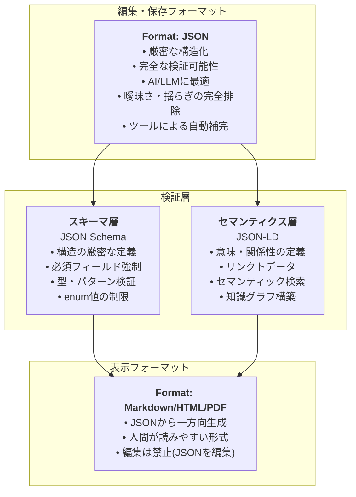

# ADR-001: データフォーマット・スキーマ定義・セマンティック定義の選定

## Status

**承認済み** (Accepted)

## Context

Ukiyoueフレームワークが目指す「AI時代の新しいドキュメント形式」において、最も根本的な決定は**データをどう表現するか**である。

### フレームワークの目的（specs/concept.mdより）

Ukiyoueは、AI時代のドキュメント管理における以下の課題を解決する：

1. **静的な情報管理の限界**: 情報検索の非効率性、動的再構成の困難さ
2. **メンテナンス負荷の増大**: 手動更新によるコスト、実装との乖離
3. **再利用性の欠如**: ドキュメント間での知識の重複、活用困難

### 満たすべき要件（specs/requirements.mdより）

この決定は、以下のフレームワーク要件を満たす必要がある：

| 要件ID           | 要件名                 | 関連性                             |
| ---------------- | ---------------------- | ---------------------------------- |
| **FR-AUTO-001**  | 構造化された形式の定義 | 🔴 Critical - データ形式の根幹     |
| **FR-AUTO-002**  | 自動バリデーション     | 🔴 Critical - 検証可能な形式が必須 |
| **FR-CONV-002**  | 動的な情報再構成       | 🟡 High - 構造化データが前提       |
| **FR-REUSE-001** | コンポーネント化       | 🟡 High - 再利用可能な形式         |
| **FR-CONV-001**  | セマンティック検索     | 🟡 High - 意味定義が必要           |

### 要求される技術特性

| 特性               | 説明                       | 重要度      |
| ------------------ | -------------------------- | ----------- |
| **厳密な構造化**   | 曖昧さ・揺らぎの排除       | 🔴 Critical |
| **検証可能性**     | 妥当性・整合性の自動検証   | 🔴 Critical |
| **AI可読性**       | LLMが理解・生成しやすい    | 🔴 Critical |
| **人間可読性**     | 人間も読みやすい（表示時） | 🟡 High     |
| **セマンティック** | 意味・関係性を明示的に定義 | 🟡 High     |
| **ツール支援**     | エコシステムが充実         | 🟢 Medium   |

### 比較対象

1. **JSON + JSON Schema + JSON-LD** ← 推奨
2. **TypeScript型定義 + JSDoc**
3. **Markdown + Frontmatter** （表示のみに使用）
4. **YAML + JSON Schema**

---

## 主要な設計判断

### ❌ Markdownを編集フォーマットとして使わない理由

#### 問題1: 構造化の弱さ

**Markdown例**:

```markdown
## Requirements

### REQ-001: OAuth Support

Priority: High
Status: Approved
```

**問題点**:

- ❌ "Priority"は必須？任意？ → 不明
- ❌ "High"以外に何が許される？ → 曖昧
- ❌ IDの形式は？（REQ-001? R001? Req-1?） → 揺らぎ
- ❌ セクション構造に意味があるのか？ → 不明確

#### 問題2: 検証の困難さ

```markdown
### REQ-001: OAuth Support

Priorty: Hight <!-- typo検出不可 -->
Status: InProgress <!-- 許可された値？ -->
```

- ❌ 必須フィールドの欠落を検出できない
- ❌ 値の妥当性チェックができない
- ❌ タイポを検出できない
- ❌ フォーマットの揺らぎを防げない

#### 問題3: 整合性検証の不可能性

- ❌ リンク切れの検出が困難（URL文字列の抽出が曖昧）
- ❌ 依存関係の循環参照チェック不可
- ❌ IDの重複検出が困難
- ❌ バージョン番号のフォーマット検証不可

#### 結論: Markdownは**表示専用**

Markdownは人間に優しいが、**構造化ドキュメントの編集フォーマットとしては不適切**。

- ✅ 使用方法: JSONからの**一方向自動生成**（レンダリング結果）
- ❌ 使用しない: ソースフォーマット（編集用）

---

## Decision

### ✅ 推奨: **JSON + JSON Schema + JSON-LD**



### 理由

#### 1. **厳密な構造化と完全な検証**

**JSON + JSON Schema**:

```json
{
  "$schema": "https://ukiyoue.dev/schemas/technical-spec.schema.json",
  "metadata": {
    "type": "technical-specification",
    "title": "User Authentication API",
    "version": "1.0.0"
  },
  "content": {
    "requirements": [
      {
        "id": "REQ-001",
        "description": "System shall support OAuth 2.0",
        "priority": "high",
        "status": "approved"
      }
    ]
  }
}
```

**スキーマによる強制**:

```json
{
  "properties": {
    "priority": {
      "enum": ["critical", "high", "medium", "low"]
    },
    "status": {
      "enum": ["draft", "approved", "implemented", "deprecated"]
    },
    "id": {
      "pattern": "^REQ-\\d{3}$"
    },
    "version": {
      "pattern": "^\\d+\\.\\d+\\.\\d+$"
    }
  },
  "required": ["id", "description", "priority"]
}
```

**効果**:

- ✅ `"priority": "Hight"` → エラー（enum違反）
- ✅ `"id": "R001"` → エラー（パターン違反）
- ✅ `"version": "1.0"` → エラー（セマンティックバージョニング違反）
- ✅ 必須フィールド欠落 → エラー

#### 2. **AI時代の要件を満たす**

| 要件         | JSONの利点                       |
| ------------ | -------------------------------- |
| **対話的**   | LLMが最も得意とする形式          |
| **自動生成** | AI生成→即座に検証→エラー検出     |
| **再利用**   | `$ref`で厳密なコンポーネント参照 |
| **検証**     | スキーマ違反を自動検出           |
| **一貫性**   | フォーマットの揺らぎゼロ         |

#### 3. **優れたツール支援**

**VSCode統合**:

```json
{
  "$schema": "https://ukiyoue.dev/schemas/technical-spec.schema.json",
  "metadata": {
    "type": "technical-specification",
    "priority": "h" // ← 自動補完: high, medium, low
    // ← リアルタイムエラー表示
  }
}
```

- ✅ 自動補完（enum値、必須フィールド）
- ✅ リアルタイム検証
- ✅ ホバーでドキュメント表示
- ✅ スキーマ違反の赤線表示

#### 4. **Markdownの問題を解決**

| 項目       | Markdown編集 | JSON編集 |
| ---------- | ------------ | -------- |
| 構造化     | ❌ 弱い      | ✅ 厳密  |
| 検証       | ❌ 困難      | ✅ 完全  |
| 揺らぎ     | ❌ 発生      | ✅ ゼロ  |
| 整合性     | ❌ 不可      | ✅ 可能  |
| ツール支援 | △ 限定的     | ✅ 充実  |

#### 5. **人間の可読性はMarkdownで担保**

```bash
# JSONで編集・保存
code data/auth-api.json

# Markdownを自動生成（表示用）
ukiyoue render data/auth-api.json --output docs/auth-api.md

# 読むのはMarkdown（編集禁止）
cat docs/auth-api.md
```

---

## 実装例

### 1. ソースドキュメント（JSON - 編集用）

```json
{
  "$schema": "https://ukiyoue.dev/schemas/technical-spec.schema.json",
  "@context": "https://ukiyoue.dev/context.jsonld",
  "metadata": {
    "type": "technical-specification",
    "title": "User Authentication API",
    "version": "1.0.0",
    "created": "2025-10-15T10:00:00Z",
    "updated": "2025-10-15T10:00:00Z",
    "authors": [
      {
        "name": "Alice",
        "email": "alice@example.com"
      }
    ],
    "tags": ["authentication", "api", "security"],
    "audience": ["developer", "ai-agent"]
  },
  "content": {
    "overview": "This document describes the user authentication API supporting OAuth 2.0.",
    "requirements": [
      {
        "id": "REQ-001",
        "description": "System shall support OAuth 2.0 authentication protocol",
        "priority": "high",
        "status": "approved",
        "validation": {
          "method": "integration-test",
          "criteria": "OAuth 2.0 flow completes successfully"
        },
        "details": [
          "Support Authorization Code Flow",
          "Support Implicit Flow",
          "Support Client Credentials Flow"
        ]
      },
      {
        "id": "REQ-002",
        "description": "System should support multi-factor authentication",
        "priority": "medium",
        "status": "draft"
      }
    ],
    "api": {
      "baseUrl": "https://api.example.com",
      "endpoints": [
        {
          "method": "POST",
          "path": "/auth/login",
          "description": "User login endpoint",
          "request": {
            "type": "object",
            "required": ["username", "password"],
            "properties": {
              "username": {
                "type": "string",
                "minLength": 3
              },
              "password": {
                "type": "string",
                "minLength": 8,
                "format": "password"
              }
            }
          },
          "response": {
            "200": {
              "type": "object",
              "properties": {
                "token": { "type": "string" },
                "expiresIn": {
                  "type": "integer",
                  "minimum": 0
                }
              }
            },
            "401": {
              "type": "object",
              "properties": {
                "error": { "type": "string" }
              }
            }
          }
        }
      ]
    }
  },
  "relationships": {
    "dependsOn": ["https://docs.example.com/oauth-spec.json"],
    "relatedTo": ["https://docs.example.com/user-management.json"]
  }
}
```

### 2. スキーマ定義（JSON Schema）

```json
{
  "$schema": "http://json-schema.org/draft-07/schema#",
  "$id": "https://ukiyoue.dev/schemas/technical-spec.schema.json",
  "title": "Technical Specification Schema",
  "description": "Schema for technical specification documents",
  "type": "object",
  "required": ["$schema", "@context", "metadata", "content"],
  "properties": {
    "$schema": {
      "type": "string",
      "format": "uri",
      "description": "JSON Schema reference"
    },
    "@context": {
      "type": "string",
      "format": "uri",
      "description": "JSON-LD context reference"
    },
    "metadata": {
      "$ref": "#/definitions/metadata"
    },
    "content": {
      "$ref": "#/definitions/content"
    },
    "relationships": {
      "$ref": "#/definitions/relationships"
    }
  },
  "definitions": {
    "metadata": {
      "type": "object",
      "required": ["type", "title", "version", "created"],
      "properties": {
        "type": {
          "const": "technical-specification",
          "description": "Document type identifier"
        },
        "title": {
          "type": "string",
          "minLength": 1,
          "maxLength": 200,
          "description": "Document title"
        },
        "version": {
          "type": "string",
          "pattern": "^\\d+\\.\\d+\\.\\d+$",
          "description": "Semantic version (e.g., 1.0.0)"
        },
        "created": {
          "type": "string",
          "format": "date-time",
          "description": "Creation timestamp (ISO 8601)"
        },
        "updated": {
          "type": "string",
          "format": "date-time",
          "description": "Last update timestamp (ISO 8601)"
        },
        "authors": {
          "type": "array",
          "minItems": 1,
          "items": { "$ref": "#/definitions/author" },
          "description": "Document authors"
        },
        "tags": {
          "type": "array",
          "items": { "type": "string" },
          "uniqueItems": true,
          "description": "Classification tags"
        },
        "audience": {
          "type": "array",
          "items": {
            "enum": ["developer", "pm", "stakeholder", "ai-agent"]
          },
          "description": "Target audience"
        }
      }
    },
    "author": {
      "type": "object",
      "required": ["name"],
      "properties": {
        "name": {
          "type": "string",
          "minLength": 1
        },
        "email": {
          "type": "string",
          "format": "email"
        },
        "url": {
          "type": "string",
          "format": "uri"
        }
      }
    },
    "content": {
      "type": "object",
      "required": ["overview", "requirements"],
      "properties": {
        "overview": {
          "type": "string",
          "minLength": 10,
          "description": "High-level document overview"
        },
        "requirements": {
          "type": "array",
          "minItems": 1,
          "items": { "$ref": "#/definitions/requirement" },
          "description": "List of requirements"
        },
        "api": {
          "$ref": "#/definitions/api",
          "description": "API definition (optional)"
        }
      }
    },
    "requirement": {
      "type": "object",
      "required": ["id", "description", "priority"],
      "properties": {
        "id": {
          "type": "string",
          "pattern": "^REQ-\\d{3}$",
          "description": "Requirement ID (format: REQ-XXX)"
        },
        "description": {
          "type": "string",
          "minLength": 10,
          "description": "Requirement description"
        },
        "priority": {
          "enum": ["critical", "high", "medium", "low"],
          "description": "Priority level"
        },
        "status": {
          "enum": ["draft", "approved", "implemented", "deprecated"],
          "default": "draft",
          "description": "Implementation status"
        },
        "validation": {
          "type": "object",
          "properties": {
            "method": {
              "type": "string",
              "description": "Validation method"
            },
            "criteria": {
              "type": "string",
              "description": "Validation criteria"
            }
          }
        },
        "details": {
          "type": "array",
          "items": { "type": "string" },
          "description": "Detailed requirements"
        }
      }
    },
    "api": {
      "type": "object",
      "properties": {
        "baseUrl": {
          "type": "string",
          "format": "uri"
        },
        "endpoints": {
          "type": "array",
          "items": { "$ref": "#/definitions/endpoint" }
        }
      }
    },
    "endpoint": {
      "type": "object",
      "required": ["method", "path"],
      "properties": {
        "method": {
          "enum": ["GET", "POST", "PUT", "PATCH", "DELETE"]
        },
        "path": {
          "type": "string",
          "pattern": "^/"
        },
        "description": { "type": "string" },
        "request": {
          "type": "object",
          "description": "Request schema"
        },
        "response": {
          "type": "object",
          "description": "Response schemas by status code"
        }
      }
    },
    "relationships": {
      "type": "object",
      "properties": {
        "dependsOn": {
          "type": "array",
          "items": {
            "type": "string",
            "format": "uri"
          },
          "description": "Dependencies (URIs)"
        },
        "relatedTo": {
          "type": "array",
          "items": {
            "type": "string",
            "format": "uri"
          },
          "description": "Related documents (URIs)"
        }
      }
    }
  }
}
```

### 3. 表示用Markdown（自動生成・読み取り専用）

````markdown
<!--
  ⚠️ AUTO-GENERATED - DO NOT EDIT MANUALLY ⚠️
  Source: data/authentication-api.json
  Generated: 2025-10-15T10:30:00Z
  To update: Edit the JSON source, then run: ukiyoue render data/authentication-api.json
-->

# User Authentication API

**Version**: 1.0.0
**Type**: Technical Specification
**Status**: Active

**Authors**: Alice (alice@example.com)
**Tags**: `authentication` `api` `security`
**Audience**: Developer, AI Agent

**Last Updated**: 2025-10-15T10:00:00Z

---

## 📋 Overview

This document describes the user authentication API supporting OAuth 2.0.

---

## 📌 Requirements

### REQ-001: OAuth 2.0 Support

**Priority**: 🔴 High | **Status**: ✅ Approved

System shall support OAuth 2.0 authentication protocol

**Details**:

- Support Authorization Code Flow
- Support Implicit Flow
- Support Client Credentials Flow

**Validation**:

- **Method**: integration-test
- **Criteria**: OAuth 2.0 flow completes successfully

---

### REQ-002: Multi-factor Authentication

**Priority**: 🟡 Medium | **Status**: 📝 Draft

System should support multi-factor authentication

---

## 🔌 API Endpoints

**Base URL**: `https://api.example.com`

### `POST /auth/login`

User login endpoint

**Request**:

```json
{
  "username": "string", // required, min length: 3
  "password": "string" // required, min length: 8
}
```
````

**Responses**:

**200 OK**:

```json
{
  "token": "string",
  "expiresIn": 3600 // seconds, minimum: 0
}
```

**401 Unauthorized**:

```json
{
  "error": "string"
}
```

---

## 🔗 Relationships

### Dependencies

- [OAuth Specification](https://docs.example.com/oauth-spec.json)

### Related Documents

- [User Management](https://docs.example.com/user-management.json)

---

## 📊 Document Statistics

- **Requirements**: 2 total (1 approved, 1 draft)
- **API Endpoints**: 1
- **Dependencies**: 1
- **Related Documents**: 1

---

_This document was automatically generated from structured JSON data.
To update, edit `data/authentication-api.json` and regenerate._

````

### 4. ツールワークフロー

```bash
# ===== 編集フェーズ =====

# 1. 新規ドキュメント作成（対話的ウィザード）
ukiyoue new technical-spec --interactive
# → プロンプトで情報入力
# → JSON生成
# → VSCodeで開く

# 2. または、テンプレートから作成
ukiyoue new technical-spec \
  --title "User Authentication API" \
  --authors "Alice <alice@example.com>" \
  --output data/auth-api.json

# 3. JSONを直接編集（VSCodeで）
code data/auth-api.json
# → JSON Schemaによる自動補完
# → リアルタイムエラー表示
# → enum値の候補表示
# → 必須フィールドの警告

# ===== 検証フェーズ =====

# 4. 保存時に厳密な検証
ukiyoue validate data/auth-api.json
# ✓ Schema validation: PASS
#   - All required fields present
#   - All enum values valid
#   - All patterns match (e.g., REQ-001)
#   - All URIs well-formed
# ✓ Consistency check: PASS
#   - No duplicate requirement IDs
#   - All referenced URIs exist
#   - No circular dependencies
# ✓ Link validation: PASS
#   - All dependsOn URIs reachable
#   - All relatedTo URIs reachable

# 5. プロジェクト全体の整合性チェック
ukiyoue check data/*.json
# ✓ Cross-document consistency: PASS
#   - All external references valid
#   - No orphaned documents
#   - Dependency graph is acyclic

# ===== 生成フェーズ =====

# 6. Markdown生成（表示用・読み取り専用）
ukiyoue render data/auth-api.json \
  --format markdown \
  --output docs/auth-api.md \
  --template default

# 7. HTML生成（公開用）
ukiyoue render data/auth-api.json \
  --format html \
  --output dist/auth-api.html \
  --template web

# 8. PDF生成（印刷用）
ukiyoue render data/auth-api.json \
  --format pdf \
  --output dist/auth-api.pdf

# ===== 検索・分析フェーズ =====

# 9. セマンティック検索
ukiyoue search "OAuth authentication" \
  --semantic \
  --fields requirements.description

# 10. 依存関係グラフ生成
ukiyoue graph data/*.json \
  --output dependency-graph.dot

# 11. 影響分析
ukiyoue impact REQ-001 \
  --show-dependencies \
  --show-impacts \
  --depth 3

# 12. 品質レポート
ukiyoue quality data/*.json \
  --output quality-report.html
````

---

## TypeScript型定義の位置づけ

TypeScript型定義は**ツール開発時**にのみ使用：

```typescript
// tools/src/types.ts
// JSON Schemaから自動生成される型定義

export interface TechnicalSpecification {
  $schema: string;
  "@context": string;
  metadata: Metadata;
  content: Content;
  relationships?: Relationships;
}

export interface Metadata {
  type: "technical-specification";
  title: string;
  version: string;
  created: string;
  updated?: string;
  authors: Author[];
  tags?: string[];
  audience?: ("developer" | "pm" | "stakeholder" | "ai-agent")[];
}

export interface Requirement {
  id: string; // pattern: ^REQ-\d{3}$
  description: string;
  priority: "critical" | "high" | "medium" | "low";
  status?: "draft" | "approved" | "implemented" | "deprecated";
  validation?: {
    method: string;
    criteria: string;
  };
  details?: string[];
}

// ツール実装で使用
import type { TechnicalSpecification } from "./types";

export function validateDocument(
  doc: TechnicalSpecification
): ValidationResult {
  // 型安全なツール実装
}
```

**用途**:

- ✅ フレームワーク内部のツール実装
- ✅ VSCodeエディタサポート
- ❌ ドキュメント保存フォーマット（JSONを使用）

---

## 比較マトリクス

| 項目                 | JSON+Schema | TypeScript | Markdown   | YAML       |
| -------------------- | ----------- | ---------- | ---------- | ---------- |
| **厳密な構造化**     | ⭐⭐⭐⭐⭐  | ⭐⭐⭐⭐⭐ | ⭐         | ⭐⭐⭐⭐⭐ |
| **検証可能性**       | ⭐⭐⭐⭐⭐  | ⭐⭐⭐⭐   | ⭐         | ⭐⭐⭐⭐⭐ |
| **曖昧さ排除**       | ⭐⭐⭐⭐⭐  | ⭐⭐⭐⭐⭐ | ⭐         | ⭐⭐⭐⭐   |
| **AI可読性**         | ⭐⭐⭐⭐⭐  | ⭐⭐⭐⭐⭐ | ⭐⭐⭐⭐⭐ | ⭐⭐⭐⭐   |
| **編集体験（人間）** | ⭐⭐⭐⭐    | ⭐⭐⭐⭐⭐ | ⭐⭐⭐⭐⭐ | ⭐⭐⭐⭐   |
| **表示（人間）**     | ⭐⭐        | ⭐⭐⭐     | ⭐⭐⭐⭐⭐ | ⭐⭐⭐     |
| **ツール支援**       | ⭐⭐⭐⭐⭐  | ⭐⭐⭐⭐⭐ | ⭐⭐⭐     | ⭐⭐⭐⭐   |
| **セマンティクス**   | ⭐⭐⭐⭐⭐  | ⭐⭐⭐     | ⭐         | ⭐⭐⭐⭐   |
| **標準化**           | ⭐⭐⭐⭐⭐  | ⭐⭐⭐     | ⭐⭐⭐⭐⭐ | ⭐⭐⭐⭐   |
| **言語非依存**       | ⭐⭐⭐⭐⭐  | ⭐         | ⭐⭐⭐⭐⭐ | ⭐⭐⭐⭐⭐ |
| **Total**            | **48/50**   | **42/50**  | **31/50**  | **44/50**  |

---

## Consequences

### Positive

- ✅ **完全な検証**: JSON Schemaによる厳密な妥当性・整合性検証
- ✅ **曖昧さゼロ**: enum、pattern、required等で揺らぎを完全排除
- ✅ **AI最適**: LLMが最も得意とする形式、生成後即座に検証可能
- ✅ **ツール支援**: VSCodeの自動補完・リアルタイム検証
- ✅ **標準技術**: JSON Schema (IETF)、JSON-LD (W3C) は業界標準
- ✅ **人間可読性**: Markdownで表示（JSONから自動生成）
- ✅ **言語非依存**: 任意の言語から利用可能

### Negative

- ⚠️ **JSON編集**: Markdownほど直感的ではない
- ⚠️ **学習コスト**: JSON Schema、JSON-LDの学習が必要
- ⚠️ **冗長性**: JSONは記述が冗長になる場合がある

### Mitigation

- **JSON編集の課題**:
  - VSCodeのJSON Schemaサポートで大幅改善
  - GUI編集ツールの提供も検討
  - テンプレート・ウィザードで初期作成を支援
- **学習コスト**:
  - ドキュメント・チュートリアルの充実
  - サンプルの提供
  - AIエージェント向けガイド
- **冗長性**:
  - デフォルト値の活用
  - `$ref`によるコンポーネント再利用
  - ツールによる自動補完

---

## Implementation Plan

### Phase 1: 基本スキーマ定義

- [ ] `document-base.schema.json` - 基底スキーマ
- [ ] `technical-spec.schema.json` - 技術仕様書スキーマ
- [ ] `api-doc.schema.json` - API仕様書スキーマ
- [ ] VSCode用 `.vscode/settings.json` 設定

### Phase 2: 検証ツール

- [ ] JSON Schema検証ツール
- [ ] 整合性チェックツール
- [ ] リンク検証ツール

### Phase 3: レンダリングツール

- [ ] JSON → Markdown変換
- [ ] JSON → HTML変換
- [ ] テンプレートエンジン

### Phase 4: セマンティクス

- [ ] JSON-LD context定義
- [ ] セマンティック検索
- [ ] 依存関係グラフ生成

---

## Requirements Traceability

この決定が満たすフレームワーク要件：

### FR-AUTO-001: 構造化された形式の定義 ✅

**実現方法**:

- JSON Schema により全ドキュメントの構造を形式的に定義
- `document-base.schema.json` を基底とした型システム
- スキーマの階層化により拡張性を確保

**効果**: 曖昧さゼロの厳密な構造化を実現

---

### FR-AUTO-002: 自動バリデーション ✅

**実現方法**:

- JSON Schema による構文・構造の自動検証
- `required`, `enum`, `pattern` 等で厳密なルール定義
- CI/CD での自動検証が可能

**効果**: タイポ・フォーマット揺れ・必須項目抜けを完全に防止

---

### FR-CONV-002: 動的な情報再構成 ✅

**実現方法**:

- JSON の機械可読性により動的フィルタリング・変換が容易
- `audience`, `level` フィールドによる視点別レンダリング
- プログラマティックなデータ操作が可能

**効果**: 同一ソースから複数ビューの生成が可能

---

### FR-REUSE-001: コンポーネント化 ✅

**実現方法**:

- JSON Schema の `$ref` によるコンポーネント参照
- 独立したJSONファイルとして管理可能
- JSON-LD による意味的な再利用性

**効果**: DRY原則の実現、知識の一元管理

---

### FR-CONV-001: セマンティック検索 ✅

**実現方法**:

- JSON-LD による明示的な意味定義
- `@context`, `@type` によるセマンティック情報の付与
- 語彙・オントロジー定義によるAI理解の向上

**効果**: AIエージェントによる高精度な情報検索・抽出

---

## Prerequisites

None (This is a foundational decision)
