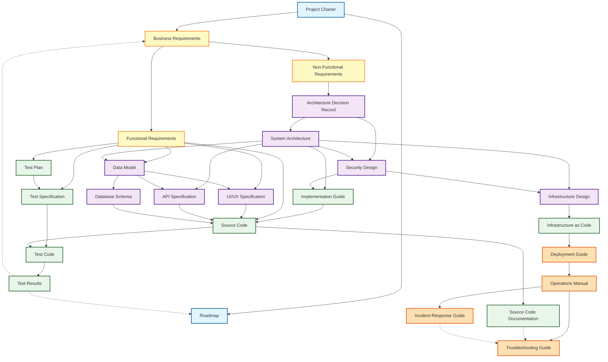

# Document Taxonomy

## ドキュメント分類と入出力関係の定義

このドキュメントは、Ukiyoue フレームワークで扱うドキュメントの分類（タクソノミー）と、ドキュメント間の入出力依存関係を定義します。

## 🎯 目的

- **What**: どのようなドキュメントタイプが存在するか
- **Why**: 各ドキュメントタイプの役割と必要性
- **How**: ドキュメント間の依存関係と情報の流れ

**対象読者**: フレームワーク開発者、スキーマ設計者

---

## 📊 ドキュメント分類の全体像

### レイヤー構造

Ukiyoue フレームワークでは、ドキュメントを以下の5つのレイヤーに分類します：

```text
┌─────────────────────────────────────────────────────┐
│ Layer 1: プロジェクト管理                            │
│ - プロジェクト全体の方向性と計画                     │
└─────────────────────────────────────────────────────┘
                      ↓ 基盤
┌─────────────────────────────────────────────────────┐
│ Layer 2: 要件定義                                   │
│ - ビジネス要件、機能要件、非機能要件                 │
└─────────────────────────────────────────────────────┘
                      ↓ 詳細化
┌─────────────────────────────────────────────────────┐
│ Layer 3: 設計                                       │
│ - アーキテクチャ、UI/UX、データ、API                 │
└─────────────────────────────────────────────────────┘
                      ↓ 実装
┌─────────────────────────────────────────────────────┐
│ Layer 4: 実装・テスト                                │
│ - コード、テスト仕様、テスト結果                     │
└─────────────────────────────────────────────────────┘
                      ↓ 運用
┌─────────────────────────────────────────────────────┐
│ Layer 5: 運用                                       │
│ - デプロイ、運用手順、トラブルシューティング         │
└─────────────────────────────────────────────────────┘
```

---

## 📋 ドキュメントタイプ一覧

### Layer 1: プロジェクト管理（2種類）

#### 1. Project Charter（プロジェクト憲章）

- **目的**: プロジェクトの目的、スコープ、ステークホルダーを定義
- **主な内容**: ビジョン、目標、制約条件、成功基準
- **読者**: 全ステークホルダー
- **更新頻度**: プロジェクト開始時、重要な変更時

#### 2. Roadmap（ロードマップ）

- **目的**: プロジェクトのマイルストーンとタイムラインを提示
- **主な内容**: フェーズ、主要成果物、期限
- **読者**: プロジェクトマネージャー、ステークホルダー
- **更新頻度**: 定期的（月次/四半期）

### Layer 2: 要件定義（3種類）

#### 3. Business Requirements（ビジネス要件）

- **目的**: ビジネス視点での要求事項を記述
- **主な内容**: ビジネス目標、ユーザーニーズ、ユーザーストーリー、期待効果、KPI
- **読者**: ビジネスアナリスト、プロダクトオーナー、ステークホルダー
- **更新頻度**: 企画段階で作成、ビジネス要件変更時

#### 4. Functional Requirements（機能要件）

- **目的**: システムが実現すべき機能を定義
- **主な内容**: 機能一覧、ユースケース記述（アクター、シナリオ、事前/事後条件）、機能仕様詳細、受け入れ基準
- **読者**: ビジネスアナリスト、プロダクトオーナー、開発者、テスター
- **更新頻度**: 要件定義段階で作成、機能追加・変更時

#### 5. Non-Functional Requirements（非機能要件）

- **目的**: システムの品質特性を定義
- **主な内容**: 性能要件、セキュリティ要件、可用性、拡張性、保守性
- **読者**: アーキテクト、開発者、インフラエンジニア
- **更新頻度**: 要件定義段階で作成、品質要件変更時

### Layer 3: 設計（8種類）

#### 6. Architecture Decision Record（アーキテクチャ決定記録）

- **目的**: 重要な技術選定とアーキテクチャ決定を記録
- **主な内容**: 決定内容、背景、選択肢、根拠、影響
- **読者**: アーキテクト、開発チームリーダー
- **更新頻度**: 重要な技術決定時

#### 7. System Architecture（システムアーキテクチャ）

- **目的**: システム全体の構造と技術スタックを定義
- **主な内容**: システム構成図、技術スタック、コンポーネント構成
- **読者**: アーキテクト、開発者、インフラエンジニア
- **更新頻度**: 設計段階で作成、アーキテクチャ変更時

#### 8. Data Model（データモデル）

- **目的**: データ構造とデータ間の関係を定義
- **主な内容**: ER 図、テーブル定義、データ辞書、制約条件
- **読者**: データアーキテクト、開発者、DBA
- **更新頻度**: 設計段階で作成、データ構造変更時

#### 9. UI/UX Specification（UI/UX 仕様）

- **目的**: ユーザーインターフェースとユーザー体験を定義
- **主な内容**: 画面遷移図、ワイヤーフレーム、デザインガイドライン
- **読者**: UI/UX デザイナー、フロントエンド開発者
- **更新頻度**: 設計段階で作成、UI 変更時

#### 10. API Specification（API 仕様）

- **目的**: API のエンドポイント、パラメータ、レスポンスを定義
- **主な内容**: エンドポイント一覧、リクエスト/レスポンス、認証、エラーコード
- **読者**: API 開発者、API 利用者
- **更新頻度**: API 設計段階で作成、API 変更時

#### 11. Database Schema（データベーススキーマ）

- **目的**: データベースの物理設計を定義
- **主な内容**: DDL、インデックス定義、パーティション設計
- **読者**: DBA、バックエンド開発者
- **更新頻度**: 設計段階で作成、スキーマ変更時

#### 12. Security Design（セキュリティ設計）

- **目的**: セキュリティ対策と実装方針を定義
- **主な内容**: 認証・認可方式、暗号化方針、脆弱性対策
- **読者**: セキュリティエンジニア、開発者
- **更新頻度**: 設計段階で作成、セキュリティ要件変更時

#### 13. Infrastructure Design（インフラストラクチャ設計）

- **目的**: インフラストラクチャの構成と設計を定義
- **主な内容**: ネットワーク構成図、サーバー構成、クラウドリソース設計、負荷分散、冗長化設計
- **読者**: インフラエンジニア、SRE、DevOps エンジニア
- **更新頻度**: 設計段階で作成、インフラ要件変更時

### Layer 4: 実装・テスト（8種類）

#### 14. Implementation Guide（実装ガイド）

- **目的**: 実装の手順と規約を提供
- **主な内容**: コーディング規約、実装パターン、ベストプラクティス
- **読者**: 開発者
- **更新頻度**: 実装開始時に作成、知見蓄積時

#### 15. Infrastructure as Code（インフラストラクチャコード）

- **目的**: インフラストラクチャの実装コード
- **主な内容**: Terraform、CloudFormation、Ansible、Kubernetes マニフェスト等の IaC コード
- **読者**: インフラエンジニア、SRE、DevOps エンジニア
- **更新頻度**: インフラ実装段階で作成、継続的に更新

#### 16. Test Plan（テスト計画）

- **目的**: テストの方針、スコープ、スケジュールを定義
- **主な内容**: テスト戦略、テストレベル、テスト環境、リソース計画
- **読者**: テストマネージャー、QA チーム
- **更新頻度**: テスト開始前に作成、計画変更時

#### 17. Test Specification（テスト仕様）

- **目的**: テストケースとテスト手順を詳細に定義
- **主な内容**: テストケース、テストデータ、期待結果、実行手順
- **読者**: テスター、QA エンジニア
- **更新頻度**: テスト設計段階で作成、仕様変更時

#### 18. Source Code（ソースコード）

- **目的**: システムの実装ソースコード
- **主な内容**: アプリケーションコード、ライブラリ、スクリプト、設定ファイル
- **読者**: 開発者、保守担当者
- **更新頻度**: 実装段階で作成、継続的に更新

#### 19. Test Code（テストコード）

- **目的**: 自動テストのソースコード
- **主な内容**: ユニットテスト、統合テスト、E2E テストのコード
- **読者**: 開発者、QA エンジニア
- **更新頻度**: 実装と並行して作成、継続的に更新

#### 20. Test Results（テスト結果）

- **目的**: テスト実行結果と品質状況を記録
- **主な内容**: テスト実行結果、カバレッジ、不具合一覧、品質メトリクス
- **読者**: テストマネージャー、プロジェクトマネージャー、開発者
- **更新頻度**: テスト実行の都度

#### 21. Source Code Documentation（ソースコードドキュメント）

- **目的**: ソースコードの構造と実装詳細を説明
- **主な内容**: クラス図、シーケンス図、コメント、自動生成 API ドキュメント
- **読者**: 開発者、保守担当者
- **更新頻度**: 実装と並行して作成、コード変更時

### Layer 5: 運用（4種類）

#### 22. Deployment Guide（デプロイガイド）

- **目的**: システムのデプロイ手順を記述
- **主な内容**: 環境構築、デプロイ手順、設定項目、ロールバック手順
- **読者**: DevOps エンジニア、リリース担当者
- **更新頻度**: デプロイ準備時に作成、インフラ変更時

#### 23. Operations Manual（運用マニュアル）

- **目的**: システムの日常運用手順を提供
- **主な内容**: 監視項目、バックアップ手順、定期メンテナンス
- **読者**: 運用担当者、SRE
- **更新頻度**: 運用開始時に作成、運用知見蓄積時

#### 24. Incident Response Guide（インシデント対応ガイド）

- **目的**: 障害発生時の対応手順を定義
- **主な内容**: エスカレーションフロー、初動対応、復旧手順
- **読者**: 運用担当者、サポート担当者
- **更新頻度**: 運用開始時に作成、インシデント経験時

#### 25. Troubleshooting Guide（トラブルシューティングガイド）

- **目的**: 問題発生時の診断と解決方法を記述
- **主な内容**: よくある問題、診断方法、解決手順、FAQ
- **読者**: 運用担当者、サポート担当者、開発者
- **更新頻度**: 運用中に継続的に更新

---

## 📊 ドキュメントタイプサマリー

| レイヤー         | ドキュメント数 | 主な役割                       |
| ---------------- | -------------- | ------------------------------ |
| プロジェクト管理 | 2              | 方向性と計画                   |
| 要件定義         | 3              | 何を実現するか                 |
| 設計             | 8              | どう実現するか                 |
| 実装・テスト     | 8              | コードと品質保証               |
| 運用             | 4              | システムの継続的な稼働         |
| **合計**         | **25**         | プロジェクトライフサイクル全体 |

---

## 🔄 ドキュメント間の依存関係

### 全体の依存関係グラフ



### 依存関係の特徴

#### 1. トップダウンフロー（計画→実装）

- **Project Charter** がすべての起点
- 要件定義（Layer 2）で **Business Requirements** が分解される
- 設計（Layer 3）で技術的な詳細化
- 実装・テスト（Layer 4）で具現化

#### 2. 複数の入力を持つドキュメント

- **Data Model**: Functional Requirements + System Architecture から派生
- **API Specification**: System Architecture + Data Model から派生
- **UI/UX Specification**: Functional Requirements + Data Model から派生
- **Infrastructure Design**: System Architecture + Security Design から派生
  - ネットワークセキュリティ（ファイアウォール、セキュリティグループ）
  - 暗号化設定（TLS/SSL、ディスク暗号化）
  - VPN、IAM、アクセス制御
  - セキュリティ要件を統合したインフラ設計
- **Implementation Guide**: System Architecture + Security Design から派生
- **Source Code**: 最も多くの入力を持つ
  - Functional Requirements（何を実装するか）
  - Implementation Guide（どう実装するか）
  - UI/UX Specification（画面ロジック）
  - API Specification（インターフェース）
  - Database Schema（データアクセス）
- **Test Code**: Test Specification + Source Code から派生

#### 3. 横断的な依存関係（フィードバックループ）

- **Test Results** → **Roadmap**（品質状況に応じたマイルストーン・スケジュール調整）
  - テスト合格率が低い → リリース延期
  - 重大な不具合発見 → 修正フェーズをロードマップに追加
  - カバレッジ不足 → テスト強化期間を設定
- **Test Results** → **Business Requirements**（品質評価による要件の再検討）
  - 実装困難な要件の発見 → 要件の見直し
  - パフォーマンス問題 → 非機能要件の調整
- **Troubleshooting Guide** ← Source Code Documentation + Incident Response（運用知見の蓄積）
  - 実装の詳細と障害対応の経験を統合

#### 4. レイヤー内の依存関係

- **Data Model** → **Database Schema**（論理設計→物理設計）
- **Infrastructure Design** → **Infrastructure as Code** → **Deployment Guide**（インフラ設計→コード化→デプロイ）
- **設計ドキュメント群** → **Source Code**（要件・設計を統合実装）
  - Functional Requirements → Source Code（機能要件の実現）
  - UI/UX Specification → Source Code（画面ロジック）
  - API Specification → Source Code（APIエンドポイント実装）
  - Database Schema → Source Code（データアクセス層）
  - Implementation Guide → Source Code（実装方針）
- **Source Code** → **Source Code Documentation**（コードからドキュメント生成）
- **Test Plan** → **Test Specification** → **Test Code**（計画→仕様→実装）
- **Source Code** + **Test Specification** → **Test Code**（テスト対象とテスト仕様）
- **Operations Manual** → **Incident Response Guide** / **Troubleshooting Guide**（運用知見の派生）

---

## 📐 次のステップ

このドキュメントタクソノミーを基に、以下を段階的に詳細化します：

### Phase 1.1: メタデータ設計

- 各ドキュメントタイプに共通するメタデータの定義
- ドキュメント識別子の設計

### Phase 1.2: スキーマ設計

- 各ドキュメントタイプの JSON Schema 設計
- 共通スキーマ（document-base.schema.json）の設計

### Phase 1.3: セマンティック定義

- ドキュメント間の関係性の形式的定義
- JSON-LD Context の設計

### Phase 1.4: バリデーションルール

- 依存関係の検証ルール
- 整合性チェックルール

---

## 📚 関連ドキュメント

- [concept.md](concept.md) - フレームワークの理念
- [requirements.md](requirements.md) - フレームワークの要件
- [architecture.md](architecture.md) - 技術アーキテクチャ
