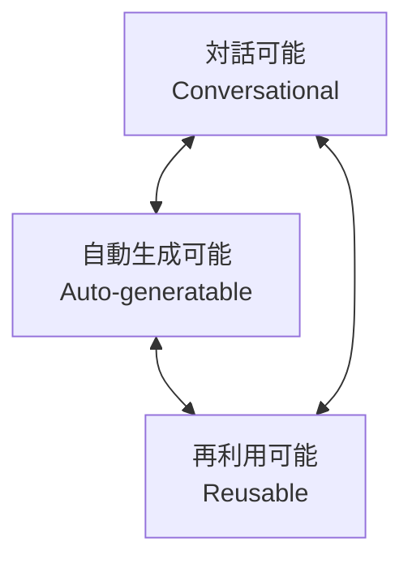

# Ukiyoue Framework - Requirements Specification

**フレームワークの要件定義**

---

## 🎯 このドキュメントの目的

このドキュメントは、Ukiyoue フレームワークが満たすべき要件を定義します。

**対象読者**: フレームワーク開発者、貢献者  
**使用場面**: 設計判断時、実装時、レビュー時

---

## 📐 要件の全体構造

Ukiyoue フレームワークは、ドキュメントが以下の**3 つの特性**を持つことを可能にする必要があります：



これら 3 つの特性は相互に依存し、全てが揃うことで最大の効果を発揮します。

---

## 1. 💬 対話可能性 (Conversational)

### FR-CONV-001: セマンティック検索の実現

**要件**: AI が質問に対して適切な情報を抽出できること

**フレームワークが提供すべきもの**:

```yaml
schemas:
  - メタデータスキーマ（タイトル、説明、タグ）
  - コンテンツ構造スキーマ

semantics:
  - JSON-LDコンテキスト定義
  - 語彙定義（document, concept, relationship等）

tools:
  - セマンティック検索エンジン
  - キーワードインデックス生成
```

**検証方法**:

- テストクエリ（例: "認証の実装"）で適切なドキュメントが返ってくる
- 適合率 > 90%
- 再現率 > 85%

**実装優先度**: 🔴 High (Phase 2)

---

### FR-CONV-002: 動的な情報再構成

**要件**: 同じ情報を異なる視点から再構成できること

**フレームワークが提供すべきもの**:

```yaml
schemas:
  - audience フィールド（開発者、PM、ステークホルダー）
  - section レベル定義（overview, detail, technical）

tools:
  - ビュー生成エンジン
  - フィルタリング機能
  - レンダリングエンジン
```

**使用例**:

```bash
# 開発者向けビュー
ukiyoue render --audience developer --doc api-spec.json

# PM向けビュー（概要のみ）
ukiyoue render --audience pm --level overview --doc api-spec.json
```

**検証方法**:

- 同じドキュメントから異なるビューが生成できる
- 各ビューが対象読者に適した内容になっている

**実装優先度**: 🟡 Medium (Phase 3)

---

### FR-CONV-003: 粒度の調整

**要件**: 情報の詳細度を調整できること

**フレームワークが提供すべきもの**:

```yaml
schemas:
  - 階層的な構造定義（summary, detail, deep-dive）

tools:
  - サマリー生成機能
  - 詳細度フィルタ
```

**検証方法**:

- 各レベルで適切な情報量になっている
- 上位レベルは下位レベルを包含している

**実装優先度**: 🟡 Medium (Phase 3)

---

## 2. 🤖 自動生成可能性 (Auto-generatable)

### FR-AUTO-001: 構造化された形式の定義

**要件**: ドキュメントの構造が形式的に定義されていること

**フレームワークが提供すべきもの**:

```yaml
schemas:
  - document-base.schema.json（全ドキュメント共通）
  - types/*.schema.json（タイプ別スキーマ）
  - components/*.schema.json（再利用コンポーネント）

validation:
  - JSON Schema validator
  - カスタムバリデーションルール
```

**具体例**:

```json
{
  "$schema": "../schemas/types/technical-spec.schema.json",
  "metadata": {
    "type": "technical-specification",
    "title": "User Authentication System",
    "version": "1.0.0"
  },
  "content": {
    "overview": "...",
    "requirements": [...],
    "design": {...}
  }
}
```

**検証方法**:

- 全てのドキュメントがスキーマに準拠している
- バリデーションエラー率 < 5%

**実装優先度**: 🔴 Critical (Phase 1)

---

### FR-AUTO-002: 自動バリデーション

**要件**: ドキュメントの妥当性を自動検証できること

**フレームワークが提供すべきもの**:

```yaml
tools:
  validators:
    - schema-validator: スキーマ準拠チェック
    - link-checker: リンク切れチェック
    - consistency-checker: 用語の一貫性チェック
    - metadata-validator: 必須メタデータチェック
```

**使用例**:

```bash
# 全チェック実行
ukiyoue validate --all docs/

# スキーマチェックのみ
ukiyoue validate --schema docs/api-spec.json

# CIでの自動実行
ukiyoue validate --ci --fail-on-error
```

**検証方法**:

- 各バリデーターが正しくエラーを検出する
- False positive 率 < 10%
- 実行時間 < 5 秒/ドキュメント

**実装優先度**: 🔴 Critical (Phase 1)

---

### FR-AUTO-003: テンプレートベース生成

**要件**: テンプレートからドキュメントを自動生成できること

**フレームワークが提供すべきもの**:

```yaml
templates:
  - technical-spec.json
  - api-doc.json
  - design-doc.json
  - adr.json

tools:
  - template-generator: テンプレート展開
  - placeholder-replacer: 変数置換
  - interactive-wizard: 対話的生成
```

**使用例**:

```bash
# テンプレートから生成
ukiyoue generate --template technical-spec \
                 --output my-spec.json

# 対話的に生成
ukiyoue generate --interactive

# 既存コードから生成
ukiyoue generate --from-code src/ \
                 --template api-doc
```

**検証方法**:

- テンプレートから有効なドキュメントが生成される
- 生成されたドキュメントがバリデーションをパスする

**実装優先度**: 🟡 Medium (Phase 2)

---

### FR-AUTO-004: バージョン管理の統合

**要件**: Git 等のバージョン管理と統合できること

**フレームワークが提供すべきもの**:

```yaml
tools:
  - diff-analyzer: 意味的な差分抽出
  - changelog-generator: 変更履歴生成
  - git-hooks: pre-commit/pre-push検証
```

**使用例**:

```bash
# 意味的な差分表示
ukiyoue diff HEAD~1 HEAD docs/api-spec.json

# 変更履歴生成
ukiyoue changelog --since v1.0.0

# Git hooks設定
ukiyoue install-hooks
```

**検証方法**:

- Git 差分が人間に理解可能な形式で表示される
- 変更履歴が自動生成される

**実装優先度**: 🟢 Low (Phase 3)

---

## 3. ♻️ 再利用可能性 (Reusable)

### FR-REUSE-001: コンポーネント化

**要件**: ドキュメントを再利用可能な単位に分割できること

**フレームワークが提供すべきもの**:

```yaml
schemas:
  - component-base.schema.json
  - 再利用メタデータ定義（usage_count, quality_score等）

tools:
  - component-extractor: コンポーネント抽出
  - component-manager: コンポーネント管理
```

**コンポーネント例**:

```json
{
  "$schema": "../schemas/component-base.schema.json",
  "@context": "../semantics/context.jsonld",
  "@type": "DesignPattern",
  "metadata": {
    "name": "JWT Authentication Pattern",
    "category": "security",
    "tags": ["authentication", "jwt", "stateless"],
    "usage_count": 15,
    "quality_score": 4.5
  },
  "content": {
    "intent": "...",
    "context": "...",
    "solution": "..."
  }
}
```

**検証方法**:

- コンポーネントが独立して機能する
- 他のコンテキストでも意味が通じる

**実装優先度**: 🟡 Medium (Phase 2)

---

### FR-REUSE-002: セマンティック検索と推奨

**要件**: 再利用可能なコンポーネントを容易に見つけられること

**フレームワークが提供すべきもの**:

```yaml
semantics:
  - 語彙定義（タグ、カテゴリー、ユースケース）
  - 関係性定義（similarTo, usedWith等）

tools:
  - component-search: コンポーネント検索
  - recommendation-engine: 推奨エンジン
```

**使用例**:

```bash
# キーワード検索
ukiyoue search "authentication JWT"

# コンテキストベース推奨
ukiyoue recommend --context "microservices API"

# 類似コンポーネント検索
ukiyoue similar --doc my-pattern.json
```

**検証方法**:

- 検索成功率 > 90%
- 推奨の適合率 > 80%

**実装優先度**: 🟡 Medium (Phase 2)

---

### FR-REUSE-003: 品質の継続的改善

**要件**: 使用実績に基づいて品質を向上できること

**フレームワークが提供すべきもの**:

```yaml
tools:
  - usage-tracker: 使用状況追跡
  - feedback-collector: フィードバック収集
  - quality-analyzer: 品質分析
  - improvement-suggester: 改善提案
```

**品質メトリクス**:

```yaml
metrics:
  - usage_count: 使用回数
  - success_rate: 成功率（問題なく使えた割合）
  - average_rating: 平均評価（1-5）
  - time_saved: 削減された工数
  - reusability_score: 再利用性スコア
```

**使用例**:

```bash
# 品質レポート生成
ukiyoue analyze quality --component jwt-pattern.json

# 改善提案
ukiyoue suggest-improvements --component jwt-pattern.json

# 使用統計
ukiyoue stats --since 2025-01-01
```

**検証方法**:

- 品質スコアが時系列で向上している
- フィードバックが適切に収集・反映されている

**実装優先度**: 🟢 Low (Phase 3)

---

## 🔗 要件の相互依存関係

### Dependency Matrix

| 要件         | 依存先       | 理由                         |
| ------------ | ------------ | ---------------------------- |
| FR-CONV-001  | FR-AUTO-001  | スキーマがないと検索できない |
| FR-CONV-002  | FR-AUTO-001  | 構造定義が必要               |
| FR-AUTO-003  | FR-AUTO-001  | スキーマに基づいて生成       |
| FR-REUSE-001 | FR-AUTO-001  | コンポーネントもスキーマ準拠 |
| FR-REUSE-002 | FR-REUSE-001 | コンポーネントが存在する必要 |

### 実装順序

```yaml
Phase 1 - 基盤:
  Priority: Critical
  Requirements:
    - FR-AUTO-001: 構造定義
    - FR-AUTO-002: バリデーション

Phase 2 - コア機能:
  Priority: High
  Requirements:
    - FR-CONV-001: セマンティック検索
    - FR-AUTO-003: テンプレート生成
    - FR-REUSE-001: コンポーネント化
    - FR-REUSE-002: 検索・推奨

Phase 3 - 高度な機能:
  Priority: Medium
  Requirements:
    - FR-CONV-002: 動的再構成
    - FR-CONV-003: 粒度調整
    - FR-AUTO-004: バージョン管理統合
    - FR-REUSE-003: 品質改善
```

---

## 📊 非機能要件 (Non-Functional Requirements)

### NFR-PERF-001: パフォーマンス

```yaml
requirements:
  - バリデーション: < 5秒/ドキュメント
  - 検索: < 2秒/クエリ
  - 生成: < 10秒/ドキュメント
```

### NFR-SCALE-001: スケーラビリティ

```yaml
requirements:
  - ドキュメント数: 10,000件まで対応
  - コンポーネント数: 1,000件まで対応
  - 同時ユーザー: 100人まで対応
```

### NFR-USAB-001: ユーザビリティ

```yaml
requirements:
  - インストール: < 5分
  - 学習時間: < 30分（基本操作）
  - エラーメッセージ: 明確で実行可能
```

### NFR-MAINT-001: 保守性

```yaml
requirements:
  - コードカバレッジ: > 80%
  - ドキュメント整備: 全API
  - 明確なアーキテクチャ
```

### NFR-COMPAT-001: 互換性

```yaml
requirements:
  - Node.js: >= 18.0.0
  - OS: Windows, macOS, Linux
  - JSON Schema: Draft 7以降
  - JSON-LD: 1.1
```

---

## ✅ 検証基準

### Acceptance Criteria

各要件の実装完了は以下の基準で判断：

```yaml
definition_of_done:
  - スキーマ定義が完成している
  - ツールが実装されている
  - ユニットテストが書かれている（カバレッジ > 80%）
  - 統合テストが書かれている
  - ドキュメントが書かれている
  - 実例が examples/ に追加されている
  - 性能要件を満たしている
```

---

## 📚 Related Documents

- [`concept.md`](concept.md) - フレームワークのコンセプト
- [`architecture.md`](architecture.md) - アーキテクチャ設計
- [`design-decisions/`](design-decisions/) - 技術選定の ADR
